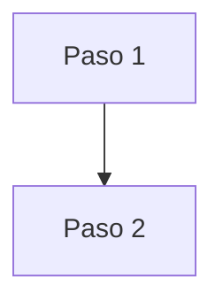

# Guía de Importación — Proyecto de Documentación Mintlify

## Visión general

Documentación completa sobre **cómo importar productos** desde el exterior. Guía práctica que cubre desde los conceptos básicos hasta procedimientos avanzados de importación.

| Métrica | Valor |
|---------|-------|
| Plataforma | Mintlify |
| Audiencia | Personas que quieren aprender a importar |
| Fuentes | Información recopilada de internet |

---

## Audiencia y estándar de calidad

**Perfil objetivo:**
- Persona sin experiencia previa en importación
- Emprendedor que quiere reducir costos
- Comerciante que busca nuevos proveedores

**Regla fundamental:** La documentación debe ser tan clara que cualquier persona pueda entender el proceso completo de importación sin conocimientos previos.

### Nivel de profundidad obligatorio

| Aspecto | Obligatorio | Descripción |
|---------|-------------|-------------|
| **QUÉ es** | ✅ Siempre | Definición clara del concepto |
| **POR QUÉ importa** | ✅ Siempre | Beneficios y razones |
| **CÓMO hacerlo** | ✅ Siempre | Pasos concretos, ejemplos prácticos |
| **DÓNDE aplicar** | ✅ Siempre | Contextos, situaciones, países |
| **Costos/Tiempos** | ✅ Si aplica | Estimaciones realistas |
| **Warnings/Riesgos** | ✅ Si los hay | Errores comunes, trampas a evitar |

### Lo que NUNCA es aceptable

- ❌ Información vaga sin pasos concretos
- ❌ Listar sin explicar cómo aplicar
- ❌ Procesos sin mencionar costos aproximados
- ❌ Términos técnicos sin definir
- ❌ Información desactualizada

---

## Estructura del proyecto

```
proyecto/
├── app/                              # Contenido publicable
│   ├── fundamentos/                  # Conceptos básicos de importación
│   ├── proceso/                      # Paso a paso del proceso
│   ├── proveedores/                  # Cómo encontrar y evaluar proveedores
│   ├── logistica/                    # Envíos, aduanas, transporte
│   ├── legal/                        # Requisitos legales, impuestos
│   └── casos/                        # Casos prácticos y ejemplos reales
├── _workspace/                       # Archivos INTERNOS (NO se publican)
│   ├── fuentes/                      # URLs y fuentes de información
│   └── tracking/                     # Seguimiento de contenido
├── docs.json                         # Configuración Mintlify + navegación
├── introduction.mdx                  # Página home
└── CLAUDE.md                         # Este archivo
```

---

## Reglas de trabajo

### Comportamiento obligatorio

- **SIEMPRE** verificar información antes de documentar
- **NUNCA** inventar datos, costos o procedimientos
- **SIEMPRE** citar fuentes cuando la información es específica
- **NUNCA** crear archivos MDX sin frontmatter completo
- **SIEMPRE** usar lenguaje simple y accesible
- **SIEMPRE** incluir ejemplos prácticos

### Fuentes de información

Cuando recopiles información de internet:
1. **Guardar la URL** en `_workspace/fuentes/`
2. **Verificar la fecha** de la información
3. **Contrastar** con múltiples fuentes si es posible
4. **Indicar el país** si la información es específica de una región

### Auto-reporte de eficiencia

Cuando detectes problemas que afecten la calidad, **reportar inmediatamente**:

```
⚠️ ALERTA DE EFICIENCIA

Problema detectado: [descripción]
Impacto: [cómo afecta]
Solución propuesta: [qué hacer]
```

---

## Navegación (docs.json)

**Estructura:** Tab → Dropdowns → Groups → Pages

### Reglas de segmentación

1. **Nunca listas planas >5 páginas** — usar nested groups
2. **Organizar por etapa del proceso** cuando sea posible
3. **Sub-grupos de 2-4 páginas** cada uno

### Iconos sugeridos por tema

| Tema | Icono |
|------|-------|
| Fundamentos | `book` |
| Proceso | `list-check` |
| Proveedores | `store` |
| Logística | `truck` |
| Legal/Impuestos | `scale-balanced` |
| Dinero/Costos | `money-bill` |
| Países | `globe` |
| Documentos | `file-contract` |
| Alertas/Riesgos | `triangle-exclamation` |
| Tips/Consejos | `lightbulb` |

---

## Formato MDX

### Frontmatter obligatorio

```yaml
---
title: "Título claro"
description: "Resumen 120-160 caracteres"
icon: "icono-fontawesome"
---
```

### Componentes Mintlify más usados

| Componente | Uso |
|------------|-----|
| `<Note>` | Información importante |
| `<Warning>` | Alertas y riesgos |
| `<Tip>` | Consejos útiles |
| `<Steps>` + `<Step>` | Procesos secuenciales |
| `<Tabs>` + `<Tab>` | Comparar opciones/países |
| `<Accordion>` | Contenido colapsable (FAQs) |
| `<CardGroup>` + `<Card>` | Navegación visual |

### Diagramas — Mermaid obligatorio

**NUNCA** usar ASCII art. **SIEMPRE** usar Mermaid:



**Regla de densidad:** Máximo ~12 nodos por diagrama.

---

## Glosario de importación

Mantener coherencia al usar estos términos:

| Término | Significado |
|---------|-------------|
| **FOB** | Free On Board - precio sin flete ni seguro |
| **CIF** | Cost, Insurance, Freight - precio con todo incluido |
| **Aduana** | Organismo que controla entrada/salida de mercancías |
| **Aranceles** | Impuestos sobre productos importados |
| **Agente de aduanas** | Profesional que gestiona trámites aduaneros |
| **Incoterms** | Términos internacionales de comercio |
| **Consolidado** | Envío compartido con otros importadores |
| **Despacho** | Proceso de liberación de mercancía en aduana |
| **Partida arancelaria** | Código que identifica el tipo de producto |

---

## Cross-references

### Cuándo agregar

1. **Prerrequisito**: Se necesita leer primero otra página
2. **Profundización**: Para quien quiera más detalle
3. **Relacionado**: Temas que se complementan

### Formato

```mdx
<Tip>
Para más detalle, consulta [Título página](/ruta/pagina).
</Tip>
```

---

## Convenciones de contenido

### Monedas y costos

- Usar **USD** como moneda de referencia
- Indicar siempre que son **aproximados**
- Incluir **rango** cuando sea posible (ej: $500-$1000)

### Tiempos

- Indicar tiempos en **días** o **semanas**
- Diferenciar entre tiempo de **envío** y tiempo de **trámites**

### Países

- Cuando la información sea específica de un país, **indicarlo claramente**
- Preferir información aplicable a **Latinoamérica** en general
- Crear secciones específicas por país cuando sea necesario

---

## Estructura sugerida de tabs

```
📚 Fundamentos       → Qué es importar, por qué hacerlo, tipos de importación
📋 Proceso           → Paso a paso desde la idea hasta recibir el producto
🏪 Proveedores       → Alibaba, otras plataformas, cómo evaluar, negociación
🚚 Logística         → Envíos, tipos de transporte, tiempos, costos
⚖️ Legal             → Requisitos, impuestos, documentos, agentes
💡 Casos Prácticos   → Ejemplos reales, errores comunes, historias de éxito
```

---

## Referencias útiles

- [Mintlify Docs](https://mintlify.com/docs)
- [Componentes Mintlify](https://mintlify.com/docs/components)
- [Mermaid Diagrams](https://mermaid.js.org)
- [Font Awesome Icons](https://fontawesome.com/icons)
