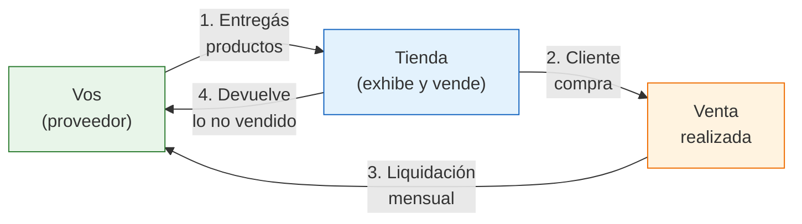

# Consignación en tiendas físicas

> En vez de abrir tu propio local, podés colocar tus productos en tiendas que ya tienen tráfico de clientes. La consignación en tiendas físicas es una forma de **expandir tu presencia** sin asumir los costos de un local propio.

## Cómo funciona la consignación en tiendas

El modelo es simple: vos entregás productos a una tienda existente, ellos los exhiben y los venden, y cuando se vende una unidad, se reparten el ingreso según un porcentaje acordado. Lo que no se vende, te lo devuelven.

<Note>
Esto es diferente a la consignación con fábricas (donde vos recibís productos de una fábrica para vender). Acá vos sos el proveedor que coloca productos en tiendas de terceros. Es una forma de multiplicar tus puntos de venta sin multiplicar tus costos fijos.
</Note>

## Términos típicos de consignación

<Tabs>
  <Tab title="Regalerías / Bazares">
    | Término | Rango habitual |
    |---------|---------------|
    | **Split (vos / tienda)** | 55/45 a 60/40 |
    | **Liquidación** | Mensual |
    | **Período mínimo** | 30-60 días |
    | **Productos que aceptan** | Decoración, bazar, regalería, velas, aromas |
    | **Unidades iniciales** | 10-30 productos |
    | **Reposición** | Vos reponés cuando se vende |
  </Tab>
  <Tab title="Boutiques / Tiendas de ropa">
    | Término | Rango habitual |
    |---------|---------------|
    | **Split (vos / tienda)** | 50/50 a 55/45 |
    | **Liquidación** | Quincenal o mensual |
    | **Período mínimo** | 60-90 días (temporada) |
    | **Productos que aceptan** | Accesorios, bijouterie, carteras, cinturones |
    | **Unidades iniciales** | 5-15 productos |
    | **Reposición** | Coordinada con la tienda |
  </Tab>
  <Tab title="Pet shops / Tiendas especializadas">
    | Término | Rango habitual |
    |---------|---------------|
    | **Split (vos / tienda)** | 60/40 a 65/35 |
    | **Liquidación** | Mensual |
    | **Período mínimo** | 30 días |
    | **Productos que aceptan** | Accesorios para mascotas, productos naturales, juguetes |
    | **Unidades iniciales** | 10-20 productos |
    | **Reposición** | Según demanda |
  </Tab>
  <Tab title="Librerías / Papelerías">
    | Término | Rango habitual |
    |---------|---------------|
    | **Split (vos / tienda)** | 55/45 a 60/40 |
    | **Liquidación** | Mensual |
    | **Período mínimo** | 30 días |
    | **Productos que aceptan** | Artículos de escritorio, agendas, organizadores, stickers |
    | **Unidades iniciales** | 15-30 productos |
    | **Reposición** | Semanal en productos que rotan |
  </Tab>
</Tabs>

## Qué tiendas aceptan consignación

No todas las tiendas trabajan con consignación. Estas son las que más frecuentemente lo hacen:

| Tipo de tienda | Probabilidad | Por qué aceptan |
|----------------|-------------|-----------------|
| **Regalerías y bazares** | Alta | Necesitan variedad constante, no pueden comprar todo |
| **Dietéticas y naturistas** | Media-Alta | Productos artesanales y naturales complementan su oferta |
| **Pet shops independientes** | Media | Buscan diferenciarse de las cadenas grandes |
| **Boutiques de barrio** | Media | Quieren ofrecer accesorios sin invertir en stock |
| **Librerías / Papelerías** | Media | Los productos de decoración y organización complementan su rubro |
| **Tiendas de regalos** | Alta | Su modelo de negocio se basa en la variedad |

<Warning>
Evitá las cadenas grandes y franquicias. Casi nunca aceptan consignación de emprendedores individuales. Apuntá a **tiendas independientes** con dueño presente, donde podés hablar directamente con quien toma las decisiones.
</Warning>

## Cómo abordar al dueño de una tienda

<Steps>
  <Step title="Investigá la tienda antes de ir">
    Visitá la tienda como cliente. Observá qué productos venden, a qué precios, si ya tienen productos en consignación de otros proveedores, y cómo es el flujo de gente. Si tus productos complementan lo que ya venden (sin competir directamente), es una buena señal.
  </Step>
  <Step title="Prepará tu propuesta">
    Armá un kit de presentación simple: fotos de tus productos, lista de precios sugeridos al público, tu propuesta de split, y 2-3 muestras físicas. Tené un PDF o catálogo impreso con tu marca que pueda quedar en la tienda.
  </Step>
  <Step title="Hacé el primer contacto">
    Acercate a la tienda en un momento tranquilo (no en hora pico). Presentate brevemente:

    *"Hola, soy [nombre], fabrico/vendo [tipo de producto]. Vi que en tu tienda tenés productos similares/complementarios. Trabajo con consignación: te dejo productos, lo que se vende lo liquidamos mensual con un [X/X], y lo que no se vende lo retiro sin costo. Te puedo dejar unas muestras para que las veas?"*
  </Step>
  <Step title="Dejá muestras y seguí en contacto">
    Si hay interés, dejá 2-3 muestras y tu catálogo. Pedí un número de WhatsApp para hacer seguimiento. No presiones: muchos dueños de tienda necesitan pensarlo unos días. Hacé seguimiento a la semana.
  </Step>
  <Step title="Formalizá el acuerdo y entregá el primer lote">
    Si acepta, redactá un acuerdo simple (ver sección de contrato abajo), entregá el primer lote con un remito detallado (producto, cantidad, precio sugerido) y coordiná la fecha de la primera liquidación.
  </Step>
</Steps>

## Ejemplo práctico con números

Supongamos que colocás productos de decoración en 3 tiendas con un split 60/40 (vos 60%, tienda 40%):

| Tienda | Productos entregados | Precio promedio | Vendidos/mes | Facturación mensual |
|--------|---------------------|-----------------|-------------|-------------------|
| Regalería A | 20 unidades | ARS 8,000 (~USD 7) | 8 unidades | ARS 64,000 |
| Bazar B | 15 unidades | ARS 6,000 (~USD 5) | 10 unidades | ARS 60,000 |
| Tienda C | 10 unidades | ARS 12,000 (~USD 10) | 4 unidades | ARS 48,000 |
| **Total** | **45 unidades** | | **22 unidades** | **ARS 172,000** |

### Tu ingreso mensual por consignación

| Concepto | Cálculo | Monto |
|----------|---------|-------|
| Facturación total | | ARS 172,000 (~USD 143) |
| **Tu parte (60%)** | 172,000 x 0.60 | **ARS 103,200 (~USD 86)** |
| (-) Costo de la mercadería (estimado 40% del PVP) | 172,000 x 0.40 | -ARS 68,800 |
| (-) Transporte/logística (estimado) | | -ARS 5,000 |
| (-) Ingresos Brutos (~3.5%) | 103,200 x 0.035 | -ARS 3,612 |
| **Ganancia neta aproximada** | | **ARS 25,788 (~USD 21)** |

<Note>
Es ingreso adicional a tus ventas online, no lo reemplaza. Con 3 tiendas generás un flujo extra estable. Con 8-10 tiendas, la consignación puede representar el 20-30% de tus ingresos totales. Los números son estimaciones aproximadas.
</Note>

## Controlar stock en múltiples tiendas

Cuando tenés productos en varias tiendas, el control de inventario es fundamental. Un Excel o Google Sheets simple alcanza:

| Tienda | Producto | Entregados | Vendidos | Stock actual | Última liquidación |
|--------|----------|-----------|----------|-------------|-------------------|
| Regalería A | Vela aromática grande | 10 | 6 | 4 | 15/01/2026 |
| Regalería A | Portarretrato madera | 10 | 2 | 8 | 15/01/2026 |
| Bazar B | Vela aromática grande | 8 | 5 | 3 | 20/01/2026 |
| Tienda C | Set de velas x3 | 5 | 4 | 1 | 18/01/2026 |

<Tip>
Actualizá la planilla cada vez que hacés una entrega o recibís una liquidación. Si una tienda vende menos del 30% del stock en 60 días, ese producto no funciona ahí. Retiralo y probá con otro producto o en otra tienda.
</Tip>

## Qué incluir en el acuerdo escrito

No necesitás un contrato de abogado, pero sí un documento simple que ambas partes firmen:

| Cláusula | Qué debe decir |
|----------|----------------|
| **Partes** | Tu nombre/razón social y datos de la tienda |
| **Productos** | Lista de productos, cantidades y precios sugeridos de venta |
| **Split** | Porcentaje para cada parte (ej: 60% proveedor / 40% tienda) |
| **Liquidación** | Cada cuánto se paga (quincenal, mensual) y forma de pago (transferencia, efectivo) |
| **Reposición** | Quién avisa cuando falta stock, cada cuánto reponés |
| **Productos dañados** | Quién se hace cargo (generalmente la tienda, si se dañó bajo su custodia) |
| **Duración y retiro** | Período mínimo de exhibición y condiciones para retirar productos |
| **Devoluciones** | La mercadería no vendida se devuelve en las mismas condiciones |

<Warning>
El problema más común en consignación con tiendas es el **cobro tardío**. Algunas tiendas se atrasan en las liquidaciones. Para protegerte: empezá con un lote chico, verificá que paguen a tiempo en los primeros 2-3 meses, y recién después aumentá el stock. Si una tienda se atrasa más de 15 días en la liquidación, no repongas hasta que pague.
</Warning>

## Errores comunes

<Accordion title="Entregar demasiado stock de entrada">
Es tentador dejar 50 productos en cada tienda, pero si después no se vende o la tienda no paga, tenés mucho capital atado. Empezá con 10-15 unidades por tienda y escalá según resultados.
</Accordion>

<Accordion title="No pedir remito firmado">
Cada entrega debe tener un remito que detalle qué dejaste, cuántas unidades y a qué precio. Ambos firman. Sin remito, no podés reclamar nada si faltan productos.
</Accordion>

<Accordion title="No visitar las tiendas regularmente">
Visitá cada tienda al menos 1 vez por mes. Verificá que tus productos estén bien exhibidos (no escondidos en un rincón), que los precios sean los correctos, y que el stock coincida con tu planilla.
</Accordion>

<Accordion title="Ignorar productos de baja rotación">
Si un producto no se vende en 60 días en una tienda, retiralo. Probá con otro producto o en otra tienda. Tener stock estancado no le sirve ni a vos ni a la tienda.
</Accordion>

## Preguntas frecuentes

<Accordion title="Necesito facturar las ventas de consignación?">
Sí. La forma más común es que vos facturés a la tienda el monto de tu porcentaje cuando se liquida. Si sos Monotributo, emitís factura C. Si sos Responsable Inscripto, factura A o B según la condición fiscal de la tienda. Consultá con tu contador.
</Accordion>

<Accordion title="Cuántas tiendas puedo manejar al mismo tiempo?">
Depende de tu logística. Manejar 3-5 tiendas es cómodo para una sola persona. Más de 10 requiere un sistema de control más robusto y posiblemente transporte tercerizado. No escales más rápido de lo que podés controlar.
</Accordion>

<Tip>
La consignación en tiendas funciona excelente como complemento de la venta online. Si todavía no vendés por otros canales físicos, mirá [Pop-up stores y ferias](/app/paso1-argentina/crecer-gestionar/popup-stores-ferias) como alternativa de menor compromiso. Y para ventas mayoristas a tiendas (sin consignación), consultá [Venta B2B en la práctica](/app/paso1-argentina/crecer-gestionar/venta-b2b-practica).
</Tip>
