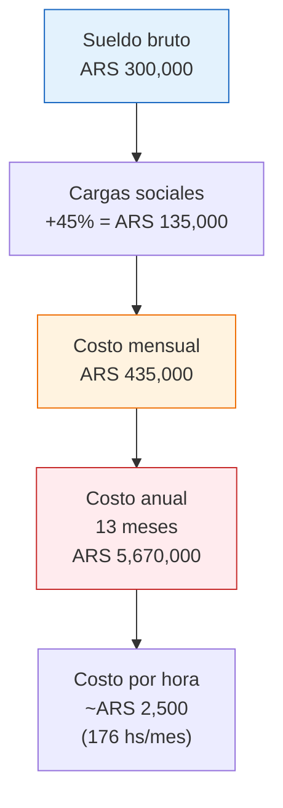

# Cuándo y cómo contratar tu primer empleado

> Llegaste al punto donde trabajás 10+ horas por día, no das abasto con los envíos y estás dejando pasar oportunidades de crecimiento porque no tenés tiempo. Eso no es éxito: es un cuello de botella con tu nombre. Es momento de delegar.

## Señales de que necesitás ayuda

Si te identificás con 3 o más de estas señales, es hora de buscar ayuda:

| Señal | Qué significa |
|-------|--------------|
| Más de 10 pedidos/día y no llegás a preparar todo | Tu operación superó tu capacidad física |
| Trabajás 8+ horas diarias solo en operación (no en crecer) | Estás atrapado en tareas operativas |
| Respondés preguntas de ML con retraso (2+ horas) | Tu reputación y conversión están sufriendo |
| Dejás de buscar nuevos productos/proveedores | No crecés porque no tenés tiempo para pensar |
| Tu calidad de packaging/envío está bajando | El cansancio afecta la experiencia del cliente |
| Rechazaste una oportunidad de compra porque no podías manejar más volumen | Estás frenando tu propio negocio |

<Note>
No necesitás tener todas las señales. Si tu negocio es rentable (margen neto 25%+ sostenido por 3+ meses) y estás desbordado, es momento de analizar opciones. Mejor contratar un mes antes de lo necesario que un mes después, cuando ya perdiste ventas y reputación.
</Note>

## Opciones de contratación

<Tabs>
  <Tab title="Ayuda familiar (informal)">
    **Qué es:** Tu pareja, hermano, padre o amigo te ayuda con tareas específicas.

    **Ventajas:** Sin costo directo (o bajo), confianza, flexibilidad.

    **Desventajas:** No tiene cobertura legal (ART, obra social), puede generar conflictos personales, no es escalable.

    **Costo aproximado:** ARS 0 (o lo que acuerden informalmente).

    **Recomendación:** Funciona como solución temporal (1-3 meses) mientras evaluás si necesitás a alguien permanente. Pero no es una solución de largo plazo.
  </Tab>
  <Tab title="Monotributista (tercerizado)">
    **Qué es:** Contratás a alguien que tiene su propio Monotributo y te factura por servicios.

    **Ventajas:** Sin cargas sociales, flexibilidad, podés contratar por tarea específica.

    **Desventajas:** No tiene exclusividad (puede trabajar para otros), menos control, riesgo legal si la relación se parece a una relación de dependencia.

    **Costo aproximado:** ARS 150,000-300,000/mes (~USD 125-250 aproximado) por media jornada, según las tareas.

    **Recomendación:** Ideal para tareas específicas: fotografía, diseño, atención al cliente, o armado de pedidos 3-4 horas/día.
  </Tab>
  <Tab title="Empleado en relación de dependencia">
    **Qué es:** Contratación formal con todos los derechos laborales argentinos.

    **Ventajas:** Exclusividad, compromiso, cobertura legal completa.

    **Desventajas:** Costo alto (cargas sociales ~45% sobre el bruto), obligaciones legales (vacaciones, aguinaldo, indemnización si se va).

    **Costo aproximado:** Ver desglose detallado abajo.

    **Recomendación:** Cuando necesitás a alguien 6+ horas/día, 5 días a la semana, de forma permanente.
  </Tab>
</Tabs>

## Costo real de un empleado en Argentina

El costo para el empleador es significativamente mayor que el sueldo que recibe el empleado:

<Warning>
Estos valores son aproximados a febrero 2026 y dependen del convenio colectivo aplicable a tu actividad, la provincia y otros factores. Consultá con tu contador antes de contratar. Los valores cambian con frecuencia.
</Warning>

| Concepto | Monto aproximado | Notas |
|----------|-----------------|-------|
| **Sueldo bruto** | ARS 300,000/mes | Sueldo mínimo vital y móvil: ~ARS 250,000+ (aproximado 2026) |
| **Cargas sociales (~45%)** | ARS 135,000/mes | Jubilación, obra social, ART, seguro de vida, sindicato |
| **ART (Aseguradora de Riesgos del Trabajo)** | Incluido en cargas | Obligatorio, cubre accidentes laborales |
| **Subtotal mensual** | **~ARS 435,000/mes** | Lo que realmente te cuesta ese empleado por mes |
| **Aguinaldo (SAC)** | 1 sueldo bruto extra por año | Se paga en 2 cuotas (junio y diciembre) |
| **Vacaciones** | 14 días mínimo por año | Pagás el sueldo sin que trabaje esos días |
| **Costo anual total** | **~ARS 5,670,000** (~USD 4,725 aproximado) | Incluyendo aguinaldo, equivale a ~13 sueldos |

## Qué delegar primero

No delegues todo de golpe. Empezá por las tareas que te consumen más tiempo y requieren menos conocimiento específico:

<Steps>
  <Step title="Primero: packaging y envíos">
    Es la tarea más repetitiva y que más tiempo consume. Cualquier persona puede aprender a embalar y etiquetar paquetes en 1-2 días. Te libera 2-4 horas diarias inmediatamente.
  </Step>
  <Step title="Segundo: atención al cliente">
    Responder preguntas en MercadoLibre, gestionar reclamos, hacer seguimiento de envíos. Requiere capacitación (1-2 semanas) pero libera mucho tiempo mental.
  </Step>
  <Step title="Tercero: fotografía y publicaciones">
    Cuando la persona ya conoce tus productos, puede tomar fotos y armar publicaciones siguiendo tu formato. Esto te libera para enfocarte en encontrar nuevos productos y negociar con proveedores.
  </Step>
  <Step title="Último: negociación y estrategia">
    La relación con fábricas, la selección de productos y la estrategia de precios son lo último que delegás. Es tu ventaja competitiva y requiere experiencia que solo vos tenés.
  </Step>
</Steps>

<Tip>
**Regla de oro de la delegación:** si una tarea la podés explicar en un documento de 1 página y no requiere tomar decisiones estratégicas, es candidata a delegar. Si requiere tu criterio o experiencia para hacerla bien, quedátela.
</Tip>

## Cuánto tiene que facturar tu negocio para pagar un empleado

Antes de contratar, hacé esta cuenta:

| Concepto | Cálculo |
|----------|---------|
| **Costo mensual del empleado** | ~ARS 435,000 (bruto + cargas) |
| **Margen neto de tu negocio** | Supongamos 30% |
| **Facturación extra necesaria** | ARS 435,000 / 0.30 = **ARS 1,450,000/mes** |

Eso significa que necesitás que el empleado te ayude a generar al menos ARS 1,450,000 de facturación mensual adicional (~USD 1,200 aproximado) para que se pague solo. Generalmente lo hace al liberarte tiempo para vender más y gestionar mejor.

## Riesgos de la informalidad

<Warning>
**Contratar en negro (sin registrar) es un riesgo enorme.** Si la persona se lastima trabajando para vos y no tiene ART, vos pagás todo de tu bolsillo (puede ser millones). Si te denuncia ante el Ministerio de Trabajo, las multas por empleo no registrado en Argentina son severísimas: pueden duplicar la indemnización y sumar multas adicionales. No vale la pena el ahorro.
</Warning>

## Alternativa: empezá tercerizando

Si no estás seguro de necesitar a alguien full-time, empezá tercerizando tareas específicas:

| Tarea | A quién tercerizar | Costo aproximado |
|-------|-------------------|-----------------|
| **Fotografía de producto** | Fotógrafo freelance | ARS 3,000-8,000 por sesión (10-20 productos) |
| **Armado de publicaciones ML** | VA (asistente virtual) | ARS 80,000-150,000/mes por medio tiempo |
| **Diseño de imágenes/banners** | Diseñador freelance | ARS 2,000-5,000 por pieza |
| **Contabilidad** | Tu contador (ya lo tenés) | Incluido en honorarios mensuales |
| **Preparación de pedidos** | Familiar o conocido de confianza | Variable |

<Tip>
Un asistente virtual (VA) que trabaje 4 horas/día contestando preguntas de ML y armando publicaciones puede costar ARS 80,000-150,000/mes como monotributista (~USD 65-125 aproximado). Es la mitad del costo de un empleado registrado y te libera una cantidad enorme de tiempo.
</Tip>

## Preguntas frecuentes

<Accordion title="Cuántas ventas mensuales necesito para justificar un empleado?">
Como regla general, si tenés más de 150-200 ventas mensuales con un margen neto del 30%+, un empleado de medio tiempo se justifica. Para un empleado full-time, apuntá a 300+ ventas mensuales. Pero la decisión depende más de tu situación personal: si estás desbordado con 80 ventas porque son productos grandes y complejos, puede que lo necesites antes.
</Accordion>

<Accordion title="Puedo contratar a alguien solo para días de mucha demanda?">
Sí. Un monotributista puede trabajar los días que necesites. Acordá un precio por día o por hora y pagá solo cuando lo necesitás. Es ideal para picos de demanda como Hot Sale, Día de la Madre, o Navidad.
</Accordion>

<Accordion title="Necesito un espacio específico para que trabaje?">
Si la persona va a preparar envíos, necesitás un espacio físico con mesa de trabajo, materiales de packaging y acceso a la mercadería. Puede ser una habitación de tu casa o un depósito pequeño. Si solo hace atención al cliente o publicaciones, puede trabajar remoto desde su casa.
</Accordion>

## Siguiente paso

Con tu equipo (aunque sea de una persona) armado, estás en posición de pensar en crecimiento real. Continuá con [Agregar un segundo rubro: cuándo y cómo](/app/paso1-argentina/crecer-gestionar/diversificar-rubros).
