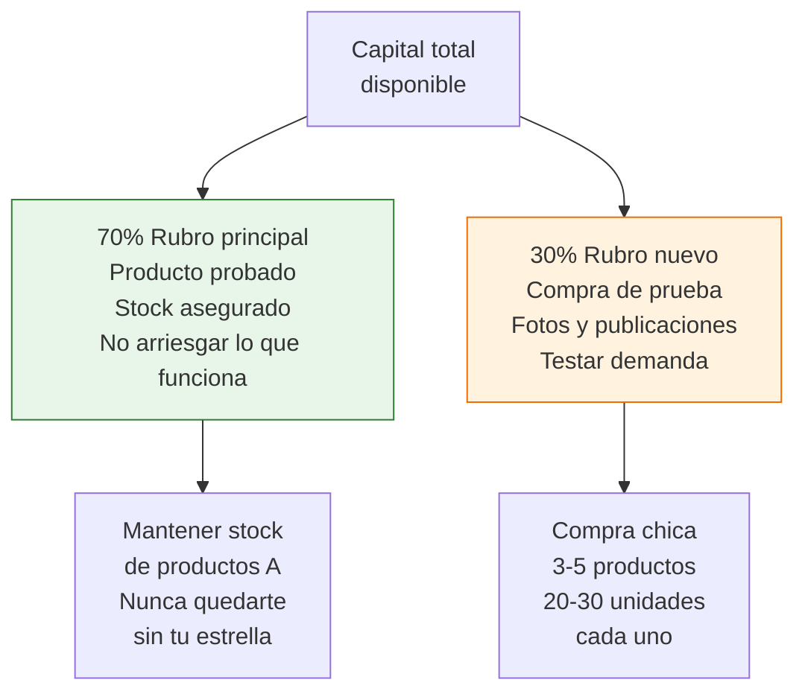
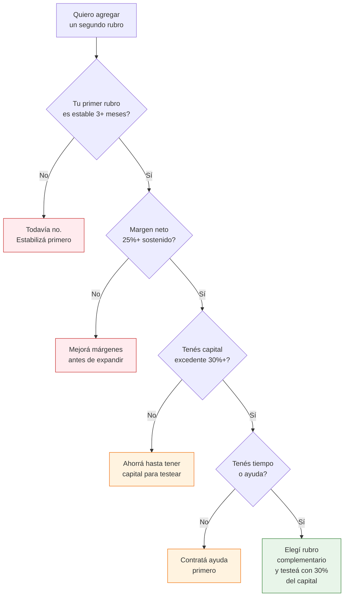

# Agregar un segundo rubro: cuándo y cómo

> Cuando tu primer rubro funciona bien, la tentación de agregar otro es enorme. Pero diversificar demasiado temprano es el error número uno que frena el crecimiento. Esta guía te dice exactamente cuándo estás listo y cómo hacerlo sin desestabilizar lo que ya funciona.

## Cuándo estás listo para un segundo rubro

**No diversifiques hasta que cumplas estos 4 requisitos:**

| Requisito | Qué significa en la práctica |
|-----------|------------------------------|
| **Primer rubro estable 3+ meses** | Vendés consistentemente, sin meses malos sorpresivos |
| **Margen neto sostenido 25%+** | Después de todos los costos, incluido tu tiempo |
| **Proveedores confiables** | Al menos 1-2 fábricas que entregan bien y a tiempo |
| **Operación bajo control** | Stock controlado, envíos al día, reputación ML verde |

<Warning>
**El error más caro de la reventa:** diversificar antes de dominar tu primer rubro. Agregar un segundo rubro duplica tu complejidad operativa: más proveedores, más fotos, más publicaciones, más stock que controlar. Si tu primer rubro no está sólido, el segundo lo va a arrastrar hacia abajo.
</Warning>

## Cómo elegir el segundo rubro

Hay dos estrategias:

<Tabs>
  <Tab title="Rubro complementario (recomendado)">
    **Qué es:** Un rubro que comparte audiencia con tu rubro actual. Los mismos clientes que te compran el producto A, también comprarían el producto B.

    **Ventajas:**
    - Podés hacer cross-selling (vender B a clientes de A)
    - Reutilizás parte de tu conocimiento de mercado
    - El packaging y la logística pueden compartirse

    **Ejemplo:** Si vendés bijouterie, agregar marroquinería (carteras, billeteras) es complementario: misma audiencia femenina, rango de precio similar, canales de venta idénticos.
  </Tab>
  <Tab title="Rubro independiente">
    **Qué es:** Un rubro completamente diferente, con audiencia distinta.

    **Ventajas:**
    - Diversificación real: si un rubro cae, el otro te sostiene
    - Podés testear mercados completamente nuevos

    **Desventajas:**
    - No podés reutilizar nada: nuevos proveedores, nueva audiencia, nueva estrategia de fotos y publicaciones
    - Duplicás la complejidad operativa

    **Cuándo elegir esto:** Solo si tu primer rubro tiene un techo muy bajo de crecimiento o si ya lo dominás completamente (12+ meses de experiencia).
  </Tab>
</Tabs>

## Rubros complementarios que funcionan

| Tu rubro actual | Rubros complementarios | Por qué funcionan juntos |
|----------------|----------------------|--------------------------|
| **Bijouterie** | Marroquinería, accesorios pelo | Misma audiencia, ocasiones de uso similares |
| **Marroquinería** | Bijouterie, accesorios viaje | Complementan el outfit, cross-selling natural |
| **Fitness/Deporte** | Indumentaria deportiva, suplementos (con habilitación) | Mismo cliente, misma motivación de compra |
| **Bazar/Hogar** | Decoración, organización | Mismo espacio (la casa), misma ocasión de compra |
| **Mascotas** | Packaging para pet shops, accesorios | Podés vender al consumidor final y también B2B |
| **Decoración** | Bazar, organización, velas artesanales | Misma audiencia interesada en su hogar |
| **Papelería** | Packaging, artículos de oficina | Complementan para trabajadores independientes |

## Asignación de capital: la regla 70/30

Cuando agregás un segundo rubro, no dividas tu capital en partes iguales. Tu primer rubro ya está funcionando y merece la mayor parte de los recursos:

### Ejemplo con números

Si tenés ARS 500,000 de capital de trabajo:

| Asignación | Monto | Destino |
|-----------|-------|---------|
| **Rubro principal (70%)** | ARS 350,000 | Stock habitual, reposición de productos A |
| **Rubro nuevo (30%)** | ARS 150,000 | Primera compra de prueba, fotos, publicaciones |

<Note>
La regla 70/30 es para el inicio. Si el segundo rubro demuestra ser rentable después de 2-3 meses, podés ir ajustando gradualmente hacia 60/40 o 50/50. Pero nunca descuides el rubro que ya te da plata para experimentar con uno nuevo.
</Note>

## Proceso paso a paso para agregar un rubro

<Steps>
  <Step title="Investigá el mercado del nuevo rubro">
    Buscá en MercadoLibre: qué se vende, a qué precios, quiénes son los principales vendedores, cuántas ventas tienen. Calculá si los márgenes son atractivos con las fórmulas que ya conocés. Dedicá 1-2 semanas a esta investigación.
  </Step>
  <Step title="Encontrá 2-3 proveedores potenciales">
    Usá las mismas técnicas que usaste para tu primer rubro: registros industriales, cámaras, ferias, Google. Pedí muestras o hacé una compra mínima para evaluar calidad.
  </Step>
  <Step title="Hacé una compra de prueba chica">
    Comprá 20-30 unidades de 3-5 productos diferentes. No te comprometas con grandes volúmenes hasta tener datos de ventas reales. Inversión típica: ARS 50,000-150,000 (~USD 40-125 aproximado).
  </Step>
  <Step title="Armá publicaciones de calidad">
    Fotos profesionales, títulos optimizados, descripciones completas. Aplicá todo lo que aprendiste con tu primer rubro. No bajes el estándar porque es "solo una prueba".
  </Step>
  <Step title="Evaluá resultados después de 60-90 días">
    Medí: ventas por producto, margen neto, rotación, ROI. Si el rubro muestra potencial (ROI positivo y creciente), escalá gradualmente. Si no funciona después de 90 días de esfuerzo real, cortá y recuperá el capital.
  </Step>
</Steps>

## Logística compartida vs. separada

| Aspecto | Compartida | Separada |
|---------|-----------|----------|
| **Almacenamiento** | Mismo espacio, diferentes estantes | Diferentes espacios o depósitos |
| **Packaging** | Mismas cajas y materiales | Packaging personalizado por rubro |
| **Envíos** | Mismo proceso, misma cuenta ML | Cuentas ML diferentes por rubro |
| **Recomendación** | Ideal para rubros complementarios | Solo si los rubros son completamente diferentes |

<Tip>
Si tus rubros son complementarios, compartí todo lo que puedas: packaging, espacio, cuenta ML, proceso de envío. Eso reduce costos y complejidad. Solo separá lo que necesita ser diferente (fotos, publicaciones, proveedores).
</Tip>

## Decisión de diversificar: diagrama

## Alternativa de bajo riesgo: consignación

Si no querés comprometer capital en un rubro nuevo, buscá proveedores que ofrezcan consignación:

- Les pedís mercadería sin pagar por adelantado
- Vendés y les pagás un porcentaje acordado
- Si no se vende, devolvés la mercadería

Es la forma más segura de testear un rubro nuevo, aunque los márgenes son menores (10-25% vs. 30-50% comprando directamente).

<Tip>
Para más detalle sobre cómo funciona la consignación, consultá [Consignación](/app/paso1-argentina/empezar-de-cero/consignacion).
</Tip>

## Preguntas frecuentes

<Accordion title="Cuántos rubros puedo manejar al mismo tiempo?">
Depende de tu capacidad operativa, pero como regla general: 1 rubro si estás solo, 2 rubros si tenés ayuda parcial, 3 rubros máximo si tenés un equipo armado. Más de 3 rubros simultáneos diluye tu atención y baja la calidad en todos. Es mejor ser muy bueno en 2 rubros que mediocre en 5.
</Accordion>

<Accordion title="Conviene abrir una segunda cuenta de MercadoLibre para el nuevo rubro?">
Generalmente no. ML penaliza las cuentas duplicadas. Mejor usá tu cuenta existente y organizá tus publicaciones por categoría. La excepción es si los rubros son tan diferentes que la audiencia podría confundirse (ejemplo: vender artículos de bebé y herramientas de ferretería desde la misma tienda).
</Accordion>

<Accordion title="Qué pasa si el segundo rubro no funciona?">
Liquidá el stock, recuperá la mayor cantidad de capital posible y redirigilo a tu rubro principal. No es un fracaso: es un aprendizaje que te costó entre ARS 50,000-150,000 pero te enseñó qué no funciona. Es mucho más barato que seguir invirtiendo en algo que no rota.
</Accordion>

## Siguiente paso

Si estás pensando en crecer más allá de la reventa simple, el siguiente nivel es evolucionar tu modelo de negocio. Continuá con [De reventa a marca propia a distribución](/app/paso1-argentina/crecer-gestionar/evolucion-negocio).
