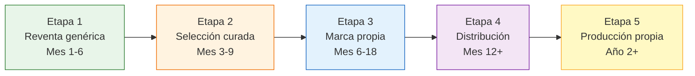

# De reventa a marca propia a distribución

> Tu negocio no tiene que quedarse en reventa genérica para siempre. Hay una evolución natural que muchos revendedores exitosos siguen: de comprar y revender a construir una marca, distribuir a otros revendedores, o incluso producir. Pero cada etapa tiene su momento, y saltear pasos es la forma más rápida de fracasar.

## Las 5 etapas de evolución

<Note>
Los tiempos son orientativos. Algunos vendedores pasan a marca propia en el mes 4; otros se quedan en reventa genérica 2 años porque les funciona bien. No hay apuro. Cada etapa tiene su rentabilidad y su razón de ser.
</Note>

## Etapa 1: Reventa genérica (Mes 1-6)

<Tabs>
  <Tab title="Qué es">
    Comprás productos terminados de fábricas argentinas y los revendés tal cual, sin modificaciones. El producto no tiene tu marca, no lo diferenciás, simplemente lo comprás barato y lo vendés más caro.

    **Ejemplo:** comprás collares a una fábrica de Flores a ARS 800 y los vendés en ML a ARS 2,500.
  </Tab>
  <Tab title="Números típicos">
    | Métrica | Rango aproximado |
    |---------|-----------------|
    | Margen neto | 25-40% |
    | Capital necesario | ARS 100,000-300,000 (~USD 80-250) |
    | Ventas/mes | 30-100 |
    | Tiempo dedicado | 4-6 horas/día |
    | Complejidad | Baja |
  </Tab>
  <Tab title="Qué aprendés">
    - Cómo funciona MercadoLibre (algoritmo, reputación, envíos)
    - Qué se vende y qué no (datos reales, no suposiciones)
    - Cómo tratar con fábricas (negociación, pedidos, calidad)
    - Tus costos reales (comisiones, envío, impuestos, imprevistos)
    - Fotografía de producto y copywriting de publicaciones
  </Tab>
</Tabs>

**Para pasar a la Etapa 2:** tenés que saber qué productos se venden bien y cuáles no. Necesitás datos de al menos 3 meses de ventas.

## Etapa 2: Selección curada (Mes 3-9)

<Tabs>
  <Tab title="Qué es">
    Dejás de vender "de todo un poco" y te enfocás en los productos que mejor funcionan (tu categoría A). Mejorás las fotos, el packaging y la presentación. Empezás a construir una identidad visual aunque no tengas marca registrada.

    **Ejemplo:** de los 15 productos que vendías, te quedás con los 5 mejores. Les sacás fotos profesionales, armás packaging consistente con tu logo o un sticker, y la experiencia del cliente mejora notablemente.
  </Tab>
  <Tab title="Números típicos">
    | Métrica | Rango aproximado |
    |---------|-----------------|
    | Margen neto | 30-50% |
    | Capital necesario | ARS 300,000-600,000 (~USD 250-500) |
    | Ventas/mes | 80-200 |
    | Tiempo dedicado | 5-8 horas/día |
    | Complejidad | Media |
  </Tab>
  <Tab title="Qué cambia">
    - Eliminás productos C (liberás capital)
    - Mejorás packaging (sticker con logo, bolsita de marca, tarjeta de agradecimiento)
    - Fotos de calidad profesional
    - Empezás a tener "clientes repetitivos" que reconocen tu tienda
    - Podés cobrar un poco más porque la percepción de calidad sube
  </Tab>
</Tabs>

**Para pasar a la Etapa 3:** necesitás tener productos validados (venta constante 3+ meses) y una relación sólida con al menos una fábrica que acepte personalización.

## Etapa 3: Marca propia (Mes 6-18)

<Tabs>
  <Tab title="Qué es">
    Ponés tu marca en productos fabricados por terceros. No fabricás: le pedís a la fábrica que ponga tu logo, tu etiqueta, tu packaging. El producto es el mismo (o con pequeñas modificaciones), pero ahora tiene tu identidad.

    **Ejemplo:** los mismos collares de la fábrica de Flores, pero ahora vienen en una cajita con tu marca, con etiqueta personalizada y un certificado de calidad con tu logo.
  </Tab>
  <Tab title="Números típicos">
    | Métrica | Rango aproximado |
    |---------|-----------------|
    | Margen neto | 40-60% |
    | Capital necesario | ARS 500,000-1,500,000 (~USD 400-1,250) |
    | Ventas/mes | 100-300 |
    | Tiempo dedicado | 6-10 horas/día |
    | Complejidad | Media-Alta |
  </Tab>
  <Tab title="Qué necesitás">
    - Registrar tu marca en INPI (costo: ~ARS 50,000-80,000 aproximado, tarda 6-12 meses)
    - Diseñar logo, packaging y material de marca (ARS 30,000-100,000 una vez)
    - Fábrica que acepte personalización (etiquetas, packaging, modificaciones menores)
    - Pedidos más grandes (las fábricas piden mínimos mayores para personalizar)
    - Buena fotografía de marca (no solo del producto, sino del branding)
  </Tab>
</Tabs>

<Tip>
Para más detalle sobre cómo implementar marca blanca con fábricas argentinas, consultá [Marca blanca](/app/paso1-argentina/empezar-de-cero/marca-blanca).
</Tip>

**Para pasar a la Etapa 4:** tu marca tiene que ser reconocida (clientes que buscan tu marca, vendedores que quieren revender tus productos).

## Etapa 4: Distribución B2B (Mes 12+)

<Tabs>
  <Tab title="Qué es">
    Además de vender al consumidor final, empezás a vender a otros revendedores: locales, tiendas online, vendedores de ML más chicos. Sos el intermediario entre la fábrica y una red de revendedores.

    **Ejemplo:** comprás 500 collares a la fábrica a ARS 800, les ponés tu marca, y vendés 200 al consumidor final a ARS 2,500 y 300 a revendedores a ARS 1,500. Tu margen por unidad es menor en B2B, pero el volumen compensa.
  </Tab>
  <Tab title="Números típicos">
    | Métrica | Rango aproximado |
    |---------|-----------------|
    | Margen neto B2C | 40-60% |
    | Margen neto B2B | 15-30% |
    | Capital necesario | ARS 1,500,000+ (~USD 1,250+) |
    | Ventas/mes | 300+ (B2C + B2B) |
    | Tiempo dedicado | 8-12 horas/día (o con empleados) |
    | Complejidad | Alta |
  </Tab>
  <Tab title="Qué cambia">
    - Necesitás facturar como Responsable Inscripto (los comercios piden factura A)
    - Volúmenes de compra mucho mayores (mejor precio de fábrica)
    - Gestión de clientes B2B (crédito, condiciones de pago, atención diferenciada)
    - Logística más compleja (envíos grandes a revendedores + envíos individuales a consumidores)
    - Potencialmente necesitás empleados
  </Tab>
</Tabs>

<Tip>
Para más detalle sobre venta B2B y distribución, consultá [Venta B2B y distribución](/app/paso1-argentina/empezar-de-cero/venta-b2b-distribucion).
</Tip>

## Etapa 5: Producción propia (Año 2+, opcional)

<Tabs>
  <Tab title="Qué es">
    Cuando un producto está tan validado que justifica producirlo vos mismo. Dejás de comprar a la fábrica y montás tu propia producción (o contratás un taller exclusivo).

    **Ejemplo:** después de vender 5,000 collares de la fábrica de Flores, descubrís que el modelo X se vende 3 veces más que cualquier otro. Contratás un taller artesanal que produzca exclusivamente ese modelo con mejores materiales y tu diseño optimizado.
  </Tab>
  <Tab title="Números típicos">
    | Métrica | Rango aproximado |
    |---------|-----------------|
    | Margen neto | 50-70% (si funciona bien) |
    | Capital necesario | ARS 3,000,000+ (~USD 2,500+) |
    | Complejidad | Muy alta |
    | Riesgo | Alto (producción, calidad, empleados) |
  </Tab>
  <Tab title="Cuándo tiene sentido">
    - Un producto específico tiene demanda demostrada (12+ meses de ventas crecientes)
    - Tu proveedor actual no puede cumplir con la calidad o el volumen que necesitás
    - El margen adicional de producir vs. comprar justifica la inversión y el riesgo
    - Tenés experiencia suficiente para gestionar producción (o podés contratar a alguien que la tenga)
  </Tab>
</Tabs>

<Warning>
**La Etapa 5 no es para todos y no es obligatoria.** Muchos negocios excelentes se quedan en Etapa 3 o 4 por siempre. Producir implica riesgos completamente diferentes: gestionar empleados de producción, controlar calidad de materias primas, invertir en maquinaria. No lo hagas solo porque "parece el siguiente paso". Hacelo solo si los números lo justifican claramente.
</Warning>

## Qué cambia en cada etapa

| Aspecto | E1: Reventa | E2: Curada | E3: Marca | E4: Distribución | E5: Producción |
|---------|------------|-----------|-----------|------------------|---------------|
| **Capital** | ARS 100-300k | ARS 300-600k | ARS 500k-1.5M | ARS 1.5M+ | ARS 3M+ |
| **Margen neto** | 25-40% | 30-50% | 40-60% | 15-60% (mixto) | 50-70% |
| **Complejidad** | Baja | Media | Media-Alta | Alta | Muy alta |
| **Tiempo** | 4-6 hs/día | 5-8 hs/día | 6-10 hs/día | 8-12 hs/día | Full-time + equipo |
| **Empleados** | No | No | Opcional | Probablemente sí | Sí |
| **Régimen fiscal** | Monotributo | Monotributo | Monotributo o RI | RI | RI |

## Cómo decidir si avanzar de etapa

Para cada transición, hacete estas preguntas:

<Accordion title="De Etapa 1 a Etapa 2: me enfoco?">
- Tengo datos de 3+ meses de ventas? Si no, esperá.
- Sé cuáles son mis productos A, B y C? Si no, clasificá primero.
- Puedo soltar los productos C sin que me falte plata? Si no, esperá a tener reserva.
- Estoy dispuesto a invertir en mejores fotos y packaging? Si sí, avanzá.
</Accordion>

<Accordion title="De Etapa 2 a Etapa 3: pongo mi marca?">
- Mi fábrica acepta personalización? Preguntá directamente.
- Tengo presupuesto para registrar la marca y diseñar packaging? (~ARS 100,000-200,000).
- Mis clientes vuelven a comprar o buscan mi tienda? Si no hay lealtad, la marca no ayuda todavía.
- El volumen justifica pedidos más grandes? Las fábricas piden mínimos mayores para personalizar.
</Accordion>

<Accordion title="De Etapa 3 a Etapa 4: distribuyo?">
- Otros vendedores me piden comprar al por mayor? Si la demanda B2B es orgánica, es buena señal.
- Puedo manejar dos tipos de clientes (B2C y B2B) al mismo tiempo? Requiere más organización.
- Estoy como Responsable Inscripto? Los comercios necesitan factura A.
- Mi capacidad de compra a fábrica justifica los descuentos por volumen? Si no, el margen B2B no cierra.
</Accordion>

<Accordion title="De Etapa 4 a Etapa 5: produzco?">
- Tengo un producto con 12+ meses de ventas crecientes? Si no, no hay suficiente validación.
- El costo de producción propia es al menos 30% menor que comprar a fábrica? Si no, no vale el riesgo.
- Tengo acceso a materias primas confiables? Producir depende de tu cadena de suministro.
- Puedo gestionar un equipo de producción (o conozco a alguien que puede)? Si no, el salto es demasiado grande.
</Accordion>

<Warning>
**Nunca saltees etapas.** Cada etapa te enseña habilidades que necesitás para la siguiente. Pasar de Etapa 1 directamente a Etapa 3 (marca propia) sin haber curado tu selección es poner tu marca en productos que tal vez no se vendan. Pasar a distribución sin marca es vender genéricos que cualquier otro puede replicar.
</Warning>

## Preguntas frecuentes

<Accordion title="Puedo estar en varias etapas al mismo tiempo?">
Sí, y es lo más común. Podés tener tu línea de marca propia (Etapa 3) para tus productos estrella y seguir haciendo reventa genérica (Etapa 1) para productos que estás testeando. Lo importante es que cada línea de producto tenga su estrategia clara.
</Accordion>

<Accordion title="Cuánta plata necesito para registrar una marca?">
En INPI (Instituto Nacional de la Propiedad Industrial) el costo de registro es de aproximadamente ARS 50,000-80,000 (aproximado 2026). El trámite tarda entre 6 y 12 meses. Podés hacerlo vos mismo online o con un agente de propiedad intelectual (costo adicional ARS 30,000-60,000 aproximado por sus honorarios).
</Accordion>

<Accordion title="Es mejor quedarse en una etapa y ser muy bueno, o avanzar?">
Depende de tus objetivos. Si tu primer rubro como reventa genérica te genera la ganancia que necesitás y tenés calidad de vida, no hay razón para complicarte. Avanzá de etapa solo si querés crecer y estás dispuesto a asumir más complejidad. No hay premio por llegar a la Etapa 5.
</Accordion>

<Tip>
Revisá periódicamente [Flujo de caja](/app/paso1-argentina/crecer-gestionar/flujo-caja) y [Gestión de inventario](/app/paso1-argentina/crecer-gestionar/gestion-inventario) cada vez que cambies de etapa. Los fundamentos financieros son los mismos, pero los números cambian significativamente con cada transición.
</Tip>
