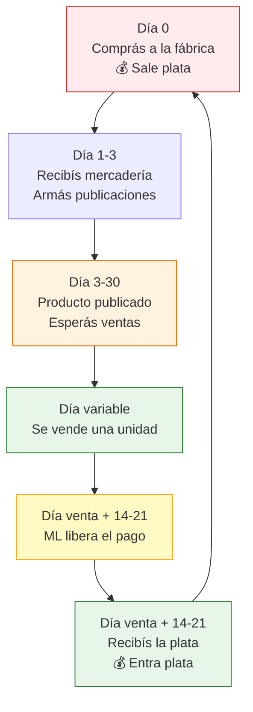

# Flujo de caja: ganancia vs. dinero en mano

> Podés ser rentable en los números y estar quebrado en la práctica. Si tu plata está atrapada entre la compra a fábrica y el cobro de MercadoLibre, no importa cuánto vendas: no vas a poder reponer stock, pagar impuestos ni comer.

## La trampa de "ganancia no es efectivo"

Hay una diferencia crítica que muchos vendedores ignoran hasta que les estalla en la cara:

| Concepto | Qué es | Ejemplo |
|----------|--------|---------|
| **Ganancia contable** | Lo que ganás en los números (ventas - costos) | Vendiste ARS 500,000 con margen del 35% = ARS 175,000 de "ganancia" |
| **Efectivo disponible** | La plata que realmente tenés en la cuenta hoy | Tu cuenta tiene ARS 30,000 porque ML todavía no liberó el resto |

<Warning>
**La trampa del "rentable pero quebrado":** tu planilla de Excel dice que ganaste ARS 175,000 este mes. Pero hoy necesitás ARS 120,000 para reponer stock y tenés ARS 30,000 en la cuenta. El resto está en tránsito en MercadoLibre. Eso es un problema de flujo de caja, no de rentabilidad.
</Warning>

## El ciclo del dinero en reventa por MercadoLibre

Tu plata pasa por un ciclo que dura entre 30 y 50 días antes de volver a tus manos:

### Tiempos reales del ciclo

| Etapa | Tiempo aproximado | Notas |
|-------|-------------------|-------|
| **Pago a fábrica** | Día 0 (inmediato o 50% anticipo) | Algunas fábricas dan 30 días, pero es raro al principio |
| **Recepción y preparación** | 1-3 días | Fotografía, armado de publicaciones, packaging |
| **Tiempo hasta la venta** | 7-30 días (promedio ~15) | Depende del producto, precio y reputación |
| **ML retiene el pago** | 14-21 días después de la venta | Vendedores nuevos: 21 días. Con reputación: 14 días |
| **Ciclo total** | **30-50 días** | Desde que pagás la mercadería hasta que cobrás |

<Note>
MercadoLibre acortó los plazos de cobro para vendedores con buena reputación. Con nivel "MercadoLíder" podés cobrar en 2-7 días después de la entrega. Pero los primeros meses, contá con 14-21 días de retención.
</Note>

## Ejemplo práctico con números

Supongamos que comprás ARS 300,000 en mercadería el 1 de marzo:

| Semana | Evento | Plata que sale | Plata que entra | Saldo disponible |
|--------|--------|----------------|-----------------|------------------|
| **Semana 1** | Comprás mercadería, pagás flete | -ARS 300,000, -ARS 15,000 | ARS 0 | -ARS 315,000 |
| **Semana 2** | Vendés 15 unidades (no cobrás todavía) | -ARS 26,000 (monotributo, contador) | ARS 0 | -ARS 341,000 |
| **Semana 3** | Vendés 20 unidades más, seguís sin cobrar | ARS 0 | ARS 0 | -ARS 341,000 |
| **Semana 4** | ML libera pagos de semana 1-2 | ARS 0 | +ARS 127,000 | -ARS 214,000 |
| **Semana 5** | ML libera pagos de semana 3 | ARS 0 | +ARS 170,000 | -ARS 44,000 |
| **Semana 6** | Cobrás todo lo pendiente, vendés más | ARS 0 | +ARS 130,000 | +ARS 86,000 |

<Warning>
Mirá la semana 3: ya vendiste 35 unidades, tu margen es excelente, pero tu saldo es **-ARS 341,000**. En ese momento necesitás plata para vivir, para impuestos, y tal vez para reponer stock. Si no tenés reserva, estás en problemas aunque el negocio "funcione".
</Warning>

## Plantilla de flujo de caja semanal

Armá una planilla con estas columnas y actualizala cada semana:

| Columna | Qué anotás |
|---------|-----------|
| **Semana** | Número de semana del mes |
| **Saldo inicial** | Cuánta plata tenés al arrancar la semana |
| **Ingresos cobrados** | Plata que efectivamente entró (no vendida, cobrada) |
| **Compras de mercadería** | Pagos a fábricas |
| **Costos fijos** | Monotributo, contador, IIBB, servicios |
| **Costos variables** | Packaging, fletes, insumos |
| **Saldo final** | Saldo inicial + ingresos - todos los gastos |
| **Ventas pendientes de cobro** | Lo que vendiste pero ML no liberó todavía |

<Tip>
Podés hacerlo en Google Sheets gratis. Lo importante no es la herramienta, es el hábito. Dedicá 15 minutos cada lunes a actualizar tu flujo de caja. Esos 15 minutos te salvan de tomar decisiones a ciegas.
</Tip>

## La regla de la reserva: 2-3 meses de operación

Tu reserva mínima de efectivo debería cubrir entre 2 y 3 meses de costos operativos:

<Steps>
  <Step title="Calculá tus costos fijos mensuales">
    Sumá: monotributo + contador + IIBB + servicios + cualquier otro gasto que pagás todos los meses aunque no vendas nada. Rango típico: ARS 50,000-120,000/mes (~USD 40-100 aproximado).
  </Step>
  <Step title="Multiplicá por 2 o 3">
    Si tus fijos son ARS 80,000/mes, tu reserva mínima es ARS 160,000-240,000. Esa plata **no se toca** para comprar mercadería.
  </Step>
  <Step title="Separala físicamente">
    Poné la reserva en una cuenta distinta (caja de ahorro, FCI money market, o incluso un sobre aparte si manejás efectivo). Si está en la misma cuenta que el capital de trabajo, la vas a gastar.
  </Step>
</Steps>

## Cuándo reinvertir y cuánto

Después de tus primeras ventas, la tentación es reinvertir todo. No lo hagas.

| Situación | Qué hacer con la ganancia |
|-----------|--------------------------|
| **Meses 1-3** (sin reserva armada) | 70% a reserva, 30% a reinversión |
| **Meses 3-6** (reserva parcial) | 50% a reserva, 50% a reinversión |
| **Mes 6+** (reserva completa) | 20% a reserva/retiro personal, 80% a reinversión |

<Note>
"Reinversión" no significa solo comprar más mercadería. También incluye mejorar fotografía, probar nuevos productos, invertir en packaging de calidad, o mejorar tu logística. A veces comprar una impresora de etiquetas (ARS 60,000-100,000 aproximado) te ahorra más tiempo y plata que comprar 50 unidades más de stock.
</Note>

## Condiciones de pago como herramienta de flujo

Si podés negociar mejores condiciones de pago con tu fábrica, estás ganando tiempo en tu ciclo de caja:

<Tabs>
  <Tab title="Pago 100% anticipado">
    **Ciclo de caja:** 30-50 días (el más largo).

    **Cuándo es inevitable:** primeras compras, fábricas que no te conocen, pedidos chicos.

    **Impacto:** máxima presión sobre tu flujo de caja.
  </Tab>
  <Tab title="50% anticipo + 50% contra entrega">
    **Ciclo de caja:** se reduce porque la mitad del capital se compromete recién al recibir la mercadería.

    **Cuándo pedirlo:** después de 2-3 compras exitosas con la misma fábrica.

    **Impacto:** libera capital para otros gastos mientras esperás la producción.
  </Tab>
  <Tab title="Pago a 30 días">
    **Ciclo de caja:** puede ser cercano a cero si vendés y cobrás antes de pagar al proveedor.

    **Cuándo pedirlo:** después de 6+ meses de relación y volumen consistente.

    **Impacto:** el escenario ideal, pagás a la fábrica con la plata que cobraste de tus ventas.
  </Tab>
</Tabs>

<Tip>
Para más detalle sobre cómo negociar condiciones de pago con fábricas, consultá [Condiciones de pago](/app/paso1-argentina/evaluar-negociar/condiciones-pago).
</Tip>

## Preguntas frecuentes

<Accordion title="Puedo acelerar el cobro de MercadoLibre?">
Sí. Mejorá tu reputación cumpliendo con los tiempos de envío, manteniendo bajas las cancelaciones y respondiendo rápido las preguntas. MercadoLibre reduce automáticamente los plazos de liberación para vendedores confiables. Con reputación verde y nivel MercadoLíder, podés cobrar en 2-7 días después de la entrega.
</Accordion>

<Accordion title="Qué pasa si necesito plata urgente y ML la retiene?">
No hay forma de acelerar la liberación manualmente. Por eso la reserva es innegociable. Si dependés del cobro de ML para pagar gastos del día a día, vas a tener problemas cada mes. Planificá siempre asumiendo que ML va a tardar lo máximo posible.
</Accordion>

<Accordion title="Conviene vender por otros canales para cobrar más rápido?">
Sí. Ventas por Instagram, WhatsApp o tienda propia con MercadoPago cobran en 2-3 días hábiles. Diversificar canales no solo mejora ventas sino también tu flujo de caja. Pero no abandones ML, que es tu fuente principal de tráfico.
</Accordion>

## Siguiente paso

Ahora que entendés cómo se mueve tu dinero, el siguiente paso es optimizar en qué productos invertís. Continuá con [Gestión de inventario: ABC, ROI por SKU](/app/paso1-argentina/crecer-gestionar/gestion-inventario).
