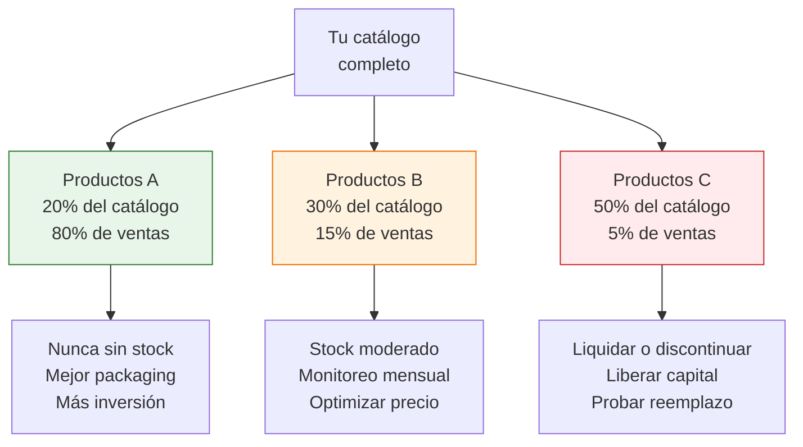

# Gestión de inventario: ABC, ROI por SKU

> No todos tus productos merecen la misma atención ni el mismo capital. Algunos generan el 80% de tus ingresos; otros ocupan espacio, atan plata y no se venden. Aprender a distinguirlos es la diferencia entre crecer y estancarte.

## Clasificación ABC: enfocá tu energía donde importa

El método ABC divide tus productos en tres categorías según cuánto aportan a tu facturación:

| Categoría | % de tus productos | % de tu facturación | Acción |
|-----------|-------------------|---------------------|--------|
| **A (estrellas)** | ~20% | ~80% | Máxima atención: nunca quedar sin stock, mejores fotos, más publicaciones |
| **B (soporte)** | ~30% | ~15% | Mantener: stock moderado, monitorear mensualmente |
| **C (cola)** | ~50% | ~5% | Evaluar: liquidar, discontinuar o reemplazar |



<Note>
Estos porcentajes son una guía general conocida como la "regla de Pareto" (80/20). En la práctica, tus números pueden variar. Lo importante es el concepto: pocos productos generan la mayor parte de tus ingresos.
</Note>

### Cómo clasificar tus productos

<Steps>
  <Step title="Listá todos tus productos activos">
    Incluí: nombre del producto, unidades vendidas en los últimos 30 días, y facturación total por producto.
  </Step>
  <Step title="Ordená de mayor a menor por facturación">
    El producto que más factura va primero.
  </Step>
  <Step title="Calculá el porcentaje acumulado">
    Sumá la facturación de arriba hacia abajo. Los productos que suman hasta el 80% son categoría A. Los que suman del 80% al 95% son B. El resto es C.
  </Step>
  <Step title="Asigná la categoría y actuá">
    Marcá cada producto como A, B o C y aplicá las acciones de la tabla de arriba.
  </Step>
</Steps>

## ROI por SKU: dónde rinde más tu capital

El ROI (Retorno sobre la Inversión) por SKU te dice cuánta plata generás por cada peso invertido en ese producto:

```
ROI por SKU = (Ganancia neta por unidad × Unidades vendidas por mes) / Capital invertido en stock
```

### Ejemplo comparativo

| Producto | Costo unidad | Ganancia neta/unidad | Unidades en stock | Capital invertido | Ventas/mes | Ganancia mensual | ROI mensual |
|----------|-------------|---------------------|-------------------|-------------------|-----------|-----------------|-------------|
| **Collar artesanal** | ARS 800 | ARS 1,200 | 100 | ARS 80,000 | 60 | ARS 72,000 | **90%** |
| **Bolso cuero** | ARS 8,000 | ARS 5,000 | 20 | ARS 160,000 | 8 | ARS 40,000 | **25%** |
| **Llavero simple** | ARS 300 | ARS 400 | 200 | ARS 60,000 | 30 | ARS 12,000 | **20%** |

<Tip>
El collar artesanal tiene un ROI del 90%: por cada ARS 100 invertidos, genera ARS 90 de ganancia por mes. El bolso de cuero tiene mayor ganancia por unidad, pero el capital está atado por más tiempo y rota menos. El ROI te muestra la verdad que el margen solo no revela.
</Tip>

## Velocidad de rotación ideal por rubro

La rotación mide cuántos días tardás en vender tu stock completo de un producto:

```
Días de rotación = Unidades en stock / Unidades vendidas por día
```

| Rubro | Rotación ideal | Rotación aceptable | Señal de alerta |
|-------|---------------|-------------------|-----------------|
| **Bijouterie/Accesorios** | 15-30 días | 30-45 días | Más de 60 días |
| **Marroquinería** | 30-45 días | 45-60 días | Más de 90 días |
| **Bazar/Hogar** | 20-35 días | 35-50 días | Más de 75 días |
| **Fitness/Deporte** | 20-40 días | 40-60 días | Más de 90 días |
| **Decoración** | 30-45 días | 45-70 días | Más de 90 días |
| **Packaging** | 15-25 días | 25-40 días | Más de 60 días |

<Warning>
Si un producto tiene más de 90 días de stock sin venderse, estás perdiendo plata. Ese capital atado podría estar en un producto que rota en 20 días. Cada mes que pasa con stock quieto es un mes en el que esa plata no genera retorno.
</Warning>

## Cuándo discontinuar un producto

No te enamores de un producto que no se vende. Aplicá la "regla de los 3 meses":

<Steps>
  <Step title="Mes 1: ajustá precio y publicación">
    Si un producto rota lento, antes de descartarlo probá: bajar el precio un 10-15%, mejorar las fotos, reescribir el título con mejores palabras clave.
  </Step>
  <Step title="Mes 2: promoción agresiva">
    Si con los ajustes sigue sin mejorar, hacé una promoción real: descuento del 20-30%, incluilo en un kit con un producto A.
  </Step>
  <Step title="Mes 3: liquidación y corte">
    Si después de 3 meses de intentos el ROI sigue siendo negativo o muy bajo, liquidá el stock restante al costo (o por debajo) y recuperá el capital para invertirlo en algo que funcione.
  </Step>
</Steps>

<Note>
Liquidar con pérdida duele, pero tener plata atada en un producto muerto es peor. Una pérdida del 20% liquidando hoy es mejor que tener ese capital congelado 6 meses más sin vender nada.
</Note>

## Tu planilla de control de inventario

Estas son las columnas mínimas que necesitás en tu planilla (Google Sheets o Excel):

| Columna | Qué anotás | Para qué sirve |
|---------|-----------|----------------|
| **Producto (SKU)** | Nombre o código del producto | Identificación |
| **Categoría ABC** | A, B o C | Priorización |
| **Unidades en stock** | Cuántas tenés hoy | Control de stock |
| **Costo por unidad** | Lo que pagás a la fábrica | Cálculo de capital invertido |
| **Capital invertido** | Unidades en stock x costo unitario | Cuánta plata está atada |
| **Unidades vendidas/mes** | Promedio últimos 30 días | Velocidad de rotación |
| **Días para agotar stock** | Stock actual / ventas por día | Cuándo reponer |
| **Ganancia neta/unidad** | Después de todos los costos | Rentabilidad real |
| **ROI mensual** | (Ganancia/unidad x ventas/mes) / capital invertido | Eficiencia del capital |

## Just-in-time: comprá solo lo que necesitás

Para productos de alta rotación (categoría A), podés aplicar una versión simple de "justo a tiempo":

<Tabs>
  <Tab title="Stock de seguridad">
    **Qué es:** Mantener solo el stock necesario para cubrir las ventas mientras llega el próximo pedido a la fábrica.

    **Fórmula simple:**
    ```
    Stock de seguridad = Ventas diarias promedio × Días de reposición × 1.3
    ```
    El 1.3 es un margen de seguridad del 30%.

    **Ejemplo:** vendés 5 unidades/día, tu fábrica tarda 7 días en entregar. Stock de seguridad = 5 × 7 × 1.3 = **46 unidades**.
  </Tab>
  <Tab title="Punto de reposición">
    **Qué es:** La cantidad mínima de stock a la que hacés un nuevo pedido.

    **Fórmula:** Igual al stock de seguridad. Cuando llegás a 46 unidades, pedís.

    **Ventaja:** Nunca te quedás sin stock de tu producto estrella, pero tampoco tenés capital atado en exceso de inventario.
  </Tab>
</Tabs>

<Warning>
El just-in-time solo funciona si tu fábrica es confiable en tiempos de entrega. Si tu proveedor es inconsistente (a veces entrega en 5 días, a veces en 20), necesitás más stock de seguridad. Conocé la realidad de tu proveedor antes de ajustar mucho el stock.
</Warning>

## Preguntas frecuentes

<Accordion title="Cuántos productos distintos debería tener en mi catálogo?">
No hay un número mágico, pero como regla general: empezá con 5-10 productos, medí cuáles son A, B y C, y después expandí solo si tus productos A están bien abastecidos. Mejor tener 8 productos bien manejados que 40 productos con stock descontrolado.
</Accordion>

<Accordion title="Qué hago con el stock de productos C?">
Tres opciones: (1) liquidar con descuento y recuperar parte del capital, (2) armar kits combinándolos con productos A para mover stock, (3) vender en lote a otro revendedor a precio de costo. Lo importante es liberar ese capital.
</Accordion>

<Tip>
Para entender mejor cómo afecta el inventario a tu flujo de dinero, revisá [Flujo de caja: ganancia vs. dinero en mano](/app/paso1-argentina/crecer-gestionar/flujo-caja).
</Tip>

## Siguiente paso

Ya sabés qué productos priorizar y cuáles soltar. Ahora aprendé a manejar los precios y las promociones sin destruir tus márgenes. Continuá con [Pricing: promos sin destruir márgenes](/app/paso1-argentina/crecer-gestionar/pricing-dinamico).
