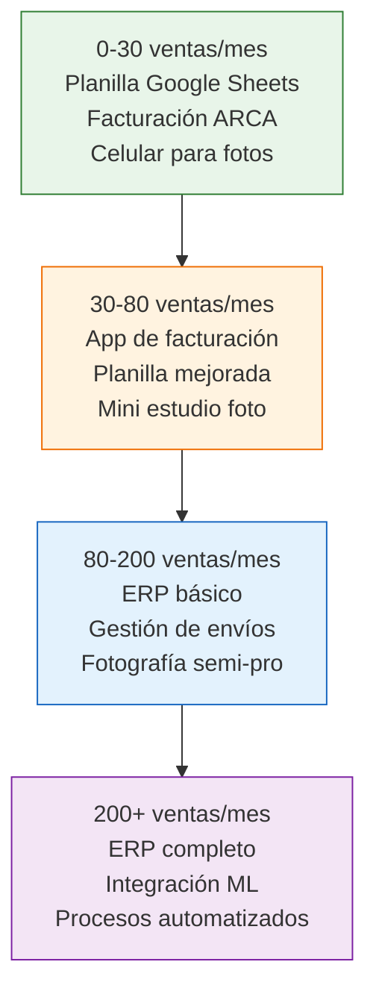

# Herramientas de gestión: stock, facturación, envíos

> Al principio una planilla de Excel alcanza. Pero cuando tenés 50+ productos, 10+ pedidos por día y facturas que hacer, necesitás herramientas que te saquen trabajo de encima. La clave es incorporarlas en el momento justo: ni antes (sobre-complicás) ni después (ya estás desbordado).

## Cuándo agregar cada herramienta

No necesitás todo desde el día uno. Incorporá herramientas según tu volumen:

<Warning>
**El error más común:** comprar un ERP de ARS 30,000/mes cuando tenés 15 ventas mensuales. Una planilla de Google Sheets bien armada es suficiente para los primeros 6 meses. No gastes en herramientas lo que deberías invertir en stock.
</Warning>

## Facturación electrónica

Necesitás emitir facturas electrónicas por cada venta. Estas son tus opciones:

<Tabs>
  <Tab title="ARCA (gratis)">
    **Qué es:** El portal de facturación de ARCA (ex AFIP). Entrás con clave fiscal y emitís facturas una por una.

    **Costo:** Gratis.

    **Ventajas:** Sin costo, oficial, siempre actualizado.

    **Desventajas:** Tenés que cargar cada factura manualmente. Con 5 ventas/día es tolerable. Con 20, es un calvario.

    **Ideal para:** Primeros meses, menos de 10 facturas diarias.
  </Tab>
  <Tab title="Facturante">
    **Qué es:** Plataforma web de facturación electrónica que se conecta con ARCA.

    **Costo:** Desde ARS 5,000/mes (aproximado, varía según plan y cantidad de facturas).

    **Ventajas:** Interfaz más amigable que ARCA, templates, reportes básicos.

    **Desventajas:** Costo mensual, requiere configuración inicial.

    **Ideal para:** 30-100 ventas mensuales.
  </Tab>
  <Tab title="TusFacturas.app">
    **Qué es:** Plataforma de facturación con integración a MercadoLibre.

    **Costo:** Desde ARS 8,000-15,000/mes (aproximado según plan).

    **Ventajas:** Puede facturar automáticamente las ventas de ML. Te ahorra mucho tiempo.

    **Desventajas:** Costo mayor, requiere configurar la integración.

    **Ideal para:** 80+ ventas mensuales, especialmente si vendés principalmente en ML.
  </Tab>
</Tabs>

## Control de stock

<Tabs>
  <Tab title="Google Sheets (gratis)">
    **Tu planilla mínima debe tener estas columnas:**

    | Columna | Ejemplo |
    |---------|---------|
    | Producto | Collar artesanal dorado |
    | SKU/Código | COL-001 |
    | Proveedor | Fábrica XX - Flores |
    | Costo unitario | ARS 800 |
    | Stock actual | 45 |
    | Stock mínimo (punto de reposición) | 20 |
    | Ventas últimos 30 días | 38 |
    | Días de stock restante | 36 |
    | Categoría ABC | A |
    | ROI mensual | 85% |

    **Costo:** Gratis.

    **Ideal para:** Primeros 6 meses, hasta ~50 SKUs y 80 ventas/mes.
  </Tab>
  <Tab title="Bind ERP">
    **Qué es:** ERP argentino para PyMEs. Maneja stock, facturación, compras y contabilidad.

    **Costo:** Desde ARS 15,000-30,000/mes (aproximado según plan).

    **Ventajas:** Todo en un solo lugar, reportes automáticos, integración con facturación.

    **Desventajas:** Curva de aprendizaje, costo mensual significativo.

    **Ideal para:** 100+ ventas/mes, múltiples proveedores, cuando la planilla ya no alcanza.
  </Tab>
  <Tab title="Colppy">
    **Qué es:** Software contable argentino con módulo de stock.

    **Costo:** Desde ARS 10,000-25,000/mes (aproximado según plan).

    **Ventajas:** Buena integración con contadores, módulo de stock + facturación.

    **Desventajas:** Interfaz puede resultar compleja al principio.

    **Ideal para:** Cuando tu contador te lo recomienda (muchos contadores trabajan con Colppy).
  </Tab>
</Tabs>

## Gestión de envíos

| Herramienta | Qué hace | Costo | Cuándo usarla |
|-------------|---------|-------|---------------|
| **MercadoEnvíos (ML)** | Gestión automática de envíos para ventas en ML | Incluido en comisiones de ML | Siempre que vendas en ML |
| **Correo Argentino** | Dashboard para generar etiquetas y tracking (fuera de ML) | Según tarifa de envío | Si vendés por tienda propia o redes |
| **Andreani** | Portal empresarial para envíos (fuera de ML) | Según tarifa, descuentos por volumen | Si tenés +50 envíos/mes fuera de ML |
| **MercadoEnvíos Flex** | Vos entregás en el día (zona cercana) | Sin costo extra de ML | Si tenés vehículo y vendés en tu zona |

<Note>
Si el 90% de tus ventas son por MercadoLibre, MercadoEnvíos maneja todo automáticamente: generación de etiquetas, tracking, comunicación con el comprador. No necesitás herramientas extra de envío hasta que diversifiques canales.
</Note>

## Fotografía de producto

Las fotos son tu vendedor silencioso. Productos con buenas fotos se venden hasta 3 veces más rápido.

<CardGroup cols={2}>
  <Card title="Setup gratuito (celular)" icon="mobile">
    **Qué necesitás:**
    - Celular con buena cámara (cualquier smartphone de los últimos 3-4 años)
    - Luz natural (poné el producto cerca de una ventana)
    - Fondo blanco (cartulina blanca de ARS 200-500)
    - App de edición gratuita (Snapseed, Lightroom Mobile)

    **Costo total:** ARS 0-500

    **Resultado:** Fotos decentes que funcionan para empezar
  </Card>
  <Card title="Mini estudio casero" icon="camera">
    **Qué necesitás:**
    - Caja de luz/softbox (ARS 15,000-30,000 aproximado)
    - Trípode para celular (ARS 5,000-10,000)
    - Fondo infinito blanco (ARS 3,000-5,000)
    - App de edición (Lightroom Mobile gratis o Canva Pro ~USD 13/mes)

    **Costo total:** ARS 25,000-50,000 (~USD 20-40 aproximado)

    **Resultado:** Fotos profesionales que compiten con vendedores grandes
  </Card>
</CardGroup>

<Tip>
La inversión en un mini estudio fotográfico (ARS 25,000-50,000) tiene un ROI enorme. Mejores fotos significan más clics, más conversiones y menos preguntas. Es probablemente la mejor inversión que podés hacer después de la mercadería misma.
</Tip>

## Conexión con tu contador

Tu contador necesita información organizada. Facilitale el trabajo y te va a cobrar menos:

<Steps>
  <Step title="Enviá la información mensual organizada">
    El primer día hábil de cada mes, mandá a tu contador: resumen de ventas (ML te da un reporte), facturas de compra a fábricas, y gastos del mes (packaging, servicios, etc.).
  </Step>
  <Step title="Usá una carpeta compartida">
    Creá una carpeta de Google Drive compartida con tu contador. Subí ahí todas las facturas de compra y los reportes de ML. Menos mails, menos confusión.
  </Step>
  <Step title="Preguntá qué formato prefiere">
    Algunos contadores usan Colppy y necesitan que cargues las facturas ahí. Otros prefieren un Excel. Adaptate a lo que tu contador necesita para que la liquidación sea eficiente.
  </Step>
</Steps>

## Resumen: herramientas por etapa de crecimiento

| Etapa | Ventas/mes | Facturación | Stock | Envíos | Fotos |
|-------|-----------|-------------|-------|--------|-------|
| **Inicial** | 0-30 | ARCA (gratis) | Google Sheets | MercadoEnvíos | Celular + luz natural |
| **Crecimiento** | 30-80 | Facturante (~ARS 5,000/mes) | Google Sheets mejorada | MercadoEnvíos + Flex | Mini estudio (~ARS 30,000 una vez) |
| **Consolidación** | 80-200 | TusFacturas (~ARS 12,000/mes) | Bind o Colppy (~ARS 20,000/mes) | MercadoEnvíos + Andreani | Mini estudio + tripode |
| **Escala** | 200+ | ERP integrado | ERP integrado | Múltiples operadores | Fotógrafo profesional |

## Preguntas frecuentes

<Accordion title="Necesito un ERP desde el principio?">
No. Una planilla de Google Sheets bien armada es suficiente para los primeros 6 meses o hasta ~80 ventas mensuales. El ERP tiene sentido cuando la planilla te consume más de 1 hora diaria de mantenimiento o cuando empezás a cometer errores de stock por falta de automatización.
</Accordion>

<Accordion title="Cuánto debería gastar en herramientas por mes?">
Como regla general, no más del 3-5% de tu facturación mensual en herramientas de gestión. Si facturás ARS 500,000/mes, tu presupuesto de herramientas debería ser ARS 15,000-25,000/mes máximo.
</Accordion>

## Siguiente paso

Con las herramientas correctas, tu operación es más eficiente. Pero si seguís creciendo, eventualmente vas a necesitar ayuda humana. Continuá con [Cuándo y cómo contratar tu primer empleado](/app/paso1-argentina/crecer-gestionar/contratar-empleados).
