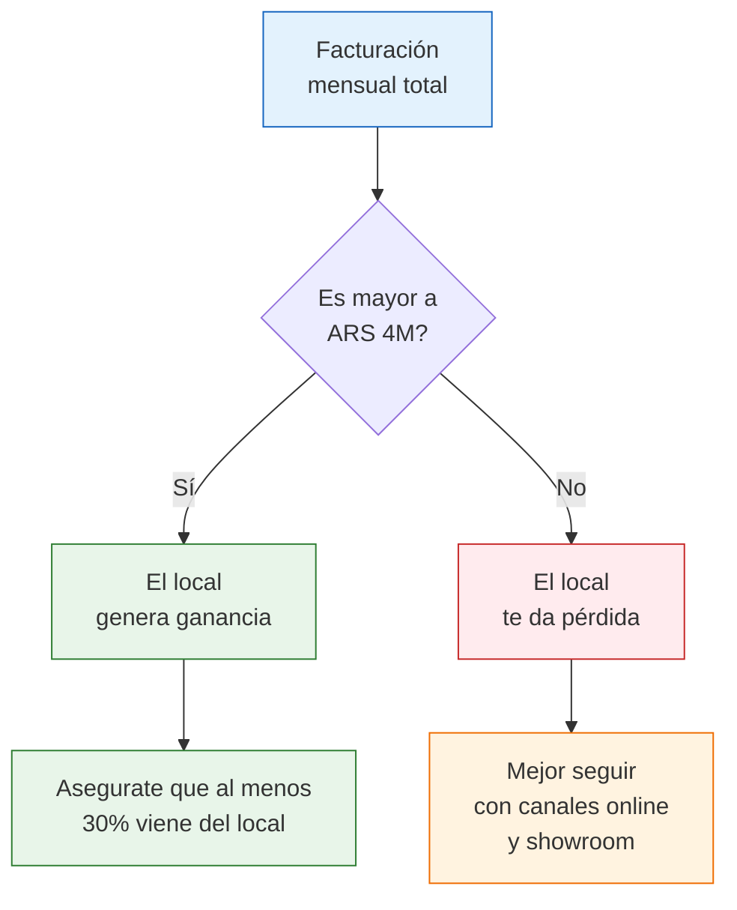
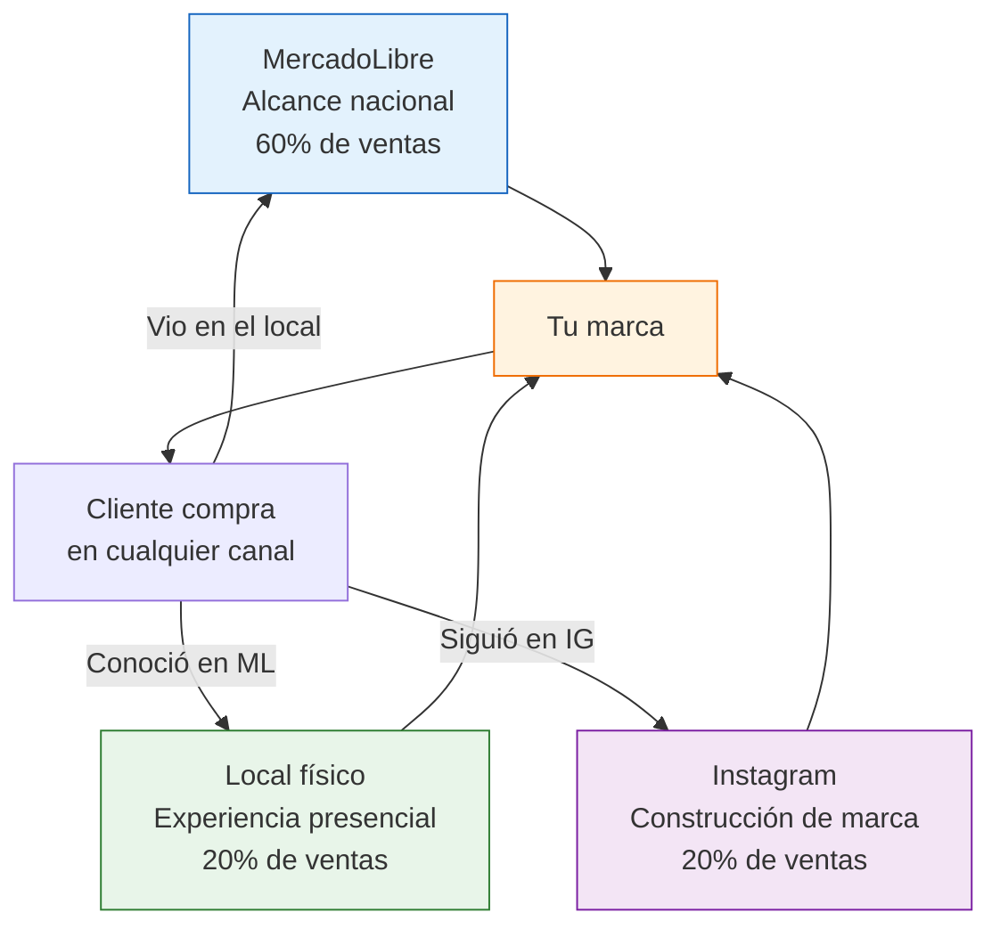

# Local comercial propio: cuándo vale la pena

> Un local propio es el sueño de muchos emprendedores, pero también es el **mayor salto de costos fijos** que podés dar. Esta página te ayuda a decidir con números reales si es el momento adecuado, o si hay alternativas mejores.

## La pregunta clave: cuánto tenés que facturar

Antes de pensar en ubicación o decoración, la pregunta más importante es: **tu facturación actual justifica los costos fijos de un local?**

La regla práctica: tu negocio online debería generar al menos **ARS 1,000,000/mes (~USD 833) de facturación neta** antes de considerar un local. Y el alquiler no debería superar el **10% de tu facturación mensual**.

| Tu facturación mensual actual | Abrir local? | Por qué |
|-------------------------------|-------------|---------|
| Menos de ARS 500,000 | No | Los costos fijos se comen toda tu ganancia |
| ARS 500,000 - 1,000,000 | Todavía no | Mejor invertir en crecer online primero |
| ARS 1,000,000 - 2,000,000 | Evaluá alternativas | Un local en galería o compartido podría funcionar |
| Más de ARS 2,000,000 | Podría tener sentido | Pero hacé los números completos antes |

<Warning>
La mayoría de los emprendedores exitosos que venden productos de fábricas argentinas **nunca necesitan un local propio**. Un showroom por turnos, ferias y venta B2B pueden darte toda la presencia física que necesitás sin los costos fijos de un local. Un local es un compromiso financiero grande, no una meta obligatoria.
</Warning>

## Desglose completo de costos fijos

Estos son los costos aproximados mensuales de operar un local comercial en CABA/GBA (valores estimados, pueden variar por zona):

### Costos iniciales (una sola vez)

| Concepto | Rango aproximado | Notas |
|----------|-----------------|-------|
| Depósito de alquiler | ARS 400,000-1,600,000 (~USD 333-1,333) | Generalmente 2-3 meses de alquiler anticipado |
| Refacción y acondicionamiento | ARS 500,000-2,000,000 (~USD 417-1,667) | Pintura, iluminación, estantería, vidriera |
| Habilitación comercial | ARS 50,000-150,000 (~USD 42-125) | Trámite municipal obligatorio |
| Cartelería exterior | ARS 30,000-100,000 (~USD 25-83) | Cartel, vinilo de vidriera |
| Sistema de seguridad | ARS 50,000-150,000 (~USD 42-125) | Cámaras, alarma, reja si aplica |
| **Total inversión inicial** | **ARS 1,030,000-4,000,000 (~USD 858-3,333)** | |

### Costos fijos mensuales

| Concepto | Rango aproximado | Notas |
|----------|-----------------|-------|
| Alquiler | ARS 200,000-800,000 (~USD 167-667) | Depende mucho de la zona y los metros |
| Servicios (luz, gas, internet) | ARS 30,000-60,000 (~USD 25-50) | Un local consume más que un departamento |
| Empleado (1 persona, con cargas sociales) | ARS 400,000-600,000 (~USD 333-500) | Sueldo + cargas sociales + ART. Valor aproximado |
| Contador (mayor complejidad) | ARS 40,000-80,000 (~USD 33-67) | Con local, la contabilidad se complica |
| Mantenimiento y limpieza | ARS 15,000-30,000 (~USD 13-25) | Productos de limpieza, reparaciones menores |
| Seguro del local | ARS 15,000-30,000 (~USD 13-25) | Seguro de comercio |
| Monotributo o IIBB | Variable | Según tu categoría fiscal |
| **Total costos fijos mensuales** | **ARS 700,000-1,600,000 (~USD 583-1,333)** | |

<Note>
Los valores son estimaciones aproximadas para CABA y GBA durante 2026. Los costos varían significativamente entre un local en galería de barrio y un local a la calle en zona premium. Siempre pedí información actualizada antes de tomar una decisión.
</Note>

## Modelo financiero: cuándo es viable

Hagamos el cálculo con un local de costos intermedios:

| Concepto | Valor mensual |
|----------|---------------|
| Costos fijos del local | ARS 1,000,000 (~USD 833) |
| Tu margen neto sobre ventas | 25% (aproximado) |
| **Ventas mensuales necesarias solo para cubrir el local** | **ARS 4,000,000 (~USD 3,333)** |

<Warning>
El cálculo anterior asume que el local genera ventas adicionales a las que ya tenés online. Si simplemente movés tus ventas online al local (porque los clientes ahora van al local en vez de comprar por ML), no estás creciendo: estás sumando costos a la misma facturación.
</Warning>

## Tipos de ubicación comparados

<Tabs>
  <Tab title="Local en galería">
    **Alquiler: ARS 100,000-300,000/mes (~USD 83-250) aproximado**

    **Ventajas:**
    - Costo más bajo que local a la calle
    - Seguridad compartida
    - Servicios incluidos en muchos casos (luz, limpieza de pasillos)
    - Comunidad de comerciantes en el mismo lugar

    **Desventajas:**
    - Menor visibilidad que un local a la calle
    - Dependés del tráfico de la galería
    - Horarios limitados por la galería
    - Vidriera chica o inexistente

    **Ideal para:** emprendedores que quieren un primer espacio fijo sin mucho riesgo
  </Tab>
  <Tab title="Local a la calle">
    **Alquiler: ARS 300,000-800,000/mes (~USD 250-667) aproximado**

    **Ventajas:**
    - Máxima visibilidad (vidriera, cartel)
    - Tráfico peatonal orgánico
    - Horarios flexibles (vos decidís)
    - Más espacio en general

    **Desventajas:**
    - Costo mucho más alto
    - Contrato de alquiler largo (mínimo 3 años)
    - Responsabilidad total de seguridad y mantenimiento
    - Depende de la cuadra: una mala ubicación arruina todo

    **Ideal para:** negocios con facturación alta que necesitan presencia en calle comercial
  </Tab>
  <Tab title="Espacio en shopping / centro comercial">
    **Alquiler: ARS 500,000-2,000,000/mes (~USD 417-1,667) aproximado**

    **Ventajas:**
    - Tráfico masivo garantizado
    - Seguridad y estacionamiento
    - Asociación con marcas reconocidas
    - Ideal para productos de consumo masivo

    **Desventajas:**
    - Costo extremadamente alto
    - Reglas estrictas del shopping (horarios, decoración, promociones obligatorias)
    - Fondo de promoción mensual adicional
    - Requiere facturación muy alta para ser viable

    **Ideal para:** marcas establecidas con facturación superior a ARS 5,000,000/mes
  </Tab>
</Tabs>

## Alternativas al local propio

Antes de firmar un contrato de alquiler, considerá estas alternativas de menor costo y compromiso:

| Alternativa | Costo mensual aproximado | Nivel de compromiso | Para quién |
|-------------|-------------------------|--------------------:|------------|
| **Showroom en casa** | ARS 0 | Bajo | Cualquier emprendedor |
| **Espacio compartido** | ARS 30,000-60,000 (~USD 25-50) | Bajo | Emprendedores con productos de diseño |
| **Pop-up store temporal** | ARS 50,000-150,000/semana (~USD 42-125) | Medio (corto plazo) | Testear zona antes de alquilar |
| **Consignación en tiendas** | ARS 0 (pagás con margen) | Bajo | Productos que se venden en retail |
| **Local en galería** | ARS 100,000-300,000 (~USD 83-250) | Alto (contrato) | Primer espacio fijo |

<Tip>
Antes de alquilar un local, hacé una prueba: montá un pop-up store de 1-2 semanas en la zona que estás evaluando. Así validás si el tráfico de esa zona realmente genera ventas para tu tipo de producto. Es mucho mejor gastar ARS 100,000 en un pop-up que firmar un contrato de 3 años y descubrir que la zona no funciona.
</Tip>

## Enfoque omnicanal: local + online

Si decidís abrir un local, no abandones tus canales online. El modelo más rentable es **omnicanal**: cada canal se refuerza mutuamente.

El local te permite:
- Usar el espacio como **centro de despacho** para envíos de ML (ahorrás Flex o puntos de entrega)
- Ofrecer **retiro en local** como opción de envío gratis (atrae clientes que viven cerca)
- Crear contenido para redes sociales en un espacio profesional
- Atender clientes B2B de forma más profesional

## Pasos si decidís avanzar

<Steps>
  <Step title="Confirmá que los números cierran">
    Proyectá tus costos fijos totales y calculá cuántas ventas adicionales necesitás para cubrir esos costos. Si no podés justificarlo con números concretos, no avances.
  </Step>
  <Step title="Definí la zona y el formato">
    Elegí entre galería, calle o shopping según tu presupuesto y rubro. Recorré la zona en diferentes horarios y días para evaluar el tráfico real de gente.
  </Step>
  <Step title="Testéa con un pop-up">
    Antes de firmar contrato, hacé un pop-up de 1-2 semanas en la zona elegida. Medí cuántas ventas generás y extrapolá al mes. Si no cubre los costos proyectados, buscá otra zona.
  </Step>
  <Step title="Negociá el contrato de alquiler">
    Intentá negociar: 1-2 meses de gracia al inicio (para armar el local), ajuste de alquiler por semestre (no mensual), y una cláusula de salida anticipada con penalidad razonable.
  </Step>
  <Step title="Gestioná la habilitación comercial">
    Tramitá la habilitación municipal antes de abrir. Los requisitos varían por municipio pero generalmente incluyen: plano del local, matafuegos, señalización de emergencia, constancia fiscal. Un gestor puede ayudarte (costo aproximado ARS 30,000-80,000, ~USD 25-67).
  </Step>
  <Step title="Acondicioná el espacio">
    Priorizá: buena iluminación, exhibición clara de productos, zona de cobro funcional, y cartelería con tu marca. No necesitás una remodelación de revista, necesitás un espacio limpio y profesional.
  </Step>
  <Step title="Abrí y medí resultados">
    Los primeros 3 meses son de ajuste. Medí: ventas del local vs. online, ticket promedio, horarios pico, productos más vendidos en local vs. online. Ajustá horarios, disposición de productos y stock según los datos.
  </Step>
</Steps>

## Señales de que NO necesitás un local

<Accordion title="Tus productos se venden bien solo online">
Si tu tasa de conversión en MercadoLibre es buena y tu negocio crece mes a mes, un local puede ser un gasto innecesario. Muchos emprendedores facturan millones sin tener un local físico.
</Accordion>

<Accordion title="Tu rubro no depende de que el cliente toque el producto">
Si vendés productos estandarizados (insumos, repuestos, productos de limpieza, etc.), el cliente no necesita verlos en persona para comprar. Un local no te agrega valor significativo.
</Accordion>

<Accordion title="No tenés margen para absorber los costos fijos">
Si tu margen neto es menor al 20%, los costos fijos de un local pueden dejarte sin ganancia. Primero mejorá tus márgenes (negociando mejor con fábricas, subiendo precios, o reduciendo costos) y después evaluá el local.
</Accordion>

<Accordion title="Querés el local por status, no por negocio">
Un local "queda bien" pero si no genera ventas incrementales, es un gasto de vanidad. Preguntate honestamente: el local va a traer clientes que hoy no me compran? Si la respuesta es "no estoy seguro", no es el momento.
</Accordion>

## Preguntas frecuentes

<Accordion title="Puedo abrir un local siendo Monotributo?">
Sí, podés tener un local con Monotributo. Pero tené en cuenta que con los costos fijos de un local, tu facturación probablemente supere los límites del Monotributo rápidamente. Planificá con tu contador la transición a Responsable Inscripto.
</Accordion>

<Accordion title="Cuánto tiempo tarda en ser rentable un local nuevo?">
En general, un local nuevo tarda entre 3 y 6 meses en alcanzar el punto de equilibrio (cubrir sus costos fijos con las ventas que genera). Los primeros meses suelen ser a pérdida mientras construís clientela. Tené reservas para cubrir al menos 3 meses de costos fijos sin depender de las ventas del local.
</Accordion>

<Accordion title="Puedo cerrar el local si no funciona?">
Sí, pero el contrato de alquiler generalmente tiene una penalidad por rescisión anticipada (1-3 meses de alquiler). Además, perdés la inversión en acondicionamiento. Por eso es tan importante testear con un pop-up antes de comprometerte.
</Accordion>

<Tip>
Si todavía no llegaste al nivel de facturación necesario, hay formas más inteligentes de tener presencia física. Consultá [Showroom + venta online](/app/paso1-argentina/crecer-gestionar/showroom-online-combo) y [Pop-up stores y ferias](/app/paso1-argentina/crecer-gestionar/popup-stores-ferias) para opciones de menor riesgo.
</Tip>
