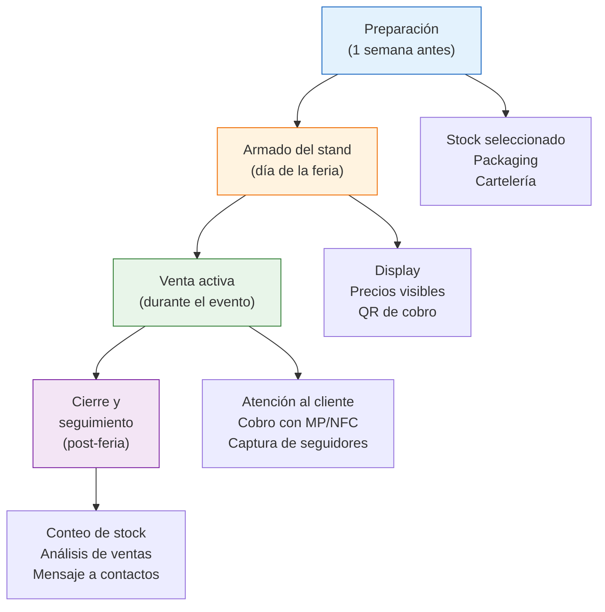

# Pop-up stores y ferias de emprendedores

> Las ferias y pop-ups son la forma más rápida (y barata) de poner tus productos frente a clientes reales, validar nuevos productos y construir tu comunidad sin comprometerte con un local fijo.

## Pop-up vs. feria: cuál es la diferencia

Aunque muchos los usan como sinónimos, son modelos distintos:

| Aspecto | Feria de emprendedores | Pop-up store |
|---------|----------------------|--------------|
| **Qué es** | Evento con muchos puestos de emprendedores, generalmente al aire libre o en espacios públicos | Espacio temporal dentro de un local, shopping o coworking, generalmente solo para tu marca |
| **Duración** | 1-2 días (fin de semana) | 3 días a 4 semanas |
| **Costo aproximado** | ARS 10,000-30,000 por jornada (~USD 8-25) | ARS 50,000-150,000 por semana (~USD 42-125) |
| **Público** | Variado, busca descubrir cosas nuevas | Más segmentado, depende de la ubicación |
| **Nivel de compromiso** | Bajo: pagás solo cuando participás | Medio: contrato corto pero con más inversión |
| **Ideal para** | Validar productos, ganar seguidores | Testear una zona antes de alquilar un local |

## Dónde encontrar oportunidades en CABA y GBA

### Ferias de emprendedores

Las ferias más activas en Buenos Aires y alrededores, aproximadamente:

| Circuito | Ubicación | Frecuencia | Perfil |
|----------|-----------|------------|--------|
| **Ferias municipales** | Cada municipio organiza las suyas (plazas, centros culturales) | Semanal o quincenal | Productos artesanales y emprendedores locales |
| **Ferias de diseño** | Palermo, San Telmo, Recoleta | Fines de semana | Diseño, decoración, indumentaria de autor |
| **Ferias en parques** | Parque Centenario, parques municipales de GBA | Fines de semana | Variado, alto tráfico |
| **Ferias en shoppings** | Varios shoppings organizan ferias estacionales | Eventos especiales (Navidad, Día de la Madre) | Mayor poder adquisitivo |
| **Ferias gastro + diseño** | Distintas sedes rotan | Mensual | Combinan comida y productos, atraen mucho público |

<Tip>
Para encontrar ferias, buscá en Instagram: "feria emprendedores [tu zona]", "feria diseño [barrio]", o seguí cuentas como organizadores de ferias locales. También consultá la agenda cultural de tu municipio. Muchas ferias publican convocatorias abiertas con 2-4 semanas de anticipación.
</Tip>

### Pop-up stores

- **Shoppings:** Algunos ofrecen espacios temporales para emprendedores, especialmente antes de fechas comerciales fuertes
- **Coworkings:** Espacios de coworking con locales a la calle suelen alquilar vidriera o espacio por semana
- **Locales vacíos:** En zonas comerciales con locales disponibles, podés negociar un alquiler corto (1-4 semanas) directamente con el propietario
- **Galerías de arte:** Ofrecen espacio para exhibición temporal de productos de diseño

## Qué llevar a una feria

### Checklist completa

| Categoría | Items | Costo aproximado |
|-----------|-------|------------------|
| **Display** | Mesa plegable, mantel, estantes portátiles, perchero si vendés ropa | ARS 15,000-40,000 (~USD 13-33) inversión inicial |
| **Cobro** | Celular con MercadoPago QR, posnet NFC (opcional), efectivo para cambio | ARS 0-15,000 (~USD 0-13) |
| **Cartelería** | Banner con tu marca, carteles de precios, tarjetas personales | ARS 5,000-15,000 (~USD 4-13) |
| **Packaging** | Bolsas con tu marca o bolsas kraft, papel tissue, stickers | ARS 3,000-10,000 (~USD 3-8) |
| **Comunicación** | Lista de precios impresa, tarjetas con tu Instagram/WhatsApp | ARS 2,000-5,000 (~USD 2-4) |
| **Logística** | Bolso/caja para transporte, cinta adhesiva, tijeras, alargue eléctrico | Ya tenés la mayoría |

## Guía paso a paso: tu primera feria

<Steps>
  <Step title="Aplicá a la feria">
    Contactá al organizador por Instagram, formulario web o WhatsApp. Te van a pedir: fotos de tus productos, redes sociales, descripción de lo que vendés y, en algunos casos, constancia de Monotributo. Aplicá con al menos 2-3 semanas de anticipación.
  </Step>
  <Step title="Seleccioná el stock y calculá precios">
    Llevá tus productos de mayor impacto visual y mejor margen. No lleves todo tu catálogo: elegí 15-30 productos estrella. Los precios en feria suelen ser los mismos que online (o con un descuento de 5-10% por compra en el momento para incentivar).
  </Step>
  <Step title="Armá tu stand para atraer">
    El stand tiene que invitar a acercarse. Productos ordenados por categoría, precios visibles (no obligues al cliente a preguntar), buena altura (usá estantes de distintos niveles) y tu marca visible. Llegá temprano al evento para elegir buena ubicación si es posible.
  </Step>
  <Step title="Vendé y capturá contactos">
    Durante la feria, atendé con buena actitud, dejá que el cliente toque los productos y ofrecé alternativas. El paso clave que muchos emprendedores olvidan: **pedí que te sigan en Instagram**. Un cartel tipo "Seguinos en @tumarca y te damos 10% en tu próxima compra" funciona muy bien.
  </Step>
  <Step title="Hacé seguimiento post-feria">
    Al día siguiente, publicá stories agradeciendo a los que pasaron. Si juntaste contactos de WhatsApp, mandá un mensaje breve con tu catálogo online. La feria no termina cuando desarmás el stand: el valor real está en los contactos que generaste.
  </Step>
</Steps>

## Expectativas de venta

Las ferias pueden ser muy rentables o muy flojas, dependiendo de muchos factores. Estas son estimaciones aproximadas para emprendedores con productos de fábricas argentinas:

<Tabs>
  <Tab title="Feria chica (barrial)">
    | Métrica | Rango aproximado |
    |---------|-----------------|
    | Público estimado | 200-800 personas en la jornada |
    | Ventas esperadas | 5-20 unidades |
    | Facturación | ARS 25,000-100,000 (~USD 21-83) |
    | Costo del stand | ARS 5,000-15,000 (~USD 4-13) |
    | **Ganancia neta estimada** | **ARS 5,000-40,000 (~USD 4-33)** |
  </Tab>
  <Tab title="Feria media (zona comercial)">
    | Métrica | Rango aproximado |
    |---------|-----------------|
    | Público estimado | 800-3,000 personas en la jornada |
    | Ventas esperadas | 15-50 unidades |
    | Facturación | ARS 75,000-250,000 (~USD 63-208) |
    | Costo del stand | ARS 15,000-30,000 (~USD 13-25) |
    | **Ganancia neta estimada** | **ARS 20,000-100,000 (~USD 17-83)** |
  </Tab>
  <Tab title="Feria grande (evento destacado)">
    | Métrica | Rango aproximado |
    |---------|-----------------|
    | Público estimado | 3,000-10,000+ personas |
    | Ventas esperadas | 40-150 unidades |
    | Facturación | ARS 200,000-750,000 (~USD 167-625) |
    | Costo del stand | ARS 20,000-50,000 (~USD 17-42) |
    | **Ganancia neta estimada** | **ARS 60,000-300,000 (~USD 50-250)** |
  </Tab>
</Tabs>

<Note>
Estos números son estimaciones orientativas basadas en productos con ticket promedio de ARS 5,000-15,000. Tu resultado real depende del producto, el precio, tu presentación, el clima y la ubicación de tu stand dentro de la feria. Un buen fin de semana de feria puede equivaler a 1-2 semanas de ventas online.
</Note>

## Usar ferias para validar productos nuevos

Una de las mayores ventajas de las ferias es que podés testear productos nuevos en tiempo real:

- **Llevá 2-3 productos nuevos** que estés evaluando sumar a tu catálogo
- **Observá las reacciones**: qué productos la gente toca, pregunta el precio, se prueba
- **Preguntá directamente**: "Este producto es nuevo, qué te parece?" genera información muy valiosa
- **Compará ventas**: si un producto nuevo vende igual o mejor que tus productos estrella, sumalo

<Warning>
Las ferias al aire libre dependen del clima. Una lluvia puede arruinar un fin de semana que tenías planificado. Tené siempre un plan B: nylon o toldo para cubrir tu stand, y aceptá que algunos eventos se cancelan. No inviertas todo tu stock de un producto nuevo solo para una feria.
</Warning>

## Pop-up stores: cuándo dar el salto

Las pop-ups requieren más inversión pero dan otra visibilidad:

| Aspecto | Detalle |
|---------|---------|
| **Inversión típica** | ARS 50,000-150,000 por semana (~USD 42-125 aproximados) solo alquiler |
| **Decoración adicional** | ARS 20,000-80,000 (~USD 17-67) para ambientación del espacio |
| **Cuándo vale la pena** | Tenés stock suficiente, ya validaste en ferias, querés testear una zona para un futuro local |
| **Mejor momento** | Fechas comerciales fuertes: pre-Navidad, Día de la Madre, Día del Padre |
| **Riesgo principal** | Pagar el espacio y que no entre suficiente gente. Investigá el tráfico de la zona antes |

## Preguntas frecuentes

<Accordion title="Necesito ser Monotributo para participar en ferias?">
La mayoría de las ferias organizadas formalmente piden constancia de inscripción en Monotributo o AFIP. Para ferias más informales (barrio, plaza) no siempre lo exigen, pero igualmente necesitás estar inscripto para facturar tus ventas legalmente.
</Accordion>

<Accordion title="Cuántas ferias por mes conviene hacer?">
Si recién empezás en ferias, arrancá con 1-2 por mes para aprender y ajustar tu presentación. Emprendedores experimentados hacen 3-4 por mes. Más de eso puede ser agotador y afectar tu operación online, que sigue siendo tu canal principal.
</Accordion>

<Accordion title="Puedo ir a una feria sin tener Instagram?">
Podés, pero perdés gran parte del valor. La feria genera ventas ese día, pero Instagram te da ventas el resto del mes. Si no tenés Instagram, al menos tené tarjetas con tu contacto de WhatsApp para mantener la relación con el cliente después del evento.
</Accordion>

<Accordion title="Qué hago si llueve y la feria es al aire libre?">
Consultá la política de cancelación del organizador antes de pagar el stand. Algunos devuelven el dinero o reprograman, otros no. Siempre tené nylon o un toldo portátil como protección parcial. Si la feria se cancela, usá ese día para publicar el stock que ibas a llevar en tus redes.
</Accordion>

<Tip>
Si las ferias te funcionan bien, el siguiente paso natural es probar un showroom propio. Consultá [Showroom + venta online](/app/paso1-argentina/crecer-gestionar/showroom-online-combo) para entender cómo armar uno sin alquilar un local. Y si querés poner tus productos en tiendas de terceros, mirá [Consignación en tiendas físicas](/app/paso1-argentina/crecer-gestionar/consignacion-tiendas).
</Tip>
