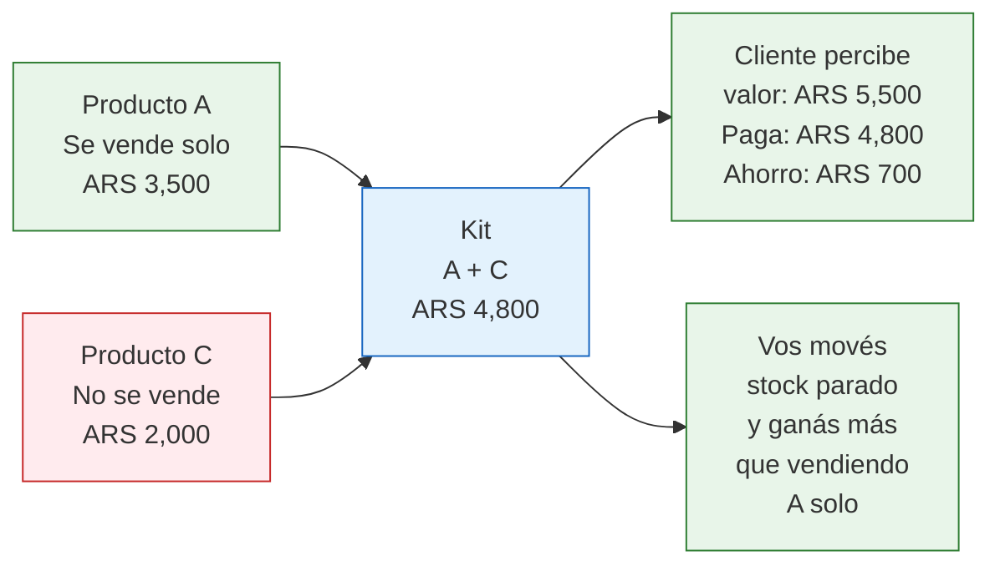

# Pricing: promos sin destruir márgenes

> Las promociones son una herramienta poderosa para mover stock y ganar visibilidad. Pero si las usás mal, entrenás a tus clientes a esperar descuentos y destruís tu rentabilidad. La clave es saber cuándo, cuánto y cómo descontar.

## Regla de oro del pricing

Antes de hablar de promociones, un principio fundamental:

**Tu precio base debe ser rentable sin ninguna promoción.** Si necesitás hacer descuentos para vender, el problema no es el precio: es el producto, las fotos, o la publicación.

<Warning>
Si tu margen neto normal (sin promo) es menor al 30%, no tenés colchón para hacer descuentos. Primero mejorá tu margen base (negociá mejor con la fábrica, reducí costos operativos, optimizá envíos) y después pensá en promociones.
</Warning>

## Estrategia Hot Sale / CyberMonday

Los eventos masivos de MercadoLibre (Hot Sale en mayo, CyberMonday en noviembre aproximadamente) son las fechas con más tráfico del año. Así se manejan:

<Steps>
  <Step title="2-3 semanas antes: ajustá precios gradualmente">
    Subí tus precios un 10-15% gradualmente en las semanas previas al evento. MercadoLibre registra el historial de precios y exige que el descuento sea real respecto al precio que manejaste las últimas semanas.
  </Step>
  <Step title="Durante el evento: aplicá el descuento">
    Ofrecé un descuento del 10-20% sobre el precio "ajustado". Para el cliente parece un gran descuento. Para vos, el precio final es similar o levemente menor que tu precio normal.
  </Step>
  <Step title="Después del evento: volvé al precio normal">
    No bajes al precio pre-ajuste inmediatamente. Hacelo gradualmente en 1-2 semanas. Si el producto se vendió bien durante el evento, podés mantener un precio levemente superior.
  </Step>
</Steps>

<Note>
Esta estrategia es estándar en la industria y la usan todos los vendedores grandes. MercadoLibre exige que el descuento sea "real" respecto a tu precio de las últimas semanas, por eso el ajuste previo es necesario. Asegurate de cumplir con las reglas de ML para participar en eventos oficiales.
</Note>

## Cuándo descontar (y cuándo NO)

<Tabs>
  <Tab title="SI descontar">
    **Stock acumulado (categoría C):** productos que llevan 60+ días sin rotación. Mejor vender con descuento que tener capital atado.

    **Fin de temporada:** si vendés productos estacionales (decoración navideña, útiles escolares), liquidá antes de que pierdan relevancia.

    **Ganar reputación en ML:** las primeras 50-100 ventas son críticas. Un descuento del 5-10% que acelere ventas puede valer la pena para subir de nivel.

    **Competencia directa con envío gratis:** si tu competidor ofrece envío gratis y vos no, a veces un ajuste del 5% es más efectivo que igualar el envío.
  </Tab>
  <Tab title="NO descontar">
    **Productos nuevos:** si recién listaste un producto, dale al menos 2-3 semanas a precio normal antes de tocar el precio. Necesitás datos reales de demanda.

    **Productos A (estrellas):** si ya se venden bien, bajar el precio es regalar margen. Subí el precio gradualmente hasta encontrar el techo.

    **Por desesperación:** si no vendés nada, bajar el precio no es la solución. El problema suele estar en las fotos, el título, o la categoría.

    **Para igualar al más barato:** competir por precio contra alguien que vende con margen del 5% es una carrera al fondo. Diferenciá por calidad, fotos y servicio.
  </Tab>
</Tabs>

## Pricing psicológico

Pequeños ajustes en cómo presentás el precio pueden mejorar la percepción sin tocar tu margen:

| Técnica | Ejemplo | Por qué funciona |
|---------|---------|-----------------|
| **Precio con 9** | ARS 8,499 en vez de ARS 8,500 | El cerebro procesa "ocho mil y algo" en vez de "ocho mil quinientos" |
| **Precio anclado** | "Antes ARS 12,000 - Ahora ARS 8,500" | El precio anterior hace que el actual parezca una ganga |
| **Precio redondo para premium** | ARS 15,000 (no ARS 14,999) | Números redondos transmiten calidad y seriedad |
| **Mostrar el ahorro** | "Ahorrás ARS 3,500" | Enfocás al comprador en lo que gana, no en lo que gasta |

<Tip>
En MercadoLibre, el precio tachado (precio anterior) se muestra automáticamente cuando bajás el precio de una publicación. Esto genera un fuerte efecto de "oferta" aunque el descuento sea del 5-10%.
</Tip>

## Estrategia de kits y combos

Armar kits es la mejor forma de aumentar el ticket promedio sin bajar precios:

| Estrategia | Ejemplo | Efecto |
|-----------|---------|--------|
| **Kit complementario** | Collar + pulsera + aros del mismo estilo | El cliente percibe valor agregado y comprás 3 ventas en 1 |
| **Kit volumen** | "Llevá 3 y pagá 2.5" (descuento del ~17%) | Movés más stock por transacción y el costo de envío se diluye |
| **Kit de liquidación** | Producto A popular + Producto C que no se vende | Movés stock parado empujado por el producto estrella |

## MercadoLibre: Ofertas del Día y Ofertas Relámpago

MercadoLibre ofrece herramientas de promoción dentro de la plataforma:

| Herramienta | Qué es | Requisitos | Recomendación |
|-------------|--------|-----------|---------------|
| **Ofertas del Día** | ML te propone participar con productos seleccionados | Buena reputación, descuento mínimo del 10% | Participá solo si tu margen neto después del descuento sigue siendo 20%+ |
| **Ofertas Relámpago** | Descuento con límite de tiempo y stock | ML selecciona productos elegibles | Buena para generar urgencia; calculá el costo antes de aceptar |
| **Cupones de descuento** | Creás cupones propios para tu tienda ML | Tienda oficial o nivel MercadoLíder | Útil para fidelizar clientes repetitivos |

<Warning>
Antes de aceptar cualquier promoción de MercadoLibre, calculá tu margen neto con el descuento aplicado. ML te muestra el descuento como porcentaje, pero no sabe cuál es tu costo. Un descuento del 15% sobre un producto con margen del 20% te deja con un margen del 5% (o menos, después de comisiones).
</Warning>

## La espiral de precios: cómo evitarla

Cuando un competidor baja el precio y vos lo igualás, y después él baja más, y vos también... eso es una espiral que destruye la rentabilidad de todos.

<Tabs>
  <Tab title="El problema">
    Tu producto se vende a ARS 8,500. Un competidor lo pone a ARS 7,900. Vos bajás a ARS 7,800. Él baja a ARS 7,200. Vos a ARS 7,000. En un mes, los dos están vendiendo al costo sin ganar nada.
  </Tab>
  <Tab title="La solución">
    **No compitas por precio.** Diferenciá tu publicación por:
    - Mejores fotos (profesionales vs. fotos de celular)
    - Descripción más completa
    - Envío más rápido (Flex o Full)
    - Mejor packaging (unboxing experience)
    - Atención al cliente superior (respondé preguntas en minutos)

    Un comprador paga ARS 500-1,000 más por un vendedor con buenas fotos, envío gratis y respuesta inmediata.
  </Tab>
</Tabs>

## Posicionamiento: volumen vs. premium

Definí tu estrategia de precio según tu modelo:

| Estrategia | Margen objetivo | Volumen necesario | Ideal para |
|-----------|----------------|-------------------|------------|
| **Volumen (precio bajo)** | 15-25% neto | Alto (100+ ventas/mes por producto) | Productos genéricos, consumibles, packaging |
| **Premium (precio alto)** | 35-60% neto | Bajo-medio (20-50 ventas/mes) | Productos diferenciados, marca propia, nicho |

<Tip>
Para principiantes, la estrategia premium es más segura: necesitás menos capital, menos ventas y menos operación para ganar lo mismo. La estrategia de volumen requiere logística eficiente y capital grande, algo que viene con la experiencia.
</Tip>

## Preguntas frecuentes

<Accordion title="Cuánto descuento máximo debería ofrecer?">
Como regla general, nunca más del 20% sobre tu precio normal. Si necesitás bajar más para que se venda, el problema no es el precio. Excepción: liquidación de stock muerto, donde el objetivo es recuperar capital, no ganar.
</Accordion>

<Accordion title="Conviene ofrecer envío gratis o bajar el precio?">
En MercadoLibre, envío gratis suele tener más impacto en la conversión que un descuento equivalente en el precio. Si tenés que elegir entre bajar ARS 2,000 el precio o absorber ARS 2,000 de envío, elegí absorber el envío y ofrecerlo gratis.
</Accordion>

## Siguiente paso

Con tu pricing bajo control, el siguiente desafío grande es el tema fiscal. Si estás creciendo, en algún momento vas a tener que hacer la transición de Monotributo a Responsable Inscripto. Continuá con [De Monotributo a Responsable Inscripto](/app/paso1-argentina/crecer-gestionar/transicion-fiscal).
