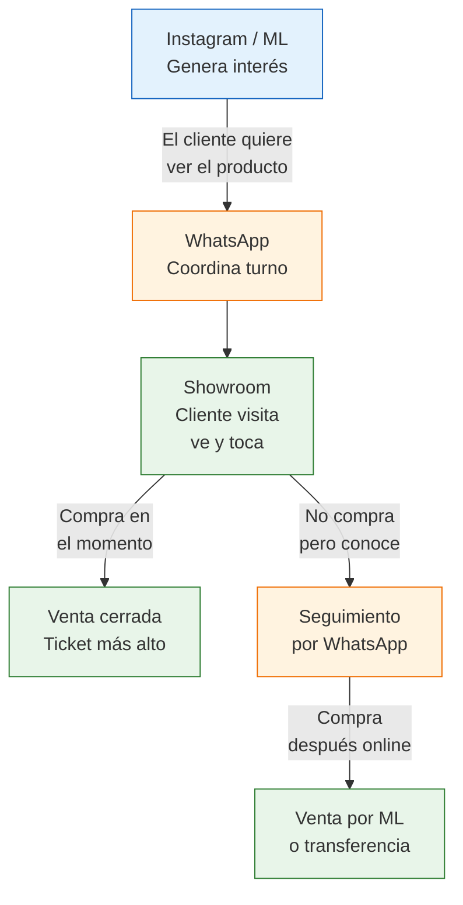

# Showroom + venta online: la combinación ganadora

> Después de meses vendiendo online, hay un paso que puede multiplicar tu ticket promedio y tu tasa de conversión: dejar que el cliente **vea y toque** el producto antes de comprar. No necesitás un local comercial, un showroom por turnos alcanza.

## Por qué un showroom cambia las reglas del juego

Cuando vendés online, el comprador decide solo con fotos y descripción. Cuando puede tocar el cuero de una cartera, sentir el peso de un centro de mesa o probarse un anillo, pasan dos cosas:

- **La tasa de conversión sube** porque se eliminan las dudas del comprador
- **El ticket promedio aumenta** porque en persona el cliente tiende a llevar más de un producto

El showroom no reemplaza al canal online. **Lo complementa**: usás redes sociales y MercadoLibre para atraer gente, y el showroom para cerrar las ventas de mayor valor.

## Modelo híbrido: cómo funciona

<Note>
El showroom funciona **por turnos coordinados**, no como local de calle con puerta abierta. Vos controlás cuándo recibís gente y te evitás los costos de tener un espacio abierto todo el día esperando que entre alguien.
</Note>

## Opciones de espacio y costos

<Tabs>
  <Tab title="Habitación en casa">
    **Costo fijo: ARS 0 (~USD 0)**

    - Usás una habitación libre, garaje o living como showroom
    - Inversión inicial en decoración: ARS 20,000-50,000 (~USD 17-42) aproximados
    - Ideal para empezar: cero riesgo de costos fijos
    - Limitación: tu dirección personal queda expuesta (seguridad)
    - Funciona bien si vivís en zona accesible con transporte público

    **Recomendado para:** facturación mensual menor a ARS 500,000
  </Tab>
  <Tab title="Espacio compartido">
    **Costo fijo: ARS 30,000-60,000/mes (~USD 25-50) aproximados**

    - Compartís un espacio con otros emprendedores, cada uno tiene su zona
    - Se encuentran en coworkings, galerías de arte, estudios compartidos
    - Buscalos en Instagram: "showroom compartido [tu zona]"
    - Ventaja: dividís costos de alquiler, servicios y seguridad

    **Recomendado para:** facturación mensual ARS 500,000-1,000,000
  </Tab>
  <Tab title="Local pequeño">
    **Costo fijo: ARS 80,000-200,000/mes (~USD 67-167) aproximados**

    - Local chico en galería o planta baja en barrio comercial
    - Mayor profesionalismo e imagen de marca
    - Podés tener vidriera, aunque sea chica
    - Requiere contrato de alquiler (mínimo 3 años por Ley de Alquileres)
    - Sumale servicios: luz, internet, limpieza (~ARS 30,000-50,000/mes adicionales)

    **Recomendado para:** facturación mensual mayor a ARS 1,000,000
  </Tab>
</Tabs>

## Rubros que más se benefician

No todos los productos necesitan un showroom. Estos son los rubros donde ver y tocar el producto marca la mayor diferencia:

| Rubro | Por qué funciona el showroom | Ticket promedio estimado |
|-------|------------------------------|-------------------------|
| **Marroquinería** | El cliente quiere sentir la calidad del cuero, ver terminaciones | ARS 15,000-60,000 |
| **Decoración / Bazar** | El tamaño y los colores se aprecian mejor en persona | ARS 8,000-40,000 |
| **Bijouterie premium** | Probarse el producto es clave para la decisión de compra | ARS 5,000-25,000 |
| **Textiles / Mantelería** | La textura y calidad de la tela solo se percibe tocando | ARS 10,000-30,000 |
| **Muebles pequeños** | El comprador necesita ver proporciones reales | ARS 20,000-80,000 |

<Tip>
La regla general: si tu producto tiene un precio mayor a ARS 10,000 (~USD 8) y se beneficia de que el cliente lo toque, pruebe o vea en persona, un showroom te va a ayudar a vender más. Para productos baratos o genéricos, no tiene sentido.
</Tip>

## Doble utilidad: showroom + estudio fotográfico

Uno de los beneficios ocultos del showroom es que te sirve como **estudio de fotos permanente**. En lugar de armar y desarmar un set cada vez que necesitás fotos nuevas, tu showroom ya tiene:

- Buena iluminación (la que instalaste para las visitas)
- Los productos exhibidos y ordenados
- Ambientación que da contexto a las fotos (lifestyle)
- Fondo prolijo para fotos tipo catálogo

Esto te ahorra tiempo y dinero cada vez que sumás productos nuevos o necesitás actualizar las publicaciones de MercadoLibre.

## Pasos para armar tu showroom

<Steps>
  <Step title="Definí el formato">
    Decidí si vas a usar tu casa, un espacio compartido o un local. Para empezar, la recomendación es **showroom en casa por turnos** (riesgo cero). Solo necesitás una habitación limpia y ordenada con buena luz.
  </Step>
  <Step title="Acondicioná el espacio">
    Inversión mínima en presentación: estantes, buena iluminación (luz fría tipo LED, ARS 5,000-15,000 aproximados), espejo si vendés accesorios, y alguna decoración neutra. No necesitás una vidriera de shopping, necesitás un espacio limpio y profesional.
  </Step>
  <Step title="Armá el sistema de turnos">
    Usá WhatsApp Business o un formulario de Google para coordinar visitas. Definí franjas horarias disponibles (por ejemplo: jueves y viernes de 16 a 20 hs, sábados de 10 a 14 hs). No abras todos los días, concentrá las visitas.
  </Step>
  <Step title="Publicá la opción de showroom en tus canales">
    En tus publicaciones de MercadoLibre, en las stories de Instagram y en la bio de WhatsApp, sumá: "Showroom con turno previo en [zona]". No hace falta poner la dirección exacta, solo la zona.
  </Step>
  <Step title="Medí resultados y ajustá">
    Llevá registro de cuántas visitas recibís, cuántas compran y el ticket promedio. Compará con tus ventas 100% online. Si el showroom no está generando un ticket al menos 30% mayor que el online, revisá la experiencia o el rubro.
  </Step>
</Steps>

## Cómo promocionar el showroom por Instagram y WhatsApp

La clave es que el showroom sea un **beneficio exclusivo**, no un reemplazo del canal online:

- En Instagram: stories mostrando el espacio, reels de "recorrido por el showroom", fotos de clientas visitando
- En WhatsApp: mensaje automático que diga "Tenemos showroom con turno previo en [zona], escribinos para coordinar"
- En MercadoLibre: en la descripción del producto agregá "Podés verlo en persona en nuestro showroom - consultanos"

<Warning>
Cuidado con los costos fijos. Si alquilás un espacio compartido o un local, ese gasto corre todos los meses **vendas o no vendas**. Calculá cuántas visitas necesitás para cubrir el costo del espacio. Si tu alquiler es ARS 80,000/mes y tu margen promedio por venta en showroom es ARS 10,000, necesitás al menos 8 ventas mensuales solo para empatar.
</Warning>

## Preguntas frecuentes

<Accordion title="Necesito habilitación comercial para un showroom en casa?">
Si recibís gente de forma regular con fines comerciales, técnicamente sí necesitás habilitación. En la práctica, muchos emprendedores operan showrooms por turnos desde su casa sin problemas, especialmente si es un volumen bajo (menos de 20 visitas por mes). Si escalás, consultá con tu contador sobre la habilitación municipal de tu zona.
</Accordion>

<Accordion title="Cuántas visitas por semana puedo esperar?">
Depende de tu audiencia online. Con 2,000-5,000 seguidores activos en Instagram, podés esperar entre 3 y 8 visitas por semana cuando lo promocionás activamente. No esperes 50 visitas por semana: esto es showroom por turnos, no local de calle.
</Accordion>

<Accordion title="Conviene dar la dirección exacta en redes sociales?">
No. Dá solo la zona (barrio, ciudad) y enviá la dirección exacta recién cuando el cliente confirma el turno por WhatsApp. Esto es tanto por seguridad como por exclusividad.
</Accordion>

<Tip>
Empezá con showroom en casa por turnos. Es gratis, te permite validar si funciona para tu rubro, y si los resultados son buenos, después escalás a un espacio compartido. Para otros canales físicos como ferias, consultá [Pop-up stores y ferias de emprendedores](/app/paso1-argentina/crecer-gestionar/popup-stores-ferias).
</Tip>
