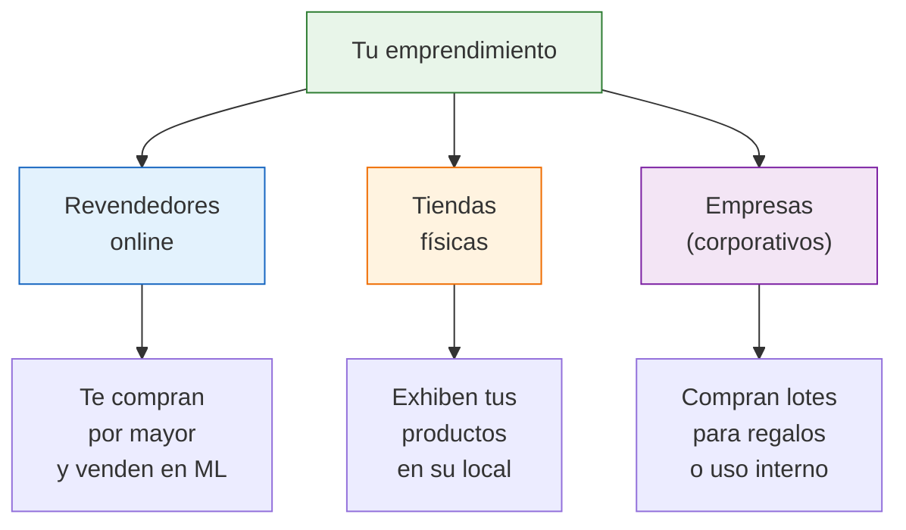
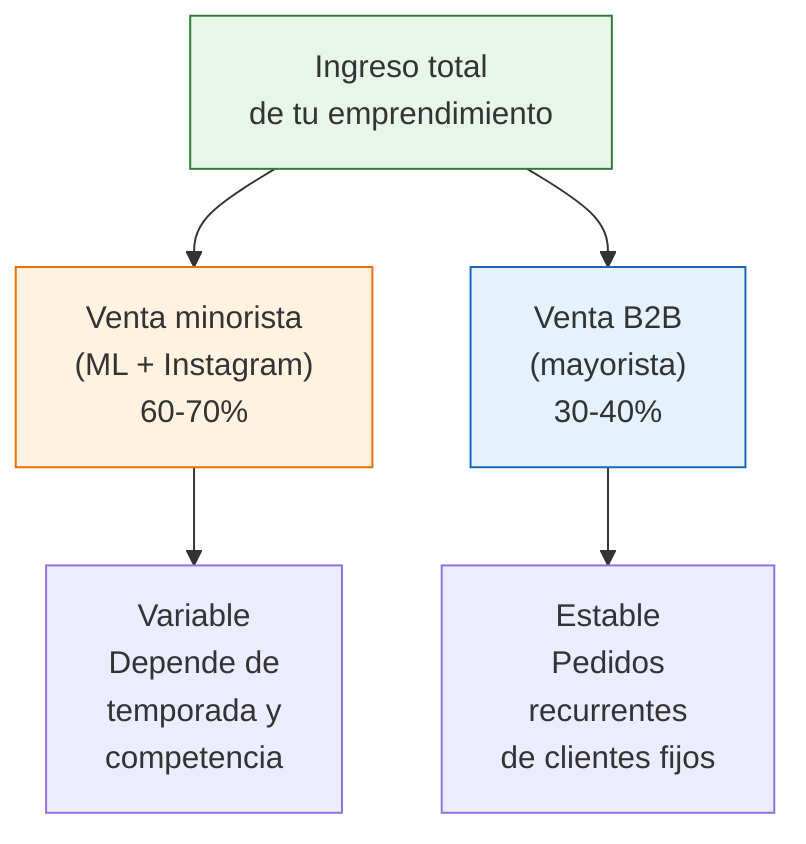

# Venta B2B en la práctica

> Vender a otros negocios (B2B) es la forma más efectiva de **estabilizar tus ingresos** y mover volumen. Un solo cliente corporativo puede equivaler a 50 ventas minoristas. Esta guía te muestra cómo hacerlo paso a paso.

## Qué es la venta B2B y por qué te conviene

B2B (Business to Business) significa venderle a otros negocios en vez de al consumidor final. En tu caso, tus clientes B2B pueden ser:

- **Revendedores online** (otros vendedores de MercadoLibre que te compran por mayor)
- **Tiendas físicas** (negocios que quieren sumar tus productos a su local)
- **Empresas** (compras corporativas: regalos para empleados, merchandising, insumos)

<Note>
El B2B reduce tu dependencia de las ventas unitarias. Si vendés 500 unidades por mes, tener 3-4 clientes B2B que te compren 50-100 unidades cada uno te da una base estable. El resto lo completás con venta minorista.
</Note>

## Tipos de clientes B2B

<Tabs>
  <Tab title="Revendedores online">
    **Quiénes son:** Otros vendedores de MercadoLibre, Instagram o TiendaNube que no tienen contacto directo con fábricas.

    **Por qué te compran:** Les ofrecés precio mayorista que ellos no consiguen solos. Necesitan proveedores confiables con stock permanente.

    **Cómo encontrarlos:** Buscá en MercadoLibre vendedores que vendan productos similares a los tuyos pero con precios más altos o peores fotos. Contactalos por ML o buscá su Instagram.

    **Pedido típico:** 20-100 unidades por compra, cada 15-30 días
    **Margen tuyo:** 15-25% (menor que minorista pero con volumen)
    **Ventaja:** Pedidos recurrentes, no necesitás hacer packaging individual
  </Tab>
  <Tab title="Tiendas físicas">
    **Quiénes son:** Locales en galerías, calles comerciales y barrios que venden productos complementarios a los tuyos.

    **Por qué te compran:** Necesitan variedad de productos sin invertir en búsqueda de fábricas. Vos les ofrecés un catálogo curado y entrega en puerta.

    **Cómo encontrarlos:** Caminá por zonas comerciales de tu área. Visitá tiendas que vendan productos de tu rubro. Preguntá directamente si compran a proveedores independientes.

    **Pedido típico:** 10-50 unidades por compra, mensual
    **Margen tuyo:** 20-30%
    **Ventaja:** Relación estable, pedidos predecibles
  </Tab>
  <Tab title="Clientes corporativos">
    **Quiénes son:** Empresas que necesitan productos para regalos de fin de año, eventos, merchandising o uso interno.

    **Por qué te compran:** Necesitan lotes grandes con personalización (a veces packaging especial o branding).

    **Cómo encontrarlos:** Redes de contacto, LinkedIn, cámaras empresariales, eventos de networking. También podés publicar en tu tienda online un apartado de "venta corporativa".

    **Pedido típico:** 50-500 unidades, estacionales (fin de año, día del trabajador)
    **Margen tuyo:** 20-35% (mayor si incluís personalización)
    **Ventaja:** Pedidos grandes de una sola vez
  </Tab>
</Tabs>

## Cómo fijar precios mayoristas

La regla general: tu precio mayorista es **30-40% menor que tu precio de venta al público** (PVP), pero necesitás asegurarte de que tu margen no baje del 15%.

| Concepto | Ejemplo con producto de ARS 10,000 PVP |
|----------|----------------------------------------|
| Precio de venta al público (PVP) | ARS 10,000 (~USD 8) |
| Tu costo de compra a fábrica | ARS 4,000 (~USD 3) |
| **Precio mayorista (30% descuento)** | **ARS 7,000 (~USD 6)** |
| Tu ganancia bruta por unidad mayorista | ARS 3,000 (~USD 3) |
| Tu margen bruto mayorista | 43% sobre costo |

### Escalas de precio sugeridas

| Cantidad | Descuento sobre PVP | Ejemplo (PVP ARS 10,000) |
|----------|---------------------|--------------------------|
| 1-5 unidades | 0% (precio minorista) | ARS 10,000 |
| 6-20 unidades | 20-25% | ARS 7,500-8,000 |
| 21-50 unidades | 25-30% | ARS 7,000-7,500 |
| 51-100 unidades | 30-35% | ARS 6,500-7,000 |
| +100 unidades | 35-40% | ARS 6,000-6,500 |

<Warning>
Nunca bajes tu precio mayorista al punto donde tu margen sea menor al 15% bruto. Si tu costo de fábrica es ARS 4,000 y vendés mayorista a ARS 5,000, tu margen es solo 20% bruto. Después de impuestos, logística y packaging, podés terminar sin ganancia. Hacé los números antes de ofrecer descuentos agresivos.
</Warning>

## Cómo armar un catálogo mayorista

Tu catálogo B2B no necesita ser sofisticado, pero sí profesional y claro. Opciones:

| Formato | Costo aproximado | Para quién |
|---------|------------------|------------|
| **PDF simple** (Canva o Google Docs) | Gratis | Empezar rápido, enviar por WhatsApp |
| **Catálogo en Canva Pro** | ARS 8,000/mes (~USD 7) | Presentación más profesional |
| **Página web simple** (Notion o TiendaNube con sección mayorista) | ARS 0-15,000/mes (~USD 0-13) | Clientes que quieren ver online |

### Qué debe incluir tu catálogo

- Nombre de tu marca / emprendimiento
- Foto de cada producto (fondo blanco o lifestyle)
- Descripción breve (material, medidas, colores disponibles)
- Precio mayorista por escala de cantidad
- Pedido mínimo (MOQ) por producto
- Condiciones de entrega (zona, tiempo, costo de envío)
- Forma de pago (transferencia, MercadoPago, efectivo)
- Contacto: WhatsApp, email, Instagram

<Tip>
Un catálogo PDF bien hecho es tu mejor vendedor B2B. Podés enviarlo por WhatsApp a cualquier potencial cliente sin necesidad de una reunión presencial. Actualizalo cada vez que cambien los precios o sumes productos nuevos.
</Tip>

## Factura A: requisito para venta B2B

Cuando vendés a otros negocios, generalmente necesitás emitir **Factura A** (si sos Responsable Inscripto) o **Factura C** (si sos Monotributo).

| Tu condición | Cliente B2B | Factura que emitís |
|-------------|-------------|-------------------|
| Monotributo | Cualquiera | Factura C |
| Responsable Inscripto | Responsable Inscripto | Factura A |
| Responsable Inscripto | Monotributo / Consumidor Final | Factura B |

<Note>
Muchos clientes B2B (especialmente tiendas formales) te van a pedir Factura A porque les permite descontar el IVA. Si sos Monotributo, no podés emitir Factura A. Esto puede limitar tu acceso a ciertos clientes. Si tu volumen B2B crece, evaluá con tu contador si conviene pasar a Responsable Inscripto.
</Note>

## Proceso de venta B2B paso a paso

<Steps>
  <Step title="Identificá potenciales clientes">
    Dedicá 2-3 horas por semana a buscar clientes B2B: recorré zonas comerciales, buscá vendedores en MercadoLibre de tu rubro, contactá empresas por LinkedIn. Armá una lista de 20-30 prospectos.
  </Step>
  <Step title="Hacé el primer contacto">
    Enviá un mensaje breve y directo por WhatsApp, email o presencialmente:

    *"Hola, soy [nombre] de [marca]. Somos proveedores de [tipo de producto] directo de fábrica argentina. Ofrecemos precio mayorista con entrega en [zona]. Te paso nuestro catálogo por si te interesa sumar nuestros productos."*

    Adjuntá el catálogo PDF.
  </Step>
  <Step title="Negociá condiciones">
    Si hay interés, definí: cantidad del primer pedido, precio según escala, forma de pago, plazo de entrega. Para el primer pedido, pedí **pago anticipado o contra entrega**. No des crédito a clientes nuevos.
  </Step>
  <Step title="Entregá y pedí feedback">
    Cumplí con el plazo y la calidad prometidos. Al entregar, preguntá: "Si te funciona, podemos armar un pedido recurrente cada [15/30] días?" Tu objetivo es convertir cada venta en una relación recurrente.
  </Step>
  <Step title="Construí una cadencia de pedidos">
    Con clientes que repiten, establecé un ritmo: cada 15 o 30 días les escribís para tomar el próximo pedido. Mantenelos informados de productos nuevos y ofertas especiales por volumen.
  </Step>
</Steps>

## B2B como estabilizador de ingresos

Uno de los mayores beneficios del B2B es que **estabiliza tus ingresos** en rubros que son estacionales:

| Mes | Solo minorista | Con B2B (30%) | Diferencia |
|-----|---------------|---------------|------------|
| Enero (temporada baja) | ARS 400,000 | ARS 550,000 | +37% |
| Marzo (normal) | ARS 700,000 | ARS 850,000 | +21% |
| Diciembre (temporada alta) | ARS 1,200,000 | ARS 1,400,000 | +17% |

<Note>
Los números de la tabla son estimaciones aproximadas para ilustrar el efecto estabilizador. El B2B suaviza los altibajos porque los clientes mayoristas compran más parejo durante el año que los consumidores finales.
</Note>

## Errores comunes en B2B

<Accordion title="Dar crédito a clientes nuevos">
El error más caro en B2B es entregar mercadería a crédito a un cliente que no conocés. Regla: los primeros 3 pedidos son **pago anticipado o contra entrega**. Recién después de demostrar que paga a tiempo, podés dar plazo (7-15 días). Nunca más de 30 días.
</Accordion>

<Accordion title="No separar precios minorista y mayorista">
Si un cliente B2B descubre que tu precio mayorista es casi igual al de MercadoLibre, no te va a comprar. Tu precio mayorista tiene que ser claramente mejor, pero sin sacrificar tu margen. La diferencia ideal es 25-35%.
</Accordion>

<Accordion title="Descuidar al cliente B2B después de la primera venta">
El valor del B2B está en la recurrencia. Si vendés y desaparecés, el cliente busca otro proveedor. Hacé seguimiento activo: escribí para tomar pedidos, avisá productos nuevos, felicitá en fechas especiales.
</Accordion>

<Accordion title="Mezclar stock minorista con mayorista">
Si vendés 50 unidades por mayor y te quedás sin stock para tus ventas de MercadoLibre, perdés reputación y ventas. Siempre reservá stock separado para cada canal o tené un nivel mínimo de stock que no se toca para mayorista.
</Accordion>

## Preguntas frecuentes

<Accordion title="Cuánto tengo que vender antes de ofrecer mayorista?">
No hay un mínimo obligatorio, pero conviene que ya tengas un flujo estable de ventas minoristas (al menos 3 meses vendiendo) y un stock suficiente para cubrir tanto minorista como mayorista sin quedarte sin mercadería.
</Accordion>

<Accordion title="Puedo vender mayorista siendo Monotributo?">
Sí, pero tené en cuenta los límites de facturación del Monotributo. Si tu volumen B2B + minorista supera el tope de tu categoría, vas a necesitar recategorizarte o pasar a Responsable Inscripto. Consultá con tu contador.
</Accordion>

<Accordion title="Qué pasa si un cliente B2B revende en MercadoLibre más barato que yo?">
Es un riesgo real. Para minimizarlo, podés fijar un precio mínimo de reventa en tu acuerdo, o simplemente no vender mayorista a vendedores de ML que estén en la misma categoría que vos. Priorizá clientes B2B que vendan por canales diferentes al tuyo.
</Accordion>

<Tip>
Si querés poner tus productos en tiendas sin que te compren por mayor, otra opción es la consignación. Consultá [Consignación en tiendas físicas](/app/paso1-argentina/crecer-gestionar/consignacion-tiendas) para entender cómo funciona. Y cuando tu volumen B2B justifique un espacio propio, mirá [Local comercial propio](/app/paso1-argentina/crecer-gestionar/local-comercial).
</Tip>
