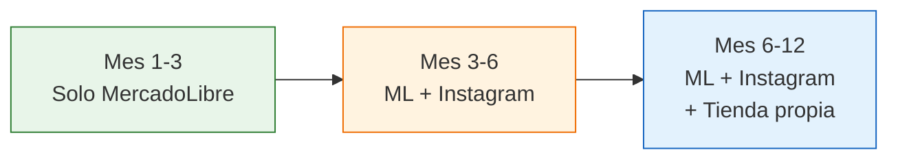

# Canales de venta para empezar

> No necesitás estar en todos los canales desde el día uno. Necesitás elegir **uno**, dominarlo, y después crecer. Esta página te muestra todas las opciones y cuál te conviene según tu etapa.

## Los 6 canales principales en Argentina

### 1. MercadoLibre — Tu canal principal

MercadoLibre es la plataforma de e-commerce más grande de Argentina y Latinoamérica. Para un emprendedor que empieza desde cero, es el canal más importante por una razón simple: **los compradores ya están ahí buscando lo que vendés**.

**Ventajas:**
- Tráfico masivo: no tenés que atraer compradores, ya están en la plataforma
- MercadoPago integrado: cobrás de forma segura
- Mercado Envíos: logística resuelta, el paquete se despacha desde puntos de entrega
- Reputación: las ventas exitosas construyen tu perfil y generan más ventas

**Desventajas:**
- Comisión alta: entre 13% y 19% según la categoría del producto
- Competencia intensa: hay muchos vendedores en la mayoría de los rubros
- Dependencia: si ML cambia sus políticas, te afecta directamente

<Note>
MercadoLibre genera el 60-70% de las ventas de la mayoría de los emprendedores que empiezan. No es el único canal, pero sí el más efectivo para arrancar porque no necesitás construir audiencia ni invertir en publicidad para tener tus primeras ventas.
</Note>

### 2. Instagram / Facebook Shop — Construir marca

Las redes sociales te permiten vender sin pagar comisiones por transacción, pero requieren que construyas una audiencia primero.

**Ventajas:**
- Sin comisión por venta
- Contacto directo con el cliente
- Construís marca e identidad
- Contenido visual para mostrar los productos en uso

**Desventajas:**
- Necesitás crear contenido constantemente (fotos, reels, stories)
- Las ventas no llegan solas: requiere tiempo y estrategia
- El cobro y envío los gestionás vos (MercadoPago link de pago + correo)

### 3. TiendaNube / Tienda propia — Independencia

TiendaNube es la plataforma argentina más popular para armar tu propia tienda online. Otras opciones incluyen Empretienda y WooCommerce.

**Ventajas:**
- Comisión más baja que ML (plan gratuito disponible, planes pagos desde ARS 25,000/mes aprox.)
- Tu marca, tu diseño, tu dominio
- Sin competidores directos al lado de tu producto

**Desventajas:**
- Necesitás generar tu propio tráfico (publicidad, SEO, redes sociales)
- Requiere más configuración inicial
- Menor confianza del comprador comparado con ML (la gente confía en ML por las garantías)

### 4. Venta directa / Showroom — Cero comisión

Vender desde tu casa, un showroom o un local pequeño.

**Ventajas:**
- Cero comisión, todo es ganancia operativa
- El cliente ve y toca el producto
- Cobrás en efectivo o transferencia directa

**Desventajas:**
- Alcance muy limitado: solo gente de tu zona
- Requiere espacio físico presentable
- Horarios fijos de atención

### 5. WhatsApp Business — Canal complementario

WhatsApp no es un canal de venta primario, pero es excelente para mantener el contacto con clientes que ya te compraron.

**Ventajas:**
- Gratuito y todo el mundo lo usa
- Ideal para clientes recurrentes y recompra
- Catálogo de productos integrado
- Mensajes automáticos y respuestas rápidas

**Desventajas:**
- No genera ventas nuevas por sí solo
- Requiere atención manual constante
- No escala fácilmente: si tenés 200 consultas por día, no das abasto

### 6. Ferias y bazares — Validación en vivo

Participar en ferias locales, bazares de emprendedores o mercados itinerantes.

**Ventajas:**
- Contacto cara a cara con el cliente
- Validación inmediata: ves en el momento qué productos gustan
- Sin comisiones (solo el costo del stand, generalmente ARS 5,000-30,000 por jornada)
- Cobrás en el momento

**Desventajas:**
- Ingresos variables: depende del clima, la ubicación y el flujo de gente
- Requiere presencia física todo el día
- Logística: llevar productos, armar el stand, desarmar

<Tip>
Las ferias son un excelente lugar para **probar productos nuevos**. Si algo se vende bien en una feria, muy probablemente se venda bien online. Usá las ferias como laboratorio de pruebas antes de invertir fuerte en un producto.
</Tip>

## Tabla comparativa de canales

| Canal | Comisión | Volumen potencial | Esfuerzo inicial | Inversión | Para principiante |
|-------|----------|-------------------|-------------------|-----------|-------------------|
| **MercadoLibre** | 13-19% | Muy alto | Bajo | Baja (gratis publicar) | Muy recomendado |
| **Instagram/Facebook** | 0% | Medio | Alto (crear contenido) | Baja-Media (publicidad) | Complementario |
| **TiendaNube** | 0-2% | Medio | Medio-Alto | Media (dominio, diseño) | Cuando estés estable |
| **Venta directa** | 0% | Bajo | Bajo | Baja | Si tenés espacio |
| **WhatsApp Business** | 0% | Bajo-Medio | Bajo | Ninguna | Complementario |
| **Ferias/Bazares** | 0% | Bajo-Medio | Medio | Baja (stand) | Para validar productos |

## Estrategia recomendada: crecimiento por etapas

No intentes estar en todos los canales al mismo tiempo. La estrategia que funciona es **crecer de a uno**:

<Steps>
  <Step title="Mes 1-3: Solo MercadoLibre">
    Enfocate 100% en MercadoLibre. Publicá tus productos, aprendé a gestionar envíos, respondé preguntas, optimizá títulos y fotos. Tu único objetivo es conseguir ventas y buena reputación.
  </Step>
  <Step title="Mes 3-6: Sumá Instagram">
    Cuando ya tengas un flujo estable de ventas en ML, abrí una cuenta de Instagram para tu emprendimiento. Publicá fotos de productos, mostrá el detrás de escena, respondé consultas. Redirigí ventas a MercadoPago o WhatsApp.
  </Step>
  <Step title="Mes 6-12: Armá tu tienda propia">
    Con productos validados y algo de audiencia en redes, creá tu tienda en TiendaNube. Usá Instagram para llevar tráfico a la tienda. Ahora tenés 3 canales funcionando y reducís tu dependencia de MercadoLibre.
  </Step>
</Steps>

<Warning>
Las redes sociales **no reemplazan** a MercadoLibre como canal principal de ventas. Instagram es excelente para construir marca y fidelizar clientes, pero la mayoría de las ventas (especialmente al inicio) van a venir de MercadoLibre. No cometas el error de dedicarle todo el tiempo a Instagram esperando que "las ventas lleguen solas".
</Warning>

## Cuánto podés esperar vender por canal

Estas son estimaciones conservadoras para un emprendedor que recién arranca, vendiendo productos de fábricas argentinas:

<Tabs>
  <Tab title="Primeros 3 meses">
    | Canal | Ventas estimadas/mes | Ingreso estimado/mes |
    |-------|---------------------|---------------------|
    | MercadoLibre | 30-80 unidades | ARS 250,000-680,000 |
    | Instagram | 0-10 unidades | ARS 0-85,000 |
    | **Total** | **30-90 unidades** | **ARS 250,000-765,000** |
  </Tab>
  <Tab title="Meses 3-6">
    | Canal | Ventas estimadas/mes | Ingreso estimado/mes |
    |-------|---------------------|---------------------|
    | MercadoLibre | 80-200 unidades | ARS 680,000-1,700,000 |
    | Instagram | 10-40 unidades | ARS 85,000-340,000 |
    | **Total** | **90-240 unidades** | **ARS 765,000-2,040,000** |
  </Tab>
  <Tab title="Meses 6-12">
    | Canal | Ventas estimadas/mes | Ingreso estimado/mes |
    |-------|---------------------|---------------------|
    | MercadoLibre | 200-500 unidades | ARS 1,700,000-4,250,000 |
    | Instagram | 40-100 unidades | ARS 340,000-850,000 |
    | Tienda propia | 10-50 unidades | ARS 85,000-425,000 |
    | **Total** | **250-650 unidades** | **ARS 2,125,000-5,525,000** |
  </Tab>
</Tabs>

<Note>
Estos números asumen un precio promedio de venta de ARS 8,500 por unidad. Tus resultados reales dependerán del producto, el precio, la calidad de tus publicaciones y la dedicación que le pongas. Son referencias orientativas, no promesas.
</Note>

## Preguntas frecuentes

<Accordion title="Puedo empezar vendiendo solo por Instagram sin usar MercadoLibre?">
Podés, pero no es recomendable. En Instagram necesitás construir una audiencia antes de vender, lo que puede llevar meses sin ingresos. En MercadoLibre, los compradores ya están buscando tu producto. La combinación ideal es empezar por ML para generar ventas inmediatas y sumar Instagram después para construir marca.
</Accordion>

<Accordion title="Vale la pena pagar publicidad en MercadoLibre (Product Ads)?">
Sí, pero recién cuando tengas publicaciones con buenas fotos, títulos optimizados y stock disponible. Product Ads de MercadoLibre funciona por costo por clic y puede acelerar mucho tus primeras ventas. Empezá con un presupuesto chico (ARS 5,000-10,000/mes) y medí los resultados antes de escalar.
</Accordion>

<Accordion title="Necesito una marca registrada para vender?">
No es obligatorio para empezar, pero es muy recomendable registrar tu marca en el INPI cuando tengas un nombre definido. El trámite cuesta aproximadamente ARS 15,000 (febrero 2026) y protege tu marca por 10 años. Podés empezar a vender mientras el trámite está en proceso.
</Accordion>

<Accordion title="Qué pasa si MercadoLibre me suspende la cuenta?">
Por eso es importante diversificar canales a medida que crecés. Las suspensiones generalmente se dan por incumplir las políticas (demoras en envíos, muchos reclamos, venta de productos prohibidos). Si cumplís las reglas y mantenés buena reputación, es muy raro que te suspendan.
</Accordion>

<Tip>
Para entender cuánto te queda de ganancia en cada canal, consultá [Comprar, revender y calcular márgenes](/app/paso1-argentina/empezar-de-cero/comprar-revender-margen) donde detallamos el cálculo completo de costos y márgenes.
</Tip>
