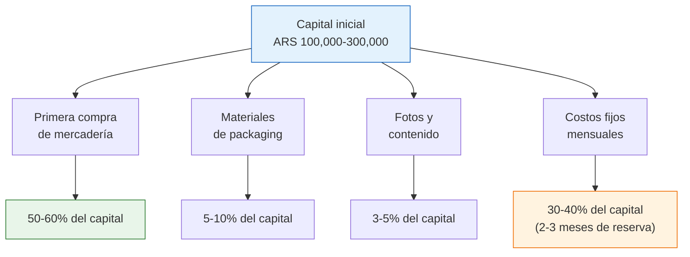
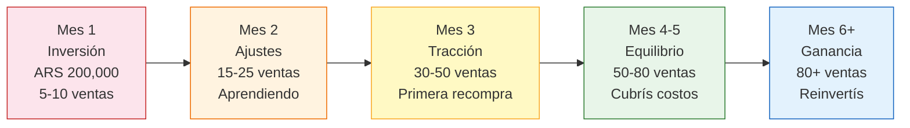

# ¿Cuánto capital necesitás para empezar?

> La respuesta corta: entre **ARS 100,000 y ARS 300,000** (~USD 80-250 a febrero 2026). Menos de lo que pensás, pero más de lo que muchos quieren escuchar. La clave no es cuánto tenés, sino cómo lo usás.

## Inversión mínima viable

No necesitás un capital enorme para arrancar. Pero sí necesitás cubrir ciertos costos básicos que son inevitables.

## Desglose detallado de costos

<Note>
Todos los valores son aproximados a febrero 2026 y pueden variar según la ciudad, el rubro y los proveedores. El tipo de cambio de referencia es ~ARS 1,200/USD. Usá estos números como guía para hacer tus propios cálculos.
</Note>

### Inversión inicial (una sola vez)

| Concepto | Rango mínimo | Rango ideal | Notas |
|----------|-------------|-------------|-------|
| **Primera compra de mercadería** | ARS 50,000 | ARS 150,000 | 2-3 productos diferentes, compra mayorista |
| **Materiales de packaging** | ARS 10,000 | ARS 20,000 | Cajas, burbuja, cinta, bolsas — comprar en cantidad |
| **Fotos y contenido** | ARS 5,000 | ARS 15,000 | DIY con celular o contratar fotógrafo para productos |
| **Dominio web (.com.ar)** | ARS 5,000 | ARS 5,000 | Si vas a crear tienda online (opcional al inicio) |
| **Subtotal inversión inicial** | **ARS 70,000** | **ARS 190,000** | |

### Costos fijos mensuales

| Concepto | Rango mínimo | Rango ideal | Notas |
|----------|-------------|-------------|-------|
| **Cuota Monotributo** | ~ARS 15,000 | ~ARS 25,000 | Varía según categoría (A-H) |
| **Contador (honorarios)** | ~ARS 15,000 | ~ARS 40,000 | Liquidación mensual + IIBB |
| **Ingresos Brutos** | ~ARS 3,000 | ~ARS 10,000 | ~3-5% sobre facturación, varía por provincia |
| **Internet/celular** | ~ARS 10,000 | ~ARS 15,000 | Herramienta de trabajo esencial |
| **Subtotal mensual** | **~ARS 43,000** | **~ARS 90,000** | |

### Capital recomendado total

| Escenario | Capital total | Incluye |
|-----------|-------------|---------|
| **Mínimo absoluto** | ARS 100,000 | Compra chica + packaging + 1 mes de gastos fijos |
| **Recomendado** | ARS 200,000 | Compra diversificada + packaging + 2 meses de reserva |
| **Ideal** | ARS 300,000 | Compra variada + packaging + fotos pro + 3 meses de reserva |

<Warning>
**NO pidas préstamos para empezar.** Los intereses bancarios en Argentina son altísimos y la presión de devolver plata con interés mientras estás aprendiendo a vender es una receta para el fracaso. Usá solo capital propio que puedas permitirte perder sin que afecte tu vida cotidiana.
</Warning>

## Cómo empezar con menos capital

Si no llegás a ARS 100,000 o querés minimizar el riesgo, hay formas de arrancar con menos:

<Tabs>
  <Tab title="Consignación">
    **Qué es:** Le pedís a una fábrica o distribuidor que te dé mercadería sin pagarla por adelantado. Les pagás después de vender, quedándote con un porcentaje.

    **Ventaja:** Inversión inicial cerca de ARS 0 en mercadería.

    **Desventaja:** Márgenes más bajos (la fábrica se queda con más), menos control sobre stock y precios. No todas las fábricas aceptan.

    **Cómo conseguirlo:** Buscá fábricas que ya tengan programa de consignación o proponelo directamente. Empezá con cantidades chicas para generar confianza.
  </Tab>
  <Tab title="Dropshipping local">
    **Qué es:** Publicás el producto en MercadoLibre, y cuando vendés, el proveedor envía directamente al comprador. Nunca tocás la mercadería.

    **Ventaja:** No necesitás comprar stock ni manejar logística.

    **Desventaja:** Márgenes muy bajos (~10-15%), no controlás la calidad del envío, dependés 100% del proveedor. Si falla, tu reputación se arruina.

    **Cómo hacerlo:** Buscá proveedores que ofrezcan dropshipping en Argentina. Hay grupos de Facebook y directorios dedicados.
  </Tab>
  <Tab title="Preventas">
    **Qué es:** Publicás el producto antes de comprarlo. Cuando juntás suficientes pedidos, hacés la compra mayorista y después enviás.

    **Ventaja:** Usás la plata del cliente para financiar tu compra.

    **Desventaja:** Tiempos de entrega más largos, riesgo de cancelación, MercadoLibre no permite preventas formalmente (debés manejar los tiempos dentro de lo permitido).

    **Cómo hacerlo:** Funciona mejor en tu tienda propia o por redes sociales, donde podés explicar que es preventa.
  </Tab>
</Tabs>

<Tip>
**La mejor estrategia para empezar con poco:** comprá una cantidad chica de 1-2 productos (ARS 30,000-50,000), vendé todo, y usá la ganancia para comprar más cantidad y mayor variedad. Es más lento pero más seguro.
</Tip>

## Timeline: cuándo recuperás la inversión

Este es un escenario realista (no optimista) para alguien que arranca con ARS 200,000:

| Mes | Qué pasa | Inversión acumulada | Ventas acumuladas | Balance |
|-----|---------|--------------------|--------------------|---------|
| **Mes 1** | Compra inicial, armado de publicaciones, primeras ventas | ARS 200,000 | ~ARS 30,000 | -ARS 170,000 |
| **Mes 2** | Primeras ventas consistentes, ajustes de precio/publicaciones | ARS 240,000 (+ gastos fijos) | ~ARS 80,000 | -ARS 160,000 |
| **Mes 3** | Recompra de stock, más publicaciones, mejora de reputación ML | ARS 300,000 (+ recompra) | ~ARS 180,000 | -ARS 120,000 |
| **Mes 4** | Ventas creciendo, reinversión parcial | ARS 340,000 | ~ARS 320,000 | -ARS 20,000 |
| **Mes 5-6** | Punto de equilibrio, empezás a generar ganancia neta | ARS 380,000 | ~ARS 500,000+ | **+ARS 120,000** |

<Note>
Este timeline asume dedicación de 3-4 horas diarias, un margen neto promedio del 30%, y un rubro con demanda constante. Los resultados reales varían enormemente. Algunos lo logran en 2 meses, otros tardan 6. La clave es la constancia.
</Note>

## Ejemplo de trayectoria realista

## Comparación: capital Paso 1 vs Paso 2

Para poner en perspectiva lo accesible que es arrancar con fábricas argentinas vs importar de China:

| Aspecto | Paso 1 (Argentina) | Paso 2 (China) |
|---------|-------------------|----------------|
| **Capital mínimo** | ARS 100,000 (~USD 80) | USD 3,000 (~ARS 3,600,000) |
| **Capital recomendado** | ARS 200,000-300,000 (~USD 160-250) | USD 5,000-10,000 (~ARS 6,000,000-12,000,000) |
| **Riesgo si falla** | Perdés ARS 100,000-300,000 | Perdés USD 3,000-10,000 |
| **Tiempo de espera** | 1-3 días (compra local) | 30-60 días (producción + envío) |
| **Complejidad** | Baja (comprar y revender) | Alta (importación, aduana, agente) |
| **Experiencia requerida** | Ninguna | Experiencia vendiendo (Paso 1) |

<Warning>
Importar de China sin experiencia previa en ventas es el error más caro que podés cometer. El Paso 1 existe para que aprendas a vender con riesgo bajo (ARS 100,000-300,000) antes de poner USD 3,000-10,000 en una importación.
</Warning>

## Reglas de oro para el capital

<Accordion title="5 reglas para manejar tu capital al empezar">
1. **Nunca inviertas todo en un solo producto.** Distribuí tu primera compra en 2-3 productos diferentes. Si uno no se vende, los otros te sostienen.
2. **Mantené reserva para 2-3 meses de gastos fijos.** Monotributo, contador e IIBB se pagan aunque no vendas. No te quedes sin plata para los fijos.
3. **Reinvertí las ganancias, no las retires.** Los primeros 3-6 meses, toda la ganancia debería volver al negocio: más stock, mejor packaging, mejor contenido.
4. **Registrá cada peso que entra y sale.** Desde el día 1, anotá todo en una planilla. Sin números claros no podés tomar decisiones.
5. **Empezá chico y escalá con datos.** Comprá 10 unidades, no 100. Si se venden rápido, comprá 30. Si esas se venden, comprá 100. Dejá que los números guíen tu inversión.
</Accordion>

<Tip>
El mejor capital no es plata — es información. Cada venta te enseña qué funciona. Cada producto que no se vende te enseña qué evitar. Empezá chico, aprendé rápido, y escalá con lo que sabés.
</Tip>

## Siguiente paso

Ya sabés cuánto necesitás y cómo distribuirlo. Ahora es momento de entender cómo funciona el negocio de comprar y revender: márgenes, precios y estrategia. Continuá con [comprar, revender y calcular márgenes](/app/paso1-argentina/empezar-de-cero/comprar-revender-margen).
