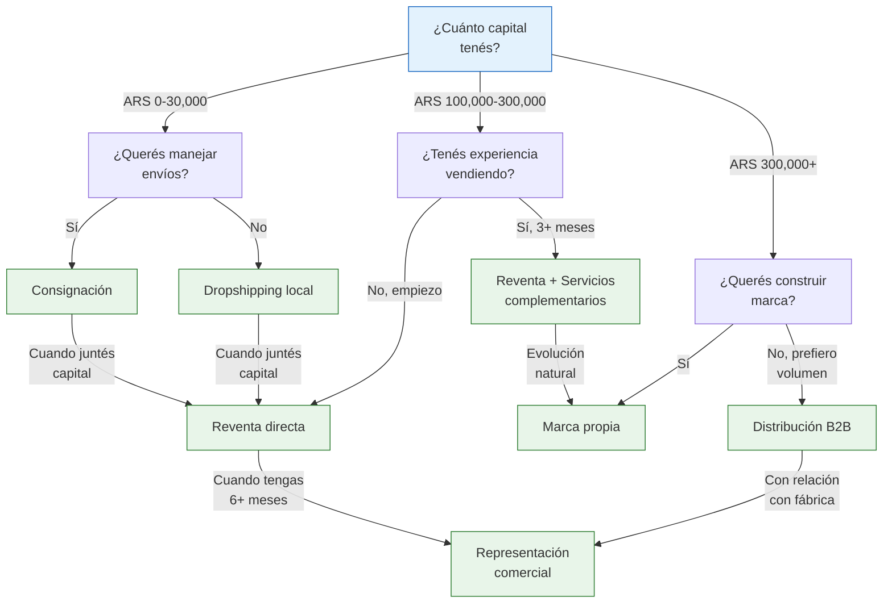
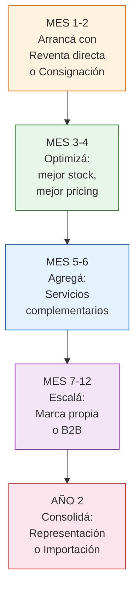

# Comparación de modelos de negocio

> Esta es la página de referencia definitiva para comparar todos los modelos de negocio con fábricas argentinas. Usala para decidir con cuál empezar, cuándo cambiar y cómo combinarlos.

## Tabla comparativa general

Cada dimensión se evalúa en una escala de 1 a 5 (1 = bajo/poco, 5 = alto/mucho):

| Dimensión | Reventa directa | Consignación | Dropshipping local | Marca propia | Distribución B2B | Representación | Servicios |
|-----------|:-:|:-:|:-:|:-:|:-:|:-:|:-:|
| **Capital requerido** | 3 | 1 | 1 | 4 | 4 | 3 | 2 |
| **Margen neto** | 4 | 2 | 2 | 5 | 3 | 4 | 4 |
| **Riesgo** | 3 | 1 | 1 | 4 | 3 | 3 | 2 |
| **Complejidad** | 2 | 2 | 3 | 4 | 3 | 3 | 3 |
| **Escalabilidad** | 3 | 2 | 3 | 5 | 5 | 4 | 3 |
| **Tiempo al 1er ingreso** | 3 | 4 | 5 | 1 | 2 | 1 | 3 |
| **Control sobre producto** | 4 | 3 | 1 | 5 | 4 | 4 | 3 |
| **Puente a importación** | 3 | 1 | 1 | 5 | 4 | 4 | 2 |

<Note>
**Cómo leer la tabla:** Capital requerido 1 = casi nada, 5 = mucho. Margen 1 = bajo, 5 = alto. Riesgo 1 = bajo, 5 = alto. Tiempo al primer ingreso 1 = tarda mucho, 5 = rápido. Los puntajes son orientativos y pueden variar según el rubro y la ejecución.
</Note>

## Datos clave de cada modelo

| Modelo | Capital mínimo aprox. | Margen neto típico | Tiempo al primer ingreso |
|--------|----------------------|-------------------|------------------------|
| **Reventa directa** | ARS 100,000-300,000 (~USD 80-250) | 25-45% | 2-4 semanas |
| **Consignación** | ARS 0-30,000 (~USD 0-25) | 15-30% | 1-2 semanas |
| **Dropshipping local** | ARS 0-10,000 (~USD 0-8) | 10-25% | 1-3 días |
| **Marca propia** | ARS 300,000-600,000 (~USD 250-500) | 35-60% | 3-6 meses |
| **Distribución B2B** | ARS 500,000+ (~USD 400+) | 15-25% | 1-2 meses |
| **Representación** | ARS 200,000+ (~USD 165+) | 20-35% | 6+ meses (relación previa) |
| **Servicios (kitting)** | ARS 50,000-150,000 (~USD 40-125) | 30-50% | 2-4 semanas |

<Note>
Todos los valores en ARS son aproximados a febrero 2026 con tipo de cambio de referencia ~ARS 1,200/USD. Los márgenes y capitales varían significativamente según el rubro, la zona geográfica y el momento.
</Note>

## ¿Qué modelo te conviene? Por perfil

<Tabs>
  <Tab title="Tengo $0">
    **Tu situación:** No tenés capital para invertir pero sí tiempo y ganas.

    **Modelos recomendados:**
    1. **Consignación** — Pedí productos a una fábrica sin pagarlos por adelantado. Empezá con cantidades chicas.
    2. **Dropshipping local** — Publicá productos de un proveedor que envíe directo al cliente. Cero inversión en stock.

    **Estrategia:** Usá estos modelos para generar tus primeros ingresos. Cuando acumules ARS 100,000+, pasá a reventa directa con los productos que ya sabés que se venden.

    **Ganancia mensual estimada (primeros 3 meses):** ARS 15,000-50,000 (~USD 12-40) aprox.

    **Lectura recomendada:**
    - [Vender en consignación](/app/paso1-argentina/empezar-de-cero/consignacion)
    - [Dropshipping local](/app/paso1-argentina/empezar-de-cero/dropshipping-local)
  </Tab>
  <Tab title="Tengo ARS 100,000">
    **Tu situación:** Tenés un capital chico pero suficiente para empezar a comprar mercadería.

    **Modelos recomendados:**
    1. **Reventa directa** — Comprá 2-3 productos a fábricas y vendé en MercadoLibre.
    2. **Consignación** (complemento) — Tomá algunos productos en consignación para ampliar catálogo sin gastar más.

    **Estrategia:** Invertí el 60% en mercadería, 10% en packaging y reservá 30% para gastos fijos de 2 meses. Vendé, reinvertí y crecé.

    **Ganancia mensual estimada (mes 3-6):** ARS 50,000-150,000 (~USD 40-125) aprox.

    **Lectura recomendada:**
    - [Comprar, revender y calcular márgenes](/app/paso1-argentina/empezar-de-cero/comprar-revender-margen)
    - [¿Cuánto capital necesitás?](/app/paso1-argentina/empezar-de-cero/capital-inicial)
  </Tab>
  <Tab title="Tengo ARS 300,000+">
    **Tu situación:** Tenés capital suficiente para proyectos más ambiciosos.

    **Modelos recomendados:**
    1. **Marca propia** — Usá tu capital para crear una marca y diferenciarte.
    2. **Reventa directa + servicios** — Comprá stock y agregá valor con kitting o packaging premium.
    3. **Distribución B2B** — Si ya tenés experiencia vendiendo, empezá a abastecer a otros.

    **Estrategia:** Validá el producto con reventa genérica (2-3 meses), después invertí en branding. Simultaneamente, armá kits y sets para aumentar el ticket promedio.

    **Ganancia mensual estimada (mes 6+):** ARS 200,000-500,000 (~USD 165-416) aprox.

    **Lectura recomendada:**
    - [Marca propia (private label)](/app/paso1-argentina/empezar-de-cero/marca-blanca)
    - [Distribución B2B](/app/paso1-argentina/empezar-de-cero/venta-b2b-distribucion)
  </Tab>
  <Tab title="Ya vendo hace 3+ meses">
    **Tu situación:** Ya tenés experiencia, canal de venta funcionando y relación con proveedores.

    **Modelos recomendados:**
    1. **Marca propia** — Es el momento de dejar de ser uno más y construir tu marca.
    2. **Servicios complementarios** — Agregá kitting y personalización para aumentar ticket.
    3. **Representación comercial** — Si tenés buena relación con una fábrica, formalizala.

    **Estrategia:** Optimizá lo que ya funciona. Subí márgenes con marca propia o valor agregado. Explorá B2B para diversificar.

    **Ganancia mensual estimada:** Depende de tu base actual — el objetivo es duplicar margen con marca propia.

    **Lectura recomendada:**
    - [Representación comercial](/app/paso1-argentina/empezar-de-cero/representacion-comercial)
    - [Servicios complementarios](/app/paso1-argentina/empezar-de-cero/servicios-complementarios)
  </Tab>
</Tabs>

## Árbol de decisión completo

## Combinaciones recomendadas

No estás limitado a un solo modelo. Estas combinaciones funcionan bien juntas:

| Combinación | Por qué funciona | Capital necesario aprox. |
|-------------|-----------------|------------------------|
| **Reventa + Consignación** | Comprás lo que se vende y tomás en consignación lo que querés probar | ARS 100,000+ (~USD 80+) |
| **Reventa + Servicios** | Vendés productos individuales Y kits premium con mayor ticket | ARS 150,000+ (~USD 125+) |
| **Marca propia + B2B** | Vendés tu marca al consumidor (B2C) Y a otros negocios (B2B) | ARS 400,000+ (~USD 333+) |
| **Dropshipping + Consignación** | Cero capital: algunos productos en dropshipping, otros en consignación | ARS 0-30,000 (~USD 0-25) |
| **Reventa + B2B + Representación** | Vendés retail, mayorista y sos representante de tu proveedor principal | ARS 300,000+ (~USD 250+) |

## Evolución recomendada: la hoja de ruta

<Warning>
**No saltes etapas.** Es tentador ir directo a marca propia o importación, pero cada etapa te da habilidades esenciales: la reventa te enseña a vender, los servicios te enseñan a agregar valor, el B2B te enseña logística de volumen. Saltar etapas es la forma más cara de aprender.
</Warning>

## Preguntas frecuentes

<Accordion title="¿Puedo combinar modelos desde el día 1?">
Sí, pero no te recomendamos más de 2 modelos al principio. Cada modelo tiene su propia curva de aprendizaje y si intentás hacer todo a la vez, no vas a hacer nada bien. La combinación más simple para empezar es **reventa directa + consignación** (para probar sin riesgo).
</Accordion>

<Accordion title="¿Cuál modelo da más plata?">
En margen porcentual, la **marca propia** (35-60%). En ingreso total con menos esfuerzo por venta, la **distribución B2B**. Pero el que más plata te da es el que **mejor ejecutás**. Un revendedor excelente gana más que un dueño de marca mediocre. Enfocate en ser el mejor en lo que elijas.
</Accordion>

<Accordion title="¿Cuál tiene menos riesgo?">
**Consignación y dropshipping** tienen el menor riesgo financiero porque no invertís en stock. Pero tienen riesgo operativo: dependés de terceros para envío y calidad. El menor riesgo global es la **reventa directa con compras chicas** — invertís poco, controlás todo y aprendés rápido.
</Accordion>

<Accordion title="¿Cuándo conviene pasar a importación (Paso 2)?">
Cuando ya dominás al menos 2-3 modelos del Paso 1, tenés capital de USD 3,000-5,000 disponible, vendés consistentemente hace 6+ meses y encontrás productos donde la importación te daría márgenes significativamente mejores. Consultá [Paso 1 vs Paso 2](/app/paso1-argentina/empezar-de-cero/paso1-vs-paso2) para la comparación completa.
</Accordion>

<Accordion title="¿Funciona lo mismo para cualquier rubro?">
Los modelos funcionan en la mayoría de los rubros, pero algunos calzan mejor: **bijouterie** es excelente para consignación y servicios, **bazar** para reventa y B2B, **marroquinería** para marca propia. Cada rubro tiene sus particularidades. Revisá las guías por rubro en la sección Oportunidades para recomendaciones específicas.
</Accordion>

<Accordion title="¿Necesito cambiar de régimen fiscal según el modelo?">
Depende del volumen. Para empezar con cualquier modelo, el **Monotributo** alcanza. Si hacés B2B en volumen, vas a necesitar pasar a **Responsable Inscripto** para emitir Factura A. Si tenés marca propia con buen volumen, también. Consultá [monotributo vs responsable inscripto](/app/paso1-argentina/empezar-de-cero/monotributo-vs-responsable-inscripto) para saber cuándo cambiar.
</Accordion>

## Resumen ejecutivo

| Si querés... | Elegí... | Capital mínimo |
|-------------|---------|---------------|
| Empezar HOY sin plata | Dropshipping local o Consignación | ARS 0-30,000 |
| El modelo más simple y probado | Reventa directa | ARS 100,000 |
| Construir algo a largo plazo | Marca propia | ARS 300,000 |
| Ingresos estables y predecibles | Distribución B2B | ARS 500,000 |
| Márgenes altos con creatividad | Servicios complementarios | ARS 50,000 |
| Relación VIP con una fábrica | Representación comercial | ARS 200,000 + trayectoria |

<Tip>
No existe el modelo perfecto — existe el modelo correcto **para vos, ahora**. Elegí según tu capital y experiencia actual, ejecutá bien y evolucioná cuando los resultados lo justifiquen. Para profundizar en cualquier modelo, usá los links en las cards de la [página de modelos de negocio](/app/paso1-argentina/empezar-de-cero/modelos-negocio-intro).
</Tip>
