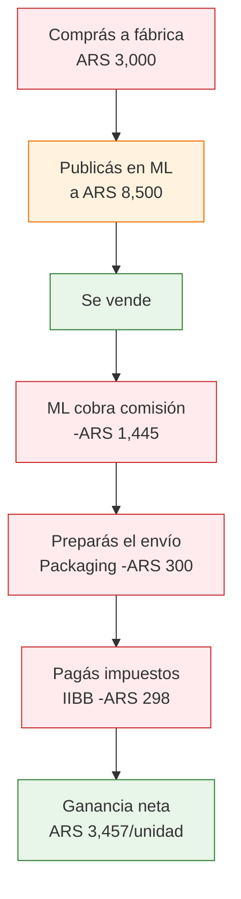

# Comprar, revender y calcular márgenes

> El negocio de reventa es simple: comprás barato a una fábrica, vendés más caro al consumidor final, y la diferencia (menos todos los costos) es tu ganancia. Pero si no calculás **todos** los costos, lo que parece ganancia puede ser pérdida.

## La fórmula fundamental

Todo el negocio se resume en una sola ecuación:

```
Precio de Venta - Costo del Producto - Costos Operativos = Ganancia Neta
```

Si esta resta da positivo y el margen es razonable, tenés un negocio. Si da negativo o muy bajo, tenés un pasatiempo que te hace perder plata.

<Warning>
El error número uno de los principiantes es calcular la ganancia como "Venta menos Costo del producto" y olvidarse de todos los demás costos. Eso **no es ganancia**, es margen bruto. Tu ganancia real es lo que queda **después de pagar todo**.
</Warning>

## Desglose completo de costos

Estos son **todos** los costos que tenés que considerar cuando revendés un producto:

| Costo | Descripción | Rango típico |
|-------|-------------|-------------|
| **Costo del producto** | Precio que pagás a la fábrica por unidad | Variable por rubro |
| **Flete/transporte** | Envío desde la fábrica hasta tu depósito | ARS 500-3,000/unidad según volumen |
| **Packaging/embalaje** | Caja, burbuja, cinta, bolsa, etiqueta | ARS 200-500/unidad |
| **Comisión MercadoLibre** | Porcentaje que cobra ML por cada venta | 13-19% del precio de venta |
| **Envío al cliente** | Costo de enviar al comprador | ARS 2,000-4,000 (puede pagarlo el comprador) |
| **Monotributo** | Cuota fija mensual según categoría | ARS 26,600-160,000/mes |
| **Ingresos Brutos (IIBB)** | Impuesto provincial sobre ventas | ~3.5% del monto facturado |
| **Contador** | Honorarios mensuales del profesional contable | ARS 30,000-60,000/mes |
| **Imprevistos** | Devoluciones, productos dañados, errores | 2-5% de la facturación |

<Note>
Los valores en ARS son aproximados a febrero 2026. Los costos cambian con frecuencia en Argentina, así que usá estos números como referencia y actualizá con valores del momento en que leas esto.
</Note>

## Cómo calcular tu margen real

Hay dos márgenes que tenés que conocer:

### Margen bruto

Es la diferencia entre lo que vendés y lo que te costó el producto, sin contar otros gastos.

```
Margen Bruto = (Precio de Venta - Costo del Producto) / Precio de Venta × 100
```

Ejemplo: vendés a ARS 8,500 algo que te costó ARS 3,000.
Margen bruto = (8,500 - 3,000) / 8,500 × 100 = **64.7%**

### Margen neto

Es lo que realmente te queda en el bolsillo después de **todos** los costos.

```
Margen Neto = (Precio de Venta - TODOS los costos) / Precio de Venta × 100
```

<Tip>
El margen que importa de verdad es el **neto**. Un margen bruto de 65% puede convertirse en un margen neto de 30% cuando sumás comisiones, envío, impuestos y packaging. Siempre calculá el neto antes de decidir vender un producto.
</Tip>

## Ejemplo práctico con números reales

Supongamos que comprás un producto de bazar a una fábrica en zona sur del Gran Buenos Aires:

<Steps>
  <Step title="Comprás el producto">
    Precio de fábrica: **ARS 3,000/unidad** (comprando un mínimo de 50 unidades).
  </Step>
  <Step title="Lo publicás en MercadoLibre">
    Precio de venta: **ARS 8,500** (precio competitivo según la categoría).
  </Step>
  <Step title="Se vende y MercadoLibre cobra su comisión">
    Comisión ML (17%): **ARS 1,445**.
  </Step>
  <Step title="Preparás y enviás el producto">
    Packaging: **ARS 300**. En este ejemplo, el envío lo paga el comprador, pero vos absorbés ARS 0 de flete.
  </Step>
  <Step title="Pagás los impuestos correspondientes">
    Ingresos Brutos (3.5% sobre ARS 8,500): **ARS 298**.
  </Step>
</Steps>

### Resumen del ejemplo

| Concepto | Monto |
|----------|-------|
| Precio de venta | ARS 8,500 |
| (-) Costo del producto | -ARS 3,000 |
| (-) Comisión MercadoLibre (17%) | -ARS 1,445 |
| (-) Packaging | -ARS 300 |
| (-) Ingresos Brutos (3.5%) | -ARS 298 |
| **= Ganancia neta por unidad** | **ARS 3,457** |
| **Margen neto** | **~40.7%** |

<Note>
Este ejemplo no incluye el costo del flete desde fábrica (que depende de la distancia y la cantidad), ni el monotributo ni el contador (que son costos fijos mensuales y se prorratean entre todas tus ventas del mes). Si vendés 100 unidades por mes, el monotributo y el contador representan aproximadamente ARS 500-900 adicionales por unidad.
</Note>

## Flujo del dinero: de la compra a la ganancia



## Márgenes objetivo por categoría

No todos los rubros dan el mismo margen. Esta tabla muestra rangos realistas para compra en fábrica argentina y reventa en MercadoLibre:

| Categoría | Margen neto típico | Comentario |
|-----------|-------------------|------------|
| **Textiles/Indumentaria** | 40-60% | Márgenes altos pero muchas devoluciones por talle |
| **Bazar/Hogar** | 30-50% | Buena relación margen-rotación, pocas devoluciones |
| **Cosmética/Belleza** | 50-80% | Márgenes excelentes, pero requiere habilitaciones |
| **Ferretería/Herramientas** | 25-40% | Márgenes más bajos, pero rotación alta y constante |
| **Juguetes** | 35-55% | Alta estacionalidad, picos en Día del Niño y Navidad |
| **Alimentos no perecederos** | 20-35% | Margen bajo, se compensa con volumen alto |

<Warning>
Si tu margen neto es menor al 20%, probablemente no sea un buen producto para empezar. Con márgenes tan bajos, cualquier imprevisto (una devolución, un aumento de costos, una promo que tengas que hacer) te deja en cero o en pérdida. Apuntá a mínimo 30% neto como principiante.
</Warning>

## 5 pasos para evaluar si un producto es rentable

Antes de gastar un solo peso, seguí estos pasos:

<Steps>
  <Step title="Investigá el precio de venta en MercadoLibre">
    Buscá productos iguales o similares. Mirá los que tienen más ventas (no los más caros ni los más baratos). Ese es tu precio de referencia.
  </Step>
  <Step title="Consultá el precio de fábrica">
    Contactá a la fábrica y pedí lista de precios mayoristas. Preguntá por el mínimo de compra y si hay descuento por cantidad.
  </Step>
  <Step title="Calculá todos los costos">
    Usá la tabla de costos de arriba. Sumá: costo del producto + comisión ML + packaging + IIBB + flete. No te olvides de ninguno.
  </Step>
  <Step title="Hacé la resta">
    Precio de venta - todos los costos = ganancia neta. Dividí la ganancia por el precio de venta y multiplicá por 100 para obtener el margen neto en porcentaje.
  </Step>
  <Step title="Decidí con el margen neto en la mano">
    Si el margen neto es mayor al 30%, es un buen candidato. Si está entre 20-30%, es aceptable pero con poco colchón. Si es menor al 20%, buscá otro producto.
  </Step>
</Steps>

<Tip>
Siempre calculá con **todos** los costos antes de comprar. Muchos principiantes se entusiasman viendo el margen bruto (que parece enorme) y se olvidan de las comisiones de MercadoLibre, el packaging y los impuestos. Cuando llegan los números reales, la "ganancia" desaparece.
</Tip>

## Preguntas frecuentes

<Accordion title="El envío al cliente, lo pago yo o el comprador?">
En MercadoLibre, podés elegir que el comprador pague el envío (envío "a cargo del comprador") o absorberlo vos ofreciendo "envío gratis". El envío gratis mejora las ventas pero reduce tu margen. Para empezar, es recomendable ofrecer envío gratis solo si tu margen neto sigue siendo mayor al 25% después de absorberlo.
</Accordion>

<Accordion title="Cómo calculo el monotributo por unidad?">
El monotributo es una cuota fija mensual. Para saber cuánto te cuesta por unidad, dividí la cuota mensual por la cantidad de unidades que vendés en el mes. Ejemplo: si pagás ARS 26,600/mes de monotributo y vendés 80 unidades, te cuesta ARS 333 por unidad.
</Accordion>

<Accordion title="Y si el producto no se vende?">
Por eso empezás con compras chicas (50-100 unidades). Si un producto no se vende en 30 días, bajá el precio hasta encontrar el punto donde rota. Es mejor ganar menos que quedarte con mercadería acumulada. La lección te sale más barata si compraste poco.
</Accordion>

<Tip>
Para más detalle sobre dónde vender tus productos, consultá [Canales de venta para empezar](/app/paso1-argentina/empezar-de-cero/canales-venta).
</Tip>
