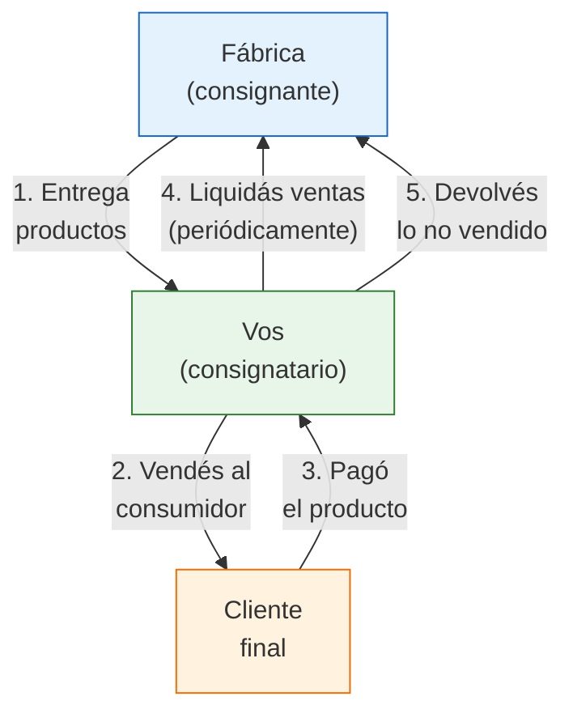

# Vender en consignación

> La consignación es el modelo ideal para empezar **sin capital**: la fábrica te entrega productos, vos los vendés, y le pagás después. Tu ganancia es un porcentaje de cada venta.

## ¿Qué es la consignación?

En un acuerdo de consignación, la fábrica (consignante) te entrega mercadería **sin cobrarte por adelantado**. Vos (consignatario) la vendés al consumidor final. Periódicamente liquidás las ventas: le pagás a la fábrica su porcentaje y te quedás con el tuyo. Los productos que no vendiste, los devolvés.

<Note>
La consignación **no es lo mismo que comprar a crédito**. En la compra a crédito, la mercadería es tuya y debés pagarla sí o sí. En consignación, la mercadería sigue siendo propiedad de la fábrica hasta que la vendés. Si no vendés, devolvés.
</Note>

## Marco legal en Argentina

La consignación está regulada por el Código Civil y Comercial de la Nación (artículos 1335 a 1346). Puntos clave:

- El consignatario (vos) actúa en nombre propio pero por cuenta del consignante (fábrica)
- La mercadería **sigue siendo propiedad de la fábrica** hasta que se vende
- Debés rendir cuentas periódicamente de las ventas realizadas
- Si la mercadería se pierde o daña bajo tu custodia, sos responsable

<Warning>
Es fundamental tener un **acuerdo escrito** (aunque sea simple) que detalle: qué productos recibís, en qué cantidad, a qué precio, qué porcentaje te corresponde, cada cuánto liquidás y qué pasa con la mercadería no vendida o dañada. Sin acuerdo escrito, cualquier disputa se vuelve imposible de resolver.
</Warning>

## Cómo funciona el split (reparto de ganancias)

La forma más común de repartir las ganancias en consignación es por porcentaje sobre el precio de venta:

| Estructura | Fábrica se lleva | Vos te quedás | Cuándo se usa |
|------------|-----------------|---------------|---------------|
| **70/30** | 70% | 30% | Lo más común para productos nuevos o de alto valor |
| **60/40** | 60% | 40% | Cuando vos aportás canal fuerte (ML con buena reputación) |
| **50/50** | 50% | 50% | Raro, solo si tu canal de venta es muy valioso |

<Note>
Estos porcentajes son sobre el **precio de venta final al consumidor**. Pero ojo: de tu porcentaje todavía tenés que descontar comisiones de MercadoLibre, packaging, envío e impuestos. Tu ganancia real es menor que tu porcentaje del split.
</Note>

## Rubros que más aceptan consignación

No todas las fábricas ofrecen consignación. Estos rubros son los que más la aceptan, aproximadamente:

| Rubro | Probabilidad de aceptar | Por qué |
|-------|------------------------|---------|
| **Bijouterie y accesorios** | Alta | Productos de bajo costo unitario, fábricas acostumbradas |
| **Decoración y bazar** | Alta | Muchos fabricantes pequeños que necesitan canales de venta |
| **Marroquinería** | Media-Alta | Productos de mayor valor, algunas fábricas como Madu ya ofrecen esquemas similares |
| **Indumentaria** | Media | Marcas emergentes que necesitan visibilidad |
| **Cosmética artesanal** | Media | Productores chicos que no pueden poner local propio |
| **Alimentos artesanales** | Baja | Fecha de vencimiento complica la devolución |

## Cómo proponerle consignación a una fábrica

<Steps>
  <Step title="Investigá la fábrica y sus productos">
    Antes de contactar, conocé bien qué produce, a qué precios vende al público, y si tiene presencia en MercadoLibre. Si ya tiene muchos vendedores online, va a ser más difícil que te acepte. Si no tiene presencia digital, tu propuesta es más valiosa.
  </Step>
  <Step title="Armá tu propuesta de valor">
    La fábrica necesita una razón para confiar en vos. Tu propuesta debe responder: ¿qué canal de venta ofrecés? ¿Tenés reputación en MercadoLibre? ¿Cuántas ventas estimás por mes? ¿En qué zona geográfica vendés?
  </Step>
  <Step title="Hacé el primer contacto">
    Enviá un mensaje profesional. Ejemplo de plantilla:

    *"Hola, soy [nombre] de [tu emprendimiento]. Vendo productos en MercadoLibre/mi tienda online en [categoría]. Me interesan sus productos para ofrecerlos en mi canal de venta. ¿Trabajan con esquema de consignación? Estoy dispuesto/a a empezar con una cantidad chica para demostrar resultados y escalar después."*
  </Step>
  <Step title="Negociá los términos">
    Si la fábrica acepta hablar, definí: porcentaje de reparto (empezá proponiendo 60/40), período de liquidación (cada 15 o 30 días), cantidad inicial de productos, política de devoluciones y productos dañados.
  </Step>
  <Step title="Firmá un acuerdo simple y empezá">
    No necesitás un contrato de 20 páginas. Un acuerdo de una carilla que detalle productos, cantidades, precios, porcentajes y condiciones es suficiente para empezar. Armá un remito con cada entrega.
  </Step>
</Steps>

<Tip>
Si la fábrica dice que no trabaja con consignación, ofrecé una alternativa: **"¿Y si empiezo con una compra chica de 20 unidades y, si las vendo en 30 días, pasamos a un esquema de consignación?"** Demostrá resultados primero.
</Tip>

## Ejemplo práctico con números

Supongamos que acordás consignación con una fábrica de bijouterie con un split 70/30:

| Detalle | Valor |
|---------|-------|
| Productos recibidos en consignación | 50 pares de aros |
| Precio de venta al público por par | ARS 4,500 (~USD 3.75) |
| Período de liquidación | 30 días |
| Vendidos en el período | 35 pares (70% del stock) |

### Liquidación del mes

| Concepto | Cálculo | Monto |
|----------|---------|-------|
| Facturación total (35 pares x ARS 4,500) | 35 x 4,500 | ARS 157,500 |
| **Parte de la fábrica (70%)** | 157,500 x 0.70 | **ARS 110,250** |
| **Tu parte bruta (30%)** | 157,500 x 0.30 | **ARS 47,250** |
| (-) Comisión MercadoLibre (17%) | 157,500 x 0.17 | -ARS 26,775 |
| (-) Packaging (ARS 200 x 35 envíos) | 200 x 35 | -ARS 7,000 |
| (-) Ingresos Brutos (~3.5%) | 157,500 x 0.035 | -ARS 5,513 |
| **Tu ganancia neta real** | 47,250 - 26,775 - 7,000 - 5,513 | **ARS 7,962** |

<Warning>
Notá que de un 30% bruto, tu ganancia neta real es aproximadamente un **5% del total facturado**. Esto es normal en consignación. El beneficio no está en el margen sino en que **no invertiste nada en mercadería**. Pero es clave que los costos de MercadoLibre no se "coman" tu porcentaje. Negociá un split mejor (60/40) o vendé por canales con menor comisión.
</Warning>

## Ventajas y desventajas

<Tabs>
  <Tab title="Ventajas">
    - **Inversión en stock: ARS 0** — no comprás mercadería, solo invertís en packaging y logística
    - **Riesgo bajo** — si no se vende, devolvés el producto
    - **Probás productos sin comprometerte** — ideal para testear qué funciona antes de comprar stock propio
    - **Flujo de caja positivo** — cobrás antes de pagar a la fábrica
    - **Variedad sin inversión** — podés tener más productos en catálogo
  </Tab>
  <Tab title="Desventajas">
    - **Márgenes bajos** — tu porcentaje es menor que si comprases mayorista
    - **Menos control** — la fábrica puede cambiar precios o retirar productos
    - **Responsabilidad por daños** — si se daña bajo tu custodia, pagás
    - **Difícil de escalar** — pocas fábricas te dan grandes cantidades en consignación al principio
    - **Dependencia** — la fábrica puede cortar el acuerdo en cualquier momento
  </Tab>
</Tabs>

## Errores comunes

<Accordion title="No tener acuerdo escrito">
Sin un documento que detalle los términos, cualquier malentendido se convierte en conflicto. Siempre dejá por escrito: qué productos, cuántos, a qué precio, qué porcentaje, cada cuánto liquidás.
</Accordion>

<Accordion title="No llevar inventario detallado">
Necesitás saber exactamente qué recibiste, qué vendiste y qué tenés. Un Excel simple alcanza, pero actualizalo con cada movimiento. La fábrica va a pedir rendición de cuentas.
</Accordion>

<Accordion title="No calcular los costos reales antes de aceptar">
Un split 70/30 parece 30% para vos, pero después de comisiones, impuestos y packaging puede ser 5% o menos. Hacé los números ANTES de aceptar un acuerdo.
</Accordion>

<Accordion title="Quedarte con mercadería demasiado tiempo">
Si no vendés en 60 días, devolvé. Tener stock estancado ocupa espacio y genera tensión con la fábrica. Es mejor devolver y pedir productos diferentes que funcionen mejor.
</Accordion>

## ¿Cuándo pasar de consignación a compra directa?

La consignación es ideal para empezar, pero llega un punto donde comprar te conviene más:

| Señal | Qué hacer |
|-------|-----------|
| Vendés más del 80% del stock en cada período | Empezá a comprar ese producto — tu margen será mucho mayor |
| Ya sabés qué productos se venden bien | Comprá esos específicamente y dejá consignación para probar cosas nuevas |
| Tenés capital acumulado de las ganancias | Reinvertí en compra mayorista de los productos validados |
| La fábrica te ofrece mejor precio por compra | Aprovechá — el precio mayorista + tu canal = mejor margen |

<Tip>
La estrategia ideal es usar consignación para **probar** productos y compra directa para los productos que **ya sabés que se venden**. Así minimizás riesgo en lo nuevo y maximizás margen en lo seguro. Para más detalle sobre la compra directa, consultá [comprar, revender y calcular márgenes](/app/paso1-argentina/empezar-de-cero/comprar-revender-margen).
</Tip>
