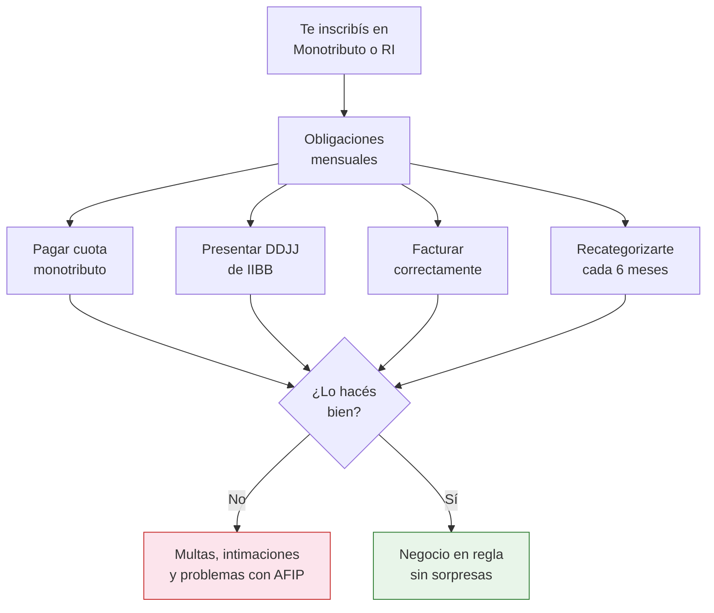

# Contador y contabilidad básica

> Un contador no es un lujo, es una necesidad desde el primer mes. En Argentina, las obligaciones fiscales son mensuales y los errores se pagan con multas. Tener un buen contador te ahorra plata y dolores de cabeza.

## Por qué necesitás un contador desde el día 1

Muchos emprendedores nuevos piensan "ya voy a buscar un contador cuando crezca". Es un error. En Argentina, desde el momento en que te inscribís en el monotributo, tenés obligaciones fiscales mensuales que cumplir.

<Warning>
AFIP y ARBA/AGIP (según tu provincia) no perdonan. Un vencimiento no pagado genera intereses automáticos. Una DDJJ no presentada genera multa. Y los errores en la categorización del monotributo pueden costarte una recategorización de oficio con diferencias a pagar retroactivas.
</Warning>

## Qué hace un contador por vos

| Tarea | Frecuencia | Qué implica |
|-------|-----------|-------------|
| **Liquidación mensual** | Mensual | Calcula cuánto debés pagar de impuestos cada mes |
| **DDJJ Ingresos Brutos** | Mensual | Presenta tu declaración jurada de IIBB ante la provincia |
| **DDJJ IVA y Ganancias** | Mensual (si sos RI) | Solo si sos Responsable Inscripto, no aplica a Monotributo |
| **Recategorización Monotributo** | Cada 6 meses (enero y julio) | Evalúa si debés subir o bajar de categoría según tu facturación |
| **Asesoramiento fiscal** | Permanente | Te dice cuándo conviene pasarte a RI, cómo deducir gastos, etc. |
| **Respuesta a intimaciones** | Cuando ocurra | Si AFIP o la provincia te intiman, tu contador responde |

## Cuánto cuesta un contador

<Note>
Honorarios aproximados a febrero 2026. Varían significativamente según la ciudad, la experiencia del profesional y la complejidad de tu situación fiscal. Pedí presupuesto a al menos 2-3 contadores antes de decidir.
</Note>

<Tabs>
  <Tab title="Monotributista">
    | Servicio | Honorario mensual aproximado |
    |----------|----------------------------|
    | **Liquidación básica + IIBB** | ~ARS 15,000-25,000 |
    | **Con asesoramiento adicional** | ~ARS 25,000-40,000 |
    | **Recategorización (extra)** | A veces incluido, a veces ~ARS 5,000-10,000 |

    **Qué incluye generalmente:** Pago mensual de monotributo, DDJJ de IIBB, control de facturación, aviso de vencimientos, recategorización semestral.
  </Tab>
  <Tab title="Responsable Inscripto">
    | Servicio | Honorario mensual aproximado |
    |----------|----------------------------|
    | **Liquidación completa** | ~ARS 30,000-50,000 |
    | **Con asesoramiento y planificación** | ~ARS 50,000-80,000 |
    | **Balances anuales (extra)** | ~ARS 30,000-60,000 |

    **Qué incluye generalmente:** DDJJ IVA mensual, DDJJ Ganancias, IIBB, retenciones, percepciones, asesoramiento sobre deducciones, balances.
  </Tab>
</Tabs>

<Tip>
**El contador es una inversión, no un gasto.** Un buen contador te ahorra más de lo que cobra: evita multas, optimiza tu carga impositiva y te avisa antes de que cometas errores costosos. Pensá en los honorarios como un seguro fiscal.
</Tip>

## Cómo encontrar un buen contador

No cualquier contador sirve. Necesitás uno que entienda comercio electrónico y la realidad de un emprendedor que recién arranca.

<Steps>
  <Step title="Pedí recomendaciones">
    Preguntá en grupos de emprendedores de Facebook, foros de MercadoLibre o conocidos que tengan negocios. La recomendación personal es el mejor filtro.
  </Step>
  <Step title="Buscá en colegios profesionales">
    Cada provincia tiene un Colegio de Profesionales de Ciencias Económicas con directorio de matriculados. Verificá que tu contador esté matriculado.
  </Step>
  <Step title="Priorizá experiencia en ecommerce">
    Un contador que entiende MercadoLibre, facturación electrónica y comercio online te va a dar mejor asesoramiento que uno especializado en empresas industriales.
  </Step>
  <Step title="Hacé una primera consulta">
    La mayoría ofrece una primera reunión gratuita o de bajo costo. Aprovechá para preguntar: honorarios, qué incluye, cómo se comunican, tiempos de respuesta.
  </Step>
  <Step title="Evaluá la comunicación">
    Tu contador tiene que explicarte las cosas en español simple, no en jerga contable. Si no entendés lo que te dice, buscá otro. Necesitás aprender, no solo delegar.
  </Step>
</Steps>

## Qué podés manejar vos mismo

No todo depende del contador. Hay tareas de contabilidad básica que podés (y debés) manejar vos:

### Registro de compras y ventas

Mantené una planilla actualizada con cada operación:

| Columna | Ejemplo |
|---------|---------|
| **Fecha** | 15/02/2026 |
| **Tipo** | Venta |
| **Producto** | Organizador bambú |
| **Cantidad** | 3 unidades |
| **Monto** | ARS 36,000 |
| **Medio de pago** | MercadoPago |
| **N° factura** | 0001-00000045 |
| **Canal** | MercadoLibre |

### Facturación

Desde la app de AFIP "Facturador Móvil" o desde la web de AFIP podés emitir facturas electrónicas. Es obligatorio facturar cada venta.

### Registro de gastos

Guardá **todos** los comprobantes de gastos del negocio: compras de mercadería, packaging, envíos, herramientas, publicidad. Tu contador los va a necesitar y, si sos RI, muchos son deducibles.

<Note>
Usá Google Sheets o Excel para tu planilla de control. Es gratis, accesible desde el celular y podés compartirla con tu contador. No necesitás software contable sofisticado al principio.
</Note>

## Qué hacer cada mes

<Steps>
  <Step title="Facturar todas las ventas">
    Emití factura por cada venta dentro de los plazos legales. Si vendés por MercadoLibre, facturá al consumidor final (Factura C si sos Monotributista). Hacelo semanalmente, no dejes que se acumule.
  </Step>
  <Step title="Registrar todos los gastos">
    Anotá en tu planilla cada gasto del negocio. Guardá los comprobantes (foto del ticket o factura electrónica).
  </Step>
  <Step title="Pagar la cuota del Monotributo">
    Vence entre el 20 y el 22 de cada mes (varía). Podés configurar débito automático para no olvidarte.
  </Step>
  <Step title="Enviar información al contador">
    Entre el 1 y el 5 de cada mes, enviá a tu contador: planilla de ventas, planilla de gastos, comprobantes relevantes. Cuanto más ordenado le mandés la info, menos te cobra y mejor te asesora.
  </Step>
  <Step title="Revisar la liquidación del contador">
    Tu contador te va a mandar un resumen de lo que hay que pagar y presentar. Revisalo, preguntá lo que no entiendas. Aprovechá cada mes para aprender un poco más.
  </Step>
</Steps>

<Tip>
**Pedile a tu contador que te explique todo.** No firmes ni pagues nada que no entiendas. Cada interacción con tu contador es una oportunidad de aprender cómo funciona el sistema fiscal argentino. En 6-12 meses vas a entender lo básico y vas a poder tomar mejores decisiones.
</Tip>

## Herramientas útiles

| Herramienta | Para qué | Costo |
|-------------|---------|-------|
| **Google Sheets** | Planillas de control de compras/ventas/gastos | Gratis |
| **AFIP Facturador Móvil** | Emitir facturas electrónicas desde el celular | Gratis |
| **Xubio** | Software contable argentino para emprendedores | Desde ~ARS 8,000/mes |
| **Colppy** | Gestión contable online | Desde ~ARS 6,000/mes |
| **Carpeta de Google Drive** | Guardar comprobantes digitales organizados por mes | Gratis |

## Preguntas frecuentes

<Accordion title="¿Puedo arrancar sin contador?">
Técnicamente sí, pero no es recomendable. Podés facturar y pagar el monotributo solo, pero las DDJJ de Ingresos Brutos, la recategorización y el asesoramiento fiscal requieren un profesional. El riesgo de cometer errores y recibir multas es alto si no tenés experiencia.
</Accordion>

<Accordion title="¿Cuándo me conviene pasar de Monotributo a Responsable Inscripto?">
Tu contador te va a avisar. Generalmente conviene cuando tu facturación se acerca al tope de tu categoría de monotributo o cuando tus compras con IVA son tan altas que te conviene descontar el crédito fiscal. No tomes esta decisión solo — el impacto fiscal es significativo.
</Accordion>

<Accordion title="¿Qué pasa si no facturo una venta?">
Si vendés por MercadoLibre y cobrás por MercadoPago, AFIP ya sabe que vendiste (MercadoPago informa tus ingresos). No facturar es una irregularidad fiscal que puede generar intimaciones, multas y hasta exclusión del monotributo.
</Accordion>

<Accordion title="¿Tengo que pagar Ingresos Brutos en todas las provincias?">
Si vendés solo dentro de tu provincia, pagás IIBB solo ahí. Si vendés a todo el país (lo normal en ecommerce), necesitás inscribirte en Convenio Multilateral, que distribuye el impuesto entre las provincias donde vendés. Tu contador gestiona esto.
</Accordion>

<Accordion title="¿Cuánto debo separar por mes para impuestos?">
Como regla general, separá entre el 5% y el 15% de tu facturación para impuestos (varía según condición fiscal y provincia). Tu contador te va a dar el número exacto. No gastes toda la ganancia — siempre tené un fondo para impuestos.
</Accordion>

## Siguiente paso

Ahora que sabés cómo manejar la parte contable, es momento de hablar de plata: [cuánto capital necesitás para empezar](/app/paso1-argentina/empezar-de-cero/capital-inicial).
