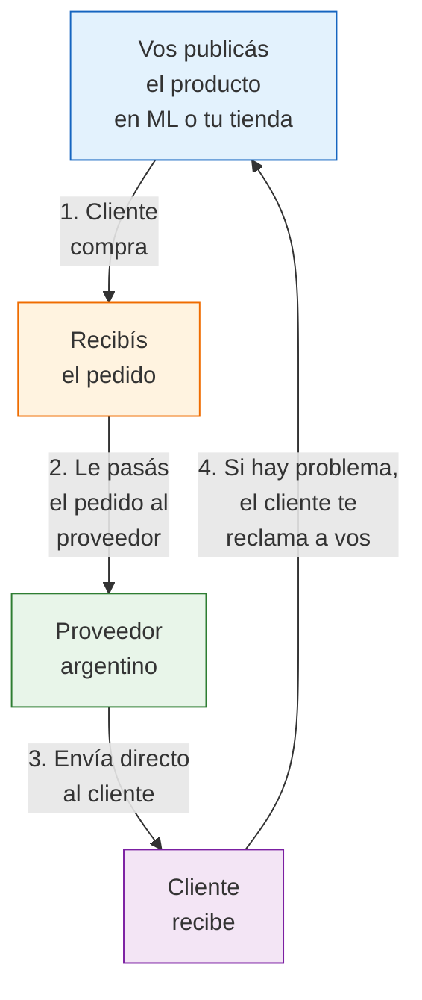

# Dropshipping local en Argentina

> Dropshipping local significa que vos publicás y vendés el producto, pero **la fábrica o proveedor lo envía directamente al cliente**. Nunca tocás la mercadería. Es la forma de empezar con menor inversión posible, pero tiene limitaciones importantes.

## ¿Qué es el dropshipping local?

A diferencia del dropshipping internacional (desde China), el dropshipping local trabaja con **proveedores argentinos**. El flujo es simple:

<Note>
En este modelo, vos sos el vendedor de cara al cliente. El comprador no sabe (ni le importa) que el producto sale de otro lugar. Para él, vos sos el responsable de todo: calidad, envío y postventa.
</Note>

## Diferencias clave: dropshipping local vs internacional

| Aspecto | Dropshipping local (Argentina) | Dropshipping internacional (China) |
|---------|-------------------------------|-----------------------------------|
| **Tiempo de entrega** | 2-5 días hábiles | 20-60 días |
| **Costo de envío** | Normal (Correo Argentino, OCA, Andreani) | Alto o incluido en precio |
| **Devoluciones** | Fáciles, dentro de Argentina | Casi imposibles |
| **Calidad del producto** | Podés ver muestras antes | Difícil verificar calidad |
| **Margen típico** | 10-25% | 30-60% (por precio bajo de origen) |
| **Compatibilidad con ML** | Alta (cumplís tiempos de envío) | Baja (ML penaliza demoras) |
| **Capital requerido** | Casi nulo (ARS 0-10,000 / ~USD 0-8) | Bajo pero necesitás publicidad |

## Cómo encontrar proveedores que ofrecen dropshipping

No todos los proveedores aceptan hacer dropshipping. Estos son los canales más efectivos para encontrarlos:

<Steps>
  <Step title="Buscá mayoristas en MercadoLibre">
    Muchos vendedores mayoristas en ML ya están acostumbrados a trabajar con revendedores. Buscá "mayorista [producto]" y contactá a los que tengan buena reputación y stock permanente. Preguntá directamente si hacen dropshipping.
  </Step>
  <Step title="Explorá grupos de Facebook de mayoristas">
    Hay grupos como "Mayoristas Argentina", "Proveedores para revendedores" y similares donde los proveedores ofrecen sus servicios. Algunos ya especifican que hacen dropshipping.
  </Step>
  <Step title="Contactá fábricas directamente">
    Algunas fábricas chicas que no tienen canal de venta online ven con buenos ojos que alguien venda por ellos. Proponeles que vos publicás y vendés, y ellos envían. Es más probable que acepten si no tienen presencia en MercadoLibre.
  </Step>
  <Step title="Plataformas B2B argentinas">
    Sitios como Emprendo Argentina o grupos de emprendedores a veces listan proveedores que ofrecen dropshipping local.
  </Step>
</Steps>

<Warning>
**Verificá siempre al proveedor antes de publicar.** Hacé un pedido de prueba comprando 1-2 unidades. Evaluá: ¿cuánto tardó en enviar? ¿Cómo llegó el packaging? ¿La calidad es la esperada? Si el proveedor falla en la prueba, va a fallar con tus clientes.
</Warning>

## Márgenes reales del dropshipping local

El margen en dropshipping es **significativamente menor** que en reventa directa, porque el proveedor se queda con la mayor parte del precio.

### Ejemplo de cálculo

| Concepto | Monto |
|----------|-------|
| Precio de venta en MercadoLibre | ARS 6,000 (~USD 5) |
| Precio del proveedor (mayorista) | ARS 4,200 |
| **Margen bruto** | **ARS 1,800 (30%)** |
| (-) Comisión ML (17%) | -ARS 1,020 |
| (-) Ingresos Brutos (3.5%) | -ARS 210 |
| **Ganancia neta por venta** | **ARS 570 (~USD 0.47)** |
| **Margen neto** | **~9.5%** |

<Note>
Este ejemplo asume que el envío lo paga el comprador. Si ofrecés envío gratis, tu margen se reduce aún más o queda en negativo. Con dropshipping, cada centavo cuenta.
</Note>

### ¿Cuántas ventas necesitás para que funcione?

Con un margen neto de ARS 570 por venta:

| Ventas/mes | Ganancia mensual aprox. | ¿Es viable? |
|------------|------------------------|-------------|
| 10 | ARS 5,700 (~USD 5) | No cubre ni el monotributo |
| 50 | ARS 28,500 (~USD 24) | Apenas cubre costos fijos |
| 100 | ARS 57,000 (~USD 48) | Empieza a ser un ingreso complementario |
| 200+ | ARS 114,000+ (~USD 95+) | Necesitás alto volumen para que sea negocio |

## Políticas de MercadoLibre que afectan al dropshipping

MercadoLibre no prohíbe el dropshipping explícitamente, pero tiene reglas que lo hacen difícil si tu proveedor no es confiable:

| Política | Impacto en dropshipping |
|----------|----------------------|
| **Tiempo de envío: 24-48hs** | Tu proveedor DEBE enviar en ese plazo o baja tu reputación |
| **Tracking obligatorio** | Necesitás el código de seguimiento del proveedor para cargarlo en ML |
| **Atención postventa** | Si el cliente reclama, vos respondés — aunque el problema sea del proveedor |
| **Penalización por cancelaciones** | Si tu proveedor no tiene stock y cancelás, ML te penaliza |
| **Mercado Envíos Full** | Incompatible con dropshipping (requiere que envíes a depósitos de ML) |

<Warning>
**La reputación en MercadoLibre es tu activo más valioso.** Si tu proveedor de dropshipping envía tarde, envía mal o se queda sin stock, quien sufre las consecuencias sos vos. Una caída de reputación en ML puede tardar meses en recuperarse y afecta todas tus publicaciones.
</Warning>

## Comparación: Dropshipping vs Reventa vs Consignación

<Tabs>
  <Tab title="Dropshipping local">
    **Capital necesario:** ARS 0-10,000 (~USD 0-8)

    **Tu responsabilidad:** Publicar, vender, atender postventa

    **Quién maneja el envío:** El proveedor

    **Margen neto típico:** 10-25%

    **Control sobre calidad:** Nulo (no ves el producto antes de que llegue al cliente)

    **Escalabilidad:** Media (limitada por capacidad del proveedor)

    **Ideal para:** Testear productos sin riesgo, primer mes de un emprendimiento, ingreso complementario
  </Tab>
  <Tab title="Reventa directa">
    **Capital necesario:** ARS 100,000-300,000 (~USD 80-250)

    **Tu responsabilidad:** Comprar, almacenar, publicar, vender, embalar, enviar

    **Quién maneja el envío:** Vos

    **Margen neto típico:** 25-45%

    **Control sobre calidad:** Total (verificás cada producto antes de enviarlo)

    **Escalabilidad:** Alta (podés comprar más cuando querás)

    **Ideal para:** Negocio principal, márgenes sólidos, crecimiento sostenido
  </Tab>
  <Tab title="Consignación">
    **Capital necesario:** ARS 0-30,000 (~USD 0-25)

    **Tu responsabilidad:** Almacenar, publicar, vender, embalar, enviar, rendir cuentas

    **Quién maneja el envío:** Vos

    **Margen neto típico:** 15-30%

    **Control sobre calidad:** Medio (recibís y podés revisar antes de vender)

    **Escalabilidad:** Baja-Media (depende de lo que la fábrica te confíe)

    **Ideal para:** Empezar sin capital pero con más control que dropshipping
  </Tab>
</Tabs>

## Cuándo tiene sentido el dropshipping local

<Accordion title="Para testear productos antes de comprar stock">
Publicás 10-15 productos diferentes en dropshipping. Los que más se venden, los comprás al mayor para tener mejor margen. Los que no se venden, los sacás sin haber perdido un peso.
</Accordion>

<Accordion title="Como primer paso con cero capital">
Si no tenés los ARS 100,000 mínimos para reventa, el dropshipping te permite empezar a vender hoy y generar los primeros ingresos que después reinvertís en stock propio.
</Accordion>

<Accordion title="Como ingreso complementario con bajo esfuerzo">
Si ya tenés un trabajo o emprendimiento y querés un ingreso extra sin complicarte con logística, el dropshipping te permite vender sin dedicarle demasiado tiempo al embalaje y envío.
</Accordion>

<Accordion title="Para ampliar catálogo sin inversión">
Si ya vendés productos propios, podés agregar productos en dropshipping para ofrecer más variedad sin invertir en stock adicional.
</Accordion>

## Riesgos principales

| Riesgo | Probabilidad | Impacto | Cómo mitigarlo |
|--------|-------------|---------|----------------|
| Proveedor envía tarde | Alta | Alto (baja reputación ML) | Tener 2-3 proveedores alternativos |
| Producto llega en mal estado | Media | Alto (reclamo + devolución) | Pedido de prueba antes de publicar |
| Proveedor se queda sin stock | Alta | Alto (debés cancelar venta) | Confirmar stock antes de cada pedido |
| Proveedor cambia precios sin aviso | Media | Medio (margen desaparece) | Acuerdo de precios por escrito con vigencia mínima |
| Cliente quiere devolver | Media | Medio (logística complicada) | Definir con proveedor quién recibe la devolución |

<Tip>
El dropshipping local es una **herramienta**, no un destino. Usalo para aprender, testear y generar tus primeros ingresos. Pero si querés construir un negocio serio, eventualmente vas a necesitar pasar a reventa directa o consignación, donde controlás la calidad y tenés mejores márgenes. Consultá la [comparación completa de modelos](/app/paso1-argentina/empezar-de-cero/comparacion-modelos) para ver cuándo conviene dar el salto.
</Tip>
