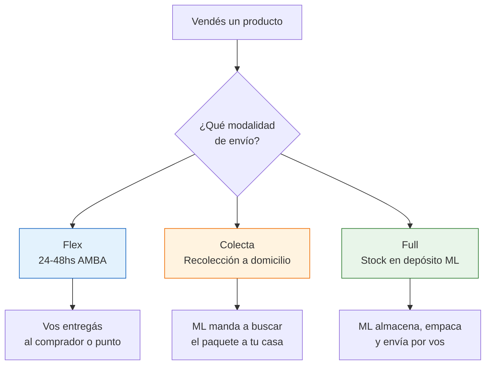
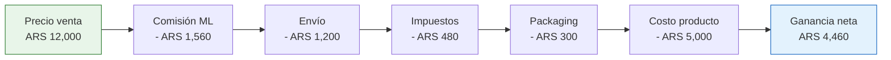

# Vender en MercadoLibre — Guía completa

> MercadoLibre es tu primer canal de ventas. Con más de 20 millones de compradores activos en Argentina, es el lugar donde **más rápido** vas a validar tu producto y generar tus primeras ventas.

## Por qué MercadoLibre primero

No necesitás invertir en publicidad, no necesitás tener una marca conocida, y no necesitás un local. MercadoLibre ya tiene los compradores; vos solo tenés que poner el producto.

| Ventaja | Detalle |
|---------|---------|
| **Tráfico masivo** | +20 millones de compradores activos en Argentina |
| **MercadoPago integrado** | Cobrás con tarjeta, transferencia, efectivo — sin gestionar nada |
| **MercadoEnvíos** | Logística resuelta: Correo Argentino, Andreani, Flex |
| **Confianza del comprador** | El comprador confía en ML, no necesita conocer tu marca |
| **Sin inversión en marketing** | Los compradores ya están buscando tu producto |

<Note>
MercadoLibre cobra comisiones (las detallamos abajo), pero a cambio te da acceso a millones de compradores sin que gastes un peso en publicidad. Para arrancar, es la mejor relación costo-beneficio que existe.
</Note>

## Crear tu cuenta vendedora

<Steps>
  <Step title="Registrarte en MercadoLibre">
    Entrá a [mercadolibre.com.ar](https://www.mercadolibre.com.ar) y creá una cuenta. Usá tu nombre real — vas a necesitar verificar identidad.
  </Step>
  <Step title="Verificar tu identidad">
    MercadoLibre te va a pedir DNI y selfie. Hacelo de inmediato porque sin verificación no podés publicar. Demora entre 24 y 72 horas.
  </Step>
  <Step title="Vincular MercadoPago">
    Asociá tu cuenta bancaria o CBU/CVU para poder cobrar. También necesitás tener tu CUIT cargado con monotributo activo para facturar.
  </Step>
  <Step title="Configurar datos fiscales">
    En la sección "Mi cuenta > Datos fiscales", cargá tu CUIT y condición fiscal (Monotributista o Responsable Inscripto). Esto es obligatorio para operar.
  </Step>
  <Step title="Crear tu primera publicación">
    Elegí la categoría correcta, subí fotos, escribí título y descripción. Más abajo te explicamos cómo hacer una publicación que venda.
  </Step>
</Steps>

## Tipos de publicación y comisiones

MercadoLibre tiene dos tipos principales de publicación. La diferencia está en la visibilidad y la comisión que pagás:

| Característica | Clásica | Premium |
|---------------|---------|---------|
| **Comisión por venta** | ~13% | ~18-19% |
| **Visibilidad** | Normal | Máxima (aparece primero) |
| **Cuotas sin interés** | No incluidas | Sí, hasta 12 cuotas |
| **Publicidad ML** | No | Tu producto se promociona automáticamente |
| **Envío gratis** | Opcional (lo pagás vos) | Envío gratis obligatorio (lo subsidiás vos) |

<Tip>
**Para empezar, usá publicación Clásica.** La comisión es menor y hasta que no tengas reputación, la diferencia de visibilidad no es tan grande. Cuando tengas ventas consistentes, probá Premium en tus productos estrella.
</Tip>

<Warning>
Las comisiones son aproximadas y pueden variar. MercadoLibre actualiza sus tarifas periódicamente. Siempre verificá la comisión actual en la sección "Costos de vender" dentro de tu cuenta. Valores de referencia: febrero 2026.
</Warning>

## MercadoEnvíos: cómo funciona cada modalidad

<Tabs>
  <Tab title="Flex (AMBA)">
    **Qué es:** Vos entregás el producto al comprador o a un punto de entrega cercano, dentro de las 24-48 horas.

    **Para quién:** Vendedores en AMBA (Capital Federal y Gran Buenos Aires) con volumen bajo-medio.

    **Ventajas:** Envío rápido, mejor reputación, sin costo de operador logístico.

    **Desventaja:** Tenés que moverte vos o contratar un cadete. Limitado a zona AMBA.
  </Tab>
  <Tab title="Colecta">
    **Qué es:** MercadoLibre manda a buscar el paquete a tu domicilio. Vos solo lo tenés empaquetado y listo.

    **Para quién:** Vendedores con volumen medio que no quieren ir a una sucursal.

    **Ventajas:** No salís de tu casa. El operador pasa a retirar.

    **Desventaja:** Tiene horarios fijos de recolección. Si no estás, perdés el pickup y afecta tu reputación.
  </Tab>
  <Tab title="Full">
    **Qué es:** Enviás tu stock al depósito de MercadoLibre. Ellos almacenan, empaquetan y envían cada pedido.

    **Para quién:** Vendedores con volumen alto y productos que se mueven rápido.

    **Ventajas:** No manejás logística, envío ultra rápido (24hs), etiqueta "FULL" que mejora conversión.

    **Desventaja:** ML cobra almacenamiento. Si el producto no rota, te come las ganancias. Requiere volumen mínimo.
  </Tab>
</Tabs>

## Cómo crear publicaciones que vendan

Una buena publicación en MercadoLibre tiene tres pilares: **fotos, título y descripción**.

### Fotos profesionales

- Usá fondo blanco — un cartón blanco o una sábana sirven al principio
- Mínimo 5 fotos: frente, dorso, detalle, escala (al lado de un objeto conocido), producto en uso
- Buena iluminación natural — sacá fotos cerca de una ventana durante el día
- Resolución mínima: 1200 x 1200 píxeles

### Título optimizado

El título es lo que aparece en los resultados de búsqueda. Tiene que incluir **palabras clave** que el comprador usaría para buscar.

**Fórmula:** `[Producto] + [Característica principal] + [Material/Tamaño] + [Uso]`

**Ejemplo bueno:** "Organizador Escritorio Madera Bambú 5 Compartimentos Oficina"

**Ejemplo malo:** "Hermoso organizador para tu escritorio!!"

### Descripción completa

- Listá **todas** las especificaciones: medidas, peso, material, colores disponibles
- Respondé las preguntas frecuentes antes de que las hagan
- Incluí información de garantía y cambios
- Usá viñetas, no párrafos largos

<Note>
Respondé las preguntas de los compradores en menos de 1 hora. Las respuestas rápidas mejoran tu posición en los resultados de búsqueda y generan más ventas.
</Note>

## Sistema de reputación

Tu reputación en MercadoLibre se construye con cada venta y determina cuánta visibilidad tienen tus publicaciones.

| Color | Significado | Requisito |
|-------|------------|-----------|
| Sin color | Vendedor nuevo | 0-9 ventas |
| Verde claro | Buena reputación | +10 ventas, pocas quejas |
| Verde | Muy buena | +50 ventas, excelentes métricas |
| Verde oscuro | MercadoLíder | +100 ventas, métricas excelentes sostenidas |

<Warning>
**Los primeros 60 días son críticos.** MercadoLibre evalúa tu desempeño inicial con más rigor. Un reclamo o envío tardío en este período tiene un impacto mucho mayor que después. Priorizá la experiencia del comprador por sobre todo durante los primeros 2 meses.
</Warning>

### Métricas que cuidan tu reputación

- **Tiempo de despacho:** Enviá dentro de las 24 horas de la venta
- **Reclamos:** Mantené menos del 2% de reclamos sobre ventas totales
- **Cancelaciones:** No canceles ventas — afecta gravemente tu reputación
- **Mensajes:** Respondé en menos de 12 horas (ideal: menos de 1 hora)

## Cuánto te queda realmente: desglose de costos

Acá es donde la mayoría de los nuevos vendedores se sorprenden. Hay que calcular **todos** los costos para saber tu ganancia real.

### Ejemplo práctico con números

<Note>
Valores aproximados a febrero 2026. Los costos de MercadoLibre, impuestos y envío varían. Usá estos números como referencia para hacer tus propios cálculos.
</Note>

| Concepto | Monto |
|----------|-------|
| **Precio de compra a fábrica** | ARS 5,000 |
| **Precio de venta en ML** | ARS 12,000 |
| **Comisión ML (Clásica ~13%)** | - ARS 1,560 |
| **Costo de envío (si lo subsidiás)** | - ARS 1,200 |
| **Impuestos sobre la venta (~3-5% según condición)** | - ARS 480 |
| **Packaging (caja, cinta, relleno)** | - ARS 300 |
| **= Ganancia neta por unidad** | **ARS 4,460** |

Eso es un **margen neto de ~37%** sobre el precio de venta, o una ganancia del **~89% sobre tu costo**.

<Tip>
Antes de publicar un producto, hacé siempre esta cuenta. Si el margen neto es menor al 25%, probablemente no sea rentable después de considerar devoluciones, productos fallados y tu tiempo.
</Tip>

## Errores comunes al empezar

<Accordion title="Los 5 errores más frecuentes en MercadoLibre">
1. **No calcular comisiones antes de poner el precio** — Muchos ponen un precio y después descubren que no les queda ganancia.
2. **Fotos con el celular sin cuidar iluminación** — Una foto oscura o borrosa mata la venta. No necesitás cámara profesional, pero sí buena luz.
3. **Título sin palabras clave** — "Producto genial!!!" no aparece en ninguna búsqueda. Usá términos que la gente busca.
4. **No responder preguntas rápido** — Cada pregunta sin responder es una venta perdida que se fue a la competencia.
5. **Cancelar ventas** — Si no tenés stock, pausá la publicación. Cancelar ventas destruye tu reputación.
</Accordion>

## Siguiente paso

Una vez que tengas ventas consistentes en MercadoLibre, es momento de complementar con [tu propia tienda online](/app/paso1-argentina/empezar-de-cero/tienda-online) para reducir comisiones y construir tu marca.
