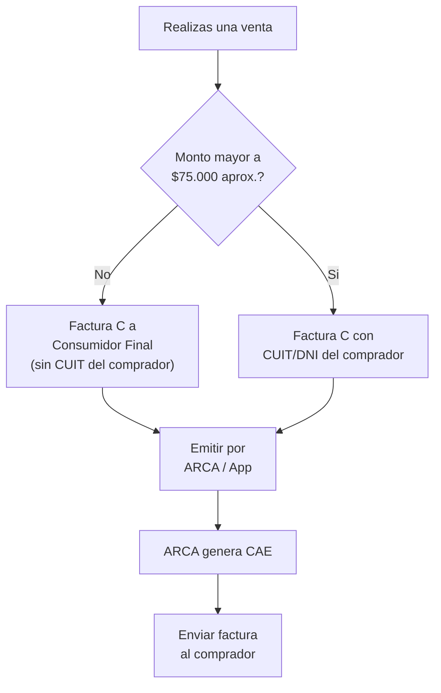

# Facturacion basica para principiantes

> Si nunca emitiste una factura en tu vida, esta guia es para vos. Vas a aprender que son, como hacerlas y por que es **indispensable** facturar desde el dia uno.

## Por que facturar es obligatorio (y no negociable)

<Warning>
**Factura SIEMPRE, desde la primera venta.** ARCA (ex-AFIP) cruza datos con MercadoLibre, bancos, billeteras virtuales (Mercado Pago, Ualá, etc.) y tarjetas de credito. Si detecta ventas sin facturar, las consecuencias son:
- **Multas** por emision de comprobantes (pueden superar los $500.000)
- **Exclusion del Monotributo** de oficio
- **Bloqueo de tu CUIT** (no podes operar comercialmente)
- **Causas penales** por evasion si los montos son significativos

No existe el "cuando crezca facturo". Si vendes, facturas. Punto.
</Warning>

## Tipos de facturas

Dependiendo de tu condicion fiscal, emitis un tipo de factura diferente:

| Tipo | Quien la emite | A quien | Cuando usarla |
|------|---------------|---------|---------------|
| **Factura C** | Monotributista | Cualquier comprador | **Esta es la tuya si sos Monotributista** |
| Factura B | Responsable Inscripto | Consumidor final o Monotributista | No aplica si sos Monotributista |
| Factura A | Responsable Inscripto | Otro Responsable Inscripto | No aplica si sos Monotributista |

<Tip>
Como Monotributista, solo vas a emitir **Factura C**. No importa si tu comprador es consumidor final, Monotributista o Responsable Inscripto: siempre emitis Factura C. Esto simplifica muchisimo tu vida.
</Tip>

### Que datos lleva una Factura C

Toda factura electronica que emitas debe incluir:

| Campo | Descripcion | Ejemplo |
|-------|-------------|---------|
| **Datos del emisor** | Tu razon social (nombre y apellido), CUIT, domicilio fiscal, condicion ante IVA | "Juan Perez - CUIT 20-12345678-9 - Monotributista" |
| **Datos del receptor** | Nombre, CUIT o DNI, condicion ante IVA del comprador | "Consumidor Final - DNI 40.123.456" |
| **Numero de comprobante** | Punto de venta + numero correlativo | 00001-00000001 |
| **Fecha de emision** | Fecha en que se emite la factura | 21/02/2026 |
| **Descripcion** | Detalle de lo que vendiste (producto o servicio) | "Set de brochas de maquillaje x10 unidades" |
| **Importe total** | Monto total de la operacion | $25.000 |
| **CAE** | Codigo de Autorizacion Electronico (lo genera ARCA automaticamente) | 73041230487652 |
| **Vencimiento del CAE** | Fecha limite de validez del comprobante | 03/03/2026 |

<Note>
El **CAE** (Codigo de Autorizacion Electronico) es lo que hace que tu factura sea valida. Lo genera ARCA automaticamente cuando emitis el comprobante a traves de cualquier sistema autorizado. Sin CAE, el comprobante no tiene validez fiscal.
</Note>

## Como emitir facturas desde ARCA (Comprobantes en Linea)

ARCA ofrece un servicio gratuito llamado **Comprobantes en Linea** para emitir facturas electronicas directamente desde su portal.

<Steps>
  <Step title="Ingresa a ARCA con tu clave fiscal">
    Anda a [www.arca.gob.ar](https://www.arca.gob.ar) e ingresa con tu CUIT y clave fiscal nivel 3.
  </Step>
  <Step title="Busca el servicio 'Comprobantes en Linea'">
    En el buscador de servicios, escribi "Comprobantes en Linea" y accede al servicio. Si es la primera vez, tenes que darlo de alta (es inmediato y gratuito).
  </Step>
  <Step title="Configura tu punto de venta">
    La primera vez necesitas crear un **punto de venta**. Elegí tipo "Online" y asignale un numero (generalmente 00001). Este punto de venta queda asociado a tu CUIT.
  </Step>
  <Step title="Generar comprobante">
    Selecciona: tipo de comprobante (Factura C), punto de venta, datos del receptor (para montos menores a $75.000 aprox. podes poner "Consumidor Final" sin mas datos), descripcion del producto y monto.
  </Step>
  <Step title="Obtener el comprobante con CAE">
    ARCA genera el comprobante con su CAE. Podes descargarlo en PDF para enviarselo al comprador por email o WhatsApp.
  </Step>
</Steps>

<Warning>
Existe un monto limite (que ARCA actualiza periodicamente, ronda los $75.000 en febrero 2026) por debajo del cual podes facturar a "Consumidor Final" sin pedir CUIT ni DNI. **Por encima de ese monto, es obligatorio identificar al comprador con su CUIT o DNI.** Consulta el monto vigente en el portal de ARCA.
</Warning>

## Apps y herramientas de facturacion

Si bien Comprobantes en Linea de ARCA funciona, es bastante basico. Estas apps simplifican el proceso y ofrecen funciones adicionales:

| App / Herramienta | Costo mensual (Feb 2026 aprox.) | Ventajas | Ideal para |
|---|---|---|---|
| **Comprobantes en Linea (ARCA)** | Gratis | Oficial, sin costo | Pocas facturas por mes, empezar |
| **Facturante** | $5.000 - $15.000 (planes pagos) / Plan gratis limitado | Interfaz moderna, reportes, app movil | Monotributistas con volumen medio |
| **Tango Factura** | $8.000 - $20.000 | Integracion contable, multiusuario | Si tu contador usa Tango |
| **Haulmer / Colppy** | $6.000 - $18.000 | Gestion integral, stock | Negocios en crecimiento |
| **Facturacion MercadoLibre** | Incluida en la comision de ML | Automatica, sin esfuerzo | Ventas exclusivas en MercadoLibre |

<Tip>
Si recien empezas y no vendes mucho, usa **Comprobantes en Linea de ARCA** (gratis). Cuando tengas mas de 20-30 ventas por mes, conviene pasar a una app de facturacion que automatice el proceso.
</Tip>

## Facturacion automatica en MercadoLibre

MercadoLibre tiene un sistema de facturacion automatica que emite la factura por vos cada vez que se confirma una venta. Es la opcion mas comoda si vendes principalmente por esa plataforma.

### Como configurarlo

<Steps>
  <Step title="Ingresa a tu cuenta de MercadoLibre">
    Anda a [www.mercadolibre.com.ar](https://www.mercadolibre.com.ar) e ingresa a tu cuenta de vendedor.
  </Step>
  <Step title="Accede a la configuracion de facturacion">
    Anda a **Ventas > Facturacion** o busca "Facturacion electronica" en la configuracion de tu cuenta de vendedor.
  </Step>
  <Step title="Vincula tu CUIT y clave fiscal">
    MercadoLibre te pide que vincules tu CUIT y autorices la emision de comprobantes a traves de ARCA. Este paso requiere tu clave fiscal.
  </Step>
  <Step title="Configura el punto de venta">
    Asigna un punto de venta exclusivo para MercadoLibre (por ejemplo, 00002, si ya usas 00001 para Comprobantes en Linea). Esto te permite diferenciar las facturas de cada canal de venta.
  </Step>
  <Step title="Activa la facturacion automatica">
    Una vez configurado, MercadoLibre emite automaticamente una Factura C cada vez que se confirma una venta. El comprador recibe la factura en su email y vos la ves en tu panel de ventas.
  </Step>
</Steps>

<Note>
**MercadoLibre reporta toda tu facturacion a ARCA.** Esto no es opcional ni configurable. Por eso es fundamental que tu condicion fiscal en MercadoLibre coincida con tu situacion real ante ARCA. Si vendes en ML sin estar inscripto, ARCA va a detectar la inconsistencia.
</Note>

## Cuando emitir cada factura

La regla general es simple: **cada venta = una factura**. Pero hay situaciones especificas:

| Situacion | Que hacer |
|-----------|-----------|
| Venta por MercadoLibre | Factura automatica (si la configuraste) o manual dentro de 24hs |
| Venta por tu tienda online | Emitir factura C al confirmar la venta |
| Venta por Instagram / WhatsApp | Emitir factura C cuando el comprador paga |
| Venta en efectivo | Emitir factura C en el momento |
| Venta mayorista (muchas unidades) | Emitir factura C por el total de la operacion |
| Devolucion / cambio | Emitir Nota de Credito C para anular la factura original |

<Warning>
**Nunca dejes pasar mas de 10 dias** desde la fecha de la operacion para emitir la factura. ARCA permite un desfasaje de hasta 10 dias, pero lo ideal es facturar el mismo dia de la venta. Si facturas con mucho retraso, el CAE puede vencer o ARCA puede considerar que estas evadiendo.
</Warning>

## Notas de credito: como anular o corregir una factura

Si necesitas anular una venta (devolucion, error en el monto, etc.), **no podes "borrar" una factura**. Lo que tenes que hacer es emitir una **Nota de Credito C** que compensa la factura original.

| Situacion | Accion |
|-----------|--------|
| El comprador devuelve el producto | Emitir Nota de Credito C por el total |
| Te equivocaste en el monto | Emitir Nota de Credito C + nueva Factura C correcta |
| Devolucion parcial | Emitir Nota de Credito C por el monto parcial |

El proceso para emitir una Nota de Credito C es el mismo que para una factura, pero elegis "Nota de Credito C" como tipo de comprobante y referenciás la factura original.

## Preguntas frecuentes

<Accordion title="Que pasa si no facturo una venta en MercadoLibre?">
MercadoLibre reporta todas las ventas a ARCA. Si ARCA detecta que tuviste ingresos en tu cuenta de Mercado Pago pero no emitiste facturas por esos montos, te puede intimar, multar o excluir del Monotributo. La facturacion automatica de ML soluciona esto.
</Accordion>

<Accordion title="Puedo emitir una factura por varias ventas juntas?">
Tecnicamente si, pero no es recomendable. Cada venta deberia tener su propia factura. Si vendes al por mayor a un mismo comprador, podes hacer una factura por el total del pedido.
</Accordion>

<Accordion title="Necesito un punto de venta distinto para cada canal?">
No es obligatorio, pero es **muy recomendable**. Tener un punto de venta para MercadoLibre (00002), otro para tu tienda web (00003) y otro para ventas directas (00001) te permite llevar un control mucho mejor de cada canal.
</Accordion>

<Accordion title="Que pasa si el comprador no me pide factura?">
Tenes que emitirla igual. La obligacion de facturar no depende de que el comprador la pida. Podes emitir la factura a "Consumidor Final" si el comprador no te da sus datos fiscales y el monto esta dentro del limite.
</Accordion>

## Siguiente paso

<Tip>
Ya sabes facturar. Ahora revisa si tu tipo de negocio necesita alguna habilitacion especial en [Habilitaciones comerciales](/app/paso1-argentina/empezar-de-cero/habilitaciones-comerciales).
</Tip>
