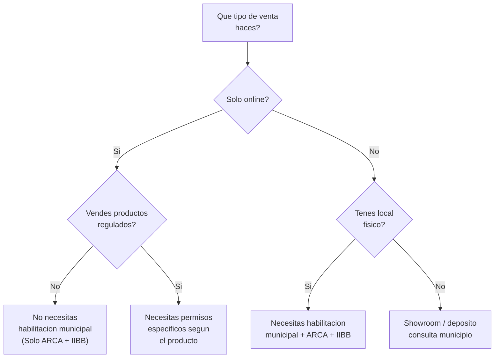

# Habilitaciones comerciales

> La buena noticia: si vendes **solo por internet**, en la mayoria de los casos **no necesitas habilitacion comercial municipal**. Pero hay excepciones importantes que tenes que conocer.

## Resumen rapido

<Tip>
**Recomendacion para principiantes:** empeza vendiendo **100% online** (MercadoLibre, tienda web, Instagram). Esto te permite arrancar sin el costo y la burocracia de habilitar un local fisico. Cuando el negocio crezca y justifique un local, en ese momento tramitas la habilitacion.
</Tip>

## Requisitos segun tipo de venta

<Tabs>
  <Tab title="Solo online">
    ### Venta exclusivamente por internet

    Si vendes **unicamente por internet** (MercadoLibre, tienda propia, redes sociales) y despachas desde tu domicilio particular:

    | Requisito | Necesario | Detalle |
    |-----------|-----------|---------|
    | Inscripcion en ARCA (Monotributo/RI) | Si | Ya lo tenes si seguiste los pasos anteriores |
    | Inscripcion en Ingresos Brutos | Si | Provincial, ya lo tramitaste |
    | Facturacion electronica | Si | Habilitada con tu alta en ARCA |
    | Habilitacion comercial municipal | **No** | No se requiere para venta online desde domicilio particular en la mayoria de los municipios |
    | Habilitacion bromatologica | Solo si vendes alimentos | Ver seccion "Productos regulados" |
    | Registro ANMAT | Solo si vendes cosmeticos/medicos | Ver seccion "Productos regulados" |

    <Note>
    **Excepcion:** Algunos municipios pueden requerir una habilitacion de "actividad economica en domicilio" si recibis clientes o proveedores con mucha frecuencia. En la practica, para un revendedor online que despacha por correo, esto no aplica. Consulta con tu municipio si tenes dudas.
    </Note>
  </Tab>
  <Tab title="Local fisico">
    ### Venta desde un local comercial

    Si alquilas o tenes un local donde atendes al publico, necesitas **habilitacion comercial municipal** obligatoria.

    | Requisito | Necesario | Costo aprox. (Feb 2026) |
    |-----------|-----------|-------------------------|
    | Inscripcion en ARCA | Si | Incluido en Monotributo |
    | Inscripcion en Ingresos Brutos | Si | Segun facturacion |
    | Habilitacion comercial municipal | **Si** | $30.000 - $150.000 (varia por municipio) |
    | Plano del local (si aplica) | Depende del municipio | $50.000 - $200.000 (honorarios profesional) |
    | Matafuegos habilitado | Si | $15.000 - $40.000 |
    | Libro de quejas | Si | $3.000 - $8.000 |
    | Cartel con datos fiscales | Si | Minimo (lo podes imprimir) |
    | Seguro de responsabilidad civil | Recomendable | $10.000 - $30.000/mes |

    **Tiempo estimado para obtener la habilitacion:** 2 a 8 semanas, dependiendo del municipio.

    <Warning>
    Operar un local **sin habilitacion municipal** puede resultar en clausura inmediata, multas significativas y decomiso de mercaderia. Las inspecciones municipales son frecuentes, especialmente en zonas comerciales.
    </Warning>
  </Tab>
  <Tab title="Online + local fisico">
    ### Venta por ambos canales

    Si vendes online y ademas tenes un local fisico, necesitas **todos los requisitos del local** mas la configuracion de facturacion para ambos canales.

    | Aspecto | Como manejarlo |
    |---------|---------------|
    | Facturacion | Usa puntos de venta separados: uno para el local, otro para online |
    | Ingresos Brutos | Si vendes online a todo el pais, necesitas Convenio Multilateral |
    | Habilitacion | Solo se requiere para el local fisico, no para la parte online |
    | Stock | Lleva control de stock unificado para evitar vender lo que no tenes |
    | Domicilio fiscal | Puede ser el local o tu casa, a tu eleccion |

    <Tip>
    Muchos revendedores arrancan 100% online, validan el negocio, y recien despues abren un local cuando ya tienen flujo de clientes y proveedores establecidos. No te apures a alquilar un local.
    </Tip>
  </Tab>
</Tabs>

## Habilitaciones que ya tenes con el Monotributo

Al inscribirte en Monotributo y dar de alta la facturacion electronica (pasos que cubrimos en las paginas anteriores), **ya tenes automaticamente**:

| Habilitacion | Que te permite |
|-------------|----------------|
| CUIT activo | Operar comercialmente a nivel nacional |
| Facturacion electronica | Emitir comprobantes fiscales validos (Factura C) |
| Monotributo activo | Estar al dia con tus obligaciones impositivas nacionales |
| Ingresos Brutos | Operar en tu provincia (o multiples provincias con Convenio Multilateral) |

Con estos cuatro elementos, **ya podes vender online legalmente** cualquier producto que no requiera permisos especiales.

## Productos que SI requieren habilitacion especial

No todo se puede revender libremente. Algunos productos tienen regulaciones especificas que necesitas cumplir **antes** de empezar a venderlos:

| Categoria | Organismo regulador | Que necesitas | Dificultad | Costo aprox. |
|-----------|-------------------|---------------|------------|--------------|
| **Alimentos envasados** | Bromatologia municipal/provincial + ANMAT | Registro de establecimiento + RNE/RNPA | Alta | $50.000 - $300.000+ |
| **Cosmeticos** | ANMAT | Registro de producto (DJC) | Media-Alta | $80.000 - $500.000+ por producto |
| **Suplementos dietarios** | ANMAT | Registro como suplemento | Alta | $100.000 - $400.000+ |
| **Productos medicos/sanitarios** | ANMAT | Registro de producto medico | Muy Alta | Variable, alto |
| **Productos electricos (220V)** | INTI / Seguridad electrica | Certificado de seguridad | Media | $50.000 - $200.000 |
| **Juguetes** | Seguridad de productos | Certificacion de seguridad | Media | $30.000 - $150.000 |
| **Productos quimicos / limpieza** | Ministerio de Salud | Registro de producto | Media-Alta | $40.000 - $200.000 |
| **Medicamentos** | ANMAT | Habilitacion farmaceutica | Muy Alta | No viable para principiantes |

<Warning>
**No todo se puede revender.** Los productos regulados (alimentos, cosmeticos, medicamentos, productos electricos que se enchufan a 220V) requieren permisos especificos que pueden ser costosos y lentos de obtener. Si estas empezando, **evita estas categorias** hasta tener experiencia y capital para cumplir con las regulaciones.
</Warning>

### Alimentos: bromatologia

Si queres revender alimentos (incluso envasados de terceros), necesitas:

<Steps>
  <Step title="Registro Nacional de Establecimiento (RNE)">
    Tu local o deposito debe estar habilitado por la autoridad bromatologica de tu municipio o provincia. Incluso si operas desde tu casa, necesitas esta habilitacion si manipulas o almacenas alimentos.
  </Step>
  <Step title="Registro Nacional de Producto Alimenticio (RNPA)">
    Cada producto alimenticio que vendas debe tener un RNPA vigente. Si revendes marcas ya registradas, el RNPA es del fabricante. Si importas o creas tu propia marca, necesitas tramitar el RNPA vos.
  </Step>
  <Step title="Cumplir normas de almacenamiento">
    Temperatura controlada (si aplica), separacion de productos, limpieza, rotulado correcto en español con fecha de vencimiento, ingredientes y datos del responsable.
  </Step>
</Steps>

<Note>
Si revendes alimentos **envasados de marcas que ya tienen RNPA** (por ejemplo, compras alfajores a una fabrica habilitada y los revendes), el proceso es mas simple porque el registro del producto ya existe. Pero igualmente necesitas el RNE para tu establecimiento si almacenas los productos.
</Note>

### Cosmeticos y cuidado personal: ANMAT

Los cosmeticos se clasifican en dos grados de riesgo:

| Grado | Productos | Tramite | Tiempo aprox. |
|-------|-----------|---------|--------------|
| **Grado 1** (menor riesgo) | Jabones, shampoo, acondicionador, perfumes, maquillaje basico | DJC simplificada | 30-60 dias |
| **Grado 2** (mayor riesgo) | Protectores solares, tintura de pelo, desodorantes, repelentes | Registro completo ANMAT | 90-180 dias |

<Tip>
Si queres vender productos de belleza, empeza por los **accesorios** (brochas, esponjas, organizadores) que **no requieren ANMAT** por no ser cosmeticos en si mismos. Son la puerta de entrada ideal al rubro.
</Tip>

### Productos electricos: seguridad

Todo producto que se conecte a la red electrica (220V) en Argentina necesita un **certificado de seguridad electrica**. Esto incluye:

- Cargadores de celular con enchufe argentino
- Lamparas y luminarias
- Electrodomesticos pequeños (planchas, secadores de pelo, etc.)
- Adaptadores y zapatillas electricas

Los productos que funcionan con **bateria o USB** (auriculares Bluetooth, luces LED USB, power banks) generalmente **no requieren** esta certificacion.

## Productos seguros para empezar sin habilitaciones especiales

<CardGroup cols={2}>
  <Card title="Accesorios de moda" icon="shirt">
    Bijouteria, bolsos, mochilas, carteras, gorras, bufandas. Sin regulacion especial.
  </Card>
  <Card title="Bazar y hogar" icon="house">
    Organizadores, utensilios de cocina (no electricos), decoracion, velas, portarretratos.
  </Card>
  <Card title="Papeleria y oficina" icon="pen">
    Cuadernos, agendas, stickers, washi tape, organizadores de escritorio.
  </Card>
  <Card title="Accesorios tecnologia" icon="mobile">
    Fundas de celular, soportes, cables, protectores de pantalla. Sin regulacion si no se enchufan a 220V.
  </Card>
</CardGroup>

## Preguntas frecuentes

<Accordion title="Puedo vender ropa sin ninguna habilitacion?">
Si, la ropa no requiere habilitacion especial para su venta. Solo necesitas estar inscripto fiscalmente (ARCA + IIBB) y facturar. Si la importas, los textiles requieren certificacion INTI en la aduana, pero eso es un tramite de importacion, no una habilitacion comercial.
</Accordion>

<Accordion title="Necesito alguna habilitacion para vender por MercadoLibre?">
No necesitas habilitacion comercial municipal. MercadoLibre te pide tener tu condicion fiscal configurada (CUIT, Monotributo o RI) y facturacion electronica activa. No exige habilitaciones municipales.
</Accordion>

<Accordion title="Que pasa si vendo un producto regulado sin habilitacion?">
Dependiendo del producto, las consecuencias van desde multas y decomiso de mercaderia hasta causas penales (especialmente con medicamentos o alimentos en mal estado). Las plataformas como MercadoLibre tambien pueden suspender tu cuenta si detectan productos regulados sin la documentacion correspondiente.
</Accordion>

<Accordion title="Puedo revender perfumes importados sin ANMAT?">
No. Los perfumes son cosmeticos Grado 1 y requieren registro ANMAT (DJC simplificada). Vender perfumes sin registro puede generar el decomiso del producto y multas. Ademas, muchos perfumes de marca tienen distribuidores exclusivos que pueden denunciar la venta no autorizada.
</Accordion>

<Accordion title="Y si vendo desde un deposito que no es local al publico?">
Si el deposito no atiende publico (solo almacenas y despachas), generalmente no necesita habilitacion comercial, pero si puede necesitar habilitacion de deposito dependiendo del municipio y del tipo de productos almacenados. Consulta con tu municipio.
</Accordion>

## Resumen: que necesitas segun tu caso

| Situacion | ARCA | IIBB | Habilitacion municipal | Permisos especiales |
|-----------|------|------|----------------------|---------------------|
| Venta online de accesorios/bazar | Si | Si | No | No |
| Venta online de ropa | Si | Si | No | No (INTI solo al importar) |
| Venta online de cosmeticos | Si | Si | No | Si (ANMAT) |
| Venta online de alimentos | Si | Si | Si (bromatologia) | Si (RNE/RNPA) |
| Local fisico de accesorios | Si | Si | Si | No |
| Local fisico de alimentos | Si | Si | Si | Si (bromatologia + RNE/RNPA) |

## Siguiente paso

<Tip>
Si seguiste toda esta seccion de "Empezar de Cero", ya tenes el panorama completo de los requisitos legales para tu negocio de reventa. El siguiente paso es armar tu infraestructura comercial: donde vender, como cobrar y como enviar. Consulta la seccion de [Infraestructura Comercial](/app/paso1-argentina/empezar-de-cero/ecommerce-mercadolibre).
</Tip>
