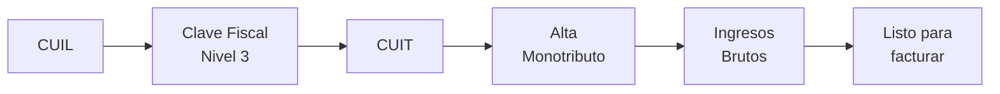
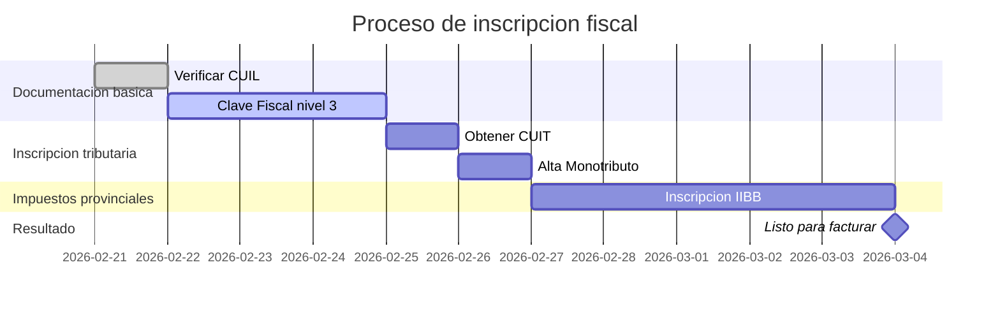

# Inscripcion fiscal paso a paso

> Todo el proceso para pasar de "no tengo nada" a "puedo facturar legalmente" en **1 a 2 semanas**. No necesitas experiencia previa ni contador (aunque siempre conviene tener uno).

## Panorama general del proceso

Antes de arrancar, asi se ve el camino completo:

| Etapa | Donde se tramita | Costo | Tiempo estimado |
|-------|-----------------|-------|-----------------|
| CUIL | ANSES (online) | Gratis | Ya lo tenes / 1 dia |
| Clave Fiscal nivel 3 | ARCA (online + verificacion) | Gratis | 1-3 dias |
| CUIT | ARCA (online) | Gratis | Inmediato |
| Alta Monotributo | ARCA (online) | Primera cuota mensual | Inmediato |
| Ingresos Brutos | ARBA / AGIP / DGR provincial | Gratis o tasa minima | 1-5 dias |

<Note>
**ARCA** es el nombre actual de la ex-AFIP (Agencia de Recaudacion y Control Aduanero). Todos los tramites fiscales nacionales se hacen a traves de su portal: [www.arca.gob.ar](https://www.arca.gob.ar). Si ves referencias a "AFIP" en internet, es lo mismo pero con el nombre anterior.
</Note>

## Paso 1 — Verificar tu CUIL

El CUIL (Codigo Unico de Identificacion Laboral) es tu numero de identificacion basico. Si tenes DNI argentino, **probablemente ya lo tenes asignado** aunque nunca hayas trabajado.

<Steps>
  <Step title="Verificar si ya tenes CUIL">
    Ingresa a [www.anses.gob.ar](https://www.anses.gob.ar) y busca "Constancia de CUIL". Ingresa tu numero de DNI y el sistema te muestra tu CUIL.
  </Step>
  <Step title="Si no tenes CUIL">
    En muy raros casos (extranjeros recien llegados, por ejemplo) necesitas tramitarlo presencialmente en una oficina de ANSES. Lleva DNI o pasaporte. El tramite es gratuito y se resuelve en el dia.
  </Step>
</Steps>

<Tip>
El CUIL tiene el formato **XX-XXXXXXXX-X** (por ejemplo, 20-12345678-9). Para mujeres generalmente empieza con 27, para hombres con 20. Lo vas a necesitar para todo lo que sigue.
</Tip>

## Paso 2 — Obtener Clave Fiscal nivel 3

La Clave Fiscal es tu "contraseña" para operar en el portal de ARCA. Tiene niveles de seguridad del 1 al 4. Para darte de alta como Monotributista necesitas **nivel 3 como minimo**.

### Opcion A: Por homebanking (mas rapido)

<Steps>
  <Step title="Ingresa a tu homebanking">
    Entra al homebanking de tu banco (Galicia, Santander, Macro, BBVA, etc.). La mayoria de los bancos argentinos tienen un servicio de vinculacion con ARCA.
  </Step>
  <Step title="Busca la opcion ARCA/AFIP">
    Generalmente esta en "Servicios" o "Tramites AFIP/ARCA". Cada banco lo ubica en un lugar distinto.
  </Step>
  <Step title="Genera tu clave fiscal">
    El banco verifica tu identidad (ya la verifico cuando abriste la cuenta) y te permite generar una clave fiscal nivel 3 directamente. El proceso tarda minutos.
  </Step>
</Steps>

### Opcion B: Presencialmente en oficina de ARCA

<Steps>
  <Step title="Saca turno online">
    Ingresa a [www.arca.gob.ar](https://www.arca.gob.ar) y saca turno para "Clave Fiscal - Blanqueo/Nuevo nivel". Elegi la dependencia de ARCA mas cercana a tu domicilio.
  </Step>
  <Step title="Asisti con documentacion">
    Lleva tu DNI original. Te toman una foto, verifican tu identidad biometrica y te asignan clave fiscal nivel 3 en el momento.
  </Step>
  <Step title="Registra tu email y celular">
    ARCA te va a pedir que registres un email y numero de celular para validacion en dos pasos. Usa un email que revises seguido.
  </Step>
</Steps>

<Warning>
**No pierdas tu clave fiscal.** Si la olvidas, tenes que hacer todo el proceso de blanqueo de nuevo (turno presencial o por homebanking). Anotala en un lugar seguro.
</Warning>

## Paso 3 — Obtener tu CUIT

El CUIT (Codigo Unico de Identificacion Tributaria) es tu numero fiscal. Es distinto al CUIL aunque tiene el mismo formato. Lo necesitas para facturar, operar comercialmente y hacer cualquier tramite impositivo.

<Steps>
  <Step title="Ingresa al portal de ARCA">
    Con tu clave fiscal nivel 3, ingresa a [www.arca.gob.ar](https://www.arca.gob.ar) y anda al servicio "Inscripcion / Modificacion de datos".
  </Step>
  <Step title="Completa el formulario de inscripcion">
    Ingresa tus datos personales, domicilio fiscal (puede ser tu casa) y actividades economicas. El sistema te genera el CUIT automaticamente.
  </Step>
  <Step title="Elegir actividad economica">
    Usa el codigo CLAE (Clasificador de Actividades Economicas). Para venta online de productos:

    | Codigo CLAE | Descripcion | Cuando usarlo |
    |-------------|-------------|---------------|
    | **479101** | Venta al por menor por internet | **Recomendado** — cubre MercadoLibre, tienda propia, redes sociales |
    | 477490 | Venta al por menor de articulos varios n.c.p. | Si tambien vendes en un local fisico |
    | 464110 | Venta al por mayor de articulos de uso domestico | Si vendes al por mayor |

    Podes tener **mas de una actividad** registrada. Empeza con 479101 y agrega otras despues si las necesitas.
  </Step>
</Steps>

<Note>
**Tu domicilio fiscal puede ser tu casa.** No necesitas un local comercial ni una oficina. El domicilio fiscal es simplemente la direccion donde ARCA te va a enviar notificaciones. Si te mudas, tenes que actualizarlo.
</Note>

## Paso 4 — Alta de Monotributo

<Steps>
  <Step title="Acceder al servicio Monotributo">
    Desde el portal de ARCA, busca el servicio "Monotributo - Adhesion". Tambien podes acceder desde [monotributo.arca.gob.ar](https://monotributo.arca.gob.ar).
  </Step>
  <Step title="Elegir categoria">
    El sistema te muestra las categorias disponibles. Para empezar, elegi **categoria A** (si estimas facturar poco los primeros meses) o **categoria B** (si ya tenes ventas proyectadas). Podes recategorizarte despues.
  </Step>
  <Step title="Elegir obra social">
    Selecciona una obra social del listado. Si ya tenes obra social por un empleo en relacion de dependencia, podes unificar aportes para mejorar tu plan. Podes cambiar de obra social una vez al año.
  </Step>
  <Step title="Confirmar domicilio y actividad">
    Verifica que el domicilio fiscal y la actividad economica sean correctos (los cargaste en el paso anterior al obtener el CUIT).
  </Step>
  <Step title="Generar primer pago">
    El sistema genera tu primera obligacion de pago (VEP). Podes configurar debito automatico desde tu cuenta bancaria para no olvidarte ningún mes.
  </Step>
</Steps>

<Tip>
**Configura debito automatico** desde el dia uno. Si te olvidas de pagar una cuota, ARCA te puede excluir del Monotributo despues de 10 meses consecutivos sin pago. El debito automatico te saca esa preocupacion.
</Tip>

## Paso 5 — Inscripcion en Ingresos Brutos

Ingresos Brutos (IIBB) es un **impuesto provincial** que se cobra sobre tu facturacion. No esta incluido en la cuota del Monotributo. Tenes que inscribirte en la provincia donde tenes tu domicilio fiscal.

<Tabs>
  <Tab title="Vendes solo en tu provincia">
    Inscribite como **contribuyente local** en el organismo de rentas de tu provincia:

    | Provincia | Organismo | Portal |
    |-----------|-----------|--------|
    | Buenos Aires (provincia) | ARBA | [www.arba.gob.ar](https://www.arba.gob.ar) |
    | CABA | AGIP | [www.agip.gob.ar](https://www.agip.gob.ar) |
    | Cordoba | DGR Cordoba | [www.rentascordoba.gob.ar](https://www.rentascordoba.gob.ar) |
    | Santa Fe | API Santa Fe | [www.santafe.gob.ar/api](https://www.santafe.gob.ar/api) |
    | Mendoza | ATM | [www.atm.mendoza.gov.ar](https://www.atm.mendoza.gov.ar) |
    | Otras provincias | Consulta "Rentas + [tu provincia]" | Varia |

    La alicuota tipica para venta minorista oscila entre **1.5% y 5%** de la facturacion, segun la provincia y la actividad.
  </Tab>
  <Tab title="Vendes a todo el pais (MercadoLibre, tienda online)">
    Si vendes online y tus compradores estan en **multiples provincias**, necesitas inscribirte en **Convenio Multilateral**. Este regimen distribuye el impuesto proporcionalmente entre las provincias donde operas.

    El tramite se hace a traves de COMARB (Comision Arbitral del Convenio Multilateral): [www.comarb.gob.ar](https://www.comarb.gob.ar).

    **Pasos:**
    1. Inscribite en COMARB con tu CUIT y clave fiscal
    2. Declara las jurisdicciones donde tenes actividad (donde vendes)
    3. Presenta la declaracion jurada mensual (formulario CM05)
    4. Paga el impuesto en cada jurisdiccion segun el coeficiente correspondiente

    <Warning>
    Si vendes por MercadoLibre a todo el pais, **Convenio Multilateral es practicamente obligatorio**. Muchos emprendedores ignoran esto y despues reciben intimaciones de provincias donde vendieron sin estar inscriptos. Consulta con tu contador para inscribirte correctamente desde el inicio.
    </Warning>
  </Tab>
</Tabs>

## Timeline completo

<Note>
**Tiempo total estimado: 1 a 2 semanas.** La mayor demora suele ser obtener la clave fiscal nivel 3 si no tenes homebanking (necesitas turno presencial). Con homebanking, podes tener todo listo en 3-5 dias.
</Note>

## Documentos que vas a necesitar

| Documento | Para que | Donde obtenerlo |
|-----------|----------|-----------------|
| DNI (frente y dorso) | Todos los tramites | Ya lo tenes |
| CUIL | Identificacion laboral | ANSES (online) |
| Comprobante de domicilio | Domicilio fiscal | Servicio a tu nombre (luz, gas, internet) |
| CBU bancario | Debito automatico Monotributo | Tu banco |
| Email y celular verificados | Clave fiscal ARCA | Personal |

## Errores comunes a evitar

<Accordion title="No inscribirme en Ingresos Brutos">
Muchos emprendedores se inscriben en Monotributo pero se olvidan de Ingresos Brutos. IIBB es un impuesto aparte y es **obligatorio**. Las provincias cruzan datos con ARCA y MercadoLibre. Si no estas inscripto, te van a llegar intimaciones con intereses y multas.
</Accordion>

<Accordion title="Elegir una categoria de Monotributo demasiado baja">
Si te inscribis en categoria A pero facturas como categoria D, ARCA te recategoriza de oficio y te cobra la diferencia con intereses. Es mejor estimar tu facturacion de forma realista y elegir la categoria que corresponda.
</Accordion>

<Accordion title="No actualizar datos cuando me mudo">
Si cambias de domicilio, tenes que actualizar tu domicilio fiscal en ARCA. Las notificaciones de ARCA se consideran validas si las envian a tu domicilio fiscal registrado, aunque ya no vivas ahi.
</Accordion>

<Accordion title="Usar el codigo CLAE incorrecto">
Elegir una actividad economica incorrecta puede generar problemas con la alicuota de Ingresos Brutos o con retenciones. Asegurate de usar 479101 (venta minorista por internet) si vas a vender online.
</Accordion>

## Siguiente paso

<Tip>
Ya estas inscripto fiscalmente. Ahora aprende a emitir facturas en [Facturacion basica para principiantes](/app/paso1-argentina/empezar-de-cero/facturacion-basica).
</Tip>
