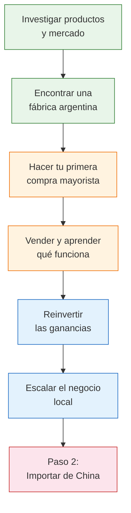

# Paso 1 — Empezar con fábricas argentinas

> Antes de pensar en China, aprendé el negocio comprando productos de **fábricas argentinas** y revendiéndolos. Es el camino más seguro, más barato y más inteligente para arrancar desde cero.

## La idea central

Muchas personas quieren importar desde China pero no tienen experiencia vendiendo ni un solo producto. El resultado: pierden plata, tiempo y motivación.

**La estrategia de esta guía es diferente:**

1. **Paso 1** — Comprás de fábricas argentinas y aprendés a vender
2. **Paso 2** — Cuando ya sabés vender, importás desde China con mejores márgenes

<Note>
No estás "perdiendo tiempo" comprando local. Estás **construyendo las bases** que van a hacer que tu importación desde China sea exitosa. Cada peso que invertís en Paso 1 es aprendizaje directo.
</Note>

## Tu recorrido completo

Así se ve el camino desde cero hasta importar:

## Qué vas a aprender en esta sección

<Steps>
  <Step title="Requisitos legales mínimos">
    Qué necesitás para operar legalmente: monotributo, facturación y habilitaciones básicas. Sin abogados ni trámites complicados.
  </Step>
  <Step title="Infraestructura comercial">
    Cómo armar tu canal de venta (MercadoLibre, tienda online), gestionar envíos y manejar la contabilidad básica.
  </Step>
  <Step title="Modelo de negocio">
    Cómo funciona el negocio de comprar mayorista y revender: márgenes, precios, canales de venta y reinversión.
  </Step>
  <Step title="Encontrar fábricas">
    Dónde y cómo encontrar fábricas argentinas que vendan por mayor, cómo contactarlas y negociar tu primera compra.
  </Step>
</Steps>

## Qué necesitás para empezar

La buena noticia: **muy poco**.

| Recurso | Mínimo necesario | Ideal |
|---------|-----------------|-------|
| **Capital** | ARS 50,000 (~USD 40) | ARS 200,000 (~USD 160) |
| **Experiencia previa** | Ninguna | Cualquier experiencia vendiendo |
| **Espacio físico** | Un rincón de tu casa | Un ambiente dedicado |
| **Tiempo disponible** | 2-3 horas por día | 4-6 horas por día |
| **Conocimiento técnico** | Saber usar un celular | Manejo básico de planillas |

<Tip>
Si tenés un celular con internet y ARS 50,000, ya podés empezar. No necesitás local, auto, ni empleados. Muchos emprendedores exitosos arrancaron vendiendo desde su living.
</Tip>

## Explorá cada tema

<CardGroup cols={2}>
  <Card title="Requisitos Legales" icon="scale-balanced" href="/app/paso1-argentina/empezar-de-cero/monotributo-vs-responsable-inscripto">
    Monotributo, inscripción fiscal, facturación y habilitaciones. Lo mínimo para operar en regla.
  </Card>
  <Card title="Infraestructura Comercial" icon="store" href="/app/paso1-argentina/empezar-de-cero/ecommerce-mercadolibre">
    MercadoLibre, tienda online, envíos, contabilidad y capital inicial. Todo lo que necesitás armado.
  </Card>
  <Card title="Modelo de Negocio" icon="money-bill" href="/app/paso1-argentina/empezar-de-cero/comprar-revender-margen">
    Cómo funciona comprar y revender: márgenes, precios, canales de venta y estrategia de reinversión.
  </Card>
  <Card title="Encontrar Fábricas" icon="magnifying-glass" href="/app/paso1-argentina/encontrar-fabricas/introduccion">
    Registros oficiales, directorios, búsqueda por zona, ferias industriales y contacto directo con fábricas.
  </Card>
</CardGroup>

## Errores que vamos a ayudarte a evitar

<Accordion title="Los 5 errores más comunes al arrancar">
1. **Comprar sin investigar el mercado** — Primero validá que hay demanda antes de gastar un peso.
2. **Empezar sin facturación** — MercadoLibre y los medios de pago requieren monotributo. Sin él, no podés cobrar.
3. **Invertir todo el capital en un solo producto** — Diversificá tu primera compra en 2-3 productos diferentes.
4. **No calcular TODOS los costos** — Incluí comisiones de MercadoLibre (~30%), envío, packaging y tu tiempo.
5. **Querer saltarse al Paso 2 sin experiencia** — Importar desde China sin saber vender es la receta para perder plata.
</Accordion>

<Warning>
**No saltes directamente a China.** El 70% de las personas que importan por primera vez sin experiencia previa en ventas terminan con mercadería acumulada que no pueden vender. Paso 1 existe para evitar exactamente eso.
</Warning>

## Siguiente paso

Empezá por entender [por qué las fábricas argentinas son tu mejor punto de partida](/app/paso1-argentina/empezar-de-cero/por-que-fabricas-argentinas) antes de avanzar con los requisitos legales.
