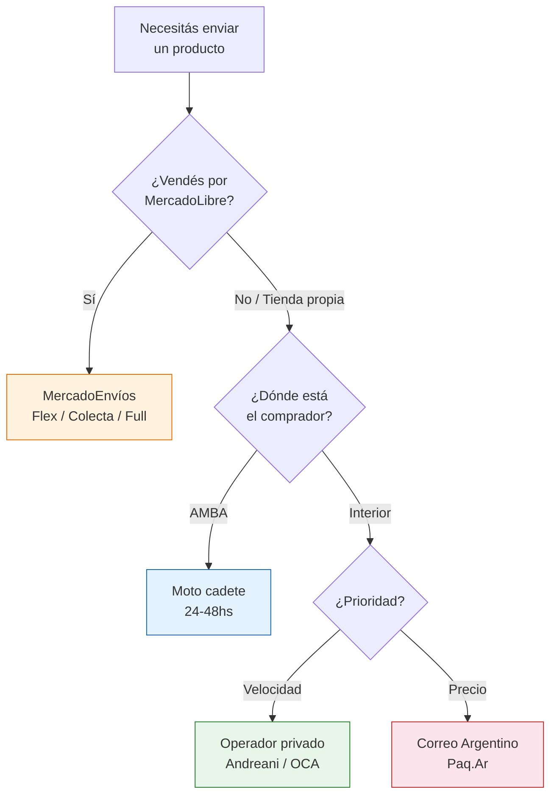

# Logística y envíos nacionales

> El envío es parte del negocio, no un problema aparte. Un envío rápido, bien embalado y con tracking genera recompras. Un envío lento, roto o sin seguimiento genera reclamos y mata tu reputación.

## Panorama general de opciones

Tenés cuatro grandes categorías de envío en Argentina, cada una con su momento ideal de uso:

## MercadoEnvíos (ventas por MercadoLibre)

Si vendés por MercadoLibre, usás MercadoEnvíos obligatoriamente (salvo excepciones). Ya cubrimos las modalidades en la [guía de MercadoLibre](/app/paso1-argentina/empezar-de-cero/ecommerce-mercadolibre), pero acá va el resumen operativo:

| Modalidad | Cómo funciona | Tiempo | Ideal para |
|-----------|--------------|--------|------------|
| **Flex** | Vos entregás en punto cercano o al comprador | 24-48hs | AMBA, volumen bajo |
| **Colecta** | ML manda a buscar a tu casa | 3-5 días | Volumen medio, no querés moverte |
| **Full** | Tu stock está en depósito de ML | 24hs | Volumen alto, productos que rotan rápido |

<Tip>
Si recién arrancás en MercadoLibre, usá **Colecta**. Es lo más simple: empaquetás, ML viene a buscar, y listo. No necesitás moverte ni coordinar entregas. Cuando crezcas, evaluá Full para tus productos estrella.
</Tip>

## Correo Argentino

El Correo Argentino es la opción más económica para envíos al interior del país. Tiene cobertura en todo el territorio nacional, incluyendo localidades pequeñas donde los operadores privados no llegan.

### Servicios principales

| Servicio | Descripción | Tiempo estimado | Tracking |
|----------|------------|-----------------|----------|
| **Paq.Ar** | Paquetería estándar | 5-10 días hábiles | Sí |
| **Sucursal a sucursal** | Retira el destinatario | 5-8 días hábiles | Sí |
| **Puerta a puerta** | Entrega en domicilio | 5-10 días hábiles | Sí |

### Costos aproximados (febrero 2026)

<Note>
Los costos de Correo Argentino se actualizan periódicamente. Estos valores son orientativos. Consultá la tarifa vigente en [correoargentino.com.ar](https://www.correoargentino.com.ar) antes de cotizar envíos.
</Note>

| Peso del paquete | AMBA | Hasta 500km | Más de 500km |
|-----------------|------|-------------|--------------|
| Hasta 1 kg | ~ARS 2,500-4,000 | ~ARS 3,500-5,500 | ~ARS 4,500-7,000 |
| 1-3 kg | ~ARS 4,000-6,000 | ~ARS 5,500-8,000 | ~ARS 7,000-10,000 |
| 3-5 kg | ~ARS 6,000-8,500 | ~ARS 8,000-11,000 | ~ARS 10,000-14,000 |

## Operadores privados: Andreani y OCA

Para envíos donde necesitás más velocidad, confiabilidad o servicio profesional, los operadores privados son la mejor opción.

<Tabs>
  <Tab title="Andreani">
    **Fortalezas:** Red amplia, buen tracking en tiempo real, servicio empresarial sólido.

    - Retiro a domicilio disponible (con costo adicional)
    - Entrega en sucursal o puerta a puerta
    - Seguro incluido en la mayoría de los servicios
    - Tiempo estimado: 2-5 días hábiles al interior

    **Cuándo usar:** Productos frágiles, envíos que necesitan tracking confiable, clientes exigentes.
  </Tab>
  <Tab title="OCA">
    **Fortalezas:** Muchas sucursales, buena cobertura, precios competitivos.

    - Servicio puerta a puerta y sucursal a sucursal
    - Pack OCA: cajas y embalaje estandarizado disponible en sucursales
    - Tiempo estimado: 2-5 días hábiles al interior

    **Cuándo usar:** Buen equilibrio precio-servicio, especialmente para paquetes medianos.
  </Tab>
  <Tab title="Via Cargo">
    **Fortalezas:** Especializado en paquetes grandes y pesados.

    - Ideal para productos de más de 5 kg
    - Cobertura nacional amplia
    - Precios competitivos para carga voluminosa

    **Cuándo usar:** Productos grandes o pesados que otros operadores cobran excesivamente.
  </Tab>
</Tabs>

## Envíos AMBA: moto cadetes

Para envíos dentro de Capital Federal y Gran Buenos Aires, los servicios de moto cadete son imbatibles en velocidad:

| Servicio | Costo aproximado (AMBA) | Tiempo | Tracking |
|----------|------------------------|--------|----------|
| **Pedidos Ya Envíos** | ~ARS 1,500-4,000 | 1-3 horas | Sí, en tiempo real |
| **Rappi** | ~ARS 1,500-4,000 | 1-3 horas | Sí, en tiempo real |
| **99envios** | ~ARS 1,200-3,000 | 2-4 horas | Sí |
| **Cadete propio/freelance** | ~ARS 2,000-5,000 | Acordado | No |

<Warning>
Los servicios de moto cadete son excelentes para AMBA pero **no tienen seguro robusto**. Si el producto vale más de ARS 50,000, usá un operador privado con seguro incluido. No arriesgues mercadería cara en un envío sin cobertura.
</Warning>

## Packaging: cómo embalar correctamente

Un buen embalaje no es un gasto, es una inversión. Un producto que llega roto es un reclamo, una devolución y una mala calificación.

### Materiales necesarios

| Material | Para qué | Dónde comprar | Costo aproximado |
|----------|---------|---------------|------------------|
| **Cajas de cartón** | Protección externa | Fabricantes de cajas, ML, Once | ~ARS 300-800 por unidad |
| **Papel burbuja** | Protección interna | Librerías mayoristas, ML | ~ARS 3,000-5,000 el rollo |
| **Cinta de embalar** | Cerrar cajas | Librerías, ferreterías | ~ARS 500-1,000 por rollo |
| **Papel kraft** | Relleno de espacios vacíos | Librerías mayoristas | ~ARS 1,500-3,000 el rollo |
| **Bolsas de polietileno** | Impermeabilizar | Fabricantes de bolsas, Once | ~ARS 2,000-4,000 x 100 |

### Reglas de embalaje

<Steps>
  <Step title="Proteger el producto">
    Envolvé el producto en papel burbuja. Si es frágil, usá doble capa. El producto nunca debe tocar directamente la pared de la caja.
  </Step>
  <Step title="Rellenar espacios vacíos">
    Un producto que se mueve dentro de la caja se rompe. Usá papel kraft arrugado, papel burbuja o foam para rellenar todo espacio vacío.
  </Step>
  <Step title="Impermeabilizar">
    Meté el producto envuelto dentro de una bolsa de polietileno antes de ponerlo en la caja. Los paquetes se mojan en tránsito.
  </Step>
  <Step title="Cerrar y reforzar">
    Sellá la caja con cinta de embalar en forma de H (centro + bordes). Si el paquete pesa más de 3 kg, reforzá las esquinas con cinta adicional.
  </Step>
  <Step title="Etiquetar correctamente">
    La etiqueta de envío debe ser legible y estar bien adherida. Poné "FRÁGIL" si aplica. Incluí una segunda etiqueta adentro de la caja por si la externa se pierde.
  </Step>
</Steps>

<Tip>
**Comprá packaging en cantidad.** Las cajas compradas de a 50-100 unidades salen hasta un 50% más baratas que comprarlas de a una. Buscá fabricantes de cajas en tu zona o comprá por mayor en Once/barrios comerciales.
</Tip>

## Tabla comparativa general

| Criterio | Correo Argentino | Andreani/OCA | Moto cadete | MercadoEnvíos |
|----------|-----------------|-------------|-------------|---------------|
| **Costo** | Bajo | Medio | Medio-Alto | Variable |
| **Velocidad** | Lenta (5-10 días) | Media (2-5 días) | Rápida (1-4 hs) | Variable por modalidad |
| **Tracking** | Básico | Bueno | Tiempo real | Bueno |
| **Cobertura** | Todo el país | Casi todo el país | Solo AMBA | Nacional (vía ML) |
| **Seguro** | Básico | Incluido | Limitado | Incluido |
| **Ideal para** | Interior, bajo costo | Confiabilidad | AMBA urgente | Ventas por ML |

## Consejos para optimizar costos de envío

<Accordion title="5 tips para reducir costos de envío">
1. **Negociá tarifas por volumen.** Cuando superes los 30-50 envíos mensuales, contactá a Andreani u OCA para pedir una cuenta corporativa con descuento. Podés conseguir 15-30% menos.
2. **Estandarizá tus cajas.** Usá 2-3 tamaños de caja que cubran todos tus productos. Comprar un solo tamaño en cantidad es más barato que tener 10 tamaños diferentes.
3. **Incluí el costo de envío en el precio.** "Envío gratis" vende más que un precio bajo + envío caro. Sumá el costo promedio de envío a tu precio de venta.
4. **Agrupá envíos.** Si un cliente compra varios productos, envialos juntos en un solo paquete. Ahorrás en envío y el cliente recibe todo junto.
5. **Evaluá puntos de despacho.** Enviar desde la sucursal del operador en vez de pedir retiro a domicilio suele ser más barato.
</Accordion>

<Note>
El costo de envío es parte de tu estructura de costos. Cuando calcules el margen de un producto, incluí siempre el costo promedio de envío. No lo trates como un gasto aparte; es tan importante como el costo del producto mismo.
</Note>

## Siguiente paso

Con la logística resuelta, necesitás alguien que te ayude con los números y los impuestos. Avanzá a [contador y contabilidad básica](/app/paso1-argentina/empezar-de-cero/contador-contabilidad).
