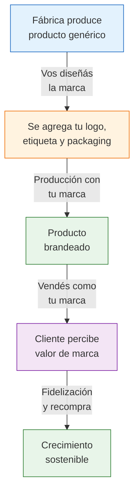

# Marca propia (private label)

> En private label o marca blanca, una fábrica produce el producto y vos le ponés **tu marca**. Es el camino para dejar de ser un revendedor más y construir un negocio con identidad, márgenes más altos y clientes fieles.

## ¿Qué es el private label?

El modelo de marca propia funciona así: encontrás una fábrica que produce un producto genérico (por ejemplo, carteras de cuero sintético), negociás para que le ponga **tu logo, tu etiqueta y tu packaging**, y lo vendés como un producto de tu marca.

<Note>
Private label no significa que vos fabricás. Significa que una fábrica produce **para vos** con tu marca. Esto es diferente de comprar productos ya fabricados y pegarles una etiqueta encima — lo ideal es que el branding sea parte del proceso de producción (grabado, estampado, cosido, etc.).
</Note>

## ¿Por qué marca propia y no reventa genérica?

| Aspecto | Reventa genérica | Marca propia |
|---------|-----------------|-------------|
| **Competencia** | Competís con todos los que venden lo mismo | Solo vos vendés tu marca |
| **Precio** | Lo marca el mercado (guerra de precios) | Vos ponés el precio (percepción de marca) |
| **Margen neto típico** | 25-40% | 35-60% |
| **Fidelización** | Baja (el cliente busca el más barato) | Alta (el cliente busca TU marca) |
| **Valor del negocio** | Solo vale tu stock | Vale la marca, la reputación, la cartera de clientes |
| **Barrera de entrada** | Ninguna (cualquiera puede revender lo mismo) | Alta (nadie más vende tu marca) |

## Fábricas argentinas que ya ofrecen private label

Muchas fábricas argentinas producen para terceros como parte de su negocio. Algunos ejemplos por rubro:

- **Marroquinería:** Fábricas como Madu ya ofrecen personalización en sus productos. Muchos talleres en Villa Crespo y Flores producen para marcas.
- **Bijouterie:** Talleres en el microcentro porteño y zona sur de GBA producen bajo pedido con marca del cliente.
- **Cosmética artesanal:** Laboratorios pequeños formulan y envasan con la marca del cliente (requiere habilitación ANMAT).
- **Textil:** Talleres de confección producen prendas con etiqueta propia del comprador.
- **Packaging y papelería:** Muchas imprentas producen packaging personalizado con tu marca.

<Tip>
Cuando visites o contactes fábricas, preguntá directamente: *"¿Hacen producción con marca de terceros?"* o *"¿Ofrecen servicio de personalización/branding?"* Muchas fábricas no lo publicitan pero lo hacen si se los pedís.
</Tip>

## Costo extra por branding

Agregar tu marca a un producto genérico tiene un costo adicional, que varía según el método:

| Método de branding | Costo extra por unidad (aprox.) | Ideal para |
|---|---|---|
| **Etiqueta cosida** | ARS 200-600 (~USD 0.16-0.50) | Indumentaria, marroquinería |
| **Grabado/estampado** | ARS 300-1,000 (~USD 0.25-0.83) | Cuero, metal, madera |
| **Packaging personalizado** | ARS 500-1,500 (~USD 0.40-1.25) | Cualquier producto |
| **Sublimación** | ARS 200-800 (~USD 0.16-0.66) | Textiles, tazas, accesorios |
| **Molde personalizado** | ARS 50,000-200,000 por molde (~USD 40-165) | Plásticos, inyección — se amortiza en unidades |

<Note>
El costo extra por branding típicamente representa un **10-30% adicional** sobre el precio base del producto genérico. Pero si ese branding te permite cobrar un 30-50% más al consumidor final, la inversión se recupera con creces.
</Note>

## Mínimos de producción para marca propia

Las fábricas que producen con tu marca generalmente piden pedidos mínimos más altos que una compra mayorista normal:

| Rubro | Mínimo típico para branding | Inversión estimada |
|-------|---------------------------|-------------------|
| **Bijouterie** | 50-100 unidades por diseño | ARS 50,000-150,000 (~USD 40-125) |
| **Marroquinería** | 30-50 unidades por modelo | ARS 150,000-400,000 (~USD 125-333) |
| **Indumentaria** | 50-200 unidades por talle/color | ARS 200,000-500,000 (~USD 165-416) |
| **Cosmética** | 100-500 unidades por producto | ARS 100,000-300,000 (~USD 83-250) |
| **Packaging** | 200-1,000 unidades | ARS 50,000-200,000 (~USD 40-165) |

## De producto genérico a marca propia: paso a paso

<Steps>
  <Step title="Validá el producto como revendedor primero">
    Antes de invertir en branding, vendé el producto genérico durante 2-3 meses. Confirmá que hay demanda, que el margen es bueno y que la calidad de la fábrica es consistente. No crees una marca para un producto que no sabés si se vende.
  </Step>
  <Step title="Diseñá tu identidad de marca">
    Necesitás al mínimo: nombre de marca, logo y paleta de colores. Podés contratar un diseñador freelance (ARS 30,000-80,000 / ~USD 25-66 aprox.) o usar herramientas como Canva para empezar. El nombre debe ser fácil de recordar, escribir y buscar.
  </Step>
  <Step title="Registrá la marca en INPI">
    El Instituto Nacional de la Propiedad Industrial (INPI) es donde registrás tu marca en Argentina. Es fundamental para proteger tu nombre y evitar que otros lo usen.
  </Step>
  <Step title="Encontrá una fábrica que haga personalización">
    Si tu fábrica actual no ofrece branding, buscá otra que sí lo haga. Pedí muestras con tu marca antes de hacer un pedido grande. Evaluá la calidad del acabado y la consistencia.
  </Step>
  <Step title="Negociá los términos de producción con marca">
    Definí: mínimo de unidades, costo por unidad con branding incluido, tiempo de producción, política de reposición, exclusividad (¿la fábrica puede vender lo mismo con otra marca?).
  </Step>
  <Step title="Hacé tu primer pedido brandeado">
    Empezá con el mínimo posible. Es preferible hacer un pedido chico, validar que todo esté bien (calidad del logo, del packaging, del producto) y después escalar.
  </Step>
  <Step title="Construí la presencia de marca">
    Creá publicaciones en MercadoLibre con el nombre de tu marca, armá redes sociales, diseñá un packaging que refuerce la identidad. El objetivo es que el cliente **recuerde tu marca** y la busque la próxima vez.
  </Step>
</Steps>

## Registro de marca en INPI

El registro de marca te da **exclusividad legal** sobre el nombre en Argentina por 10 años (renovable).

| Aspecto | Detalle |
|---------|---------|
| **Organismo** | INPI (Instituto Nacional de la Propiedad Industrial) |
| **Costo de solicitud** | ARS 10,000-15,000 aprox. (~USD 8-12) por clase |
| **Tiempo de tramitación** | 12-18 meses (pero podés usar la marca desde que presentás la solicitud) |
| **Duración de la protección** | 10 años, renovable |
| **Podés hacerlo solo** | Sí, el trámite es online en inpi.gob.ar. Pero un abogado de marcas (ARS 30,000-60,000 / ~USD 25-50 aprox.) reduce riesgos de rechazo |
| **Qué te da** | Derecho exclusivo a usar ese nombre/logo en la clase registrada en Argentina |

<Warning>
**Antes de registrar, buscá si el nombre ya existe.** El INPI tiene un buscador gratuito de marcas registradas. Si tu nombre ya está registrado en la misma clase, tu solicitud va a ser rechazada y perdés la tasa. También buscá en MercadoLibre, Google y redes sociales para evitar conflictos.
</Warning>

## Ejemplo práctico: de genérico a marca propia

Supongamos que vendés billeteras de cuero sintético de una fábrica en Flores:

| Etapa | Precio de compra | Precio de venta | Margen neto aprox. |
|-------|-----------------|-----------------|-------------------|
| **Genérico (sin marca)** | ARS 3,000/unidad | ARS 7,000 | ~30% después de costos |
| **Con tu marca** | ARS 3,600/unidad (+20% por branding) | ARS 9,500 (+35% por percepción de marca) | ~40% después de costos |

### Resultado comparativo en 100 ventas mensuales

| Concepto | Genérico | Con marca propia |
|----------|---------|-----------------|
| Facturación (100 uds.) | ARS 700,000 | ARS 950,000 |
| Costo mercadería | -ARS 300,000 | -ARS 360,000 |
| Comisión ML (17%) | -ARS 119,000 | -ARS 161,500 |
| Packaging y costos operativos | -ARS 50,000 | -ARS 65,000 |
| Impuestos (IIBB ~3.5%) | -ARS 24,500 | -ARS 33,250 |
| **Ganancia neta mensual** | **~ARS 206,500** | **~ARS 330,250** |
| **Diferencia** | — | **+ARS 123,750/mes (+60%)** |

<Note>
Los valores son aproximados y no incluyen monotributo ni honorarios del contador (costos fijos mensuales). El punto es que la marca propia puede generar aproximadamente un 60% más de ganancia neta con el mismo volumen de ventas.
</Note>

## Ventajas y riesgos

<Tabs>
  <Tab title="Ventajas">
    - **Márgenes más altos** — podés cobrar 20-50% más que el producto genérico equivalente
    - **Fidelización** — los clientes vuelven a buscar tu marca
    - **Barrera competitiva** — nadie más puede vender exactamente tu producto
    - **Valor del negocio** — una marca registrada con ventas es un activo que vale dinero
    - **Control de precios** — no competís solo por precio, competís por valor percibido
  </Tab>
  <Tab title="Riesgos">
    - **Mayor inversión inicial** — branding, diseño, INPI, mínimos más altos
    - **Responsabilidad de marca** — si hay un problema de calidad, afecta a toda tu marca
    - **Tiempo hasta resultados** — construir una marca toma entre 3-6 meses mínimo
    - **Dependencia de la fábrica** — si la fábrica deja de producir, necesitás encontrar otra que haga lo mismo
    - **Riesgo de stock** — mínimos más altos significan más plata comprometida
  </Tab>
</Tabs>

## Timeline realista

| Período | Actividad |
|---------|-----------|
| **Mes 1-3** | Vender el producto genérico, validar demanda y calidad de la fábrica |
| **Mes 2** | Diseñar logo e identidad de marca, buscar nombre disponible |
| **Mes 3** | Iniciar trámite INPI, pedir muestras con branding a la fábrica |
| **Mes 4** | Recibir y evaluar muestras, ajustar detalles de calidad |
| **Mes 5** | Primer pedido brandeado, actualizar publicaciones con marca |
| **Mes 6+** | Ventas con marca propia, construcción de presencia de marca |

<Tip>
No necesitás esperar a tener la marca registrada en INPI para empezar a usarla (el trámite tarda 12-18 meses). Desde que presentás la solicitud, ya podés usar la marca comercialmente. Lo importante es iniciar el trámite lo antes posible para proteger tu nombre. Para una comparación con otros modelos, consultá la [comparación completa](/app/paso1-argentina/empezar-de-cero/comparacion-modelos).
</Tip>
