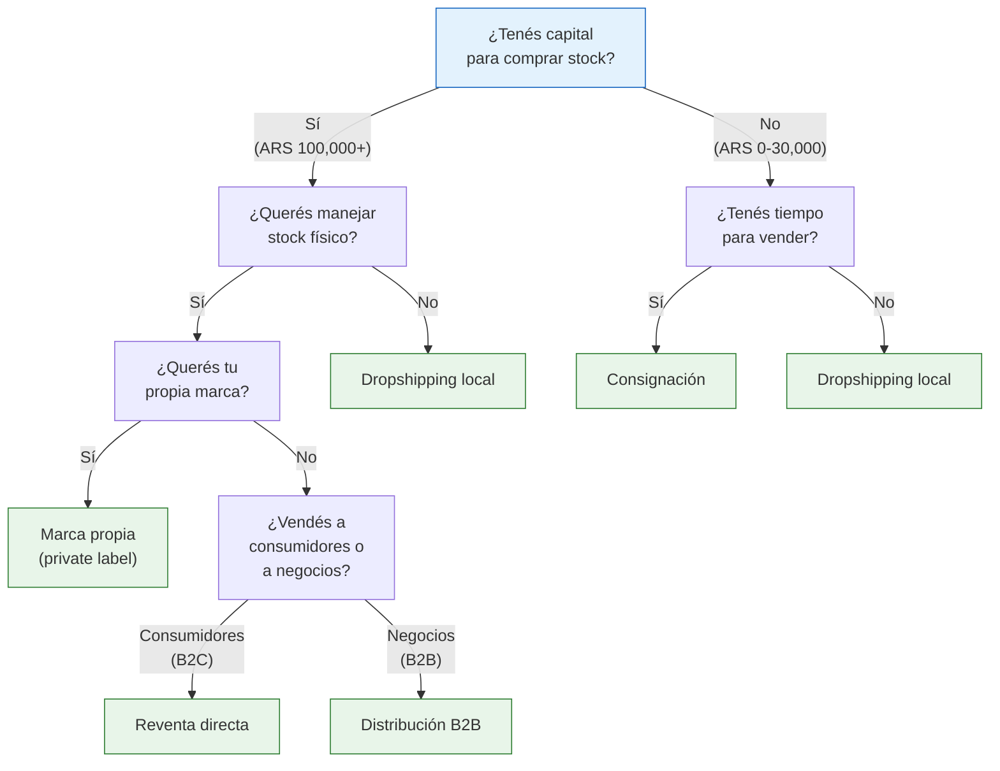
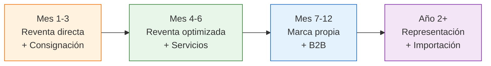

# Modelos de negocio: más allá de revender

> Comprar y revender es el punto de partida más común, pero **no es el único camino**. Dependiendo de tu capital, tu experiencia y tus objetivos, hay al menos 7 formas distintas de generar ingresos trabajando con fábricas argentinas.

## ¿Por qué explorar otros modelos?

Muchos emprendedores se quedan estancados en la reventa directa porque no saben que existen alternativas. Cada modelo tiene ventajas diferentes:

- Algunos requieren **cero capital** para empezar
- Otros generan **márgenes más altos** a cambio de más trabajo
- Varios se pueden **combinar** entre sí para diversificar ingresos

<Note>
No necesitás elegir un solo modelo para siempre. La mayoría de los emprendedores exitosos **empiezan con reventa** y van incorporando otros modelos a medida que crecen. Lo importante es conocer las opciones.
</Note>

## Los 7 modelos en resumen

### 1. Reventa directa
El modelo clásico: comprás productos a precio mayorista en una fábrica y los revendés al consumidor final con un margen. Requiere capital para comprar stock, pero es el más simple de entender y ejecutar. Si ya leíste [comprar, revender y calcular márgenes](/app/paso1-argentina/empezar-de-cero/comprar-revender-margen), ya conocés este modelo.

### 2. Consignación
La fábrica te entrega productos **sin que pagues por adelantado**. Vos vendés y le pagás después, quedándote con un porcentaje acordado. Ideal si no tenés capital para comprar stock, aunque los márgenes son menores.

### 3. Dropshipping local
Publicás productos en MercadoLibre o tu tienda online, pero **nunca tocás la mercadería**. Cuando vendés, el proveedor envía directo al cliente. Cero inversión en stock, pero márgenes bajos y dependencia total del proveedor.

### 4. Marca propia (private label)
Una fábrica produce el producto, pero lleva **tu marca**. Esto te permite diferenciarte, cobrar más y construir un activo a largo plazo. Requiere más inversión y tiempo, pero los márgenes pueden ser significativamente más altos.

### 5. Distribución B2B (venta mayorista)
En vez de vender al consumidor final, le vendés a **otros revendedores**: locales, otros vendedores de MercadoLibre, empresas. Menos margen por unidad, pero volúmenes más grandes y ventas más predecibles.

### 6. Representación comercial
Te convertís en el **distribuidor exclusivo** de una fábrica en tu zona o canal. Trabajás como brazo comercial de la fábrica a cambio de precios preferenciales y territorio protegido. Requiere trayectoria y volumen.

### 7. Servicios complementarios
Agregás valor sin fabricar: kitting (armar combos), curación (selección temática), packaging premium, personalización. Comprás productos genéricos y los transformás en algo de mayor valor percibido.

## Navegá cada modelo en detalle

<CardGroup cols={2}>
  <Card title="Consignación" icon="handshake-simple" href="/app/paso1-argentina/empezar-de-cero/consignacion">
    Vendé sin invertir en stock. La fábrica te da productos y pagás después de vender.
  </Card>
  <Card title="Dropshipping local" icon="truck-fast" href="/app/paso1-argentina/empezar-de-cero/dropshipping-local">
    Vendé sin tocar mercadería. El proveedor envía directo al cliente final.
  </Card>
  <Card title="Marca propia" icon="tag" href="/app/paso1-argentina/empezar-de-cero/marca-blanca">
    Tu marca en productos de fábrica. Márgenes más altos y diferenciación real.
  </Card>
  <Card title="Distribución B2B" icon="warehouse" href="/app/paso1-argentina/empezar-de-cero/venta-b2b-distribucion">
    Vendé a otros negocios. Más volumen, menos margen, ingresos estables.
  </Card>
  <Card title="Representación comercial" icon="user-tie" href="/app/paso1-argentina/empezar-de-cero/representacion-comercial">
    Sé el brazo comercial de una fábrica en tu zona o canal de venta.
  </Card>
  <Card title="Servicios complementarios" icon="wand-magic-sparkles" href="/app/paso1-argentina/empezar-de-cero/servicios-complementarios">
    Agregá valor con packaging, personalización y curación de productos.
  </Card>
  <Card title="Comparación completa" icon="scale-balanced" href="/app/paso1-argentina/empezar-de-cero/comparacion-modelos">
    Tabla comparativa de todos los modelos para elegir el que mejor te sirve.
  </Card>
</CardGroup>

## Tabla comparativa rápida

| Modelo | Capital requerido | Margen neto aprox. | Riesgo | Complejidad | Escalabilidad |
|--------|------------------|--------------------|--------|-------------|---------------|
| **Reventa directa** | ARS 100,000-300,000 (~USD 80-250) | 25-45% | Medio | Baja | Media |
| **Consignación** | ARS 0-30,000 (~USD 0-25) | 15-30% | Bajo | Baja | Baja |
| **Dropshipping local** | ARS 0-10,000 (~USD 0-8) | 10-25% | Bajo | Media | Media |
| **Marca propia** | ARS 300,000-600,000 (~USD 250-500) | 35-60% | Alto | Alta | Alta |
| **Distribución B2B** | ARS 500,000+ (~USD 400+) | 15-25% | Medio | Media | Alta |
| **Representación comercial** | ARS 200,000+ (~USD 165+) | 20-35% | Medio | Media | Alta |
| **Servicios complementarios** | ARS 50,000-150,000 (~USD 40-125) | 30-50% | Bajo | Media | Media |

<Note>
Los márgenes y capitales son aproximados y varían enormemente según el rubro, la zona y el momento. Usá estos valores como orientación general, no como certeza. Todos los valores en ARS son a febrero 2026 con tipo de cambio de referencia ~ARS 1,200/USD.
</Note>

## ¿Qué modelo elegir? Árbol de decisión

<Tip>
**Podés combinar modelos.** La mayoría de los emprendedores exitosos no usan un solo modelo. Por ejemplo, podés hacer **reventa directa** como base, tomar algunos productos en **consignación** para probar sin riesgo, y agregar **servicios complementarios** (packaging premium) para aumentar el ticket promedio. Consultá la [comparación completa](/app/paso1-argentina/empezar-de-cero/comparacion-modelos) para ver combinaciones recomendadas.
</Tip>

## Evolución natural de un emprendimiento

La mayoría de los negocios exitosos siguen una progresión similar:

No te presiones por llegar a los modelos más avanzados rápido. Cada etapa te da las habilidades y el capital para la siguiente.

## Preguntas frecuentes sobre modelos de negocio

<Accordion title="¿Necesito elegir un solo modelo?">
No. La mayoría de emprendedores exitosos combinan 2-3 modelos. Lo que sí es importante es no intentar hacer todo a la vez desde el día 1. Empezá con uno, dominalo, y después sumá otro. La combinación más natural para empezar es **reventa directa + consignación** (para probar sin riesgo productos nuevos).
</Accordion>

<Accordion title="¿Cuánto tiempo le dedico a cada modelo antes de decidir si funciona?">
Dale al menos **60-90 días** a un modelo antes de descartarlo. Los primeros 30 días son de aprendizaje y ajuste. Recién en el día 60-90 vas a ver si realmente funciona o no para tu rubro y tu situación.
</Accordion>

<Accordion title="¿Alguno de estos modelos requiere inscripción especial?">
Todos se pueden operar con **Monotributo** para empezar. Si hacés B2B en volumen y tus clientes necesitan Factura A, probablemente necesites pasar a Responsable Inscripto. La marca propia no requiere inscripción extra, pero sí el registro en INPI para proteger el nombre (es opcional pero muy recomendable).
</Accordion>

<Accordion title="¿Puedo saltar directo a marca propia o importación?">
Técnicamente sí, pero no es recomendable. Cada modelo previo te enseña habilidades críticas: la reventa te enseña a vender, la consignación a negociar con fábricas, el B2B a manejar volumen. Saltear etapas significa aprender con errores más caros.
</Accordion>

<Tip>
Para entender cuánto capital necesitás para cada etapa, consultá [¿Cuánto capital necesitás para empezar?](/app/paso1-argentina/empezar-de-cero/capital-inicial). Y si ya decidiste empezar con reventa, leé [comprar, revender y calcular márgenes](/app/paso1-argentina/empezar-de-cero/comprar-revender-margen).
</Tip>
