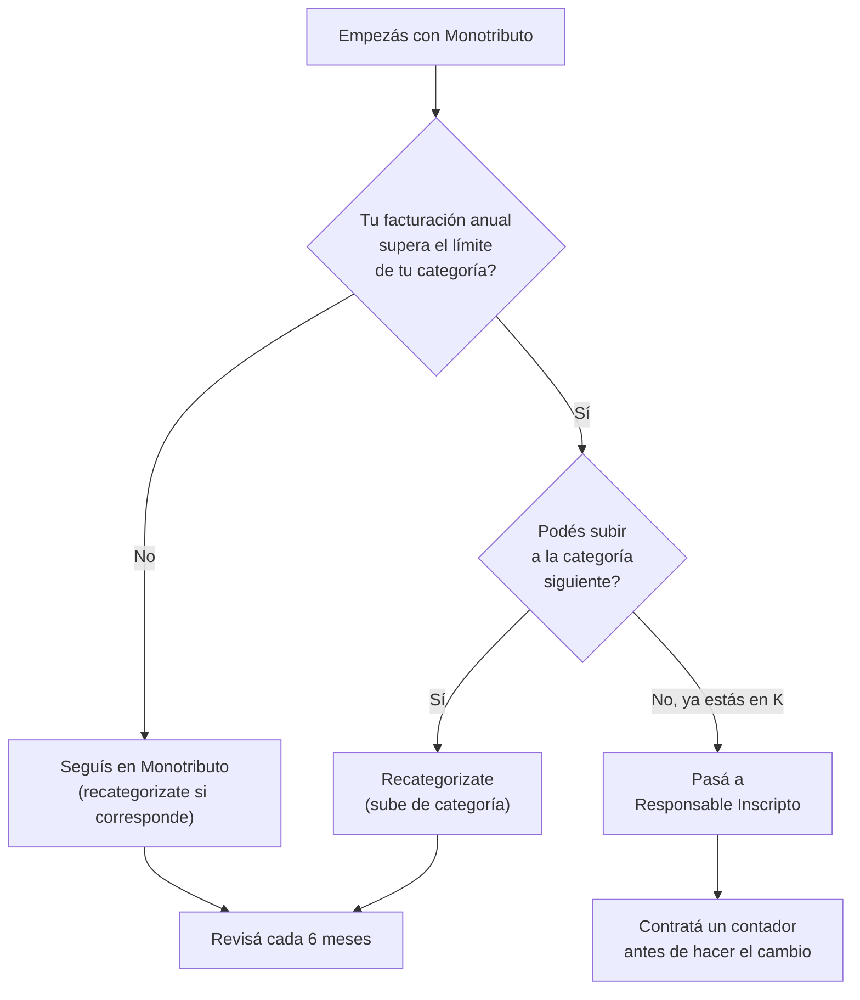

# Monotributo vs Responsable Inscripto

> Elegir el **régimen fiscal correcto** es la primera decisión importante cuando arrancás un negocio de reventa. No te preocupes: para empezar, la respuesta es casi siempre la misma.

## La respuesta corta

<Tip>
Si estás empezando de cero y nunca tuviste un negocio, **inscribite en Monotributo categoría A o B**. Es más simple, más barato y más que suficiente para arrancar. Siempre podés pasarte a Responsable Inscripto después.
</Tip>

## Qué es el Monotributo

El Monotributo es un **régimen simplificado** de ARCA (ex-AFIP) pensado para pequeños contribuyentes. En lugar de pagar varios impuestos por separado, pagás **una cuota fija mensual** que incluye todo:

- **Componente impositivo** (reemplaza IVA + Ganancias)
- **Componente previsional** (jubilación)
- **Obra social** (cobertura médica)

Tiene **categorías de la A a la K**, y cada una tiene un tope máximo de facturación anual. Vos elegís la categoría según cuánto estimás facturar en los próximos 12 meses.

### Ventajas del Monotributo para empezar

1. **Cuota fija mensual** — sabés exactamente cuánto pagás cada mes
2. **No liquidás IVA** — no necesitás calcular débito fiscal menos crédito fiscal
3. **No presentás Ganancias** — te ahorrás la declaración jurada anual más compleja del sistema
4. **Factura C** — emitís un solo tipo de comprobante, simple
5. **Menos necesidad de contador** — podés manejarlo solo (aunque siempre conviene consultar uno)

## Qué es Responsable Inscripto (RI)

El Responsable Inscripto es el **régimen general**. Pagás cada impuesto por separado:

- **IVA:** liquidación mensual (débito fiscal - crédito fiscal). Alícuota general: 21%
- **Ganancias:** anticipos mensuales + declaración jurada anual
- **Autónomos:** aporte previsional mensual
- **Obra social:** se contrata por separado

Emitís **Factura A** (a otros responsables inscriptos) y **Factura B** (a consumidores finales y monotributistas).

### Cuándo conviene ser RI

- Cuando tu facturación supera el límite de la categoría más alta del Monotributo
- Cuando tus proveedores son RI y querés recuperar el IVA de tus compras (crédito fiscal)
- Cuando tu negocio ya tiene un volumen considerable y un contador que lo administre

## Comparativa detallada

| Aspecto | Monotributo | Responsable Inscripto |
|---------|-------------|----------------------|
| **Facturación máxima anual (2026 aprox.)** | $68.000.000 (categoría K, servicios) | Sin límite |
| **Cuota mensual (Cat. A, Feb 2026 aprox.)** | $15.000 - $18.000 | Variable (depende de facturación) |
| **Cuota mensual (Cat. B, Feb 2026 aprox.)** | $17.000 - $21.000 | Variable |
| **IVA** | Incluido en la cuota (no se discrimina) | 21% sobre ventas, con crédito fiscal |
| **Ganancias** | Incluido en la cuota | Alícuotas progresivas (hasta 35%) |
| **Tipo de factura** | Factura C | Factura A y B |
| **Complejidad contable** | Baja | Alta |
| **Necesidad de contador** | Recomendable pero no imprescindible | Prácticamente obligatorio |
| **Costo contable mensual (Feb 2026 aprox.)** | $15.000 - $40.000 | $40.000 - $100.000+ |
| **Obra social** | Incluida en la cuota | Se contrata por separado |
| **Recupero IVA de compras** | No | Sí |
| **Ingresos Brutos** | Se paga aparte (varía por provincia) | Se paga aparte (varía por provincia) |

<Warning>
Los montos de las cuotas del Monotributo se actualizan periódicamente (generalmente cada 6 meses). Los valores indicados son **aproximados para febrero 2026**. Consultá siempre los valores vigentes en el portal de ARCA (ex-AFIP): [www.arca.gob.ar](https://www.arca.gob.ar).
</Warning>

## Categorías del Monotributo más relevantes para empezar

Para un revendedor que recién arranca, las categorías más comunes son:

| Categoría | Facturación anual máxima (2026 aprox.) | Cuota mensual aprox. | Recomendado para |
|-----------|---------------------------------------|----------------------|------------------|
| **A** | $7.800.000 - $8.500.000 | $15.000 - $18.000 | Primeros meses, ventas esporádicas |
| **B** | $11.500.000 - $12.500.000 | $17.000 - $21.000 | Ventas regulares, 1-2 ventas por día |
| **C** | $16.000.000 - $17.500.000 | $20.000 - $25.000 | Negocio en crecimiento |

<Note>
Estos montos son **aproximados** y se actualizan periódicamente. La categoría se elige según la facturación estimada de los próximos 12 meses. Si te pasás del tope, ARCA te recategoriza automáticamente o te excluye del Monotributo.
</Note>

## Cómo inscribirse en Monotributo

<Steps>
  <Step title="Obtener CUIL">
    Si nunca trabajaste formalmente, necesitás tu CUIL (Código Único de Identificación Laboral). Generalmente ya lo tenés asignado con tu DNI. Podés verificarlo en [www.anses.gob.ar](https://www.anses.gob.ar).
  </Step>
  <Step title="Sacar Clave Fiscal nivel 3">
    Ingresá al portal de ARCA ([www.arca.gob.ar](https://www.arca.gob.ar)) y registrate para obtener tu clave fiscal. Para llegar a nivel 3 necesitás verificar identidad (se puede hacer por homebanking o presencialmente en una oficina de ARCA).
  </Step>
  <Step title="Obtener CUIT">
    Con la clave fiscal nivel 3, generás tu CUIT (Código Único de Identificación Tributaria) desde el portal de ARCA. Este trámite es online y gratuito.
  </Step>
  <Step title="Alta de Monotributo">
    Desde el portal de ARCA, accedé al servicio "Monotributo" y completá el formulario de adhesión. Elegí tu categoría (A o B para empezar), tu actividad económica (código CLAE 479101 para venta minorista por internet) y tu domicilio fiscal.
  </Step>
  <Step title="Elegir obra social">
    Durante el alta, elegís una obra social. Podés cambiarla después (una vez al año). Si ya tenés obra social por otro empleo, podés unificar aportes.
  </Step>
  <Step title="Generar credencial de pago">
    Una vez inscripto, ARCA genera tu credencial de pago mensual (VEP). Podés pagar por débito automático, transferencia bancaria o en puntos de pago.
  </Step>
</Steps>

## Cuándo pasar de Monotributo a Responsable Inscripto

### Señales de que es momento de pasar a RI

- Tu facturación se acerca al tope de la categoría K
- Tus proveedores son RI y perdés mucho IVA por no poder tomar crédito fiscal
- Tu contador te recomienda el cambio por conveniencia impositiva
- Querés importar directamente (muchos despachantes prefieren trabajar con RI)

<Warning>
**Facturá SIEMPRE.** No importa si vendés por MercadoLibre, Instagram, WhatsApp o en la puerta de tu casa. Vender "en negro" (sin facturar) tiene consecuencias graves: multas de ARCA, clausura del negocio, exclusión del Monotributo y hasta causas penales por evasión si los montos son significativos. MercadoLibre reporta toda la facturación a ARCA automáticamente — no hay forma de esconderla.
</Warning>

## Preguntas frecuentes

<Accordion title="Puedo ser Monotributista y tener un empleo en relación de dependencia al mismo tiempo?">
Sí. Podés ser empleado y Monotributista a la vez. Tené en cuenta que si tu empleador ya te cubre obra social, podés unificar aportes para mejorar el plan. Consultá con tu contador las implicancias en Ganancias.
</Accordion>

<Accordion title="Qué pasa si facturo más de lo que permite mi categoría?">
ARCA te recategoriza automáticamente a la categoría que corresponda. Si superás el límite de la categoría K, quedás excluido del Monotributo y pasás obligatoriamente a Responsable Inscripto. ARCA te notifica y tenés un plazo para regularizar tu situación.
</Accordion>

<Accordion title="Puedo volver de Responsable Inscripto a Monotributo?">
Sí, es posible, pero hay condiciones. Tenés que haber sido RI por al menos 3 años y tu facturación debe estar dentro de los parámetros del Monotributo. Es un trámite que conviene hacer con asesoramiento contable.
</Accordion>

<Accordion title="Cuánto pago de Ingresos Brutos además del Monotributo?">
Ingresos Brutos es un impuesto provincial y **no está incluido** en la cuota del Monotributo. La alícuota varía según la provincia y la actividad, generalmente entre 1.5% y 5% de la facturación. Si vendés online a todo el país, probablemente necesites inscribirte en Convenio Multilateral.
</Accordion>

## Siguiente paso

<Tip>
Ya sabés que el Monotributo es tu mejor opción para empezar. Ahora aprendé el proceso paso a paso para inscribirte en [Inscripción fiscal paso a paso](/app/paso1-argentina/empezar-de-cero/inscripcion-fiscal).
</Tip>
