# Paso 1 vs Paso 2 — El camino del importador

> No son caminos opuestos. Son **etapas del mismo camino**. Paso 1 te prepara para que Paso 2 sea exitoso.

## Qué es cada paso

<Tabs>
  <Tab title="Paso 1: Fábricas argentinas">
    **Comprás productos de fábricas locales y los revendés.**

    - Buscás fábricas argentinas que vendan por mayor
    - Hacés compras chicas (10-100 unidades)
    - Vendés por MercadoLibre, Instagram, ferias o tu tienda online
    - Aprendés qué se vende, cómo se vende y a qué precio
    - Reinvertís las ganancias para crecer

    **Objetivo:** Generar ventas estables, construir infraestructura y acumular capital.
  </Tab>
  <Tab title="Paso 2: Importar de China">
    **Importás productos desde China con márgenes mucho mayores.**

    - Contactás proveedores en Alibaba u otras plataformas
    - Hacés pedidos grandes (100-1,000+ unidades)
    - Gestionás envío internacional, aduana e impuestos
    - Vendés con márgenes de 150-500%
    - Escalás el negocio significativamente

    **Objetivo:** Maximizar márgenes y escalar con productos que ya sabés que se venden.
  </Tab>
</Tabs>

## Comparación lado a lado

| Aspecto | Paso 1: Argentina | Paso 2: China |
|---------|-------------------|---------------|
| **Inversión inicial** | ARS 50,000-200,000 | USD 3,000-10,000 + impuestos |
| **Ganancia por producto** | 50-150% | 150-500% |
| **Tiempo hasta primera venta** | 1-4 semanas | 3-6 meses |
| **Riesgo si sale mal** | Bajo (perdés poco) | Alto (perdés mucho) |
| **Conocimiento necesario** | Básico | Comercio exterior completo |
| **Trámites aduaneros** | Ninguno | Agente de aduanas, permisos, AFIP |
| **Idioma** | Castellano | Inglés / chino (con traductor) |
| **Control de calidad** | Visitás la fábrica | Dependés de fotos y muestras |
| **Cantidad mínima** | 10-50 unidades | 100-1,000+ unidades |
| **Exclusividad de producto** | Baja (otros venden lo mismo) | Alta (podés personalizar) |
| **Escalabilidad** | Limitada por capacidad local | Prácticamente ilimitada |

<Note>
Paso 1 tiene márgenes más bajos pero te permite **aprender sin arriesgar mucho**. Paso 2 tiene márgenes altos pero requiere **todo lo que aprendiste en Paso 1** para funcionar.
</Note>

## Tu hoja de ruta en el tiempo

```mermaid
graph LR
    subgraph M1["Meses 1-3"]
        A["Investigar\nproductos"] --> B["Armar\ninfraestructura"]
        B --> C["Primera compra\na fábrica"]
    end

    subgraph M2["Meses 3-6"]
        D["Vender y\naprender"] --> E["Reinvertir\ny crecer"]
        E --> F["Ventas\nestables"]
    end

    subgraph M3["Meses 6-12"]
        G["Consolidar\nnegocio local"] --> H["Acumular\ncapital"]
        H --> I["Estudiar\nimportación"]
    end

    subgraph M4["Mes 12+"]
        J["Primera\nimportación"] --> K["Escalar con\nChina + local"]
    end

    C --> D
    F --> G
    I --> J

    style A fill:#e8f5e9,stroke:#2e7d32
    style B fill:#e8f5e9,stroke:#2e7d32
    style C fill:#e8f5e9,stroke:#2e7d32
    style D fill:#fff3e0,stroke:#ef6c00
    style E fill:#fff3e0,stroke:#ef6c00
    style F fill:#fff3e0,stroke:#ef6c00
    style G fill:#e3f2fd,stroke:#1565c0
    style H fill:#e3f2fd,stroke:#1565c0
    style I fill:#e3f2fd,stroke:#1565c0
    style J fill:#fce4ec,stroke:#c62828
    style K fill:#fce4ec,stroke:#c62828
```

## Qué hacer en cada etapa

<Steps>
  <Step title="Meses 1-3: Arrancar desde cero">
    - Sacá el monotributo (categoría A o B)
    - Abrí tu cuenta en MercadoLibre como vendedor
    - Investigá qué productos tienen demanda
    - Encontrá 2-3 fábricas argentinas
    - Hacé tu primera compra mayorista (ARS 50,000-100,000)
    - Publicá tus primeros productos y empezá a vender

    **Meta:** Hacer tus primeras 10-20 ventas.
  </Step>
  <Step title="Meses 3-6: Aprender vendiendo">
    - Identificá qué productos se venden mejor
    - Optimizá tus publicaciones (fotos, títulos, descripciones)
    - Aprendé a gestionar envíos de forma eficiente
    - Reinvertí las ganancias en más stock
    - Probá nuevos productos y dejá los que no funcionan
    - Empezá a construir reputación en MercadoLibre

    **Meta:** Llegar a 50-100 ventas mensuales.
  </Step>
  <Step title="Meses 6-12: Consolidar el negocio">
    - Alcanzar ventas mensuales estables superiores a ARS 500,000
    - Tener 2-3 productos que se venden consistentemente
    - Infraestructura funcionando (envíos, facturación, atención al cliente)
    - Acumular capital de al menos USD 3,000 para la primera importación
    - Empezar a estudiar el proceso de importación (sección Paso 2 de esta guía)

    **Meta:** Negocio local rentable y funcionando.
  </Step>
  <Step title="Mes 12+: Dar el salto a China">
    - Elegir UN producto que ya vendés bien para importar la versión china
    - Contactar proveedores en Alibaba y pedir muestras
    - Contratar un agente de aduanas
    - Hacer tu primera importación pequeña (USD 3,000-5,000)
    - Comparar márgenes: producto local vs. importado

    **Meta:** Primera importación exitosa con producto vendido.
  </Step>
</Steps>

## Los 5 hitos para saber que estás listo para Paso 2

Antes de importar desde China, verificá que cumplís estos hitos. No es un checklist rígido, pero si no cumplís al menos 4 de 5, todavía no es tu momento.

<Accordion title="Hito 1: Ventas mensuales estables superiores a ARS 500,000">
No alcanza con haber vendido ARS 500,000 una vez. Necesitás al menos **3 meses consecutivos** con ese nivel de ventas. Esto demuestra que tenés un flujo de clientes constante y que sabés mantener el negocio andando.

**Por qué importa:** Si no tenés ventas estables, la mercadería importada se va a quedar parada meses. Y mercadería parada es plata muerta.
</Accordion>

<Accordion title="Hito 2: Infraestructura armada y funcionando">
Esto significa que tenés resueltos los temas operativos:

- Monotributo activo y al día
- Facturación electrónica configurada
- Canal de venta funcionando (MercadoLibre, tienda online, o ambos)
- Logística de envíos resuelta
- Contador o contadora que te asesore

**Por qué importa:** Importar agrega complejidad. Si tu operación local todavía tiene problemas, importar va a multiplicar esos problemas.
</Accordion>

<Accordion title="Hito 3: Conocimiento real del mercado">
Sabés responder estas preguntas sin dudar:

- Cuáles son los 3 productos más vendidos en tu nicho
- Cuál es el techo de precio que el mercado acepta
- Quiénes son tus competidores y a qué precio venden
- Qué época del año se vende más y menos
- Qué problemas tienen los productos actuales que podrías mejorar

**Por qué importa:** Este conocimiento define QUÉ importar. Sin él, estás adivinando.
</Accordion>

<Accordion title="Hito 4: Capital acumulado mayor a USD 3,000">
Necesitás al menos **USD 3,000 de capital disponible** que puedas inmovilizar durante 3-6 meses (el tiempo que tarda el ciclo completo de importación). Este capital NO puede ser plata que necesitás para tu operación diaria.

**Por qué importa:** Si usás tu capital operativo para importar, tu negocio local se frena mientras esperás la mercadería. Necesitás capital extra.
</Accordion>

<Accordion title="Hito 5: Tiempo y capacidad operativa">
Tu negocio local ya funciona con cierta autonomía. No dependés de estar vos 100% del tiempo para que las ventas salgan. Tenés tiempo para dedicar al proceso de importación (que al principio requiere muchas horas de investigación, contacto con proveedores y trámites).

**Por qué importa:** Si tu negocio local te consume todo el tiempo, no vas a poder gestionar una importación en paralelo. El resultado: hacés las dos cosas mal.
</Accordion>

<Warning>
Estos hitos no son arbitrarios. Son las lecciones aprendidas de cientos de emprendedores que intentaron importar antes de tiempo y perdieron dinero. **No los ignores** por ansiedad de querer "ir más rápido".
</Warning>

## La verdad que nadie te dice

<Tip>
**Muchos importadores exitosos empezaron vendiendo productos nacionales.** La experiencia de vender productos argentinos les dio todo lo que necesitaban para importar con éxito: conocimiento del mercado, infraestructura, capital y confianza. No hay atajos, pero sí un camino probado.
</Tip>

<Note>
**No hay un plazo fijo.** Algunas personas están listas para Paso 2 en 6 meses. Otras tardan 12-18 meses. No es una carrera. Lo importante es que cuando des el salto, estés preparado. Cada persona avanza a su propio ritmo según su capital, tiempo disponible y velocidad de aprendizaje.
</Note>

## Lo que viene después

Ya sabés por qué arrancar con fábricas argentinas y cuándo vas a estar listo para importar. Ahora es momento de pasar a la acción:

<CardGroup cols={2}>
  <Card title="Requisitos legales" icon="scale-balanced" href="/app/paso1-argentina/empezar-de-cero/monotributo-vs-responsable-inscripto">
    Empezá por lo más importante: ponerte en regla para poder operar y cobrar.
  </Card>
  <Card title="Encontrar fábricas" icon="magnifying-glass" href="/app/paso1-argentina/encontrar-fabricas/introduccion">
    Aprendé dónde y cómo encontrar fábricas argentinas para comprar por mayor.
  </Card>
</CardGroup>
