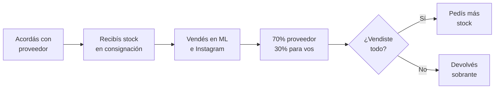
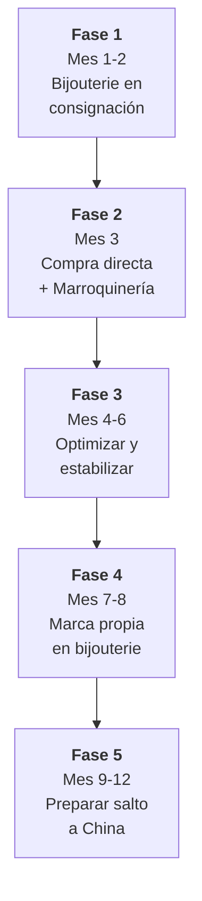

# El plan con más probabilidades de éxito

> Después de analizar 15 rubros, 9 criterios ponderados, 7 modelos de negocio y decenas de proveedores reales, esta es la ruta que recomendamos para alguien que empieza **desde cero, sin experiencia y con capital mínimo**.

<Note>
Este plan no es el único camino posible, pero es el que **minimiza riesgos** y **maximiza aprendizaje** en cada etapa. Está diseñado para que cada paso financie el siguiente.
</Note>

---

## La estrategia en una oración

**Empezar con bijouterie en consignación (riesgo cero) → pasar a compra directa con las ganancias → sumar marroquinería como segundo rubro → escalar operaciones → dar el salto a importar de China.**

---

## ¿Por qué esta combinación específica?

### Bijouterie como primer rubro

De los [8 rubros analizados](/app/paso1-argentina/oportunidades/ranking-general), bijouterie obtuvo el **score más alto (8.23/10)** y tiene características únicas para un principiante:

| Ventaja | Detalle |
|---------|---------|
| **Capital casi nulo** | Podés arrancar con $30,000-80,000 ARS (~USD 25-65) en stock, o con $0 en consignación |
| **Margen 100-300%** | El más alto de todos los rubros analizados |
| **Logística perfecta** | Pequeño, liviano, no frágil — almacenás miles de unidades en un cajón |
| **Sin regulación** | No necesitás certificaciones, habilitaciones ni permisos especiales |
| **Puente directo a China** | Yiwu es la capital mundial de bijouterie — la transición es natural |

<Tip>
Bijouterie es el **único rubro** donde podés arrancar literalmente con **cero pesos** usando el [modelo de consignación](/app/paso1-argentina/empezar-de-cero/consignacion). Ningún otro rubro te permite eso con tanta facilidad.
</Tip>

### Marroquinería como segundo rubro

Marroquinería (score 7.89/10) es el complemento perfecto porque:

| Ventaja | Detalle |
|---------|---------|
| **Ticket más alto** | Un bolso se vende $8,000-25,000 ARS vs. un par de aros a $800-3,000 ARS |
| **Mismo público** | La clienta que compra bijouterie también compra carteras y mochilas |
| **Cross-selling natural** | "Te llevás estos aros y esta cartera que combinan" |
| **Fábricas accesibles** | Madu, Enchúlate, Lenid, Necy — sin mínimos de compra |
| **Mismos canales** | Vendés por MercadoLibre, Instagram y ferias — no necesitás infraestructura extra |

### ¿Por qué NO tres rubros desde el inicio?

Uno de los [errores fatales más comunes](/app/paso1-argentina/empezar-de-cero/errores-fatales-principiante) es diversificar demasiado pronto. Con dos rubros complementarios:

- **Conocés bien a tu cliente** (mujer 18-45, interesada en moda y accesorios)
- **Dominás los proveedores** (pocos pero bien evaluados)
- **Simplificás la logística** (todo liviano, mismo tipo de packaging)
- **Concentrás el marketing** (una sola audiencia, un solo mensaje)

---

## ¿Por qué consignación primero?

El modelo de [consignación](/app/paso1-argentina/empezar-de-cero/consignacion) resuelve los tres miedos más grandes de un principiante:

1. **"¿Y si no vendo nada?"** → En consignación, devolvés lo que no vendiste. Riesgo = $0.
2. **"No tengo plata para invertir"** → No necesitás capital. El proveedor pone el producto.
3. **"No sé si esto funciona"** → Probás el mercado real sin arriesgar un peso.

### Cómo funciona en la práctica

<Warning>
El split 70/30 es un ejemplo común. Algunos proveedores ofrecen 60/40 o 50/50 dependiendo del volumen y la relación. **Siempre negociá** antes de aceptar.
</Warning>

### ¿Cuándo pasar de consignación a compra directa?

La transición debe ocurrir cuando se cumplan **estas tres condiciones**:

1. **Vendés consistentemente** — Al menos 3-4 semanas seguidas con ventas regulares
2. **Sabés qué se vende** — Identificaste los 5-10 productos que más rotan
3. **Tenés capital acumulado** — Juntaste al menos $50,000-80,000 ARS de ganancias

En ese momento, comprás directamente a la fábrica los productos que **ya sabés que se venden** (porque lo probaste en consignación) y tu margen sube de 30% a 100-300%.

---

## Visión general del roadmap

El plan completo dura 12 meses y tiene **5 fases claras**:

| Fase | Meses | Inversión acumulada | Facturación mensual estimada |
|------|-------|--------------------|-----------------------------|
| 1 — Consignación | 1-2 | $0 | $30,000-50,000 ARS |
| 2 — Compra directa + Rubro 2 | 3 | ~$100,000 ARS | $200,000-300,000 ARS |
| 3 — Optimizar | 4-6 | ~$300,000 ARS | $500,000-700,000 ARS |
| 4 — Marca propia | 7-8 | ~$500,000 ARS | $800,000-1,200,000 ARS |
| 5 — Preparar China | 9-12 | ~$1,000,000 ARS | $1,500,000-2,000,000 ARS |

<Note>
Los montos son estimaciones conservadoras basadas en márgenes promedio de bijouterie (100-300%) y marroquinería (60-120%). Los valores reales dependen del esfuerzo, la selección de productos y las condiciones de mercado.
</Note>

<Tip>
Para el detalle mes a mes con milestones, KPIs y decisiones clave, consultá la [Hoja de ruta: 12 meses paso a paso](/app/paso1-argentina/empezar-de-cero/hoja-ruta-mes-a-mes).
</Tip>

---

## Los 5 hitos de transición

Cada transición entre fases tiene un **trigger claro** — no avanzás hasta que se cumpla:

<Steps>
  <Step title="De consignación a compra directa">
    **Trigger:** 3-4 semanas de ventas constantes + identificaste tus top 5-10 productos + acumulaste $50,000+ ARS en ganancias.

    **Acción:** Comprás stock de los productos probados directamente a la fábrica. Tu margen salta de ~30% a ~150%.
  </Step>

  <Step title="De un rubro a dos rubros">
    **Trigger:** Bijouterie estabilizado con al menos 20 ventas/mes + tenés capital para un pedido inicial de marroquinería ($100,000-150,000 ARS).

    **Acción:** Contactás [proveedores de marroquinería](/app/paso1-argentina/oportunidades/marroquineria/proveedores) (Madu, Enchúlate, Lenid) y hacés tu primer pedido chico (10-15 unidades variadas).
  </Step>

  <Step title="De venta básica a operación optimizada">
    **Trigger:** +50 ventas/mes entre ambos rubros + dedicás más de 4 horas/día al negocio.

    **Acción:** Implementás [herramientas de gestión](/app/paso1-argentina/crecer-gestionar/herramientas-gestion), automatizás respuestas en ML, creás plantillas de publicaciones.
  </Step>

  <Step title="De reventa a marca propia">
    **Trigger:** Tenés 3+ productos que venden consistentemente 20+ unidades/mes cada uno + margen de al menos 100%.

    **Acción:** Contactás el mismo proveedor (u otro) para que produzca [marca blanca](/app/paso1-argentina/empezar-de-cero/marca-blanca) con tu logo. Tu margen sube otro 20-30% y te diferenciás de la competencia.
  </Step>

  <Step title="De Argentina a importar de China">
    **Trigger:** Facturás $1,000,000+ ARS/mes + tenés capital para un pedido de China ($1,500-3,000 USD) + dominás tus productos y audiencia.

    **Acción:** Hacés tu primer pedido de China vía Alibaba/1688, empezando por los mismos productos que ya vendés (bijouterie o marroquinería). Consultá la [guía de puente a importación](/app/paso1-argentina/oportunidades/puente-importacion).
  </Step>
</Steps>

---

## ¿Para quién NO es este plan?

Este plan asume ciertas condiciones. **No es el mejor camino** si:

- **Ya tenés capital alto (+$500,000 ARS):** Podés saltarte consignación y empezar con compra directa en rubros de ticket más alto.
- **Tenés experiencia en otro rubro:** Si conocés fitness, mascotas o packaging, empezá por ahí aunque el score sea menor — tu conocimiento del mercado vale más que un punto de diferencia.
- **Tu objetivo no es e-commerce:** Si querés vender B2B o a tiendas, el modelo de [distribución](/app/paso1-argentina/empezar-de-cero/venta-b2b-distribucion) o [representación comercial](/app/paso1-argentina/empezar-de-cero/representacion-comercial) puede ser mejor.
- **No podés dedicar tiempo:** Este plan requiere mínimo 2-3 horas diarias. Si tenés menos tiempo, considerá [dropshipping local](/app/paso1-argentina/empezar-de-cero/dropshipping-local).

---

## Páginas relacionadas

<CardGroup cols={2}>
  <Card title="Hoja de ruta mes a mes" icon="calendar-days" href="/app/paso1-argentina/empezar-de-cero/hoja-ruta-mes-a-mes">
    Detalle completo de los 12 meses con milestones, KPIs y proyecciones financieras.
  </Card>
  <Card title="Errores fatales del principiante" icon="skull-crossbones" href="/app/paso1-argentina/empezar-de-cero/errores-fatales-principiante">
    Los 7 errores que matan negocios de reventa antes de los 6 meses.
  </Card>
  <Card title="Bijouterie — Rubro #1" icon="gem" href="/app/paso1-argentina/oportunidades/bijouterie/overview">
    Análisis completo del rubro con mayor score: márgenes, proveedores y estrategia.
  </Card>
  <Card title="Marroquinería — Rubro #2" icon="bag-shopping" href="/app/paso1-argentina/oportunidades/marroquineria/overview">
    Tu segundo rubro ideal: ticket alto, fábricas accesibles y cross-selling natural.
  </Card>
</CardGroup>
