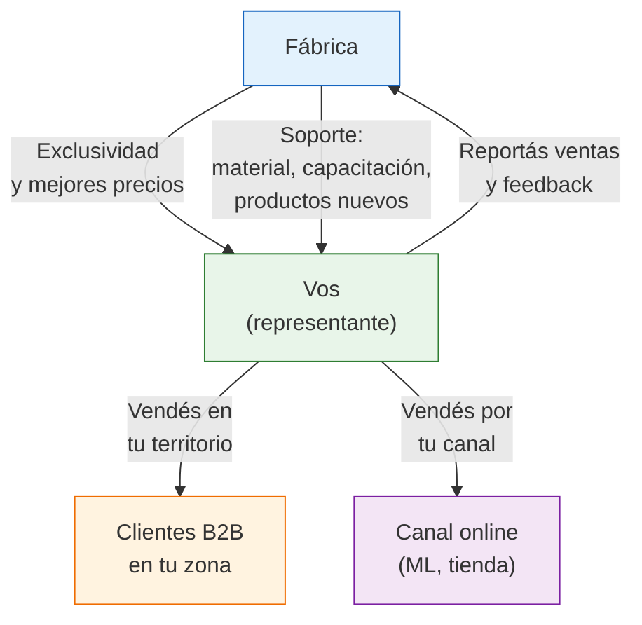

# Representación comercial de fábricas

> La representación comercial es el nivel más alto de relación con una fábrica: vos te convertís en su **brazo comercial** en una zona o canal. A cambio, obtenés exclusividad, mejores precios y soporte directo.

## ¿Qué es la representación comercial?

Ser representante comercial de una fábrica significa que vos sos el encargado de **vender sus productos en un territorio o canal definido**. La fábrica te da precios preferenciales y exclusividad a cambio de que cumplas con cierto volumen de ventas.

<Note>
La representación comercial es diferente de la distribución. Un distribuidor compra y revende. Un representante puede hacer lo mismo, pero además tiene un **acuerdo formal** con la fábrica que le da exclusividad y condiciones especiales. Es una relación más cercana y comprometida de ambos lados.
</Note>

## Marco legal

La representación comercial en Argentina se rige por el Código Civil y Comercial (artículos 1479 a 1501 sobre contratos de agencia, y disposiciones generales de mandato comercial). Puntos clave:

- El representante actúa en nombre de la fábrica o en nombre propio según lo acordado
- Se puede pactar exclusividad territorial (la fábrica no vende directo ni a otros en tu zona)
- El contrato debe ser por escrito para mayor seguridad jurídica
- En caso de rescisión sin causa, puede corresponder una indemnización

<Warning>
Si bien un acuerdo informal puede funcionar al principio, si vas a comprometerte con volúmenes y exclusividad, es **fundamental tener un contrato escrito** revisado por un abogado. La inversión en asesoría legal (ARS 50,000-100,000 / ~USD 40-83 aprox.) se justifica ampliamente considerando los montos involucrados.
</Warning>

## Términos típicos de un acuerdo de representación

| Término | Rango habitual | Notas |
|---------|---------------|-------|
| **Exclusividad territorial** | Por zona geográfica (ej: Córdoba, Rosario, zona sur de GBA) | La fábrica no vende directo ni a otros distribuidores en tu zona |
| **Exclusividad por canal** | Por canal de venta (ej: MercadoLibre, tiendas físicas) | Menos común pero posible |
| **Descuento sobre lista** | 10-20% menor que precio mayorista normal | Cuanto más volumen, mejor precio |
| **Compromiso de volumen** | Compra mínima mensual o trimestral | Si no cumplís, podés perder la exclusividad |
| **Duración** | 6 meses a 2 años con renovación automática | Períodos cortos al inicio, se extienden con resultados |
| **Soporte de la fábrica** | Material publicitario, muestras, capacitación | Varía mucho según la fábrica |
| **Política de precios** | La fábrica sugiere precios mínimos de venta | Para proteger la marca y a otros representantes |

## Cómo llegar a ser representante

No podés proponer representación comercial en el primer contacto con una fábrica. Hay un camino natural:

<Steps>
  <Step title="Empezá como cliente mayorista regular (Mes 1-3)">
    Comprá productos de la fábrica como cualquier otro cliente. Hacé pedidos puntuales, pagá a tiempo y no causes problemas. El objetivo es que te conozcan como un comprador serio.
  </Step>
  <Step title="Demostrá resultados de venta (Mes 3-6)">
    Mostrá a la fábrica que vendés su producto consistentemente. Compartí datos de ventas, screenshots de MercadoLibre, feedback de clientes. La fábrica necesita ver que sos un canal de venta efectivo.
  </Step>
  <Step title="Aumentá tus pedidos gradualmente">
    Pasá de compras esporádicas a pedidos regulares. Si empezaste comprando 50 unidades, subí a 100, después a 200. La regularidad y el crecimiento son las mejores credenciales.
  </Step>
  <Step title="Proponé la representación">
    Cuando ya tenés 6+ meses de relación, pedidos regulares y resultados demostrables, proponé formalizar la relación. Ejemplo:

    *"Llevo 6 meses comprando sus productos y he logrado vender X unidades mensuales en [zona/canal]. Me gustaría proponer un acuerdo de representación comercial para [zona]. Estoy dispuesto a comprometerme con un volumen mensual de X unidades a cambio de exclusividad y un precio preferencial."*
  </Step>
  <Step title="Negociá los términos">
    Definí: zona de exclusividad, volumen mínimo, precio preferencial, duración del acuerdo, condiciones de renovación y rescisión, soporte que te dará la fábrica.
  </Step>
</Steps>

<Tip>
**La clave es demostrar valor antes de pedir beneficios.** Ninguna fábrica te va a dar exclusividad y mejores precios si no demostraste primero que podés vender. Invertí 6 meses en construir la relación y los números van a hablar por vos.
</Tip>

## Ventajas de ser representante

| Ventaja | Detalle |
|---------|---------|
| **Precios preferenciales** | 10-20% menos que el precio mayorista normal — esto se traduce directamente en mayor margen |
| **Exclusividad territorial** | No competís con otros vendedores del mismo producto en tu zona |
| **Prioridad de stock** | Cuando hay poca producción, los representantes reciben primero |
| **Soporte comercial** | Material publicitario, muestras, información de productos nuevos |
| **Relación directa con producción** | Podés pedir modificaciones, colores especiales, cantidades a medida |
| **Credibilidad** | Podés decir "representante oficial" — genera confianza en tus clientes |

## Riesgos y desventajas

| Riesgo | Impacto | Cómo mitigarlo |
|--------|---------|----------------|
| **Compromiso de volumen que no podés cumplir** | Perdés exclusividad y condiciones | Negociá mínimos realistas, empezá conservador |
| **Dependencia de una sola fábrica** | Si la fábrica tiene problemas, vos también | Representá máximo 60-70% de una sola fábrica; diversificá |
| **La fábrica vende directo en tu zona** | Competencia desleal del propio proveedor | Contrato con cláusula de exclusividad clara y penalidad |
| **Cambio de precios o condiciones** | Margen reducido sin previo aviso | Contrato con preaviso mínimo de 60 días para cambios |
| **Rescisión unilateral** | Perdés un proveedor clave de golpe | Cláusula de preaviso de 90-180 días e indemnización |

<Warning>
**No pongas todos los huevos en una canasta.** Si dependés 100% de una sola fábrica como representante y esa relación se corta, tu negocio se desmorona. Siempre tené al menos 2-3 proveedores, aunque tengas representación formal con uno solo.
</Warning>

## Ejemplo de escenario real

Un emprendedor que vende artículos de bazar producidos por una fábrica en zona sur de GBA:

| Etapa | Volumen mensual | Precio unitario | Margen neto | Ingreso mensual aprox. |
|-------|----------------|-----------------|-------------|----------------------|
| **Cliente mayorista (Mes 1-6)** | 150 uds. | ARS 2,500 | ~25% | ARS 93,750 |
| **Representante (Mes 7+)** | 300 uds. | ARS 2,100 (-16% preferencial) | ~32% | ARS 201,600 |

<Note>
El salto de ARS 93,750 a ARS 201,600 mensuales viene de dos factores: mejor precio por unidad (de ARS 2,500 a ARS 2,100) y mayor volumen (de 150 a 300 unidades porque la exclusividad elimina competencia). Los valores son aproximados.
</Note>

## ¿Para quién es la representación comercial?

La representación NO es para todos. Funciona mejor cuando:

<Tabs>
  <Tab title="Es para vos si...">
    - Ya llevás **6+ meses vendiendo** productos de la fábrica
    - Tenés **canal de venta probado** (ML con buena reputación, locales físicos, cartera de clientes B2B)
    - Podés **comprometerte con un volumen mínimo** mensual sin que sea un riesgo existencial
    - Tenés **capital de trabajo** para comprar más stock (ARS 200,000+ / ~USD 165+ aprox.)
    - Conocés bien el **rubro y el producto** (podés asesorar a otros compradores)
  </Tab>
  <Tab title="NO es para vos si...">
    - Estás **recién empezando** (menos de 3 meses vendiendo)
    - Todavía **no sabés qué producto funciona** y estás testeando
    - No tenés **capital** para sostener compras mínimas
    - **No querés compromisos** de volumen a largo plazo
    - Tu canal de venta es **inestable** o dependés de un solo lugar
  </Tab>
</Tabs>

## Qué debe incluir un contrato de representación

<Accordion title="Elementos esenciales del contrato">
1. **Partes:** Datos completos de la fábrica y del representante (CUIT, domicilio, etc.)
2. **Objeto:** Qué productos se representan, en qué territorio o canal
3. **Exclusividad:** Alcance geográfico y por canal, excepciones (si las hay)
4. **Volumen mínimo:** Cantidad mínima mensual o trimestral de compra
5. **Precios y condiciones:** Lista de precios preferencial, forma de actualización, condiciones de pago
6. **Duración y renovación:** Plazo inicial, condiciones de renovación automática
7. **Rescisión:** Preaviso mínimo, causales de rescisión, indemnización
8. **Obligaciones del representante:** Reportes de venta, respeto de precios sugeridos, exclusividad inversa
9. **Obligaciones de la fábrica:** Entrega de productos, soporte, material publicitario
10. **Resolución de conflictos:** Mediación antes de vía judicial
</Accordion>

<Tip>
La representación comercial es un paso natural después de consolidarte como distribuidor B2B. Si todavía estás en la etapa de reventa directa, enfocate primero en crecer tu volumen y tu relación con la fábrica. Para ver cómo encaja en el panorama completo, consultá la [comparación de modelos](/app/paso1-argentina/empezar-de-cero/comparacion-modelos).
</Tip>
