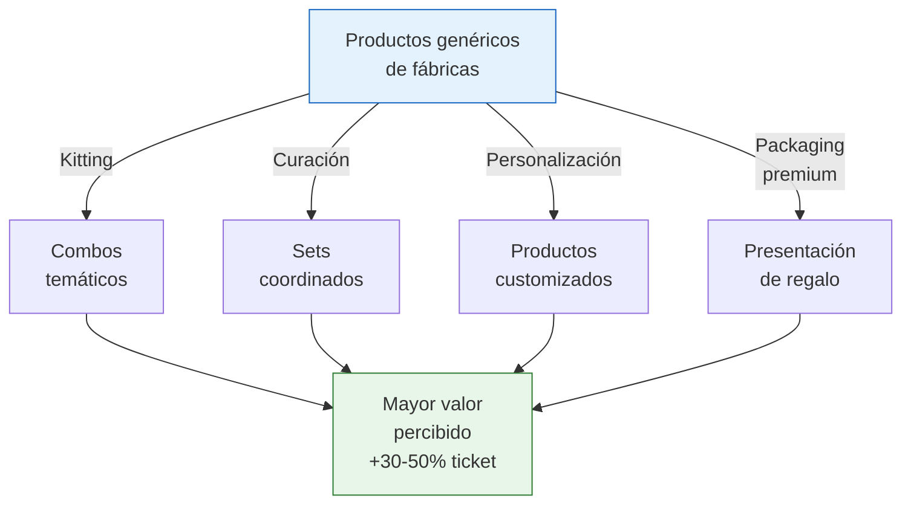

# Servicios: kitting, curación y personalización

> No necesitás fabricar nada para ganar más. Comprás productos genéricos de fábricas y les agregás **valor percibido** a través de curación, combinación inteligente y presentación premium. El cliente paga por la experiencia, no solo por el producto.

## ¿Qué son los servicios complementarios?

Son formas de **transformar productos genéricos en algo de mayor valor** sin modificar el producto en sí:

| Servicio | Qué es | Ejemplo |
|----------|--------|---------|
| **Kitting** | Armar combos o kits con productos de distintos proveedores | Kit de regalo con vela + jabón + difusor de 3 fábricas diferentes |
| **Curación** | Seleccionar y agrupar productos por tema, estilo o uso | Set de decoración "estilo nórdico" con 5 productos coordinados |
| **Personalización** | Agregar grabado, nombre, mensaje, o customización al producto | Mate con nombre grabado, pulsera con inicial |
| **Packaging premium** | Presentar el producto en un envoltorio que eleva la percepción | Producto de ARS 3,000 en caja premium que parece de ARS 8,000 |

<Note>
La magia de este modelo es que **el valor que agregás es intangible pero real para el cliente**. Una vela aromática sola cuesta ARS 3,000. La misma vela en una caja premium con un jabón artesanal y una tarjeta personalizada se vende como "set de regalo" por ARS 9,000-12,000. El costo extra de la caja, el jabón y la tarjeta puede ser ARS 2,000-3,000, pero el precio sube ARS 6,000-9,000.
</Note>

## Ideas por rubro

<Tabs>
  <Tab title="Bijouterie y accesorios">
    **Kitting:** Set de aros + collar + pulsera coordinados en caja de regalo

    **Curación:** "Colección fiesta" con accesorios para eventos, o "colección oficina" con piezas discretas

    **Personalización:** Iniciales grabadas en medallas, pulseras con nombre

    **Packaging:** Caja tipo joyería con terciopelo interior y tarjeta con nombre de tu marca

    **Aumento de ticket estimado:** +40-60%
  </Tab>
  <Tab title="Mascotas">
    **Kitting:** Kit "bienvenida cachorro" con correa + comedero + juguete + snacks

    **Curación:** Caja mensual temática (verano, paseo, entrenamiento)

    **Personalización:** Collar con chapita grabada con nombre de la mascota

    **Packaging:** Caja con forma de casita, tarjeta con datos de la mascota

    **Aumento de ticket estimado:** +30-50%
  </Tab>
  <Tab title="Decoración y hogar">
    **Kitting:** Set "rincón de lectura" con almohadón + vela + portarretratos

    **Curación:** Colección "estilo nórdico" o "estilo industrial" con productos que combinan

    **Personalización:** Cuadros con frases a medida, almohadones con iniciales

    **Packaging:** Caja de cartón kraft con moño y tarjeta manuscrita

    **Aumento de ticket estimado:** +30-50%
  </Tab>
  <Tab title="Papelería y escolares">
    **Kitting:** Kit "vuelta al cole" con cuaderno + cartuchera + lapiceras + stickers

    **Curación:** Set "bullet journal" con cuaderno punteado + washi tapes + planner stickers

    **Personalización:** Cuadernos con nombre del alumno en la tapa

    **Packaging:** Bolsa de tela reutilizable con el logo de tu marca

    **Aumento de ticket estimado:** +25-40%
  </Tab>
</Tabs>

## Cómo aumenta el ticket: ejemplo con números

### Productos individuales vs set curado

| Concepto | Individual | Set curado |
|----------|-----------|-----------|
| Vela aromática de soja (Fábrica A) | ARS 3,000 (~USD 2.50) | — |
| Jabón artesanal (Fábrica B) | ARS 1,500 (~USD 1.25) | — |
| Difusor de ambiente (Fábrica C) | ARS 2,500 (~USD 2) | — |
| **Total si vende por separado** | **ARS 7,000 (~USD 5.83)** | — |
| Caja de regalo + relleno + tarjeta | — | ARS 1,500 (~USD 1.25) |
| **Precio del set "Relax en casa"** | — | **ARS 12,000 (~USD 10)** |
| **Valor agregado por curación** | — | **ARS 3,500 (+50%)** |

### Desglose de rentabilidad del set

| Concepto | Monto |
|----------|-------|
| Precio de venta del set | ARS 12,000 |
| (-) Costo de los 3 productos | -ARS 7,000 |
| (-) Caja + relleno + tarjeta | -ARS 1,500 |
| (-) Comisión ML (17%) | -ARS 2,040 |
| (-) IIBB (3.5%) | -ARS 420 |
| **Ganancia neta** | **ARS 1,040** |
| **Margen neto** | **~8.7%** |

<Warning>
El margen del ejemplo parece bajo, pero es porque los productos del ejemplo tienen un costo alto en relación al precio de venta. Para que el kitting sea rentable, necesitás que la suma de productos individuales tenga un costo total menor al 50% del precio del set. Elegí productos con buen margen individual para armar los kits.
</Warning>

### Ejemplo optimizado (productos con mejor margen)

| Concepto | Monto |
|----------|-------|
| Precio de venta del set | ARS 9,000 (~USD 7.50) |
| (-) Costo de productos (3 items de bijouterie) | -ARS 2,500 |
| (-) Caja premium + tarjeta | -ARS 800 |
| (-) Comisión ML (17%) | -ARS 1,530 |
| (-) IIBB (3.5%) | -ARS 315 |
| **Ganancia neta** | **ARS 3,855** |
| **Margen neto** | **~42.8%** |

<Note>
La diferencia entre los dos ejemplos muestra por qué la selección de productos es crítica. El kitting funciona mejor con productos de **bajo costo y alto valor percibido** como bijouterie, cosmética artesanal y papelería temática. Los valores son aproximados a febrero 2026.
</Note>

## Paso a paso para empezar

<Steps>
  <Step title="Elegí un nicho y un tipo de servicio">
    No intentes hacer todo a la vez. Empezá con UNA combinación: un rubro + un servicio. Ejemplo: kits de regalo de bijouterie, o sets de decoración curados. Lo que mejor conozcas y donde veas demanda.
  </Step>
  <Step title="Identificá 3-5 proveedores complementarios">
    Para armar kits necesitás productos de diferentes categorías que combinen. Contactá fábricas que produzcan cosas que se complementen: si hacés kits de baño, necesitás un proveedor de jabones, otro de velas, otro de toallas.
  </Step>
  <Step title="Diseñá tu primer kit o set">
    Armalo físicamente. Comprá los productos, la caja, el relleno. Fotografiá todo. ¿Se ve como algo que valga el precio que querés cobrar? Si no, ajustá componentes o presentación.
  </Step>
  <Step title="Calculá costos y precio de venta">
    Sumá: costo de todos los productos + packaging + comisiones + impuestos. El precio de venta debe ser al menos 2x el costo total para tener un margen saludable después de comisiones.
  </Step>
  <Step title="Publicá y testeá la demanda">
    Armá 5-10 sets y publicalos. Medí: ¿cuántas consultas recibís? ¿Se venden? ¿Qué feedback te dan? Ajustá composición, precio y presentación según los datos.
  </Step>
</Steps>

## Personalización: el multiplicador de valor

La personalización convierte un producto genérico en un producto único. Métodos accesibles:

| Método | Costo por unidad (aprox.) | Equipamiento necesario | Ideal para |
|--------|--------------------------|----------------------|-----------|
| **Grabado láser** | ARS 500-1,500 (~USD 0.40-1.25) | Servicio tercerizado o máquina (USD 300-500) | Madera, cuero, metal |
| **Vinilo de corte** | ARS 200-500 (~USD 0.16-0.40) | Plotter de corte (ARS 150,000-300,000 / ~USD 125-250) | Tazas, botellas, cuadernos |
| **Sublimación** | ARS 300-800 (~USD 0.25-0.66) | Plancha de sublimación (ARS 100,000-200,000 / ~USD 83-165) | Tazas, textiles, fundas |
| **Estampado/serigrafía** | ARS 400-1,000 (~USD 0.33-0.83) | Servicio tercerizado | Textiles, bolsas |
| **Bordado** | ARS 800-2,000 (~USD 0.66-1.66) | Servicio tercerizado o máquina (USD 800+) | Textiles, gorras, mochilas |

<Tip>
No necesitás comprar equipamiento al principio. Tercerizá la personalización hasta que el volumen justifique la inversión en máquina propia. Un servicio de grabado láser te cobra ARS 500-1,500 por unidad, pero si vendés 100 unidades/mes, una máquina de ~USD 400 se paga en 2-3 meses.
</Tip>

## Ventajas y riesgos

<Tabs>
  <Tab title="Ventajas">
    - **Bajo capital inicial** — comprás productos de fábrica y le agregás valor sin equipamiento costoso
    - **Alta diferenciación** — tus sets y kits son únicos, nadie los replica fácil
    - **Mejor ticket promedio** — vendés por ARS 9,000-15,000 en vez de ARS 3,000-5,000
    - **Múltiples proveedores** — no dependés de una sola fábrica
    - **Creatividad como ventaja** — tu capacidad de curar y presentar es tu moat
    - **Ideal para regalos** — los sets de regalo tienen demanda todo el año con picos estacionales
  </Tab>
  <Tab title="Riesgos">
    - **Mayor complejidad logística** — necesitás coordinar con múltiples proveedores
    - **Tiempo de armado** — cada kit requiere tiempo de ensamblaje y empaque
    - **Stock de componentes** — si falta un producto del kit, no podés vender el set completo
    - **Devoluciones complicadas** — si devuelven un set, hay que desarmar y reubicar cada componente
    - **Escalabilidad limitada** — a medida que crecés, el armado manual se convierte en cuello de botella
  </Tab>
</Tabs>

<Warning>
**No te compliques al empezar.** Es tentador crear kits con 10 productos diferentes, personalización con nombre y packaging de 5 capas. Pero más componentes = más proveedores que coordinar = más cosas que pueden faltar = más cosas que pueden salir mal. Empezá con kits de 2-3 productos y complejizá solo cuando el proceso esté aceitado.
</Warning>

## Momentos clave de demanda

Los servicios de curación y kitting tienen picos de demanda predecibles:

| Fecha | Oportunidad | Tipo de producto |
|-------|-------------|-----------------|
| **14 de febrero** | Día de los Enamorados | Sets de regalo románticos |
| **Marzo** | Vuelta al cole | Kits escolares personalizados |
| **Día de la Madre** | Regalo premium | Sets de cuidado personal, bijouterie curada |
| **Día del Padre** | Regalo funcional | Kits de escritorio, accesorios personalizados |
| **Día del Amigo** | Regalos grupales | Combos económicos para varios amigos |
| **Día del Niño** | Kits infantiles | Sets de juegos, papelería temática |
| **Navidad / Fin de año** | Regalos para todo el mundo | Sets premium, personalización masiva |
| **Corporativo (todo el año)** | Regalos empresariales | Kits brandeados con logo de la empresa |

<Tip>
**Planificá con 45-60 días de anticipación.** Si querés vender kits para el Día de la Madre, tenés que tener los productos comprados, los kits armados y las publicaciones listas al menos un mes antes. La demanda empieza semanas antes de la fecha. Para ver cómo encaja este modelo con otros, consultá la [comparación completa](/app/paso1-argentina/empezar-de-cero/comparacion-modelos).
</Tip>
