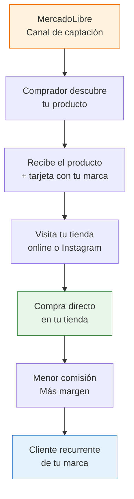

# Tu propia tienda online

> Tu tienda online es tu **segundo canal de ventas**. Te da control total, menor comisión y la posibilidad de construir una marca propia. Pero solo tiene sentido **después** de validar tu producto en MercadoLibre.

## Cuándo crear tu tienda (y cuándo NO)

Este es uno de los errores más comunes: emprendedores que gastan semanas armando una tienda online antes de vender un solo producto.

<Warning>
**NO inviertas en una tienda online propia antes de tener ventas consistentes en MercadoLibre.** Primero validá que tu producto se vende, entendé a tu cliente, y después creá tu tienda. Si no, vas a gastar tiempo y plata en algo que nadie visita.
</Warning>

### Señales de que estás listo para tu tienda

- Tenés al menos 20-30 ventas mensuales en MercadoLibre
- Los clientes te hacen recompras o te buscan por nombre
- Querés reducir la dependencia de las comisiones de ML
- Tenés productos con margen suficiente para invertir en marketing

### Beneficios vs MercadoLibre

| Aspecto | MercadoLibre | Tienda propia |
|---------|-------------|---------------|
| **Comisión** | ~13-19% por venta | ~2-3% (solo procesador de pago) |
| **Tráfico** | Ya tiene millones de visitantes | Tenés que generar vos el tráfico |
| **Marca** | Limitada — todo tiene diseño de ML | Total — tu logo, colores, identidad |
| **Datos del cliente** | ML no te da el email del comprador | Tenés nombre, email, teléfono |
| **Costo fijo** | ARS 0 (pagás solo si vendés) | Plan mensual + dominio |
| **Control** | ML pone las reglas | Vos ponés las reglas |

## Comparación de plataformas

<Tabs>
  <Tab title="TiendaNube (Recomendada)">
    **Por qué es la mejor opción para Argentina:**

    TiendaNube es la plataforma líder en Latinoamérica y fue diseñada específicamente para el mercado argentino. Eso significa que las integraciones con medios de pago y correos locales funcionan de entrada.

    | Característica | Detalle |
    |---------------|---------|
    | **Plan gratuito** | Sí — funcional para arrancar (con comisión por venta) |
    | **Planes pagos** | Desde ~ARS 15,000/mes (febrero 2026, varía) |
    | **MercadoPago** | Integrado de fábrica |
    | **Correos** | Andreani, OCA, Correo Argentino integrados |
    | **Dominio propio** | Sí, con SSL incluido |
    | **Facturación** | Integración con sistemas de facturación argentinos |
    | **Soporte** | En español, horario argentino |

    <Tip>
    **Empezá con el plan gratuito de TiendaNube.** Tiene limitaciones (comisión adicional por venta, menos plantillas), pero te permite probar sin riesgo. Cuando superes las 30-50 ventas mensuales por la tienda, migrá a un plan pago.
    </Tip>
  </Tab>
  <Tab title="Shopify">
    **Para quién:** Vendedores que quieren expandirse internacionalmente o necesitan funcionalidades avanzadas.

    | Característica | Detalle |
    |---------------|---------|
    | **Plan básico** | ~USD 29/mes (pagás en dólares) |
    | **MercadoPago** | Sí, disponible como medio de pago |
    | **Correos argentinos** | Requiere apps o integraciones adicionales |
    | **Dominio propio** | Sí, con SSL incluido |
    | **Plantillas** | Muy buenas, muchas opciones |
    | **Soporte** | En español, pero no específico de Argentina |

    **Desventaja para Argentina:** Pagás en dólares, las integraciones con correos locales no son nativas, y el soporte no conoce la realidad fiscal argentina.
  </Tab>
  <Tab title="WooCommerce">
    **Para quién:** Personas con conocimientos técnicos que quieren control total.

    | Característica | Detalle |
    |---------------|---------|
    | **Costo del plugin** | Gratis (WordPress + WooCommerce son open source) |
    | **Hosting** | ~ARS 5,000-15,000/mes (lo contratás aparte) |
    | **MercadoPago** | Sí, con plugin gratuito |
    | **Correos** | Requiere plugins adicionales |
    | **Mantenimiento** | Lo hacés vos: actualizaciones, seguridad, backups |

    <Warning>
    **No recomendado para principiantes.** WooCommerce requiere manejar hosting, actualizaciones de WordPress, seguridad y plugins. Si no tenés experiencia técnica, vas a perder más tiempo manteniendo la tienda que vendiendo.
    </Warning>
  </Tab>
</Tabs>

## Cómo armar tu tienda paso a paso

Usando TiendaNube como ejemplo (la plataforma recomendada):

<Steps>
  <Step title="Crear cuenta en TiendaNube">
    Entrá a [tiendanube.com.ar](https://www.tiendanube.com.ar) y registrate con tu email. Elegí el plan gratuito para empezar. No necesitás tarjeta de crédito.
  </Step>
  <Step title="Elegir plantilla y personalizar">
    Seleccioná una plantilla limpia y profesional. Cargá tu logo (podés hacer uno básico gratis en Canva), elegí colores y configurá las páginas básicas: Inicio, Productos, Contacto, Preguntas frecuentes.
  </Step>
  <Step title="Registrar tu dominio">
    Registrá un dominio `.com.ar` en NIC Argentina. Cuesta ~ARS 5,000/año (febrero 2026). Elegí un nombre corto, fácil de recordar y que refleje tu negocio. Conectalo a TiendaNube desde el panel de control.
  </Step>
  <Step title="Configurar MercadoPago">
    En TiendaNube, andá a Configuración > Medios de pago > MercadoPago. Vinculá tu cuenta. Los compradores van a poder pagar con tarjeta, transferencia y efectivo.
  </Step>
  <Step title="Configurar envíos">
    Activá los operadores de envío que uses: Andreani, OCA, Correo Argentino. Configurá zonas, tarifas y tiempos de entrega. TiendaNube calcula el costo automáticamente al comprador.
  </Step>
  <Step title="Cargar productos">
    Subí los mismos productos que ya tenés en MercadoLibre. Usá las mismas fotos y descripciones (mejoradas si querés). Poné precio ligeramente menor que en ML, ya que pagás menos comisión.
  </Step>
  <Step title="Configurar datos legales">
    Completá las páginas de Términos y Condiciones, Política de Privacidad y Política de Cambios y Devoluciones. TiendaNube tiene plantillas base que podés adaptar.
  </Step>
</Steps>

## Costos de tener tu tienda

<Note>
Valores aproximados a febrero 2026. Todos los costos son estimaciones y varían según el proveedor y el plan que elijas.
</Note>

| Concepto | Costo aproximado | Frecuencia |
|----------|-----------------|------------|
| **Dominio .com.ar** | ~ARS 5,000 | Anual |
| **TiendaNube plan gratuito** | ARS 0 + comisión por venta | Mensual |
| **TiendaNube plan pago** | ~ARS 15,000-40,000 | Mensual |
| **Comisión MercadoPago** | ~3-4% por transacción | Por venta |
| **SSL (certificado seguridad)** | Incluido en TiendaNube | — |
| **Hosting** | Incluido en TiendaNube | — |

### Comparación de costos: ML vs tienda propia

Usando el mismo ejemplo de un producto de ARS 12,000:

| Concepto | MercadoLibre | Tienda propia |
|----------|-------------|---------------|
| **Comisión plataforma** | ~ARS 1,560 (13%) | ARS 0 |
| **Comisión medio de pago** | Incluida en ML | ~ARS 420 (3.5%) |
| **Costo fijo mensual** | ARS 0 | ~ARS 15,000-40,000 |
| **Marketing/publicidad** | No necesitás (ML tiene tráfico) | ARS 5,000-20,000/mes mínimo |

<Tip>
La tienda propia conviene cuando vendés volumen suficiente para que el ahorro en comisiones supere los costos fijos + marketing. Como regla general, necesitás al menos **30-50 ventas mensuales** por la tienda para que sea rentable vs MercadoLibre.
</Tip>

## Cómo generar tráfico a tu tienda

Sin MercadoLibre, los clientes no llegan solos. Necesitás una estrategia para atraer visitantes:

| Canal | Costo | Dificultad | Tiempo para resultados |
|-------|-------|------------|----------------------|
| **Instagram/TikTok orgánico** | Gratis | Media | 2-4 meses |
| **Instagram Ads** | Desde ARS 5,000/mes | Media | 1-2 semanas |
| **Google Ads** | Desde ARS 10,000/mes | Alta | 1 semana |
| **WhatsApp Business** | Gratis | Baja | Inmediato (con contactos) |
| **Tarjetas en los envíos de ML** | ~ARS 2,000 (impresión) | Baja | 1-2 meses |

<Tip>
La estrategia más efectiva y barata: **incluí una tarjeta en cada envío de MercadoLibre** con tu logo, Instagram y sitio web. Ofrecé un 10% de descuento para la próxima compra directa. Así convertís compradores de ML en clientes de tu tienda.
</Tip>

## La estrategia correcta: multicanal

No es MercadoLibre **o** tienda propia. Es MercadoLibre **y** tienda propia, cada uno cumpliendo un rol diferente:

## Siguiente paso

Con tus canales de venta definidos, necesitás resolver cómo hacer llegar los productos a tus clientes. Avanzá a [logística y envíos nacionales](/app/paso1-argentina/empezar-de-cero/logistica-envios-locales).
