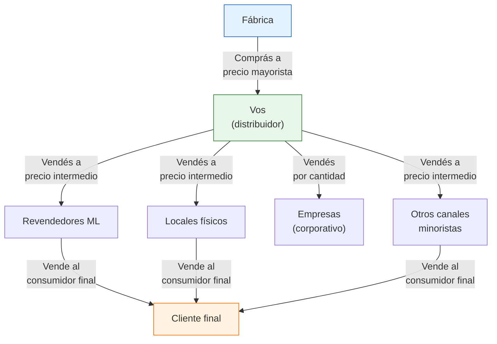
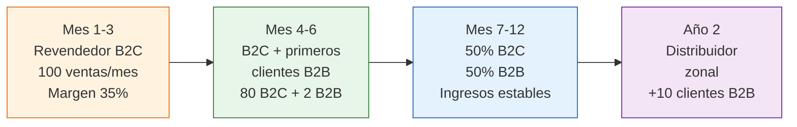

# Venta mayorista y distribución B2B

> En vez de vender un producto a un consumidor final, le vendés **cajas enteras a otros negocios**. Menos margen por unidad, pero pedidos más grandes, menos trabajo por venta y clientes que te compran todos los meses.

## ¿Qué es B2B en este contexto?

B2B (Business to Business) significa vender a otros negocios en vez de al consumidor final. En el contexto de fábricas argentinas, esto puede significar:

- Vender a **otros revendedores de MercadoLibre** que necesitan stock confiable
- Abastecer a **locales físicos** (bazares, boutiques, regalerías) en tu zona
- Proveer a **empresas** para regalos corporativos o eventos
- Distribuir a **kioscos, farmacias o librerías** según el rubro

<Note>
La diferencia clave: en B2C (venta al consumidor) hacés muchas ventas chicas con margen alto. En B2B hacés menos ventas pero más grandes, con margen más bajo por unidad pero volumen total mayor. Un pedido B2B de 200 unidades puede darte más ganancia total que 200 ventas individuales en MercadoLibre.
</Note>

## Cómo identificar oportunidades B2B

<Steps>
  <Step title="Buscá otros vendedores de ML que venden lo mismo que vos">
    Si hay 50 vendedores publicando el mismo producto de fábrica, muchos de ellos podrían ser tus clientes mayoristas. Contactalos y ofrecé stock a precio intermedio entre fábrica y su precio de venta. Para ellos, es más cómodo comprarte a vos que ir a la fábrica.
  </Step>
  <Step title="Visitá locales físicos en tu zona">
    Recorré bazares, boutiques, regalerías, farmacias y locales que vendan productos similares a los tuyos. Muchos compran a distribuidores intermedios. Dejá tu catálogo y lista de precios.
  </Step>
  <Step title="Ofrecé catálogos corporativos">
    Empresas que buscan regalos para fin de año, kits de bienvenida para empleados o merchandising para eventos son clientes B2B potenciales. Armá un catálogo con opciones de personalización y precios por cantidad.
  </Step>
  <Step title="Publicá como mayorista en MercadoLibre">
    MercadoLibre permite publicaciones con "precio por cantidad". Publicá con descuento por mayor (ejemplo: "1 unidad ARS 5,000 / Pack x 12 ARS 45,000"). Muchos compradores mayoristas buscan así.
  </Step>
  <Step title="Usá redes sociales y grupos de WhatsApp">
    Hay grupos de WhatsApp y Facebook de comerciantes que buscan proveedores. Participá activamente y ofrecé tus productos con lista de precios mayorista.
  </Step>
</Steps>

## Pricing B2B: cómo poner precios mayoristas

La regla general: tu precio mayorista debe ser **30-40% menor que tu precio minorista**, pero aún así dejarte un margen de 15-25%.

### Estructura de precios sugerida

| Nivel | Cantidad | Descuento sobre precio minorista | Tu margen neto aprox. |
|-------|----------|--------------------------------|----------------------|
| **Minorista (B2C)** | 1-5 unidades | 0% (precio lleno) | 30-45% |
| **Semi-mayorista** | 6-24 unidades | 15-20% | 20-30% |
| **Mayorista** | 25-99 unidades | 25-35% | 15-25% |
| **Distribuidor** | 100+ unidades | 35-45% | 10-20% |

### Ejemplo con números

Supongamos un producto que comprás a ARS 2,000 en fábrica y vendés al público a ARS 5,500:

| Nivel | Precio unitario | Tu ganancia bruta/ud. | En 100 unidades |
|-------|----------------|----------------------|-----------------|
| **Minorista (B2C)** | ARS 5,500 | ARS 3,500 | ARS 350,000 (pero son 100 ventas individuales) |
| **Mayorista (B2B)** | ARS 3,600 (-35%) | ARS 1,600 | ARS 160,000 (en 1-2 ventas) |

<Note>
Los ARS 160,000 del pedido mayorista parecen menos que los ARS 350,000 del minorista, pero considerá: el B2B son 1-2 ventas con 1-2 envíos vs 100 ventas con 100 envíos, 100 embalajes, posibles reclamos y devoluciones. El costo operativo del B2C es mucho mayor. Los valores son aproximados a febrero 2026.
</Note>

## Facturación B2B: Factura A

<Warning>
Para vender B2B en Argentina necesitás **emitir Factura A** (a otros contribuyentes inscriptos). Si estás en Monotributo, podés emitir Factura C que sirve para B2B pero no le permite a tu cliente tomar el IVA como crédito fiscal. Esto puede ser una desventaja competitiva. Si hacés B2B en volumen, probablemente necesites pasar a Responsable Inscripto para emitir Factura A.
</Warning>

| Tipo de factura | Quién la emite | Para quién | IVA para el comprador |
|----------------|---------------|-----------|----------------------|
| **Factura A** | Responsable Inscripto | Otro Responsable Inscripto | Puede descontar el IVA (crédito fiscal) |
| **Factura B** | Responsable Inscripto | Consumidor final | No descuenta IVA |
| **Factura C** | Monotributista | Cualquiera | No descuenta IVA |

<Tip>
Si tus clientes B2B son monotributistas o consumidores finales, la Factura C no es un problema. Pero si tus clientes son Responsables Inscriptos, van a preferir comprarte a alguien que les emita Factura A (para descontar el IVA). Consultá [monotributo vs responsable inscripto](/app/paso1-argentina/empezar-de-cero/monotributo-vs-responsable-inscripto) para más detalle.
</Tip>

## Logística B2B

La logística B2B es diferente a la minorista:

| Aspecto | B2C (minorista) | B2B (mayorista) |
|---------|----------------|----------------|
| **Tamaño de envío** | Paquetes individuales | Cajas, bultos, pallets |
| **Frecuencia** | Muchos envíos diarios | 2-4 envíos mensuales a cada cliente |
| **Transporte** | Correo Argentino, OCA, Andreani | Transporte de cargas, flete, entrega propia |
| **Costo de envío** | ARS 2,000-4,000 por envío (~USD 1.6-3.3) | ARS 5,000-20,000 por envío (~USD 4-16) pero se diluye en más unidades |
| **Embalaje** | Individual con packaging premium | A granel, en cajas de cartón sin necesidad de packaging individual |
| **Quién paga el envío** | Generalmente el comprador | Negociable — envío gratis a partir de cierto monto |

## Margen B2B: menor por unidad, mayor por volumen

| Métrica | B2C | B2B |
|---------|-----|-----|
| **Margen neto por unidad** | 25-45% | 15-25% |
| **Unidades por venta** | 1 | 25-200+ |
| **Tiempo por venta** | 15-30 min (publicar, embalar, enviar) | 30-60 min total para todo el pedido |
| **Costo operativo por unidad** | Alto | Bajo |
| **Previsibilidad** | Baja (venta a venta) | Alta (pedidos recurrentes) |
| **Devoluciones** | Frecuentes (5-10% en ML) | Raras (se inspecciona al recibir) |

## Cuándo pasar de B2C a B2B

No conviene empezar directo con B2B. Primero necesitás:

| Requisito | Por qué |
|-----------|---------|
| **Proveedor confiable y estable** | Si tu fábrica falla, le fallás a todos tus clientes de golpe |
| **Capital para comprar en volumen** | B2B requiere más stock (mínimo ARS 500,000 / ~USD 400 aprox.) |
| **Conocimiento del producto** | Tus clientes B2B van a preguntar detalles técnicos; necesitás saber |
| **3+ meses vendiendo el producto** | Para confirmar que la demanda es real y la calidad consistente |
| **Capacidad logística** | Necesitás espacio de almacenamiento y forma de despachar bultos grandes |

<Accordion title="¿Puedo hacer B2C y B2B al mismo tiempo?">
Sí, y es lo más recomendable. Vendé al público con margen alto (B2C) y a mayoristas con margen menor pero volumen mayor (B2B). La clave es que los precios no se pisen: tu precio mayorista debe ser menor que tu precio minorista, pero tu cliente mayorista no debería vender más barato que vos en los mismos canales.
</Accordion>

<Accordion title="¿Qué pasa si mi cliente B2B me compite en ML?">
Es un riesgo real. Para mitigarlo, podés: (1) no vender mayorista a otros vendedores de ML si vos también vendés ahí, (2) vender productos ligeramente diferentes a cada canal, o (3) enfocarte en clientes B2B que vendan en canales donde vos no estás (locales físicos, otra provincia).
</Accordion>

<Accordion title="¿Necesito contrato para vender B2B?">
No es obligatorio legalmente para ventas simples, pero sí es muy recomendable tener al menos un acuerdo de condiciones comerciales que detalle: precios, cantidades mínimas, plazo de pago, política de devoluciones y exclusividad (si la hay).
</Accordion>

## Ejemplo de evolución: de revendedor a distribuidor

<Tip>
La distribución B2B es el puente natural hacia la representación comercial. Si vendés volumen consistente de un fabricante, podés negociar exclusividad territorial y mejores precios. Consultá [representación comercial](/app/paso1-argentina/empezar-de-cero/representacion-comercial) para el siguiente paso.
</Tip>
