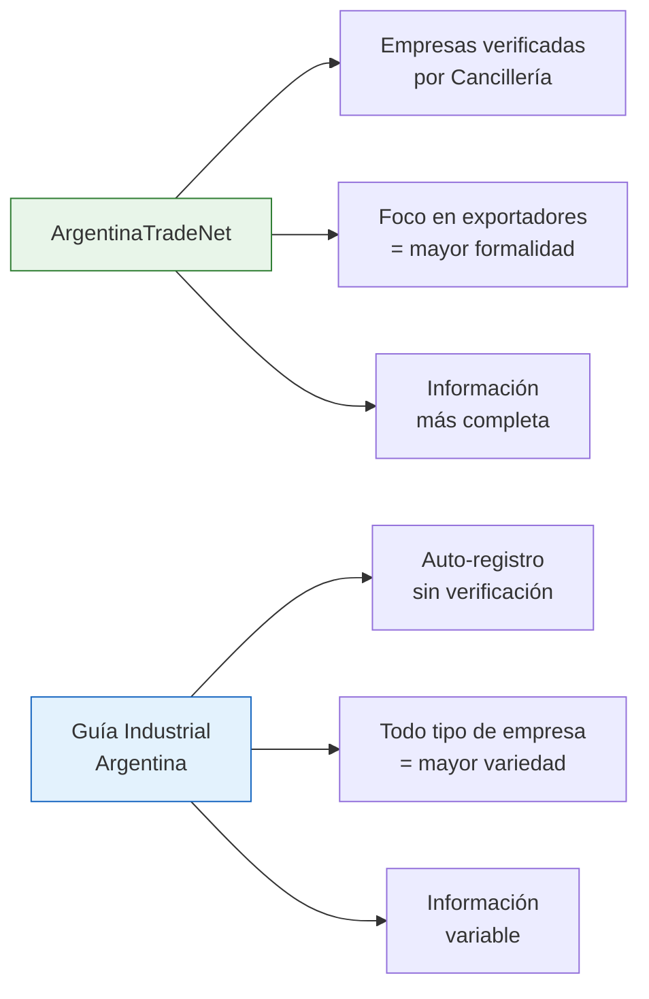

# ArgentinaTradeNet — Cancillería

**ArgentinaTradeNet** es la plataforma oficial del Ministerio de Relaciones Exteriores (Cancillería) de Argentina, diseñada para conectar empresas argentinas con compradores del exterior. Aunque su foco es el comercio internacional, es una fuente muy valiosa para encontrar fabricantes dentro del país.

## Por qué te sirve aunque no vayas a exportar

Las empresas que están en ArgentinaTradeNet tienen estas características:

- **Son empresas reales y verificadas** — la Cancillería las valida antes de listarlas
- **Tienen capacidad exportadora** — lo que implica que pueden producir volúmenes importantes
- **Mayor nivel de formalidad** — están inscriptas, facturan y cumplen estándares
- **Productos competitivos** — si pueden competir en el exterior, tienen buena relación calidad-precio

<Note>
Que una empresa tenga capacidad exportadora suele ser señal de calidad. Para exportar, necesitan cumplir normas internacionales, lo que generalmente se traduce en mejores productos y procesos más organizados.
</Note>

## Qué encontrás en la plataforma

| Sección | Qué contiene | Utilidad |
|---------|-------------|----------|
| **Directorio de empresas** | Listado de empresas argentinas exportadoras | Encontrar fabricantes por sector |
| **Oferta exportable** | Productos que Argentina exporta, organizados por categoría | Descubrir qué se fabrica en el país |
| **Búsqueda por sector** | Filtros por industria (alimentos, textiles, metalurgia, etc.) | Encontrar fábricas de tu rubro |
| **Perfiles de empresa** | Datos de contacto, productos, capacidades | Información detallada de cada empresa |

## Cómo buscar fabricantes

<Steps>
  <Step title="Accedé a la plataforma">
    Ingresá al sitio de ArgentinaTradeNet a través del portal de la Cancillería. La plataforma es de acceso público y gratuito.
  </Step>
  <Step title="Explorá el directorio de empresas">
    Usá la sección de búsqueda de empresas. Podés filtrar por:
    - **Sector industrial** (alimentos, textil, metalurgia, química, etc.)
    - **Producto específico** (palabra clave)
    - **Provincia** de origen
  </Step>
  <Step title="Revisá la oferta exportable">
    La sección de oferta exportable te muestra los productos argentinos disponibles, organizados por categoría. Es útil para descubrir qué se fabrica en el país en tu rubro.
  </Step>
  <Step title="Analizá los perfiles">
    Cada empresa tiene un perfil con datos de contacto, descripción de productos, capacidad productiva y certificaciones. Esta información es más confiable que la de otros directorios porque fue verificada por el Estado.
  </Step>
  <Step title="Contactá a las empresas">
    Usá los datos de contacto del perfil. Mencioná que los encontraste por ArgentinaTradeNet: las empresas suelen responder bien a consultas que llegan por canales oficiales.
  </Step>
</Steps>

## Diferencias con otros directorios

<Tabs>
  <Tab title="ArgentinaTradeNet">
    - Empresas verificadas por el Estado
    - Foco en empresas con capacidad exportadora
    - Menor cantidad de empresas listadas
    - Mayor nivel de formalidad y confiabilidad
    - Ideal para productos con exigencias de calidad
  </Tab>
  <Tab title="Guía Industrial Argentina">
    - Auto-registro, sin verificación estatal
    - Todo tipo de empresa industrial (grande, mediana, pequeña)
    - Mayor cantidad de empresas
    - Calidad de información variable
    - Ideal para búsquedas amplias
  </Tab>
</Tabs>

## Registrarte como comprador

Podés registrarte en la plataforma para recibir notificaciones y acceder a funciones adicionales:

1. **Completá el formulario** de registro con tus datos comerciales
2. **Indicá tu rubro de interés** para recibir alertas relevantes
3. **Accedé a rondas de negocios** virtuales organizadas por la Cancillería

<Tip>
La Cancillería organiza periódicamente **rondas de negocios** donde compradores y fabricantes se conectan en reuniones virtuales o presenciales. Estar registrado te da acceso a estas oportunidades. Son gratuitas y muy útiles para hacer primeros contactos.
</Tip>

## Sectores con mayor presencia

Estos son los sectores industriales argentinos con más empresas registradas en la plataforma:

| Sector | Productos típicos | Nivel de oferta |
|--------|-------------------|-----------------|
| **Alimentos y bebidas** | Vinos, aceites, lácteos, snacks, miel | Muy alto |
| **Cuero y calzado** | Zapatos, carteras, indumentaria de cuero | Alto |
| **Textil e indumentaria** | Ropa, telas, hilados | Alto |
| **Maquinaria agrícola** | Implementos, piezas, equipamiento rural | Alto |
| **Químicos y cosméticos** | Productos de limpieza, cosmética, químicos industriales | Medio-alto |
| **Software y tecnología** | Soluciones IT, aplicaciones, servicios digitales | Medio |
| **Metalmecánica** | Piezas, estructuras, herrajes | Medio |

## Limitaciones a tener en cuenta

<Warning>
ArgentinaTradeNet está orientada al comercio exterior. Esto significa que:
- **No todas las fábricas argentinas están listadas**, solo las que exportan o quieren exportar
- **Empresas muy chicas o informales** no van a aparecer acá
- **Los precios pueden estar pensados para exportación** (en dólares, volúmenes grandes)
- **La plataforma puede tener cambios** según la gestión de gobierno de turno

Siempre verificá que la URL y la plataforma estén activas antes de confiar en ella como única fuente.
</Warning>

## Cómo combinarla con otras fuentes

La estrategia más efectiva es usar ArgentinaTradeNet como **filtro de calidad**:

1. Buscá fábricas en la [Guía Industrial Argentina](/app/paso1-argentina/encontrar-fabricas/guia-industrial-argentina) para tener una lista amplia
2. Verificá cuáles de esas fábricas también aparecen en ArgentinaTradeNet
3. Las que aparecen en ambas fuentes son las más confiables
4. Complementá con el [Cluster Map del IDEP](/app/paso1-argentina/encontrar-fabricas/cluster-map-idep) para cobertura regional

<Tip>
Si una empresa aparece en ArgentinaTradeNet, en la Guía Industrial Y en una cámara sectorial, tenés tres señales positivas de que es una empresa seria y establecida. Ese es el tipo de proveedor que querés.
</Tip>
