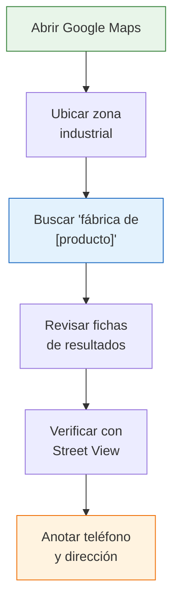

# Búsqueda estratégica en Google

> Google es la herramienta más poderosa y gratuita para encontrar fábricas argentinas, pero solo si sabés cómo usarla. La diferencia entre buscar "fábrica de remeras" y usar operadores avanzados puede ser la diferencia entre encontrar 0 resultados útiles o 20 fabricantes reales.

## Por qué Google funciona para esto

La mayoría de las fábricas argentinas tienen algún tipo de presencia online, aunque sea mínima: un sitio web básico, una ficha de Google Maps, una mención en un directorio o una nota en un medio local. Google indexa todo eso. El problema no es que la información no exista, sino que hay que saber buscarla.

<Note>
A diferencia de plataformas como MercadoLibre donde los resultados están curados, en Google vas a encontrar de todo: fábricas reales, revendedores que se hacen pasar por fábricas, directorios desactualizados y páginas irrelevantes. Aprender a filtrar es clave.
</Note>

## Términos de búsqueda que funcionan

Estos son los términos específicos que producen resultados concretos cuando buscás fábricas argentinas:

| Patrón de búsqueda | Ejemplo concreto | Qué encontrás |
|--------------------|------------------|---------------|
| `fábrica de [producto] Argentina` | fábrica de medias Argentina | Fabricantes a nivel nacional |
| `fabricante de [producto] [provincia]` | fabricante de muebles Córdoba | Fabricantes en una zona específica |
| `industria [rubro] directorio Argentina` | industria textil directorio Argentina | Directorios y listados del rubro |
| `proveedores [producto] mayorista Buenos Aires` | proveedores calzado mayorista Buenos Aires | Mayoristas y fabricantes en AMBA |
| `planta industrial [producto] [ciudad]` | planta industrial plásticos Rosario | Plantas de producción específicas |
| `distribuidor oficial [producto] Argentina` | distribuidor oficial herrajes Argentina | Distribuidores que llevan a los fabricantes |

<Tip>
Usá siempre "Argentina" o el nombre de la provincia en la búsqueda. Sin esto, Google te va a mostrar resultados de España, México y otros países hispanohablantes que no te sirven.
</Tip>

## Operadores de Google para búsquedas avanzadas

Los operadores de búsqueda son comandos especiales que refinan los resultados. Usá estos para búsquedas mucho más precisas:

| Operador | Qué hace | Ejemplo |
|----------|----------|---------|
| `" "` (comillas) | Busca la frase exacta | `"fábrica de bolsas" Buenos Aires` |
| `site:` | Busca solo en un sitio web | `site:guiaindustrial.com.ar calzado` |
| `-` (menos) | Excluye una palabra | `fábrica remeras -mercadolibre -empleo` |
| `OR` | Busca uno u otro término | `fabricante OR fábrica medias Argentina` |
| `filetype:pdf` | Busca archivos PDF | `directorio industrial Argentina filetype:pdf` |
| `intitle:` | Busca en el título de la página | `intitle:"fábrica de" plásticos Argentina` |

### Combinaciones avanzadas recomendadas

```
"fábrica de medias" Argentina -mercadolibre -empleo -linkedin
```
Esto busca la frase exacta "fábrica de medias" en Argentina, excluyendo resultados de MercadoLibre, ofertas de empleo y perfiles de LinkedIn que no aportan.

```
site:com.ar "fabricante de" calzado (Buenos Aires OR Córdoba)
```
Busca solo en sitios argentinos (.com.ar) fabricantes de calzado en Buenos Aires o Córdoba.

## Búsqueda en Google Maps

Google Maps es una de las herramientas más subestimadas para encontrar fábricas. Muchas fábricas tienen ficha en Google Maps aunque no tengan sitio web.

<Steps>
  <Step title="Abrí Google Maps">
    Ingresá a maps.google.com o abrí la app de Google Maps en el celular.
  </Step>
  <Step title="Navegá a una zona industrial">
    Ubicá el mapa en una zona industrial conocida: Parque Industrial Pilar, zona industrial de Avellaneda, parques industriales de Córdoba, etc.
  </Step>
  <Step title="Buscá por tipo de fábrica">
    En el buscador escribí: "fábrica de [producto]" o simplemente "fábrica" para ver todas las que están mapeadas en esa zona.
  </Step>
  <Step title="Revisá cada ficha">
    Hacé clic en cada resultado. Fijate: dirección, teléfono, sitio web, horario de atención, fotos (a veces hay fotos de la planta), y reseñas.
  </Step>
  <Step title="Verificá con Street View">
    Usá Street View para "ver" la fábrica desde afuera. Si ves un galpón industrial con cartel de la empresa, es una buena señal. Si ves una casa particular, probablemente no sea una fábrica real.
  </Step>
</Steps>



<Tip>
Las zonas industriales con mayor concentración de fábricas en el Gran Buenos Aires son: Pilar (zona norte), Moreno y Merlo (zona oeste), Avellaneda y Quilmes (zona sur). En el interior: Córdoba capital, Rafaela (Santa Fe), Mendoza capital y San Luis.
</Tip>

## Google Images: encontrar el origen de un producto

Si tenés un producto y querés saber quién lo fabrica, Google Images puede ayudar:

1. **Buscá el nombre del producto** en Google Images
2. **Buscá por imagen**: subí una foto del producto usando la función de búsqueda por imagen (ícono de cámara en el buscador)
3. **Mirá las páginas de origen**: hacé clic en los resultados y fijate si llevan a sitios de fabricantes

Esto es útil cuando tenés un producto en la mano pero no sabés quién lo hace.

## Google Alerts: monitoreo continuo

Google Alerts te envía un email cada vez que Google indexa contenido nuevo que coincide con tu búsqueda. Es ideal para monitoreo a largo plazo.

<Steps>
  <Step title="Ingresá a Google Alerts">
    Andá a google.com/alerts e iniciá sesión con tu cuenta de Google.
  </Step>
  <Step title="Creá una alerta">
    Escribí tu búsqueda, por ejemplo: "fábrica de [producto] Argentina". Configurá la frecuencia (diaria o semanal) y el idioma (español).
  </Step>
  <Step title="Recibí notificaciones">
    Cada vez que aparezca contenido nuevo que mencione tu búsqueda, te llega un email. Esto incluye notas en diarios, nuevos listados en directorios y actualizaciones de sitios web de fábricas.
  </Step>
</Steps>

<Note>
Las alertas son especialmente útiles para detectar nuevas fábricas que se suman a directorios, notas periodísticas sobre empresas industriales, o aperturas de nuevas plantas. Creá 3 o 4 alertas con variaciones de tu búsqueda para cubrir más terreno.
</Note>

## Proceso sistemático completo

Para no perderte en la inmensidad de Google, seguí este proceso ordenado:

<Tabs>
  <Tab title="Búsqueda web">
    1. Empezá con la búsqueda genérica: `fábrica de [producto] Argentina`
    2. Refiná con provincia: `fabricante [producto] [provincia]`
    3. Excluí ruido: agregá `-mercadolibre -empleo -linkedin`
    4. Probá variantes del nombre del producto
    5. Revisá hasta la página 3 de resultados (las fábricas no siempre están en la primera página)
  </Tab>
  <Tab title="Google Maps">
    1. Ubicá las zonas industriales principales de tu región
    2. Buscá "fábrica" o "fábrica de [producto]" en cada zona
    3. Revisá fichas: anotá teléfono, dirección y web
    4. Verificá con Street View
    5. Repetí en 3-4 zonas industriales diferentes
  </Tab>
  <Tab title="Monitoreo">
    1. Creá 3-4 alertas en Google Alerts con tus búsquedas principales
    2. Configurá frecuencia semanal
    3. Revisá los emails semanalmente
    4. Agregá a tu planilla cualquier resultado nuevo
  </Tab>
</Tabs>

<Warning>
Cuidado con los sitios que aparecen como "directorios de fábricas" pero que en realidad son páginas que cobran por listar tu empresa o que muestran información muy desactualizada. Siempre verificá que los datos de contacto funcionen antes de considerar un resultado como válido.
</Warning>

## Siguiente paso

Complementá tu búsqueda en Google con las [plataformas B2B mayoristas argentinas](/app/paso1-argentina/encontrar-fabricas/plataformas-b2b-mayoristas), que son sitios especializados donde los fabricantes ya están pre-verificados como vendedores mayoristas.
