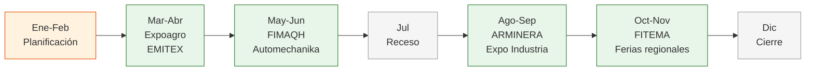

# Calendario de ferias industriales 2026

Las ferias industriales en Argentina se realizan durante todo el año, con mayor concentración entre marzo y noviembre. Este calendario te ayuda a planificar qué ferias visitar y cuándo, pero **siempre verificá las fechas en los sitios oficiales** porque pueden cambiar de un año a otro.

<Warning>
Las fechas de las ferias cambian cada año y a veces se reprograman con poco aviso. Este calendario es una referencia orientativa basada en la información disponible a febrero de 2026. **Siempre confirmá las fechas en los sitios oficiales antes de planificar tu viaje.**
</Warning>

## Dónde consultar calendarios actualizados

Estas son las fuentes más confiables para ver qué ferias se vienen:

| Fuente | URL | Qué encontrás |
|--------|-----|---------------|
| **INTI — Agenda de Eventos** | argentina.gob.ar/inti/agenda-de-eventos | Calendario del Instituto Nacional de Tecnología Industrial. Incluye ferias, jornadas técnicas y capacitaciones |
| **Messe Frankfurt Argentina** | ar.messefrankfurt.com | Organizador internacional de ferias. Manejan Automechanika, Intersec y otras ferias grandes |
| **nFerias** | nferias.com/ferias-industriales/argentina/ | Directorio de ferias con fechas, ubicaciones y descripciones. Cobertura amplia |
| **EventsEye** | eventseye.com/ferias/c3_ferias_argentina.html | Buscador internacional de ferias por país y sector. Interfaz en varios idiomas |

<Steps>
  <Step title="Consultá las 4 fuentes">
    Revisá cada uno de los sitios de la tabla. Cada fuente tiene ferias diferentes: ninguna tiene el listado completo.
  </Step>
  <Step title="Filtrá por tu sector">
    Buscá ferias relacionadas con el rubro que te interesa. Si todavía no definiste rubro, enfocate en las ferias multisector.
  </Step>
  <Step title="Anotá fechas y lugares">
    Creá una lista con las ferias que te interesan, sus fechas tentativas y dónde se hacen.
  </Step>
  <Step title="Verificá en el sitio oficial de cada feria">
    Una vez que identifiques una feria, buscá su sitio web oficial y confirmá la fecha exacta, horarios y requisitos de ingreso.
  </Step>
  <Step title="Registrate con anticipación">
    La mayoría de las ferias requieren registro previo (online y gratuito). Hacelo con al menos una semana de anticipación.
  </Step>
</Steps>

## Calendario orientativo por mes

<Note>
Este calendario muestra los meses **habituales** en los que se realizan las ferias principales. Las fechas exactas de 2026 pueden variar. Las ferias bienales se indican con su frecuencia.
</Note>

| Mes | Ferias habituales | Sector |
|-----|-------------------|--------|
| **Marzo** | Expoagro | Agroindustria |
| **Abril** | EMITEX | Textil y confección |
| **Mayo** | FIMAQH (bienal) | Maquinaria industrial |
| **Junio** | Automechanika (bienal), Intersec Buenos Aires | Automotriz, Seguridad |
| **Julio** | — | (Receso invernal, pocas ferias) |
| **Agosto** | ARMINERA (bienal) | Minería |
| **Septiembre** | Expo Industria y Servicios, Somos Industria | Multisector |
| **Octubre** | FITEMA (bienal), AOG | Madera, Petróleo y gas |
| **Noviembre** | Ferias regionales varias | Variados |
| **Diciembre** | — | (Cierre de año, pocas ferias) |

## Cómo planificar tus visitas

<Tabs>
  <Tab title="Si vivís en Buenos Aires">
    Estás en ventaja: la mayoría de las ferias grandes se hacen en CABA o alrededores (Tecnópolis, La Rural, Costa Salguero). Podés visitarlas en el día sin necesidad de hotel.

    **Estrategia recomendada:**
    - Visitá al menos 2-3 ferias por año
    - Priorizá las de tu sector
    - Complementá con ferias multisector (Somos Industria)
  </Tab>
  <Tab title="Si vivís en el interior">
    Vas a necesitar planificar viajes a Buenos Aires para las ferias grandes. Pero también tenés opciones regionales:

    **Estrategia recomendada:**
    - Agrupá 2 ferias en un mismo viaje a Buenos Aires
    - Combiná la feria con visitas a fábricas en zona norte/sur de GBA
    - Buscá ferias regionales en tu provincia (suelen ser más chicas pero más accesibles)
    - Presupuestá: pasaje + 2 noches hotel + comidas (aprox. USD 100-250 en total)
  </Tab>
</Tabs>

## Ferias regionales: las joyas escondidas

Además de las grandes ferias nacionales, existen ferias regionales y provinciales que muchas veces son excelentes para encontrar fabricantes locales:

| Tipo de feria | Dónde buscarlas | Ventaja |
|--------------|-----------------|---------|
| **Ferias provinciales de industria** | Sitios web de gobiernos provinciales | Fabricantes locales con menos competencia de compradores |
| **Rondas de negocios regionales** | Cámaras de comercio locales, agencias de desarrollo | Reuniones organizadas comprador-vendedor |
| **Exposiciones en parques industriales** | Sitios de parques industriales | Acceso directo a múltiples fábricas en un día |
| **Ferias de emprendedores** | Municipios, centros culturales | Productores chicos con productos artesanales/semi-industriales |

<Tip>
Las ferias regionales son ideales para principiantes porque son más chicas, menos abrumadoras y los expositores tienen más tiempo para charlar con vos. Además, muchos fabricantes regionales no participan de las ferias grandes en Buenos Aires.
</Tip>

## Checklist pre-feria

Antes de ir a cualquier feria, asegurate de:

<Accordion title="1 semana antes">
- Registrarte online si la feria lo requiere
- Investigar el listado de expositores (la mayoría de las ferias lo publica en su web)
- Marcar los stands que querés visitar
- Preparar preguntas para los vendedores
- Imprimir o comprar tarjetas personales
</Accordion>

<Accordion title="El día anterior">
- Confirmar dirección, horarios y cómo llegar
- Preparar una mochila cómoda (vas a juntar muchos catálogos)
- Cargar el celular y llevar cargador portátil (vas a sacar muchas fotos)
- Vestirte casual pero prolijo (no hace falta traje)
</Accordion>

<Accordion title="En la feria">
- Llevar un cuaderno o usar el celular para tomar notas
- Pedir tarjetas de contacto en cada stand
- Sacar fotos de los productos que te interesen (pedir permiso antes)
- No comprometerte a compras: solo recopilá información
</Accordion>

<Warning>
Nunca vayas a una feria sin antes revisar el listado de expositores. Si vas "a ver qué hay", vas a perder tiempo caminando sin dirección. Planificá tu recorrido de antemano.
</Warning>

<Tip>
Para una guía completa sobre cómo sacar el máximo provecho de una feria, consultá [Cómo aprovechar una feria industrial](/app/paso1-argentina/encontrar-fabricas/como-aprovechar-feria).
</Tip>
