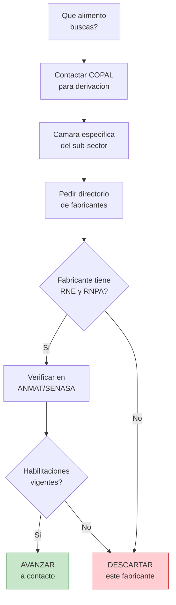

# Camaras del sector alimenticio

> La industria alimenticia es la **mas grande de Argentina** y tiene camaras muy organizadas con directorios completos de fabricantes. Sin embargo, este sector tiene requisitos especiales (bromatologia, habilitaciones sanitarias) que necesitas conocer antes de comprar.

## Por que el sector alimenticio es diferente

A diferencia de otros rubros, los alimentos tienen **regulaciones especiales** que impactan tanto al fabricante como al que revende:

- Los fabricantes deben tener **habilitacion bromatologica** (SENASA o autoridad provincial)
- Los productos necesitan **Registro Nacional de Establecimiento (RNE)** y **Registro Nacional de Producto Alimenticio (RNPA)**
- Hay requisitos de **rotulado** (etiquetado) obligatorio
- Algunos productos requieren **cadena de frio** y logistica especial

<Warning>
**Nunca compres alimentos de una fabrica sin habilitacion bromatologica.** Revender alimentos sin la trazabilidad correcta te expone a multas, decomiso de mercaderia y hasta causas penales si alguien se enferma. Siempre verifica que el fabricante tenga RNE y RNPA vigentes.
</Warning>

## Las principales camaras de alimentos

### COPAL — Coordinadora de Industrias de Productos Alimenticios

La **entidad madre** de la industria alimenticia argentina. Agrupa a la mayoria de las camaras especificas de alimentos.

| Dato | Detalle |
|------|---------|
| **Sitio web** | [copal.org.ar](https://www.copal.org.ar) |
| **Que agrupa** | 37+ camaras de distintos sub-sectores alimenticios |
| **Alcance** | Nacional |
| **Utilidad para vos** | Directorio de camaras por tipo de alimento, derivacion a fabricantes, informacion regulatoria |

**Como usarla:** COPAL funciona como un "directorio de directorios". Le decis que tipo de alimento buscas y te deriva a la camara especifica. Por ejemplo: si buscas fabricantes de galletitas, te conecta con la camara de productos de panificacion.

<Tip>
COPAL agrupa **mas de 37 camaras especificas** de sub-sectores alimenticios (lacteos, panificados, conservas, bebidas, golosinas, etc.). Es el mejor punto de entrada si no sabes exactamente por donde arrancar en alimentos.
</Tip>

### Camara de la Industria de la Alimentacion

Otra entidad importante que representa a fabricantes de alimentos a nivel nacional.

| Dato | Detalle |
|------|---------|
| **Sitio web** | [ciaranet.com.ar](https://www.ciaranet.com.ar) |
| **Sector** | Industria alimenticia general |
| **Alcance** | Nacional |
| **Utilidad para vos** | Contacto con fabricantes de alimentos diversos |

### Camaras regionales de alimentos

Muchas provincias tienen camaras alimenticias propias, particularmente utiles si buscas productos regionales o fabricas cerca de tu ubicacion.

| Region | Productos tipicos | Donde buscar |
|--------|-------------------|-------------|
| **Mendoza / San Juan** | Vinos, aceite de oliva, conservas, dulces | Camaras vitivinicolas, ProMendoza |
| **Cordoba** | Mani, lacteos, chacinados, alfajores | Agencia ProCordoba, camaras locales |
| **Tucuman** | Azucar, citricos, arándanos | Camaras citricolas, EEAOC |
| **Patagonia** | Chocolates, frutos finos, cervezas artesanales | Camaras regionales de cada provincia |
| **Entre Rios** | Citricos, arroz, avicultura | Camaras locales, CFI |
| **Buenos Aires (interior)** | Lacteos, carnes, panificados | Camaras locales por municipio |

## Sub-sectores alimenticios y sus camaras

COPAL tiene camaras para practicamente cada tipo de alimento. Estos son los mas relevantes para emprendedores:

| Sub-sector | Productos | Camara principal |
|-----------|-----------|-----------------|
| **Panificados y galletitas** | Galletas, pan, bizcochos | Camara de Industriales de Productos Alimenticios |
| **Golosinas y chocolates** | Caramelos, chocolates, alfajores | AADYND / camaras especificas |
| **Lacteos** | Quesos, yogures, dulce de leche | Centro de la Industria Lechera |
| **Conservas** | Conservas de frutas, verduras, encurtidos | Camaras regionales |
| **Bebidas** | Gaseosas, jugos, aguas saborizadas | Camaras de bebidas |
| **Yerba mate y te** | Yerba, te, infusiones | Camaras de yerba mate (Misiones) |
| **Productos organicos** | Alimentos certificados organicos | MAPO (Movimiento Argentino para la Produccion Organica) |

## Como buscar fabricas de alimentos paso a paso

<Steps>
  <Step title="Definir exactamente que tipo de alimento buscas">
    "Alimentos" es demasiado amplio. Necesitas definir: galletitas? conservas? snacks? salsas? Cuanto mas especifico, mas rapido encontras fabricantes.
  </Step>
  <Step title="Contactar COPAL para derivacion">
    Escribi a COPAL indicando el tipo de producto. Te van a derivar a la camara especifica del sub-sector.
  </Step>
  <Step title="Pedir directorio de fabricantes habilitados">
    Al contactar la camara especifica, pedí el listado de fabricantes asociados. Enfatizá que buscas fabricantes con **RNE y RNPA vigentes** (esto filtra automaticamente a los formales).
  </Step>
  <Step title="Verificar habilitaciones del fabricante">
    Antes de comprar, verificá en la web de ANMAT o SENASA que el establecimiento tenga:
    - Registro Nacional de Establecimiento (RNE) vigente
    - Registro Nacional de Producto Alimenticio (RNPA) para cada producto
    - Habilitacion bromatologica municipal o provincial
  </Step>
  <Step title="Evaluar logistica especial">
    Muchos alimentos requieren **cadena de frio** o condiciones especiales de almacenamiento. Antes de comprometerte con un producto, asegurate de poder cumplir con los requisitos de conservacion.
  </Step>
</Steps>

## Flujo de busqueda para alimentos

## Regulaciones clave que debes conocer

<Tabs>
  <Tab title="RNE y RNPA">
    **RNE (Registro Nacional de Establecimiento):** Certifica que la fabrica cumple con las condiciones sanitarias para producir alimentos. Sin RNE, la fabrica no puede operar legalmente.

    **RNPA (Registro Nacional de Producto Alimenticio):** Cada producto individual debe estar registrado. Una fabrica puede tener RNE pero no tener todos sus productos registrados.

    **Como verificar:** Busca en la web de ANMAT (anmat.gob.ar) o pedi el certificado directamente al fabricante.
  </Tab>
  <Tab title="Rotulado obligatorio">
    Todo alimento envasado debe tener etiqueta con: nombre del producto, ingredientes, informacion nutricional, fecha de vencimiento, RNE, RNPA, lote, y datos del fabricante.

    **Por que te importa:** Si revendes alimentos sin rotulado correcto, vos tambien sos responsable. Verifica que los productos que compras tengan etiquetado completo.
  </Tab>
  <Tab title="Cadena de frio">
    Productos refrigerados y congelados deben mantener temperatura controlada desde la fabrica hasta tu deposito. Necesitas: vehiculo refrigerado para transporte, heladera/freezer comercial para almacenamiento.

    **Consejo:** Si recien empezas, es mas facil arrancar con alimentos que **no requieren frio** (galletitas, conservas, snacks, yerba mate, miel, etc.).
  </Tab>
</Tabs>

<Tip>
Si recien empezas en alimentos, los productos **no perecederos y sin cadena de frio** son los mas faciles de manejar: galletitas, alfajores, yerba mate, miel, frutos secos, conservas. Requieren menos logistica y tienen mayor vida util, lo que reduce tu riesgo.
</Tip>

## Preguntas frecuentes

<Accordion title="Necesito habilitacion bromatologica YO para revender alimentos?">
Depende. Si solo revendes productos ya envasados y etiquetados por el fabricante, generalmente no necesitas habilitacion bromatologica propia (pero si un local o deposito habilitado si tenes stock). Si fracciones, re-envasas o manipulas el alimento, si necesitas habilitacion. Consulta con la autoridad bromatologica de tu municipio.
</Accordion>

<Accordion title="Puedo vender alimentos por MercadoLibre?">
Si, pero MercadoLibre tiene reglas estrictas para alimentos. Los productos deben estar envasados, etiquetados correctamente y cumplir con todas las regulaciones. No se permiten alimentos caseros sin habilitacion. Consulta las politicas de MercadoLibre para alimentos antes de publicar.
</Accordion>

<Accordion title="Las camaras de alimentos cobran por dar informacion?">
No. La informacion basica y la derivacion a fabricantes es gratuita. Algunos servicios especificos (capacitaciones, informes detallados del sector) pueden tener costo, pero pedir un directorio de asociados o consultar por fabricantes no tiene costo.
</Accordion>

## Siguiente paso

<Tip>
Si los alimentos no son tu rubro, explora las [camaras de metalurgia, plasticos y electronica](/app/paso1-argentina/encontrar-fabricas/camaras-metalurgia-plasticos) o las de [construccion, quimica y otros sectores](/app/paso1-argentina/encontrar-fabricas/camaras-construccion-quimica).
</Tip>
