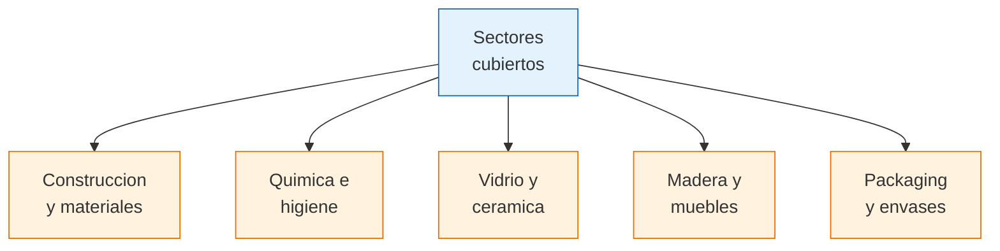

# Camaras de construccion, quimica y otros sectores

> Si buscas fabricantes de materiales de construccion, productos quimicos, envases, vidrio, madera o packaging, estas camaras son tu puerta de entrada. Cada sector tiene asociaciones especificas con directorios de fabricantes y contactos directos.

## Vision general de estos sectores

Estos sectores tienen algo en comun: producen **productos intermedios o materiales** que se usan en otras industrias o se venden al publico en ferreterias, corralones, bazares y distribuidoras. Son sectores con buen volumen y margenes interesantes.

## Sector construccion y materiales

### Camaras principales

| Camara | Sector | Web / Contacto | Productos |
|--------|--------|----------------|-----------|
| **Camara Argentina de la Construccion (CAMARCO)** | Construccion general | camarco.org.ar | Materiales de obra, herramientas, equipamiento |
| **Camara del Cemento Portland** | Cemento | No disponible publicamente | Cemento, hormigon, premezclados |
| **CAFAM** | Accesorios para muebles | cafam.com.ar | Herrajes, bisagras, correderas, manijas, tiradores |
| **Camara de la Madera** | Industria maderera | Varias por region | Maderas, tableros, MDF, melamina |
| **Camaras de ceramicos y porcelanatos** | Revestimientos | Por empresa | Pisos, azulejos, porcelanatos |

<Note>
**CAFAM** (Camara Argentina de Fabricantes de Accesorios para el Mueble) es una camara muy especifica pero extremadamente util si vendes herrajes, accesorios o insumos para muebleria. Sus asociados son fabricantes argentinos de alta calidad en un nicho con poca competencia importada.
</Note>

### Como usar las camaras de construccion

Los materiales de construccion suelen venderse a traves de **corralones y distribuidoras**, pero muchos fabricantes tambien venden directo. Las camaras te ayudan a:

- Identificar fabricantes por tipo de material
- Conocer precios de referencia del sector
- Acceder a ferias como **Batimat** (la mas importante de construccion en Argentina)

## Sector quimico e higiene

### Camaras principales

| Camara | Sector | Web / Contacto | Productos |
|--------|--------|----------------|-----------|
| **CIQyP (Camara de la Industria Quimica y Petroquimica)** | Quimica industrial | ciqyp.org.ar | Productos quimicos industriales |
| **CASRN (Camara Argentina de Sanitarios, Rociadores y Afines)** | Sanitarios | Sector especifico | Griferia, sanitarios |
| **Camara de productos de limpieza e higiene** | Limpieza | Varias | Detergentes, lavandina, limpiadores |
| **CAEHFA (Camara Argentina de Especialidades Farmaceuticas)** | Farmaceutica | caehfa.com.ar | Medicamentos, suplementos |

<Warning>
Los productos quimicos tienen **regulaciones especiales** de transporte, almacenamiento y etiquetado. Si planeas revender productos de limpieza o quimicos, investiga los requisitos de seguridad (fichas de seguridad SDS, etiquetado GHS) antes de comprar stock.
</Warning>

<Tip>
El sector de **productos de limpieza** es uno de los mas accesibles para emprendedores. Hay cientos de fabricas PyME en el Gran Buenos Aires que producen detergentes, lavandina, desodorantes de piso, etc. con marcas blancas y pedidos minimos bajos. Consulta a CAME para encontrar estas fabricas.
</Tip>

## Sector vidrio

### Camara de la Industria del Vidrio

| Dato | Detalle |
|------|---------|
| **Sector** | Fabricacion de productos de vidrio |
| **Productos** | Botellas, frascos, vasos, vidrio plano, espejos, vidrio templado, envases de vidrio |
| **Utilidad** | Si buscas envases de vidrio para tu producto, o productos de vidrio para reventa |

El vidrio es un sector relativamente concentrado en Argentina, con pocas fabricas grandes y varias medianas especializadas. La camara puede orientarte segun el tipo de producto de vidrio que necesites.

## Sector madera y muebles

### Camaras principales

| Camara | Sector | Productos |
|--------|--------|-----------|
| **FAIMA (Federacion Argentina de la Industria Maderera)** | Madera general | Maderas, tableros, aglomerados |
| **CAFAM** | Accesorios para muebles | Herrajes, sistemas de apertura, correderas |
| **Camaras regionales de muebles** | Muebleria | Muebles terminados por region |

<Note>
La industria del mueble en Argentina esta muy **regionalizada**. Hay polos muebleros importantes en: Esperanza (Santa Fe), Canuelas (Buenos Aires), San Martin (Buenos Aires), y varias localidades de Cordoba. Busca camaras locales de la zona que te quede mas cerca.
</Note>

## Sector packaging y envases

### Camaras principales

| Camara | Sector | Productos |
|--------|--------|-----------|
| **Camara Argentina del Envase** | Envases general | Envases de todo tipo de material |
| **Camara Argentina de la Industria Plastica (CAIP)** | Envases plasticos | Botellas plasticas, potes, bolsas, film |
| **Camara de la Industria del Vidrio** | Envases vidrio | Botellas, frascos |
| **Camaras de carton y papel** | Envases carton | Cajas, estuches, displays |

<Tip>
Si ya tenes un producto y necesitas **packaging personalizado** (cajas, bolsas, envases con tu marca), las camaras de envases pueden conectarte con fabricantes que hacen tiradas cortas para PyMEs. Es mas accesible de lo que parece.
</Tip>

## Como encontrar la camara de tu sector especifico

<Steps>
  <Step title="Definir el material o producto">
    Identifica exactamente que material o tipo de producto buscas. Por ejemplo: "herrajes para muebles", "envases de vidrio de 500ml", "productos de limpieza al por mayor".
  </Step>
  <Step title="Buscar la camara especifica en Google">
    Busca: `camara industria [tu producto] argentina`. Generalmente el primer resultado es la camara correcta.
  </Step>
  <Step title="Si no encontras camara especifica, usar CAME o UIA">
    Contacta a CAME o UIA explicando que producto buscas. Ellos conocen practicamente todas las camaras del pais y te van a derivar correctamente.
  </Step>
  <Step title="Revisar RUMP como complemento">
    El Registro Unico de la Matriz Productiva (RUMP) del Ministerio de Produccion permite buscar empresas por sector y ubicacion. Usalo como complemento a las camaras.
  </Step>
  <Step title="Contactar la camara y pedir directorio">
    Una vez identificada la camara correcta, escribi pidiendo el listado de fabricantes asociados que vendan por mayor. Mencioná tu ubicacion y volumen aproximado que manejas.
  </Step>
</Steps>

## Tabla resumen por sector

| Sector | Camara principal | Nivel de accesibilidad para emprendedores |
|--------|-----------------|------------------------------------------|
| **Construccion** | CAMARCO | Medio — pedidos minimos altos en materiales basicos |
| **Accesorios muebles** | CAFAM | Alto — buen nicho con pedidos accesibles |
| **Quimica / limpieza** | CIQyP / CAME | Alto — muchas PyMEs con marca blanca |
| **Vidrio** | Camara del Vidrio | Medio — pocas fabricas, pedidos mayores |
| **Madera / muebles** | FAIMA / CAFAM | Alto — muchas fabricas regionales |
| **Packaging** | Camara del Envase | Alto — fabricantes para tiradas cortas |

## Preguntas frecuentes

<Accordion title="Puedo comprar directo a una fabrica de materiales de construccion?">
Si, muchas fabricas venden directo al publico o a revendedores con descuento. Sin embargo, los materiales de construccion suelen tener **pedidos minimos altos** (por ejemplo, pallets completos de ladrillos o cemento). Las camaras pueden orientarte sobre fabricantes que manejen volumenes mas chicos.
</Accordion>

<Accordion title="Los productos quimicos necesitan habilitacion especial para revender?">
Depende del tipo de producto. Los productos de limpieza domestica generalmente no requieren habilitacion especial mas alla de tu actividad comercial registrada. Los productos quimicos industriales, pesticidas o productos con sustancias peligrosas si requieren habilitaciones especificas. Consulta con la autoridad local.
</Accordion>

<Accordion title="Que es CAFAM exactamente y por que es util?">
CAFAM es la Camara Argentina de Fabricantes de Accesorios para el Mueble. Agrupa a fabricantes de herrajes, bisagras, correderas, manijas, tiradores y todo tipo de accesorios para muebles de cocina, placard y hogar. Es util porque es un nicho especifico con fabricantes argentinos de calidad, ideal para vender a carpinterias y mueblerias.
</Accordion>

## Siguiente paso

<Tip>
Si tu sector no esta cubierto en esta pagina, revisa las [otras camaras sectoriales](/app/paso1-argentina/encontrar-fabricas/otras-camaras) donde encontraras cosmetica, juguetes, papeleria y mas. Tambien podes usar el [RUMP](/app/paso1-argentina/encontrar-fabricas/rump-matriz-productiva) para buscar por sector y ubicacion.
</Tip>
