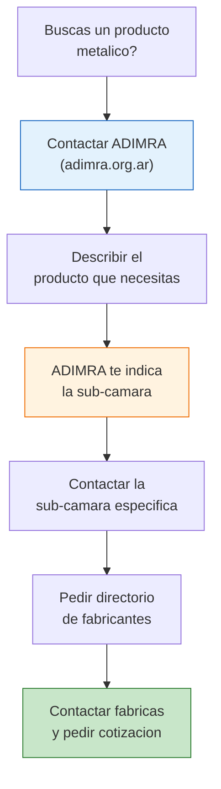

# Camaras de metalurgia, plasticos y electronica

> La industria metalurgica argentina es enorme y esta organizada en **mas de 30 sub-camaras especializadas** dentro de ADIMRA. Junto con CAIP (plasticos) y CADIEEL (electronica), estas camaras cubren una parte gigante de la produccion industrial del pais.

## ADIMRA — La organizacion madre de la metalurgia

### Que es ADIMRA

ADIMRA (Asociacion de Industriales Metalurgicos de la Republica Argentina) es la **entidad que agrupa a toda la industria metalurgica y metalmecanica** del pais. No es una sola camara, sino un sistema de **30+ camaras sectoriales** especializadas.

| Dato | Detalle |
|------|---------|
| **Sitio web** | [adimra.org.ar](https://www.adimra.org.ar) |
| **Miembros** | 30+ camaras sectoriales especializadas |
| **Alcance** | Nacional |
| **Sectores** | Todo lo que involucre metales: desde tornillos hasta maquinaria pesada |

<Note>
ADIMRA no es un directorio donde buscas una fabrica directamente. Es una **federacion de camaras**. Tu camino es: ADIMRA te indica la sub-camara correcta, y esa sub-camara te da el listado de fabricantes.
</Note>

### Las sub-camaras de ADIMRA

ADIMRA esta organizada por **especialidad metalurgica**. Cada sub-camara agrupa fabricas que trabajan con un proceso o producto especifico:

| Sub-camara | Especialidad | Productos tipicos |
|-----------|-------------|-------------------|
| **Fundicion** | Fundicion de metales | Piezas fundidas, lingotes, bloques |
| **Torneria** | Mecanizado por arranque de viruta | Piezas torneadas, ejes, bujes |
| **Estampado** | Conformado de chapa | Piezas estampadas, componentes automotrices |
| **Forja** | Conformado en caliente | Herramientas, componentes de alta resistencia |
| **Matriceria** | Fabricacion de matrices y moldes | Moldes de inyeccion, matrices de estampado |
| **Tratamientos termicos** | Endurecimiento de metales | Servicios de temple, cementacion, nitrurado |
| **Galvanoplastia** | Recubrimientos metalicos | Cromado, niquelado, zincado |
| **Herramientas** | Fabricacion de herramientas | Llaves, destornilladores, herramientas manuales |
| **Aceros inoxidables** | Productos de inox | Ollas, piletas, equipamiento gastronomico |
| **Cerrajeria** | Cerraduras y herrajes | Cerraduras, candados, herrajes de seguridad |
| **Aberturas** | Puertas y ventanas metalicas | Aberturas de aluminio, hierro, acero |
| **Maquinaria agricola** | Equipamiento agro | Sembradoras, cosechadoras, implementos |

<Tip>
Si no sabes a cual sub-camara de ADIMRA pertenece tu producto, contacta a ADIMRA directamente (adimra.org.ar) y deciles que producto buscas. Ellos te derivan a la sub-camara correcta en el momento.
</Tip>

### Como navegar las sub-camaras de ADIMRA

### Ejemplo practico

Si buscas un fabricante de **ollas de acero inoxidable**:

1. Contactas a ADIMRA
2. Te derivan a la sub-camara de **Aceros Inoxidables**
3. La sub-camara te da un listado de fabricantes de productos de acero inoxidable
4. Contactas a los fabricantes que hacen articulos de cocina

## CAIP — Camara Argentina de la Industria Plastica

### Que es CAIP

CAIP agrupa a los fabricantes de **productos plasticos** de todo tipo. Es una camara grande y bien organizada.

| Dato | Detalle |
|------|---------|
| **Sitio web** | [caip.org.ar](https://www.caip.org.ar) |
| **Sector** | Toda la industria plastica |
| **Productos** | Envases, juguetes, articulos del hogar, insumos industriales, bolsas, film, canerias |

### Sub-sectores dentro de CAIP

| Sub-sector | Productos | Oportunidad para emprendedores |
|-----------|-----------|-------------------------------|
| **Envases** | Botellas, potes, bidones | Alta — si necesitas envases para tu producto |
| **Hogar** | Baldes, organizadores, perchas | Alta — reventa en bazares y ML |
| **Construccion** | Canerias, accesorios sanitarios | Media — volumenes grandes |
| **Industrial** | Film stretch, bolsas, precintos | Alta — consumo constante |
| **Jugueteria** | Juguetes plasticos | Media — sector regulado |

<Note>
La industria plastica argentina fabrica una cantidad enorme de productos de uso cotidiano que se venden muy bien por MercadoLibre y en bazares: organizadores, contenedores, articulos de limpieza, perchas, baldes, etc. CAIP puede conectarte con estos fabricantes.
</Note>

## CADIEEL — Camara de Equipamiento Electrico y Electronico

### Que es CADIEEL

CADIEEL representa a los **distribuidores y fabricantes de equipamiento electrico y electronico** de Argentina.

| Dato | Detalle |
|------|---------|
| **Nombre completo** | Camara Argentina de Distribuidores de Equipamiento Electrico, Electronico y Luminotecnico |
| **Sector** | Material electrico, iluminacion, automatizacion, electronica |
| **Productos** | Cables, tableros, iluminacion LED, componentes electricos, automatizacion |

### Productos que encontras a traves de CADIEEL

| Categoria | Productos tipicos | Mercado |
|-----------|-------------------|---------|
| **Iluminacion** | Lamparas LED, plafones, reflectores | Muy bueno — iluminacion LED tiene alta demanda |
| **Material electrico** | Cables, fichas, prolongadores, zapatillas electricas | Constante — consumo permanente |
| **Tableros** | Tableros electricos, termomagneticas | Tecnico — requiere conocimiento |
| **Automatizacion** | Sensores, temporizadores, controles | Nicho tecnico |

<Tip>
Los productos de **iluminacion LED** y **material electrico basico** (zapatillas, prolongadores, fichas) son articulos con alta rotacion que se venden muy bien tanto en ferreterias como online. CADIEEL puede conectarte con fabricantes y distribuidores mayoristas argentinos.
</Tip>

## Tabla comparativa de las 3 camaras principales

| Camara | Sector | Cantidad de sub-sectores | Mejor para |
|--------|--------|--------------------------|------------|
| **ADIMRA** | Metalurgia y metalmecanica | 30+ sub-camaras | Productos metalicos de cualquier tipo |
| **CAIP** | Plasticos | 5+ sub-sectores | Envases, articulos hogar, insumos plasticos |
| **CADIEEL** | Electrico y electronico | Varios | Iluminacion, material electrico, componentes |

## Como contactar estas camaras

<Steps>
  <Step title="Identificar si tu producto es metalico, plastico o electrico">
    Esta es la primera division. Si tu producto involucra metal, anda a ADIMRA. Si es plastico, CAIP. Si es electrico o electronico, CADIEEL.
  </Step>
  <Step title="Visitar el sitio web de la camara">
    Busca secciones de asociados, directorio de empresas o miembros.
  </Step>
  <Step title="Enviar consulta especifica">
    Escribi un email claro indicando:
    - Que producto exacto buscas
    - En que zona te encontras
    - Que volumen aproximado manejas (aunque sea chico, decilo)
    - Que necesitas: listado de fabricantes, derivacion, informacion del sector
  </Step>
  <Step title="Preguntar por ferias y eventos sectoriales">
    Estas camaras organizan ferias tecnicas muy buenas. Las ferias metalurgicas y de plasticos suelen ser anuales y permiten conocer decenas de fabricantes en un solo dia.
  </Step>
</Steps>

<Warning>
En los sectores metalurgico y plastico, muchas fabricas trabajan exclusivamente B2B (empresa a empresa) con pedidos minimos altos. Cuando contactes fabricantes, preguntá siempre por el **pedido minimo** antes de avanzar. Algunas fabricas no venden menos de un pallet o una tonelada.
</Warning>

## Preguntas frecuentes

<Accordion title="ADIMRA tiene 30+ sub-camaras, como se cual necesito?">
No necesitas saberlo de antemano. Contacta a ADIMRA directamente y describiles el producto que buscas. Ellos saben exactamente a cual sub-camara derivarte. Es literalmente su funcion: organizar y conectar al sector metalurgico.
</Accordion>

<Accordion title="CAIP cubre juguetes plasticos?">
Si, la industria del juguete plastico esta parcialmente cubierta por CAIP. Sin embargo, los juguetes tienen su propia camara especifica (CAIJ — Camara Argentina de la Industria del Juguete). Si buscas juguetes especificamente, CAIJ es mejor opcion.
</Accordion>

<Accordion title="Puedo encontrar fabricantes de productos electronicos terminados?">
CADIEEL se enfoca mas en componentes, material electrico e iluminacion que en electronica de consumo (celulares, tablets, etc.). Para electronica de consumo, la produccion argentina es limitada y se concentra en Tierra del Fuego con regimen especial.
</Accordion>

<Accordion title="Cual de estos sectores es mejor para un emprendedor que recien arranca?">
Los **productos plasticos para el hogar** (a traves de CAIP) y la **iluminacion LED** (a traves de CADIEEL) son los mas accesibles para emprendedores. Tienen pedidos minimos relativamente bajos, alta demanda y buen margen de reventa.
</Accordion>

## Siguiente paso

<Tip>
Si tu producto no encaja en metalurgia, plasticos ni electronica, revisa las [otras camaras sectoriales](/app/paso1-argentina/encontrar-fabricas/otras-camaras) que cubren cosmetica, juguetes, papeleria, deportes y muchos rubros mas.
</Tip>
