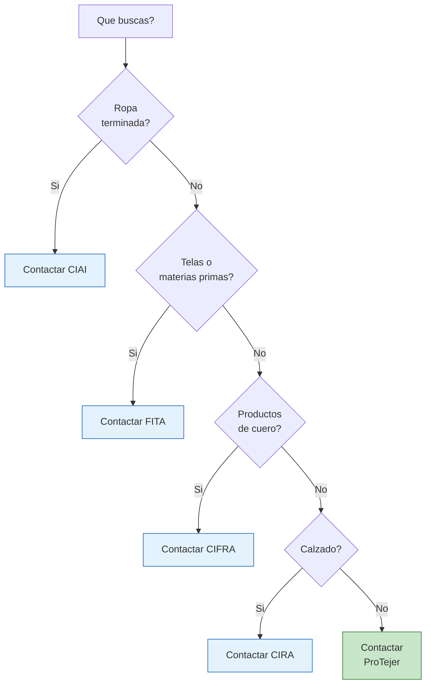

# Camaras del sector textil e indumentaria

> El sector textil y de indumentaria es uno de los mas organizados de Argentina. Las camaras de este rubro tienen **directorios detallados de fabricantes**, organizan ferias importantes y son un recurso invaluable para encontrar fabricas de ropa, telas, cuero y calzado.

## Por que las camaras textiles son especialmente utiles

La industria textil argentina tiene una caracteristica particular: esta **muy concentrada geograficamente** (principalmente en Buenos Aires, Gran Buenos Aires y algunas provincias) y **muy organizada gremialmente**. Esto significa que:

- Las camaras tienen listados muy completos de fabricantes
- Organizan ferias y exposiciones frecuentes donde podes ver productos en persona
- Muchas fabricas chicas solo se encuentran a traves de estas camaras
- La informacion de contacto suele estar actualizada

<Note>
El sector textil-indumentaria representa una de las mayores oportunidades para emprendedores porque hay miles de fabricas que producen desde cantidades chicas. Es uno de los rubros donde mas facil es arrancar comprando por mayor.
</Note>

## Las principales camaras textiles

### CIAI — Camara Industrial Argentina de la Indumentaria

La camara mas importante si buscas fabricas de **ropa y confeccion**.

| Dato | Detalle |
|------|---------|
| **Sitio web** | [ciaindumentaria.com.ar](https://www.ciaindumentaria.com.ar) |
| **Sector** | Confeccion de indumentaria (ropa de todo tipo) |
| **Que encontras** | Fabricas de remeras, pantalones, camperas, vestidos, ropa deportiva, uniformes |
| **Eventos** | Participa en ferias de moda y produce informes del sector |

**Como usarla:** Contactalos pidiendo orientacion sobre fabricantes de la prenda que te interesa. CIAI conoce el mapa completo de la confeccion argentina.

### FITA — Federacion Industrial Textil Argentina

Agrupa a los fabricantes de **telas y materias primas textiles**, no de ropa terminada.

| Dato | Detalle |
|------|---------|
| **Sitio web** | [fita.com.ar](https://www.fita.com.ar) |
| **Sector** | Fabricacion de hilados, tejidos, telas y materias primas textiles |
| **Que encontras** | Hilanderias, tejedurias, fabricas de telas, empresas de teñido y acabado |
| **Eventos** | Informes sectoriales, datos de produccion textil |

<Tip>
FITA es clave si queres fabricar tu propia marca de ropa. A traves de ella podes encontrar proveedores de telas por metro, que es el primer paso para producir indumentaria propia.
</Tip>

### ProTejer — Fundacion Pro Tejer

No es una camara tradicional sino una **fundacion que promueve la cadena de valor textil** completa.

| Dato | Detalle |
|------|---------|
| **Sitio web** | [protejer.org.ar](https://www.protejer.org.ar) |
| **Sector** | Toda la cadena textil: desde el algodon hasta la prenda terminada |
| **Que encontras** | Conexiones con fabricantes de toda la cadena, eventos networking, datos del sector |
| **Eventos** | Organiza encuentros y promueve la industria nacional textil |

**Como usarla:** ProTejer es ideal para entender como funciona la cadena textil completa y encontrar proveedores en cada eslabón (tela, confeccion, terminacion).

### CIFRA — Camara Industrial de las Manufacturas del Cuero

Si te interesan los productos de **cuero y marroquineria**.

| Dato | Detalle |
|------|---------|
| **Sitio web** | [cifra.org.ar](https://www.cifra.org.ar) |
| **Sector** | Manufacturas de cuero: carteras, billeteras, cinturones, bolsos, accesorios |
| **Que encontras** | Fabricas de marroquineria, curtiembres, proveedores de cuero |

### CIRA — Camara de la Industria del Calzado

Todo lo relacionado con **fabricacion de calzado**.

| Dato | Detalle |
|------|---------|
| **Sitio web** | [cira.org.ar](https://www.cira.org.ar) |
| **Sector** | Calzado de todo tipo: deportivo, casual, formal, infantil, laboral |
| **Que encontras** | Fabricas de zapatos, zapatillas, botas, sandalias y componentes (suelas, hormas) |

<Note>
La industria del calzado en Argentina esta muy concentrada en **zonas especificas**: Remedios de Escalada, San Martin, y algunas localidades del interior (como en Cordoba). CIRA puede orientarte a fabricantes por zona geografica.
</Note>

## Tabla resumen de todas las camaras textiles

| Camara | Sector | Web | Que producto buscar |
|--------|--------|-----|---------------------|
| **CIAI** | Indumentaria | ciaindumentaria.com.ar | Ropa terminada de todo tipo |
| **FITA** | Textil (materias primas) | fita.com.ar | Telas, hilados, tejidos |
| **ProTejer** | Cadena textil completa | protejer.org.ar | Cualquier eslabon textil |
| **CIFRA** | Cuero y marroquineria | cifra.org.ar | Carteras, cinturones, accesorios cuero |
| **CIRA** | Calzado | cira.org.ar | Zapatos, zapatillas, botas |

## Como acceder a los listados de fabricantes

<Steps>
  <Step title="Identificar que producto buscas exactamente">
    No es lo mismo buscar una fabrica de remeras que una de telas para remeras. Defini si necesitas **producto terminado** (CIAI, CIFRA, CIRA) o **materia prima** (FITA).
  </Step>
  <Step title="Visitar el sitio web de la camara correspondiente">
    Busca secciones como "Asociados", "Miembros", "Directorio" o "Empresas". Algunas camaras publican listados parciales en su web.
  </Step>
  <Step title="Contactar por email pidiendo el directorio">
    Si no hay listado publico, escribi un email claro:

    *"Buenos dias, soy emprendedor del rubro [X] y estoy buscando fabricantes de [producto especifico] que vendan por mayor. Podrian facilitarme un listado de asociados o derivarme a alguna empresa que pueda ayudarme? Gracias."*
  </Step>
  <Step title="Consultar por proximos eventos y ferias">
    Pregunta si hay ferias, exposiciones o ruedas de negocios proximas. Estos eventos son la **mejor oportunidad** para conocer fabricas en persona, ver productos y negociar condiciones.
  </Step>
  <Step title="Visitar ferias del sector textil">
    Las ferias textiles en Argentina son numerosas y accesibles. Generalmente se realizan en Buenos Aires y la entrada para compradores suele ser gratuita o de bajo costo.
  </Step>
</Steps>

## Flujo de decision para el sector textil

## Eventos y ferias textiles a tener en cuenta

Las camaras textiles organizan y participan en varias ferias anuales. Estos son los eventos mas relevantes para un emprendedor:

| Evento | Organizador | Frecuencia | Que encontras |
|--------|------------|------------|---------------|
| **Expotextil** | Varias camaras | Anual | Telas, maquinaria, insumos textiles |
| **Buenos Aires Moda** | Sector privado | Semestral | Indumentaria, tendencias, fabricantes |
| **Ferias regionales CAME** | CAME | Varias al anio | PyMEs textiles de todo el pais |

<Tip>
Las ferias son el lugar donde mas rapido podes armar una **lista de proveedores potenciales**. Lleva tarjetas personales (aunque sean simples), un cuaderno para anotar contactos y precios, y pregunta siempre por pedidos minimos y condiciones de pago.
</Tip>

<Warning>
No confundas fabricas con **talleres clandestinos**. Cuando contactes fabricantes a traves de camaras, estas accediendo a empresas formales que operan legalmente. Si un supuesto fabricante no tiene CUIT, no emite factura o te pide todo en efectivo, descartalo aunque el precio sea tentador.
</Warning>

## Siguiente paso

<Tip>
Si tu producto no es textil, explora las [camaras del sector alimenticio](/app/paso1-argentina/encontrar-fabricas/camaras-alimentos) o las de [metalurgia, plasticos y electronica](/app/paso1-argentina/encontrar-fabricas/camaras-metalurgia-plasticos). Si ya encontraste fabricas potenciales, avanza a [verificar su legitimidad](/app/paso1-argentina/evaluar-negociar/verificar-legitimidad).
</Tip>
