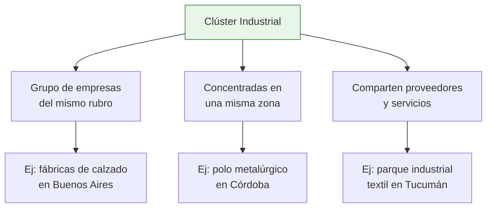
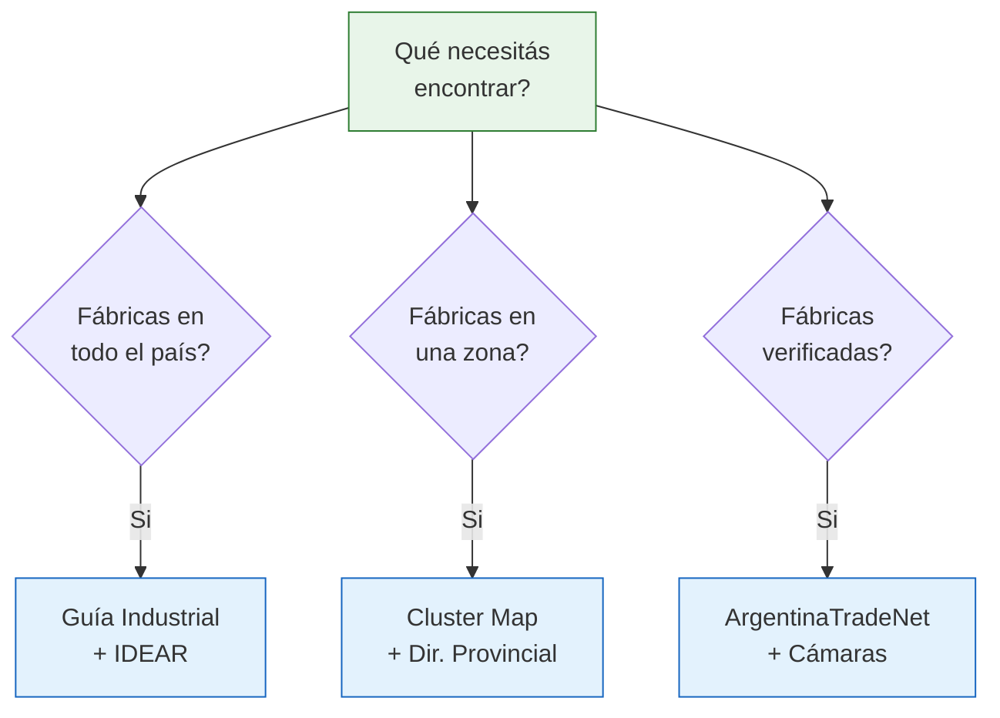

# Cluster Map, IDEP y otros directorios

Además de la Guía Industrial y ArgentinaTradeNet, existen otros directorios que te permiten encontrar fábricas en Argentina desde ángulos diferentes: por **clústeres productivos**, por **sector industrial** o por **región geográfica**.

## Cluster Map del IDEP

El **Instituto para el Desarrollo Empresarial de la Argentina (IDEP)** mantiene un mapa de clústeres industriales. Un "clúster" es una concentración de empresas del mismo rubro en una zona geográfica.

### Qué es un clúster industrial

### Para qué te sirve el Cluster Map

- **Visualizar dónde se concentra** cada industria en Argentina
- **Descubrir zonas productivas** que no conocías
- **Encontrar varias fábricas juntas** en una misma región (ahorrás tiempo de búsqueda)
- **Entender la cadena productiva** de cada sector

<Note>
Los clústeres son útiles porque donde hay una fábrica del rubro, suele haber varias más. Si viajás a visitar una, podés aprovechar y conocer otras en la misma zona.
</Note>

### Cómo usarlo

<Steps>
  <Step title="Accedé al mapa">
    Buscá el Cluster Map del IDEP en su sitio web. El mapa muestra los principales clústeres productivos de Argentina organizados por sector y ubicación.
  </Step>
  <Step title="Filtrá por sector">
    Seleccioná el sector industrial que te interese: alimentos, textil, metalurgia, madera, etc. El mapa te mostrará dónde se concentran las empresas de ese rubro.
  </Step>
  <Step title="Explorá cada clúster">
    Al hacer clic en un clúster, vas a ver información sobre las empresas que lo componen, la actividad principal y los datos de la zona productiva.
  </Step>
  <Step title="Usá la información para planificar">
    Con los datos del mapa, podés planificar visitas a zonas industriales y contactar a múltiples fábricas en un mismo viaje.
  </Step>
</Steps>

## IDEAR — Información de empresas argentinas

**IDEAR** es un directorio de empresas argentinas que permite búsquedas por sector productivo. Su enfoque es proporcionar información empresarial estructurada.

### Qué ofrece IDEAR

| Característica | Detalle |
|---------------|---------|
| **Tipo de búsqueda** | Por sector industrial, por nombre de empresa |
| **Información disponible** | Datos de contacto, actividad principal, ubicación |
| **Cobertura** | Empresas de todo el país |
| **Costo** | Acceso básico gratuito |
| **Actualización** | Variable, depende de las empresas registradas |

### Cómo buscar en IDEAR

1. Ingresá al sitio de IDEAR
2. Seleccioná el sector productivo que te interese
3. Revisá los listados de empresas por categoría
4. Anotá las que fabrican lo que estás buscando

## Directorios regionales y provinciales

Muchas provincias argentinas tienen sus propios directorios industriales. Estos son especialmente útiles si buscás fábricas en una zona específica:

<Tabs>
  <Tab title="Buenos Aires">
    - **Directorio industrial de PBA:** La provincia de Buenos Aires tiene el mayor parque industrial del país
    - **Ministerio de Producción PBA:** Suele tener listados de empresas por municipio
    - **Parques industriales:** Cada parque tiene un listado de empresas radicadas
    - Concentra aprox. el 50% de la industria argentina
  </Tab>
  <Tab title="Córdoba">
    - **Agencia Córdoba Inversión y Financiamiento:** Promueve la industria cordobesa
    - Fuerte en: automotriz, metalmecánica, alimentos, software
    - La segunda provincia industrial del país
  </Tab>
  <Tab title="Santa Fe">
    - **Gobierno de Santa Fe — Producción:** Directorio de empresas provinciales
    - Fuerte en: alimentos (lácteos, aceites), maquinaria agrícola, siderurgia
    - Zona de Rafaela: polo metalmecánico y de autopartes
  </Tab>
  <Tab title="Otras provincias">
    - **Mendoza:** Vinos, alimentos, metalmecánica
    - **Tucumán:** Textil, alimentos (azúcar, limón)
    - **San Luis:** Electrónica, plásticos (beneficios impositivos)
    - **Tierra del Fuego:** Electrónica, electrodomésticos (régimen especial)
  </Tab>
</Tabs>

## Tabla comparativa de directorios

| Directorio | Cobertura | Verificación | Gratis | Mejor para |
|-----------|-----------|-------------|--------|------------|
| **Guía Industrial Argentina** | Nacional, amplia | No (auto-registro) | Si | Búsqueda general de fábricas |
| **ArgentinaTradeNet** | Nacional, exportadores | Si (Cancillería) | Si | Empresas formales y con capacidad |
| **Cluster Map IDEP** | Nacional, por clústeres | Parcial | Si | Mapear zonas productivas |
| **IDEAR** | Nacional, por sector | No (auto-registro) | Si | Búsqueda por sector industrial |
| **Directorios provinciales** | Provincial | Variable | Si | Fábricas en una provincia específica |

## Cuándo usar cada directorio

<Tip>
La mejor estrategia es **cruzar información entre varios directorios**. Si una fábrica aparece en la Guía Industrial, en IDEAR y en un directorio provincial, tenés más confianza de que es una empresa real y activa.
</Tip>

## Limitaciones generales de los directorios

<Warning>
Todos los directorios industriales argentinos comparten estas limitaciones:

- **Información desactualizada:** Algunas empresas cerraron o cambiaron de rubro y siguen listadas
- **Cobertura parcial:** Ningún directorio tiene el 100% de las fábricas del país
- **Sesgo hacia empresas formales:** Las fábricas más chicas o informales no aparecen
- **Datos incompletos:** Muchas fichas tienen solo nombre y teléfono

**Siempre verificá** que la empresa esté activa antes de visitarla: llamá por teléfono, buscala en Google y consultá su CUIT en AFIP.
</Warning>

## Próximos pasos

Una vez que hayas explorado los directorios institucionales, complementá tu búsqueda con:

- [Directorios B2B y especializados](/app/paso1-argentina/encontrar-fabricas/otros-directorios) para plataformas comerciales
- [Ferias industriales](/app/paso1-argentina/encontrar-fabricas/ferias-principales) para conocer fabricantes en persona
