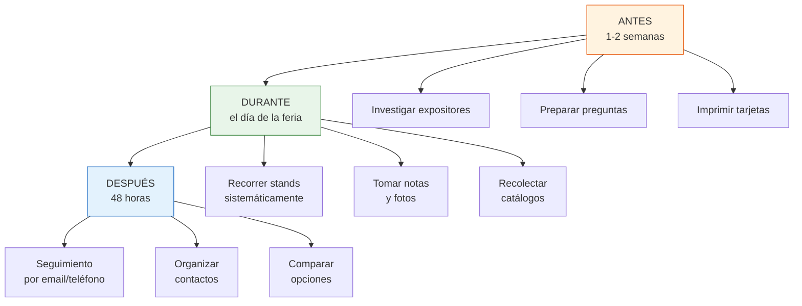

# Cómo aprovechar una feria industrial

Visitar una feria industrial sin preparación es como ir al supermercado sin lista: vas a pasear, te vas a cansar y probablemente vuelvas sin lo que necesitabas. Esta guía te enseña a convertir cada visita a una feria en una fuente real de contactos y oportunidades de negocio.

## El proceso completo



## ANTES de la feria

<Steps>
  <Step title="Investigá el listado de expositores">
    La mayoría de las ferias publican el listado de expositores en su sitio web semanas antes del evento. Revisalo y marcá los que te interesan. Esto te permite planificar tu recorrido y no perder tiempo en stands irrelevantes.
  </Step>
  <Step title="Prepará tus preguntas">
    Llevá una lista de preguntas para hacer en cada stand. Las preguntas clave son:
    - "Qué productos fabrican ustedes?" (no todos los expositores son fabricantes)
    - "Cuál es el pedido mínimo?"
    - "Tienen lista de precios para mayoristas/revendedores?"
    - "Cuáles son los plazos de entrega?"
    - "Hacen envíos al interior?" (si no sos de Buenos Aires)
    - "Tienen catálogo que me pueda llevar?"
  </Step>
  <Step title="Hacé tarjetas personales">
    No necesitás tarjetas lujosas. Podés imprimirlas en una imprenta rápida o incluso en tu casa. Lo mínimo que necesitan:
    - Tu nombre completo
    - Tu teléfono y WhatsApp
    - Tu email
    - A qué te dedicás (ej: "Comercialización de productos textiles")
  </Step>
  <Step title="Registrate online">
    Si la feria requiere registro previo, hacelo con tiempo. Muchas ferias te envían un código QR que agiliza el ingreso.
  </Step>
  <Step title="Planificá la logística">
    Definí cómo vas a llegar, a qué hora (idealmente cuando abre, antes de que se llene) y cuánto tiempo vas a quedarte (mínimo 3-4 horas para una feria grande).
  </Step>
</Steps>

<Tip>
Si la feria es grande (como FIMAQH o Expoagro), descargá el mapa del predio de la web oficial y marcá los stands que querés visitar. Planificá un recorrido lógico para no caminar de ida y vuelta.
</Tip>

## DURANTE la feria

### Qué llevar

| Item | Por qué |
|------|---------|
| **Mochila cómoda** | Vas a juntar muchos catálogos, folletos y muestras |
| **Tarjetas personales** | Para dejar tu contacto en cada stand (llevá al menos 30) |
| **Cuaderno o app de notas** | Para anotar precios, condiciones y observaciones |
| **Celular con batería** | Para fotos de productos y datos de contacto |
| **Cargador portátil** | Las ferias duran horas y vas a usar mucho el celular |
| **Agua y snack** | La comida en ferias suele ser cara y las filas largas |
| **Calzado cómodo** | Vas a caminar mucho durante varias horas |

### Cómo recorrer los stands

<Tabs>
  <Tab title="Enfoque sistemático (recomendado)">
    1. Empezá por los stands que marcaste como prioritarios
    2. En cada stand: presentate, preguntá si son fabricantes, hacé tus preguntas
    3. Pedí catálogo y tarjeta de contacto
    4. Anotá en tu cuaderno: nombre empresa, qué fabrican, precio aproximado, impresión general
    5. Sacá fotos de los productos que te interesan (siempre pedí permiso)
    6. Si queda tiempo, recorré los stands que no habías marcado
  </Tab>
  <Tab title="Enfoque exploratorio">
    Caminá todos los pasillos de forma ordenada (fila por fila). Este enfoque es mejor cuando no sabés bien qué buscás y querés descubrir oportunidades. Es más lento pero te permite ver todo lo que la feria ofrece.
  </Tab>
</Tabs>

### Cómo hablar con los vendedores

Si nunca hablaste con un vendedor industrial, no te preocupes. Son personas acostumbradas a atender consultas. Algunos consejos:

<Accordion title="Presentate de forma simple">
No necesitás un discurso elaborado. Algo como: "Hola, tengo un emprendimiento de [rubro] y estoy buscando proveedores de [producto]. Me pueden contar qué opciones manejan?" es suficiente.
</Accordion>

<Accordion title="No tengas vergüenza de ser nuevo">
Si sos nuevo en el rubro, no lo ocultes. Muchos vendedores prefieren explicarte todo desde cero y ganarse un cliente a largo plazo. Decí: "Estoy empezando, así que cualquier información me sirve."
</Accordion>

<Accordion title="Escuchá más de lo que hablás">
Dejá que el vendedor te explique sus productos, precios y condiciones. Tomá nota de todo. No interrumpas con objeciones ni negociaciones: eso viene después.
</Accordion>

<Accordion title="Pedí siempre material para llevar">
Catálogos, folletos, listas de precios, muestras. Todo lo que te puedan dar, aceptalo. Después en tu casa vas a poder comparar tranquilo.
</Accordion>

### Qué vestir

No hace falta ir de traje ni formal. La vestimenta ideal es:

- **Casual prolijo:** Jean, remera o camisa, zapatillas cómodas
- **Evitá:** Ropa demasiado informal (ojotas, musculosa) o demasiado formal (traje y corbata, salvo que vayas a un evento específico)
- **Pensá en comodidad:** Vas a caminar 4+ horas

## DESPUÉS de la feria

Esta es la parte más importante y la que la mayoría se olvida de hacer:

<Steps>
  <Step title="Organizá tus contactos (mismo día)">
    Esa misma noche o al día siguiente, organizá todo lo que juntaste:
    - Pasá los contactos a una planilla (nombre empresa, contacto, qué fabrican, precio estimado, observaciones)
    - Ordená los catálogos y folletos
    - Revisá las fotos que sacaste
  </Step>
  <Step title="Hacé seguimiento dentro de 48 horas">
    Contactá a las empresas que más te interesaron por email o WhatsApp. Mencioná que los conociste en la feria y recordales quién sos. Ejemplo:

    "Hola, soy [nombre], nos conocimos en [feria] en su stand. Me interesaron sus [productos]. Podrían enviarme la lista de precios y condiciones para revendedores?"
  </Step>
  <Step title="Compará opciones">
    Con toda la información organizada, compará los proveedores que encontraste: precios, mínimos de compra, calidad percibida, ubicación, plazos de entrega.
  </Step>
  <Step title="Agendá visitas a las fábricas finalistas">
    De tu lista final, seleccioná 3-5 fábricas para visitar en persona. La visita a la fábrica es el paso definitivo antes de hacer tu primera compra.
  </Step>
</Steps>

<Warning>
**El error más grave:** Ir a una feria, juntar 50 catálogos y después no contactar a nadie. Los vendedores de ferias reciben cientos de consultas: si no los contactás dentro de la primera semana, se van a olvidar de vos. El seguimiento rápido es lo que convierte una visita a una feria en un negocio real.
</Warning>

## Errores comunes de principiantes

| Error | Consecuencia | Qué hacer en cambio |
|-------|-------------|---------------------|
| Ir sin investigar expositores | Perdés tiempo en stands irrelevantes | Revisá el listado antes y marcá prioridades |
| No llevar tarjetas personales | No podés dejar tu contacto | Imprimí al menos 30 tarjetas |
| Comprometerse a comprar en la feria | Presión, malas decisiones, no podés comparar | Decí: "me interesa, voy a evaluarlo y los contacto" |
| No tomar notas | Al día siguiente no te acordás de nada | Anotá todo: empresa, producto, precio, impresión |
| No hacer seguimiento | Perdés todos los contactos conseguidos | Contactá dentro de 48 horas sin falta |
| Quedarse solo en el primer pasillo | Te perdés el 80% de la feria | Recorré todo, incluso los stands del fondo |

<Warning>
**Nunca compres ni te comprometas a comprar durante la feria.** Las ferias son para investigar, conocer proveedores y recopilar información. Las decisiones de compra se toman después, con calma, comparando opciones y verificando la legitimidad de las empresas. Si un vendedor te presiona para cerrar en el momento, es una mala señal.
</Warning>

## Plantilla de notas para la feria

Usá esta estructura para cada stand que visites:

```
Stand #: ___
Empresa: ___________________
Contacto: __________________ (nombre de la persona)
Teléfono/WhatsApp: __________
Email: _____________________
Qué fabrican: _______________
Precio aproximado: __________
Pedido mínimo: _____________
Plazo de entrega: ___________
Impresión general (1-5): ____
Notas: _____________________
```

<Tip>
Podés crear esta plantilla como nota en tu celular y copiarla para cada stand. Así completás rápido y después tenés toda la información digital lista para organizar.
</Tip>

## Resumen: las 3 reglas de oro

1. **Preparación:** Investigá antes, llevá preguntas, tarjetas y mochila
2. **Disciplina:** Recorré sistemáticamente, tomá notas, no te comprometas a comprar
3. **Seguimiento:** Contactá dentro de 48 horas y organizá lo que juntaste

<Tip>
Consultá el [calendario de ferias 2026](/app/paso1-argentina/encontrar-fabricas/calendario-ferias) para ver qué ferias se vienen y empezar a planificar tu primera visita.
</Tip>
