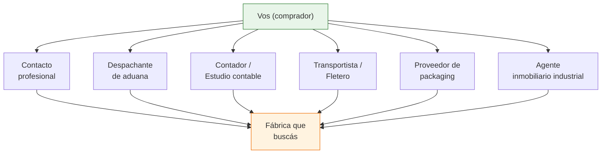
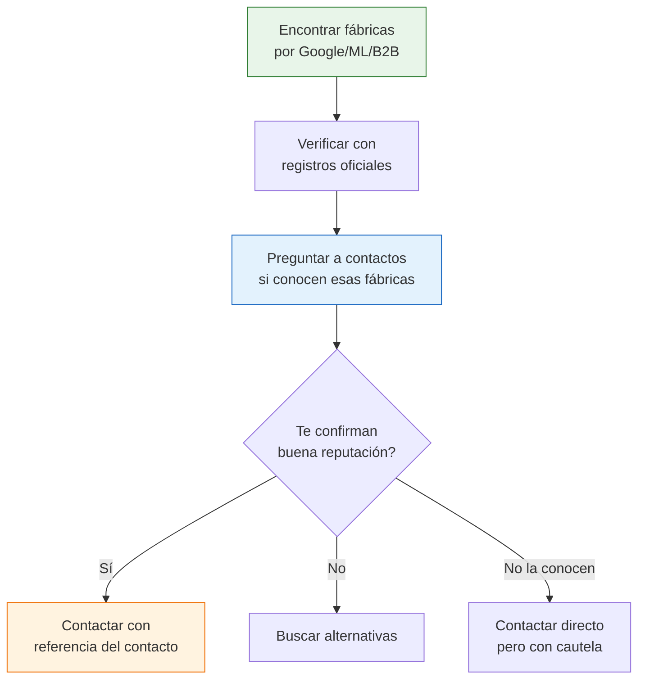

# Despachantes, contadores y contactos clave

> Algunas de las mejores fábricas argentinas no tienen presencia online, no participan en ferias y no están en ningún directorio. La única forma de llegar a ellas es a través de alguien que ya las conozca. Los despachantes de aduana, contadores de empresas industriales y otros profesionales tienen redes de contactos que pueden abrirte puertas que ninguna búsqueda en Google logra.

## Por qué los contactos indirectos son tan valiosos

En el mundo industrial argentino, muchas relaciones comerciales se construyen por recomendación. Un fabricante que recibe un llamado de un desconocido probablemente no lo atienda. Pero si ese mismo llamado viene referido por su contador, su despachante o su proveedor de packaging, la puerta se abre.

<Note>
Esta estrategia es la menos "escalable" de todas (no podés automatizarla ni hacerla masivamente), pero es la que genera los contactos de mayor calidad. Un referido tiene más peso que cualquier mensaje frío por LinkedIn o email.
</Note>

## Despachantes de aduana

### Por qué un despachante te puede ayudar

Los despachantes de aduana trabajan con empresas que importan y exportan. En el proceso, conocen:

- Qué fábricas argentinas exportan (señal de calidad y capacidad productiva)
- Qué empresas importan materias primas para fabricar (señal de que producen localmente)
- Qué rubros industriales están activos
- Qué empresas son confiables (trabajaron con ellas durante años)

| Ventaja del despachante | Detalle |
|------------------------|---------|
| **Red de contactos amplia** | Trabajan con decenas o cientos de empresas industriales |
| **Conocimiento del rubro** | Saben qué empresa fabrica qué producto |
| **Criterio de confiabilidad** | Conocen la reputación comercial de sus clientes |
| **Acceso a fabricantes que exportan** | Si exportan, su calidad suele ser superior |

### Cómo pedir referidos a un despachante

<Steps>
  <Step title="Encontrá un despachante">
    Buscá en Google: "despachante de aduana [tu ciudad]". También podés consultar el directorio del Centro Despachantes de Aduana de la República Argentina (CDA). Otra opción: pedí recomendación a tu contador o a otros comerciantes.
  </Step>
  <Step title="Contactá y explicá tu necesidad">
    No necesitás contratar al despachante para que te ayude. Explicale que estás buscando fábricas de un rubro específico y preguntá si conoce alguna que pueda interesarte. Muchos despachantes acceden a dar referencias como cortesía profesional o con la expectativa de que en el futuro los contrates.
  </Step>
  <Step title="Sé específico en lo que buscás">
    No digas "busco cualquier fábrica". Decí: "busco un fabricante de envases plásticos para alimentos, con capacidad para producir 10.000 unidades mensuales, preferentemente en zona sur de GBA". Cuanto más preciso seas, más fácil es para el despachante pensar en un contacto.
  </Step>
  <Step title="Ofrecé reciprocidad">
    Si el despachante te conecta con un fabricante, mencioná que si en el futuro necesitás servicios de comercio exterior, lo vas a tener en cuenta. La reciprocidad profesional mueve montañas.
  </Step>
</Steps>

<Tip>
Incluso si tu negocio es 100% doméstico (no importás ni exportás), un despachante de aduana puede ser un contacto valioso. Muchos de sus clientes fabrican para el mercado interno Y externo, y pueden conectarte con la parte de venta local.
</Tip>

## Contadores y estudios contables

### Por qué un contador conoce fábricas

Los contadores y estudios contables que atienden empresas industriales tienen una visión privilegiada del mercado:

- Conocen la facturación real de sus clientes (saben quién produce en serio)
- Saben qué rubros están creciendo y cuáles están en baja
- Tienen contacto directo con dueños de PyMEs industriales
- Pueden recomendar fabricantes confiables dentro de su cartera de clientes

### Cómo pedir referidos a un contador

| Paso | Acción |
|------|--------|
| 1 | Hablá con tu propio contador y contale qué tipo de fábrica buscás |
| 2 | Pedile que piense si entre sus clientes hay algún fabricante del rubro |
| 3 | Si no tiene, preguntá si conoce algún colega que atienda empresas industriales |
| 4 | Un estudio contable grande suele tener 50-100 clientes de diversos rubros |

<Warning>
El contador tiene obligación de confidencialidad con sus clientes. No le pidas datos financieros ni información sensible. Lo que le pedís es simplemente: "si conocés algún fabricante de [producto] que esté abierto a nuevos clientes, te agradecería la referencia". Es una consulta legítima y habitual.
</Warning>

## Otros contactos clave

Además de despachantes y contadores, hay otros profesionales que pueden conectarte con fábricas:

### Transportistas y empresas de flete

| Por qué son útiles | Detalle |
|-------------------|---------|
| **Conocen las fábricas por dentro** | Pasan todos los días a cargar y descargar mercadería |
| **Saben quién produce y quién no** | Distinguen fábricas activas de depósitos |
| **Cubren zonas industriales** | Conocen todas las empresas de su zona de reparto |

### Proveedores de packaging e insumos

| Por qué son útiles | Detalle |
|-------------------|---------|
| **Venden a muchas fábricas del mismo rubro** | Conocen a todos los fabricantes de un sector |
| **Saben quién está creciendo** | Las fábricas que piden más packaging están produciendo más |
| **Pueden recomendar clientes suyos** | Si vos comprás al fabricante, el proveedor de packaging también gana |

### Agentes inmobiliarios industriales

| Por qué son útiles | Detalle |
|-------------------|---------|
| **Alquilan galpones y plantas** | Conocen qué empresa ocupa cada inmueble industrial |
| **Saben de mudanzas y aperturas** | Están al tanto de nuevas fábricas que se instalan |
| **Manejan zonas industriales** | Son especialistas en la geografía industrial de su zona |

<Note>
Un agente inmobiliario que se especializa en inmuebles industriales conoce prácticamente todas las fábricas de su zona. Si le preguntás quién fabrica determinado producto en la zona, es probable que te pueda dar nombres y direcciones.
</Note>

## Cómo pedir referidos de forma profesional

Independientemente de a quién le pidas referidos, hay reglas que aplican a todos:

<Tabs>
  <Tab title="Lo que SÍ hacer">
    - Presentate profesionalmente (quién sos, qué hacés)
    - Sé específico en lo que buscás (producto, volumen, zona)
    - Explicá por qué buscás un fabricante (compra mayorista, nueva línea de producto)
    - Ofrecé algo a cambio (reciprocidad, recomendación mutua)
    - Agradecé siempre, haya o no resultado
    - Mencioná quién te recomendó (si aplica) para generar cadena de confianza
  </Tab>
  <Tab title="Lo que NO hacer">
    - No pidas información confidencial sobre empresas
    - No presiones si la persona dice que no puede ayudarte
    - No uses el nombre de alguien como referencia sin su permiso
    - No contactes al fabricante diciendo cosas que el referente no dijo
    - No dejes de hacer seguimiento: si te dieron un nombre, usalo
  </Tab>
</Tabs>

## Tabla resumen de contactos clave

| Tipo de contacto | Qué puede aportar | Cómo encontrarlo | Costo |
|-------------------|-------------------|-------------------|-------|
| **Despachante de aduana** | Fabricantes que exportan, red industrial amplia | Directorio CDA, Google, referidos | Gratis (consulta) |
| **Contador / estudio contable** | Fabricantes PyME de su cartera de clientes | Tu propio contador, referidos | Gratis (consulta) |
| **Transportista / fletero** | Fábricas activas en su zona de reparto | Google, parques industriales | Gratis |
| **Proveedor de packaging** | Fabricantes de tu rubro que compran packaging | Google, cámaras del rubro | Gratis |
| **Inmobiliario industrial** | Toda empresa que opera en su zona | Google: "galpones industriales [zona]" | Gratis |

## Estrategia combinada

La forma más efectiva de usar contactos indirectos es combinarlos con las otras fuentes de búsqueda:

<Tip>
La mejor combinación es: encontrar la fábrica por medios digitales (Google, MercadoLibre, directorios) y después usar un contacto profesional para validar su reputación y, si es posible, que te refiera. Así llegás al fabricante ya con información y con respaldo.
</Tip>

## Siguiente paso

Con todas las fuentes cubiertas (plataformas digitales, rondas, parques industriales, redes y contactos profesionales), ya tenés las herramientas para armar tu lista de fábricas candidatas. El paso siguiente es [evaluar y negociar](/app/paso1-argentina/evaluar-negociar/introduccion) con las que selecciones.
