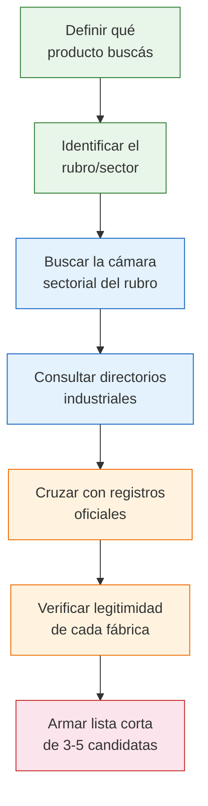

# Estrategia de búsqueda de fábricas

> No todas las fuentes sirven para lo mismo. Antes de salir a buscar, definí QUÉ necesitás encontrar y esta guía te dice exactamente POR DÓNDE empezar.

## Matriz de decisión: qué buscás y dónde ir

Dependiendo de tu objetivo, las fuentes óptimas cambian completamente:

| Lo que necesitás | Fuente principal | Fuente complementaria |
|-----------------|-----------------|----------------------|
| **Fabricantes de un rubro específico** | Cámara sectorial del rubro | Guía Industrial Argentina |
| **Verificar que una fábrica existe** | Registro Nacional de Sociedades | RIN + consulta ARCA |
| **Comprar directo al por mayor** | Plataformas B2B + MercadoLibre mayorista | Contacto directo (Google Maps) |
| **Conocer fabricantes en persona** | Ferias industriales (FIAR, sectoriales) | Visita a parques industriales |
| **Fabricantes que exportan** | ArgentinaTradeNet | Cámaras bilaterales de comercio |
| **Buscar por zona geográfica** | Parques industriales + Guía Industrial | Registros provinciales (RAI) |
| **Fabricantes certificados** | INTI | INPI (marcas y patentes) |

<Tip>
Si estás arrancando de cero y no sabés por dónde empezar, la combinación **Cámara sectorial + Guía Industrial** te va a dar los primeros resultados más rápido. Empezá por ahí.
</Tip>

## Proceso recomendado paso a paso

<Steps>
  <Step title="Definí qué producto buscás">
    Sé lo más específico posible. No es lo mismo buscar "ropa" que "remeras de algodón para hombre talle S a XL". Cuanto más específico seas, más fácil es encontrar el fabricante correcto.
  </Step>
  <Step title="Identificá el rubro o sector industrial">
    Cada producto pertenece a un sector: textil, alimentos, metalúrgico, plástico, químico, etc. Esto define qué cámara sectorial y qué directorio usar.
  </Step>
  <Step title="Buscá en la cámara sectorial">
    Las cámaras empresariales agrupan fabricantes por rubro. Muchas publican listados de socios. Por ejemplo, la Fundación Pro Tejer lista fabricantes textiles.
  </Step>
  <Step title="Consultá directorios industriales">
    La Guía Industrial Argentina y directorios similares permiten buscar por producto, rubro o zona geográfica. Complementan lo que encontraste en la cámara.
  </Step>
  <Step title="Cruzá con registros oficiales">
    Usá el RIN, RAI (si es CABA) o registros provinciales para verificar que la empresa está registrada como industrial. El INPI te muestra marcas y patentes asociadas.
  </Step>
  <Step title="Verificá legitimidad">
    Antes de contactar, verificá el CUIT en el Registro Nacional de Sociedades y en ARCA. Esto confirma que la empresa existe legalmente.
  </Step>
  <Step title="Armá tu lista corta">
    Seleccioná las 3 a 5 fábricas más prometedoras. Vas a contactarlas a todas para comparar precios, mínimos y condiciones.
  </Step>
</Steps>

## Ranking de fuentes por efectividad

No todas las fuentes rinden igual. Acá va un ranking práctico basado en qué tan fácil es obtener resultados concretos:

| Prioridad | Fuente | Facilidad de uso | Calidad de datos | Costo |
|-----------|--------|------------------|------------------|-------|
| 1 | **Cámaras sectoriales** | Media | Alta | Gratis |
| 2 | **Guía Industrial Argentina** | Alta | Alta | Gratis (versión web) |
| 3 | **MercadoLibre mayorista** | Alta | Media | Gratis |
| 4 | **Google Maps + búsqueda directa** | Alta | Variable | Gratis |
| 5 | **Ferias industriales** | Alta (presencial) | Muy alta | Entrada (variable) |
| 6 | **INTI** | Media | Alta | Gratis (consulta) |
| 7 | **Registros oficiales (RIN, RAI)** | Baja | Alta | Gratis |
| 8 | **ArgentinaTradeNet** | Media | Alta | Gratis |

<Note>
Las cámaras sectoriales están en el primer lugar porque sus socios son fabricantes verificados. Cuando una empresa paga cuota de una cámara, eso ya es una señal de que es una empresa real y activa.
</Note>

## Cuántas fábricas buscar

Para tu primera compra, la recomendación es:

- **Mínimo 3 fábricas** del mismo rubro para poder comparar
- **Ideal 5 fábricas** para tener un panorama completo del mercado
- **Máximo 8 fábricas** porque más que eso se vuelve difícil de gestionar

<Warning>
No te quedes con la primera fábrica que encontrés. Siempre compará al menos 3 opciones. Las diferencias de precio entre fábricas del mismo rubro pueden ser de **20% a 50%** por el mismo tipo de producto.
</Warning>

## Qué información recopilar de cada fábrica

Cuando encuentres una fábrica candidata, anotá siempre:

| Dato | Por qué importa |
|------|-----------------|
| **Razón social y CUIT** | Para verificar legalmente |
| **Dirección física** | Para confirmar que tienen planta |
| **Teléfono y email** | Para contactar |
| **Productos que fabrican** | Para confirmar que hacen lo que buscás |
| **Fuente donde la encontraste** | Para referencia futura |
| **Fecha del dato** | La info caduca, necesitás saber si es actual |

<Tip>
Armá una planilla simple (Google Sheets o Excel) con estos campos. Cuando tengas tus 3-5 candidatas cargadas, pasá a la etapa de [evaluación y negociación](/app/paso1-argentina/evaluar-negociar/introduccion).
</Tip>

## Siguiente paso

Empezá explorando los [registros oficiales del Estado](/app/paso1-argentina/encontrar-fabricas/rin-registro-industrial), que es la fuente con mayor respaldo legal. Después complementá con cámaras y directorios.
