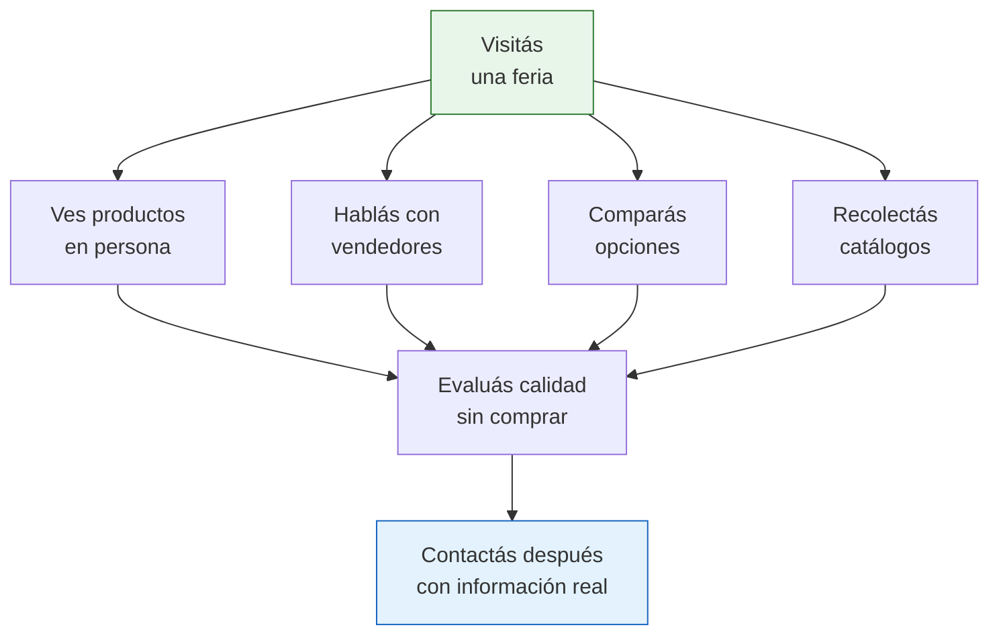

# Principales ferias industriales de Argentina

Las ferias industriales son eventos donde los fabricantes exhiben sus productos, maquinaria y servicios. Para alguien que busca fábricas para comprar mercadería, **una feria vale más que cien búsquedas en internet**: ves los productos en vivo, hablás cara a cara con los vendedores y podés comparar opciones en un mismo lugar.

## Por qué visitar ferias si sos principiante

<Note>
No necesitás ser un experto ni tener una empresa grande para visitar una feria industrial. La mayoría son abiertas al público o requieren solo un registro gratuito. Los expositores QUIEREN que los visites: están ahí para vender.
</Note>

## Las 10 ferias industriales más importantes

### FIMAQH — Maquinaria y Herramienta

| Dato | Detalle |
|------|---------|
| **Nombre completo** | Feria Internacional de la Máquina-Herramienta y Tecnologías para la Producción |
| **Sector** | Maquinaria industrial, herramientas, tecnología de producción |
| **Expositores** | Más de 300 empresas |
| **Frecuencia** | Bienal (cada 2 años) |
| **Lugar** | Tecnópolis, Buenos Aires |
| **Entrada** | Gratuita con registro previo |
| **Ideal para** | Quien busca maquinaria, insumos industriales o quiere entender procesos de fabricación |

### Expoagro

| Dato | Detalle |
|------|---------|
| **Nombre completo** | Expoagro — Muestra Internacional del Campo |
| **Sector** | Agroindustria, maquinaria agrícola, insumos rurales |
| **Expositores** | Cientos de empresas nacionales e internacionales |
| **Frecuencia** | Anual (marzo) |
| **Lugar** | Rota entre provincias (San Nicolás, Corrientes, etc.) |
| **Entrada** | Paga (aprox. USD 5-15 según día) |
| **Ideal para** | Quien busca productos agroindustriales o maquinaria rural |

### EMITEX — Textil y Confección

| Dato | Detalle |
|------|---------|
| **Nombre completo** | EMITEX — Exposición Internacional de Proveedores de la Industria de la Confección |
| **Sector** | Textil, confección, insumos para indumentaria |
| **Expositores** | Proveedores de telas, avíos, maquinaria textil |
| **Frecuencia** | Anual |
| **Lugar** | Buenos Aires (Centro Costa Salguero u otro predio) |
| **Entrada** | Gratuita con registro |
| **Ideal para** | Quien quiere vender ropa o productos textiles |

### Automechanika Buenos Aires

| Dato | Detalle |
|------|---------|
| **Nombre completo** | Automechanika Buenos Aires |
| **Sector** | Industria automotriz, autopartes, accesorios, equipamiento |
| **Expositores** | Fabricantes nacionales e internacionales de autopartes |
| **Frecuencia** | Bienal |
| **Lugar** | Buenos Aires (La Rural o Centro Costa Salguero) |
| **Entrada** | Gratuita con registro previo |
| **Ideal para** | Quien busca autopartes, accesorios o productos automotrices |

### ARMINERA — Minería

| Dato | Detalle |
|------|---------|
| **Nombre completo** | ARMINERA — Exposición Internacional de la Minería |
| **Sector** | Minería, equipamiento minero, servicios para minería |
| **Expositores** | Más de 400 empresas |
| **Frecuencia** | Bienal |
| **Lugar** | Buenos Aires (Centro Costa Salguero) |
| **Entrada** | Con registro previo |
| **Ideal para** | Quien busca proveedores del sector minero |

### FITEMA — Madera y Tecnología

| Dato | Detalle |
|------|---------|
| **Nombre completo** | FITEMA — Feria Internacional de Tecnología de la Madera |
| **Sector** | Madera, muebles, maquinaria para madera |
| **Expositores** | Más de 250 expositores |
| **Frecuencia** | Bienal |
| **Lugar** | Buenos Aires |
| **Entrada** | Con registro previo |
| **Ideal para** | Quien busca muebles, aberturas o productos de madera |

### Otras ferias relevantes

<Tabs>
  <Tab title="Expo Industria y Servicios">
    Punto de encuentro de la industria argentina en general. Participan fabricantes de múltiples sectores. Útil para un panorama amplio de la oferta industrial. Se realiza generalmente en Buenos Aires.
  </Tab>
  <Tab title="Somos Industria">
    Organizada por parques industriales. Exposición donde los fabricantes de distintos parques industriales muestran sus productos. Muy útil para descubrir fábricas que no tienen presencia online.
  </Tab>
  <Tab title="Intersec Buenos Aires">
    Feria internacional de seguridad, protección contra incendios y seguridad industrial. Ideal si buscás productos de seguridad, EPP (elementos de protección personal) o sistemas de protección.
  </Tab>
  <Tab title="AOG — Oil & Gas">
    Argentina Oil & Gas Expo. Feria del sector petrolero y gasífero. Muy especializada, orientada a empresas del sector energético. Útil solo si tu negocio está vinculado a esa industria.
  </Tab>
</Tabs>

## Tabla comparativa: cuál feria te conviene

| Feria | Sector | Expositores | Frecuencia | Utilidad para revendedor |
|-------|--------|-------------|-----------|--------------------------|
| **FIMAQH** | Maquinaria industrial | +300 | Bienal | Media (más para quien fabrica) |
| **Expoagro** | Agroindustria | Cientos | Anual | Alta si vendés productos rurales |
| **EMITEX** | Textil/confección | Decenas | Anual | Muy alta para ropa y textiles |
| **Automechanika** | Automotriz | Decenas | Bienal | Alta para autopartes |
| **ARMINERA** | Minería | +400 | Bienal | Baja (muy especializada) |
| **FITEMA** | Madera/muebles | +250 | Bienal | Alta para muebles y aberturas |
| **Somos Industria** | Multisector | Variable | Anual | Muy alta (variedad de fábricas) |
| **Expo Industria** | Multisector | Variable | Anual | Alta (panorama general) |

## Cuáles visitar si sos principiante

<Tip>
Si estás empezando y todavía no definiste bien tu rubro, las ferias **multisector** como Somos Industria y Expo Industria y Servicios son las mejores opciones. Te permiten ver muchos rubros diferentes en un solo día y descubrir oportunidades que no habías considerado.

Si ya sabés qué querés vender, andá directamente a la feria de tu sector (EMITEX para textil, Automechanika para automotriz, etc.).
</Tip>

## Costos orientativos

| Concepto | Costo aproximado (febrero 2026) |
|----------|--------------------------------|
| **Entrada a la mayoría de las ferias** | Gratuita con registro previo |
| **Expoagro (con entrada paga)** | Aprox. USD 5-15 |
| **Estacionamiento** | Aprox. USD 3-10 |
| **Transporte (Buenos Aires)** | Variable según distancia |
| **Almuerzo en la feria** | Aprox. USD 5-15 |

<Warning>
Los costos de entrada pueden cambiar de edición en edición. Siempre verificá en el sitio web oficial de cada feria antes de ir. Muchas ferias que antes eran pagas ahora son gratuitas con registro previo, y viceversa.
</Warning>

## Qué esperar en una feria industrial

Si nunca fuiste a una feria industrial, esto es lo que vas a encontrar:

- **Stands de empresas** exhibiendo productos, máquinas y muestras
- **Representantes comerciales** disponibles para charlar y responder preguntas
- **Catálogos y folletos** gratuitos para llevar
- **Demostraciones en vivo** de productos y maquinaria
- **Charlas y conferencias** sobre temas del sector (generalmente gratuitas)
- **Otros visitantes** como vos, buscando proveedores y oportunidades

<Tip>
Para sacar el máximo provecho de una feria, leé nuestra guía [Cómo aprovechar una feria industrial](/app/paso1-argentina/encontrar-fabricas/como-aprovechar-feria) con consejos prácticos de antes, durante y después del evento.
</Tip>
