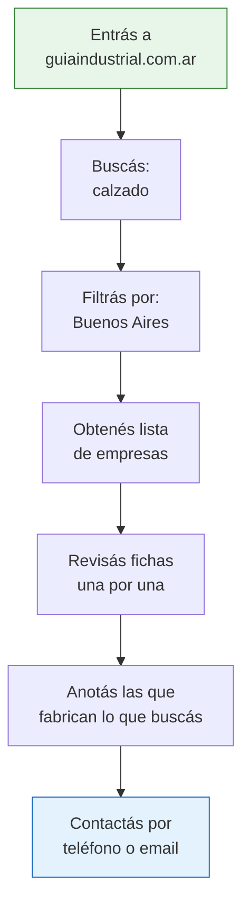

# Guía Industrial Argentina

La **Guía Industrial Argentina** (guiaindustrial.com.ar) es el directorio industrial más completo del país. Funciona como una "guía telefónica" de fábricas argentinas donde podés buscar empresas por sector, ubicación geográfica o tipo de producto.

## Qué es y para qué sirve

Es un directorio online gratuito que cataloga miles de empresas industriales argentinas. Las propias empresas se registran y cargan su información, lo que significa que:

- **Ventaja:** Las empresas que aparecen *quieren* ser encontradas por compradores
- **Ventaja:** La información de contacto suele estar actualizada (la cargan ellos mismos)
- **Limitación:** No todas las fábricas de Argentina están registradas, solo las que se dieron de alta

<Note>
Es el directorio industrial más grande del país, pero no es una base de datos oficial del Estado. Las empresas se registran voluntariamente. Que una fábrica NO aparezca acá no significa que no exista.
</Note>

## Qué información encontrás de cada empresa

Cada ficha de empresa en la Guía Industrial puede incluir:

| Dato | Descripción | Utilidad para vos |
|------|-------------|-------------------|
| **Razón social** | Nombre legal de la empresa | Verificar en AFIP si existe |
| **Rubro / actividad** | Qué fabrica o qué servicio ofrece | Filtrar por lo que necesitás |
| **Dirección** | Ubicación física de la planta | Planificar visitas |
| **Provincia / ciudad** | Ubicación geográfica | Buscar fábricas cerca tuyo |
| **Teléfono** | Número de contacto directo | Llamar y consultar |
| **Email** | Correo electrónico | Enviar consultas escritas |
| **Sitio web** | Página de la empresa (si tiene) | Ver catálogo y más info |
| **Descripción** | Texto libre sobre la empresa | Entender qué hacen exactamente |

<Warning>
No todas las fichas tienen todos los datos completos. Algunas empresas cargan solo lo básico (nombre, rubro y teléfono). Si una ficha tiene poca información, no la descartes: puede ser una fábrica excelente con poca presencia digital.
</Warning>

## Cómo buscar paso a paso

<Steps>
  <Step title="Ingresá al sitio">
    Abrí tu navegador y entrá a **guiaindustrial.com.ar**. La página principal muestra un buscador y categorías principales.
  </Step>
  <Step title="Elegí tu método de búsqueda">
    Tenés varias formas de buscar:
    - **Por palabra clave:** Escribí el producto que buscás (ej: "envases plásticos")
    - **Por rubro / categoría:** Navegá por las categorías industriales del directorio
    - **Por provincia:** Filtrá por ubicación geográfica
  </Step>
  <Step title="Refiná los resultados">
    Si la búsqueda por palabra clave te da demasiados resultados, combiná filtros. Por ejemplo: buscá "envases" y filtrá por "Buenos Aires" para acotar a tu zona.
  </Step>
  <Step title="Revisá las fichas">
    Abrí las fichas de las empresas que te interesen. Anotá: nombre, teléfono, email, dirección y qué fabrican exactamente.
  </Step>
  <Step title="Contactá a las empresas">
    Con la información recopilada, llamá o enviá un email presentándote como comprador. Preguntá por catálogo, mínimos de compra y lista de precios.
  </Step>
</Steps>

## Ejemplo práctico de búsqueda

Supongamos que querés encontrar **fábricas de calzado** en la **provincia de Buenos Aires**:

<Tip>
Probá con sinónimos y variaciones. Si buscás "calzado" y encontrás pocos resultados, intentá también con "zapatos", "zapatillas" o "industria del calzado". Cada empresa carga su descripción con palabras diferentes.
</Tip>

## Trucos para búsquedas efectivas

<Accordion title="Buscá por materia prima, no solo por producto final">
Si buscás fábricas de muebles, probá buscar también "carpintería industrial", "madera", "tableros" o "melamina". A veces las fábricas se describen por la materia prima que trabajan, no por el producto final.
</Accordion>

<Accordion title="Usá los rubros como punto de partida">
Navegá por las categorías del directorio aunque no sepas exactamente qué buscar. Muchas veces descubrís fábricas y productos que no sabías que existían en Argentina.
</Accordion>

<Accordion title="No descartes empresas con fichas incompletas">
Muchas PyMEs industriales argentinas tienen excelentes productos pero poca presencia digital. Una ficha con solo un teléfono puede llevar a una fábrica muy buena. Llamá siempre.
</Accordion>

<Accordion title="Cruzá la información con otras fuentes">
Si encontrás una empresa en la Guía Industrial, buscala también en AFIP (para verificar que existe y está activa) y en Google Maps (para confirmar la dirección y ver fotos del lugar).
</Accordion>

## Qué hacer con los resultados

Una vez que tengas una lista de fábricas candidatas:

1. **Verificá la existencia** de cada empresa en el sitio de AFIP con su CUIT
2. **Buscá en Google** el nombre de la empresa para ver si tiene web propia, redes sociales o referencias
3. **Llamá por teléfono** antes de enviar email (muchas PyMEs no revisan el mail con frecuencia)
4. **Pedí catálogo y lista de precios** de forma clara y directa
5. **Preguntá por mínimos de compra** antes de ilusionarte con un precio

<Warning>
Si una empresa de la guía no responde al teléfono ni al email después de varios intentos, pasá a la siguiente. No pierdas tiempo con empresas que no atienden: hay muchas más opciones.
</Warning>

## Limitaciones que tenés que conocer

| Limitación | Impacto | Qué hacer |
|-----------|---------|-----------|
| No todas las fábricas están | Podés perderte opciones | Complementá con otros directorios y fuentes |
| La información puede estar desactualizada | Teléfonos o direcciones viejas | Verificá siempre antes de ir en persona |
| No hay reviews ni calificaciones | No sabés la reputación | Investigá por tu cuenta en otras fuentes |
| Empresas de todo tamaño | Desde microempresas hasta grandes | Preguntá capacidad de producción al contactar |

<Tip>
Combiná la Guía Industrial con otras fuentes como [ArgentinaTradeNet](/app/paso1-argentina/encontrar-fabricas/argentina-tradenet) y el [Cluster Map del IDEP](/app/paso1-argentina/encontrar-fabricas/cluster-map-idep) para tener una visión más completa del mercado.
</Tip>
