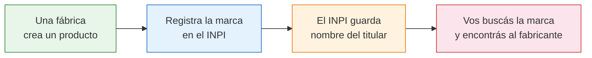

# INPI — Marcas, patentes y modelos industriales

> El INPI (Instituto Nacional de la Propiedad Industrial) registra todas las **marcas, patentes y modelos industriales** de Argentina. Esto lo convierte en una herramienta poderosa para descubrir quién fabrica qué, porque detrás de cada marca registrada hay una empresa con nombre, CUIT y dirección.

## Qué es el INPI

El Instituto Nacional de la Propiedad Industrial es el organismo del Estado que administra el registro de:

- **Marcas comerciales** (nombres y logos de productos)
- **Patentes de invención** (inventos nuevos)
- **Modelos de utilidad** (mejoras técnicas a productos existentes)
- **Modelos y diseños industriales** (diseño estético de productos)

| Dato | Detalle |
|------|---------|
| **Sitio web** | argentina.gob.ar/inpi |
| **Buscador de marcas** | portaltramites.inpi.gob.ar/marcasconsultas/busqueda |
| **Costo de búsqueda** | Gratuito |
| **Información disponible** | Titular, CUIT, clase, estado del registro |

## Por qué te sirve para encontrar fabricantes

La lógica es simple:

Cuando buscás una marca en el INPI, el sistema te muestra **quién la registró**. En la mayoría de los casos, el titular de la marca es el fabricante o está directamente vinculado al fabricante.

<Note>
No siempre el titular de una marca es el fabricante directo. A veces es una empresa holding, un distribuidor exclusivo o una persona física dueña de la fábrica. Pero siempre te da una pista concreta para rastrear al fabricante.
</Note>

## Cómo buscar marcas paso a paso

<Steps>
  <Step title="Ingresá al buscador de marcas">
    Visitá **portaltramites.inpi.gob.ar/marcasconsultas/busqueda**. Es el buscador público y gratuito del INPI. No necesitás crear cuenta ni estar registrado.
  </Step>
  <Step title="Elegí el tipo de búsqueda">
    Podés buscar por:
    - **Denominación** (nombre de la marca): ideal si conocés el nombre de un producto
    - **Titular** (nombre de empresa): ideal si conocés la empresa y querés ver qué marcas tiene
    - **Clase** (categoría de producto): para explorar todas las marcas de un rubro
  </Step>
  <Step title="Ingresá tu término de búsqueda">
    Escribí el nombre de la marca, el producto o la empresa que buscás. Por ejemplo, si buscás fabricantes de galletitas, podés buscar marcas de galletitas conocidas para ver quién las registró.
  </Step>
  <Step title="Analizá los resultados">
    Para cada marca registrada vas a ver: denominación, titular (nombre y CUIT), clase (tipo de producto), estado (vigente, vencida, en trámite) y fecha de registro.
  </Step>
  <Step title="Identificá al fabricante">
    Con el nombre del titular y el CUIT, ya tenés un dato concreto para buscar a la empresa: podés verificarla en ARCA, buscarla en Google, o contactarla directamente.
  </Step>
</Steps>

## Ejemplo práctico: buscar fabricantes de calzado

Supongamos que querés encontrar fábricas de zapatillas argentinas:

| Paso | Acción | Resultado esperado |
|------|--------|--------------------|
| 1 | Buscás por clase 25 (vestimenta y calzado) | Ves cientos de marcas registradas |
| 2 | Filtrás por denominación que incluya "sport" o "zapatilla" | Reducís la lista |
| 3 | Ves los titulares de cada marca | Empresas como "Calzados XYZ S.A.", "Industria del Calzado ABC S.R.L." |
| 4 | Tomás el CUIT del titular | Ej: 30-71234567-8 |
| 5 | Buscás ese CUIT en ARCA y Google | Encontrás dirección, teléfono, estado fiscal |

<Tip>
Las clases del INPI siguen la **Clasificación de Niza** internacional. Las más útiles para productos de consumo son: Clase 25 (ropa y calzado), Clase 29-30 (alimentos), Clase 3 (cosméticos), Clase 20-21 (muebles y artículos del hogar), Clase 9 (electrónica).
</Tip>

## Clases de Niza más relevantes para emprendedores

| Clase | Productos | Ejemplo de búsqueda |
|-------|-----------|---------------------|
| 3 | Cosméticos, perfumería, limpieza | Fabricantes de cremas, jabones |
| 9 | Electrónica, software, equipos | Fabricantes de cargadores, accesorios tech |
| 16 | Papelería, artículos de oficina | Fabricantes de cuadernos, carpetas |
| 18 | Marroquinería, bolsos, carteras | Fabricantes de mochilas, billeteras |
| 20 | Muebles, colchones | Fabricantes de muebles, racks |
| 21 | Artículos del hogar, cocina | Fabricantes de utensilios, recipientes |
| 25 | Ropa, calzado, sombrería | Fabricantes de indumentaria |
| 29 | Alimentos (lácteos, carnes, conservas) | Fabricantes de dulces, embutidos |
| 30 | Alimentos (harinas, café, golosinas) | Fabricantes de galletitas, yerba |

## Cómo usar patentes para encontrar fabricantes

Las **patentes de invención** y los **modelos de utilidad** revelan qué empresas están innovando en un sector. Si una empresa patentó algo, es porque fabrica o planea fabricar ese producto.

<Tabs>
  <Tab title="Patentes de invención">
    Son inventos completamente nuevos. Las empresas que patentan suelen ser fabricantes con capacidad de I+D (investigación y desarrollo). Son generalmente empresas más grandes y consolidadas.

    **Cómo buscar:** En el sitio del INPI, sección de patentes. Podés buscar por palabra clave del invento o por titular.
  </Tab>
  <Tab title="Modelos de utilidad">
    Son mejoras técnicas a productos existentes. Muchas PyMEs industriales patentan modelos de utilidad. Es una fuente excelente para encontrar **fábricas medianas** que innovan.

    **Cómo buscar:** Mismo sitio del INPI, sección de modelos de utilidad. La búsqueda es similar a patentes.
  </Tab>
  <Tab title="Diseños industriales">
    Son el aspecto estético de un producto (la forma, el patrón, los colores). Si un fabricante registró el diseño de su producto, aparece acá con todos sus datos.

    **Cómo buscar:** Sección de diseños industriales del INPI. Útil para productos donde el diseño es clave (muebles, packaging, indumentaria).
  </Tab>
</Tabs>

<Warning>
La información del INPI es **pública pero puede no estar actualizada** en tiempo real. Una marca vigente en el registro puede pertenecer a una empresa que ya cerró. Siempre verificá la información cruzando con ARCA (estado fiscal del CUIT) y una búsqueda en Google.
</Warning>

## Estrategia combinada: INPI + ARCA + Google

La forma más efectiva de usar el INPI es combinándolo con otras fuentes:

<Steps>
  <Step title="Buscás en el INPI">
    Encontrás la marca o patente y obtenés el nombre del titular y su CUIT.
  </Step>
  <Step title="Verificás en ARCA">
    Con el CUIT, consultás en **srvhst.arca.gob.ar/constancia/inscripcion** si la empresa está activa fiscalmente y qué actividad declaró.
  </Step>
  <Step title="Buscás en Google">
    Buscás el nombre de la empresa y el CUIT para encontrar su web, redes sociales, dirección y teléfono.
  </Step>
  <Step title="Contactás a la empresa">
    Con toda la información verificada, contactás al fabricante con confianza sabiendo que es una empresa real y registrada.
  </Step>
</Steps>

<Tip>
Esta estrategia combinada de INPI + ARCA + Google es una de las más poderosas para encontrar y verificar fabricantes en Argentina. Dedicale 30 minutos y vas a tener resultados concretos.
</Tip>

## Siguiente paso

Para registros oficiales especializados (telecomunicaciones, pirotecnia y verificación de sociedades), consultá [Otros registros oficiales](/app/paso1-argentina/encontrar-fabricas/otros-registros).
