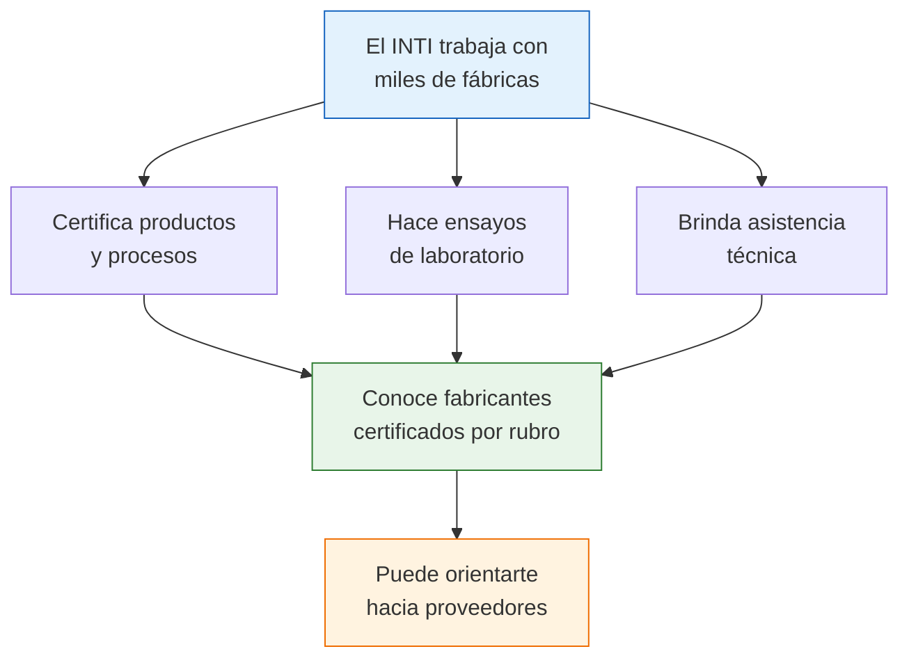

# INTI — Instituto Nacional de Tecnología Industrial

> El INTI es el organismo técnico del Estado argentino que trabaja directamente con la industria. Además de certificar productos y procesos, puede **orientarte para encontrar fabricantes** en sectores específicos. Es una fuente de calidad que pocos conocen.

## Qué es el INTI

El Instituto Nacional de Tecnología Industrial es un organismo del Estado que brinda **asistencia técnica a la industria argentina**. Tiene más de 60 años de trayectoria y trabaja directamente con miles de fábricas en todo el país.

| Dato | Detalle |
|------|---------|
| **Sitio web** | inti.gob.ar |
| **Función principal** | Asistencia técnica, ensayos, certificaciones industriales |
| **Alcance** | Todo el país (centros regionales en múltiples provincias) |
| **Costo de consultas** | Gratuito para consultas básicas de orientación |

<Note>
El INTI no es un "buscador de fábricas" como tal. Es un organismo técnico que, por su trabajo diario con la industria, **conoce fabricantes de prácticamente todos los rubros** y puede orientarte hacia ellos.
</Note>

## Por qué el INTI es valioso para tu búsqueda

### Tres razones concretas:

1. **Conocen fabricantes certificados:** Las empresas que pasaron por el INTI tienen un nivel de formalidad y calidad verificado
2. **Tienen presencia regional:** Con centros en múltiples provincias, conocen la industria local de cada zona
3. **Brindan orientación gratuita:** Podés consultar sin costo y obtener direccionamiento hacia fabricantes de tu sector

## Cómo usar el INTI para encontrar fabricantes

<Steps>
  <Step title="Identificá qué tipo de producto buscás">
    El INTI está organizado por sectores técnicos. Necesitás saber qué tipo de producto te interesa para que te deriven al área correcta.
  </Step>
  <Step title="Contactá al INTI">
    Visitá **inti.gob.ar** y buscá la sección de contacto o atención al público. También podés llamar o enviar un correo electrónico explicando tu consulta.
  </Step>
  <Step title="Explicá tu necesidad">
    Sé claro: "Soy emprendedor y busco fabricantes de [producto] en Argentina. Necesito orientación sobre qué empresas del sector están certificadas o trabajan con ustedes."
  </Step>
  <Step title="Pedí orientación sectorial">
    El INTI tiene técnicos especializados por rubro que pueden indicarte qué empresas del sector conocen, qué cámaras consultar y qué certificaciones buscar.
  </Step>
</Steps>

## Centros y áreas técnicas del INTI

El INTI tiene áreas especializadas por tipo de industria. Las principales:

| Área técnica | Rubros que cubre | Utilidad para tu búsqueda |
|-------------|------------------|---------------------------|
| **Alimentos** | Procesamiento, envasado, conservación | Fabricantes de alimentos certificados |
| **Textiles** | Telas, confección, fibras | Fabricantes textiles con calidad verificada |
| **Química** | Productos químicos, cosméticos, limpieza | Fabricantes con formulaciones aprobadas |
| **Construcción** | Materiales, cemento, cerámicos | Fabricantes de materiales certificados |
| **Mecánica** | Metalurgia, autopartes, maquinaria | Fabricantes metalmecánicos evaluados |
| **Plásticos** | Envases, piezas, materiales | Fabricantes con procesos controlados |
| **Electrónica** | Componentes, equipos | Fabricantes con ensayos aprobados |

## La certificación INTI como señal de calidad

<Warning>
Que una fábrica tenga certificación INTI o haya pasado ensayos del INTI **no garantiza** que sea un buen proveedor comercial para vos. La certificación habla de la calidad técnica del producto, pero no de condiciones comerciales como precio, plazos de entrega o atención al cliente. Usá la certificación como **un filtro más**, no como el único criterio.
</Warning>

### Qué significa que una fábrica trabaje con el INTI

| Situación | Qué indica |
|-----------|------------|
| **Productos ensayados por INTI** | Los productos pasaron pruebas técnicas de laboratorio |
| **Proceso certificado por INTI** | La fábrica tiene procesos productivos evaluados |
| **Asistencia técnica del INTI** | La empresa buscó mejorar con apoyo profesional |
| **Sello de calidad INTI** | El producto cumple normas técnicas argentinas |

<Tip>
Cuando contactés a un fabricante, preguntale directamente: "Trabajan con el INTI? Tienen productos ensayados o certificados?" Si la respuesta es sí, pedí que te muestren los informes o certificados. Eso te da una capa extra de confianza.
</Tip>

## Servicios del INTI útiles para emprendedores

Además de orientarte en la búsqueda de fabricantes, el INTI ofrece servicios que pueden servirte cuando ya estés comprando:

<Tabs>
  <Tab title="Ensayos de producto">
    Si querés verificar la calidad de lo que estás comprando, podés enviar muestras al INTI para que las analicen. Esto es especialmente útil para alimentos, textiles, cosméticos y productos que deben cumplir normas.

    **Costo:** Variable según el tipo de ensayo (desde algunos miles de pesos)

    **Tiempo:** 5 a 20 días hábiles según complejidad
  </Tab>
  <Tab title="Asistencia técnica">
    Si ya tenés una relación con un fabricante pero necesitás mejorar el producto o adaptarlo, el INTI puede asistirte técnicamente. Ofrecen asesoramiento en diseño, materiales, procesos y packaging.

    **Costo:** Muchos programas son gratuitos o subsidiados para PyMEs
  </Tab>
  <Tab title="Capacitación">
    El INTI dicta cursos y talleres sobre calidad industrial, gestión de producción, normas técnicas y más. Útil si querés entender mejor el sector antes de comprar.

    **Costo:** Variable, muchos gratuitos
  </Tab>
</Tabs>

## Centros regionales del INTI

El INTI no solo está en Buenos Aires. Tiene centros en múltiples provincias, lo que te permite consultar sobre la industria de cada zona:

| Región | Ubicación del centro | Rubros fuertes |
|--------|---------------------|----------------|
| **AMBA** | Parque Tecnológico Miguelete, San Martín | Todos los rubros |
| **Córdoba** | Córdoba Capital | Automotriz, alimentos |
| **Santa Fe** | Rosario | Agroindustria, maquinaria |
| **Mendoza** | Mendoza Capital | Vitivinícola, alimentos |
| **Tucumán** | San Miguel de Tucumán | Azúcar, cítricos |
| **Neuquén** | Neuquén Capital | Petróleo, alimentos |

<Tip>
Si estás buscando fabricantes en una provincia específica, contactá al centro regional del INTI de esa zona. Los técnicos locales conocen la industria de su región mejor que nadie.
</Tip>

## Siguiente paso

Para identificar fabricantes a través de sus marcas y patentes registradas, consultá la guía del [INPI — Marcas, patentes y modelos industriales](/app/paso1-argentina/encontrar-fabricas/inpi-marcas-patentes).
